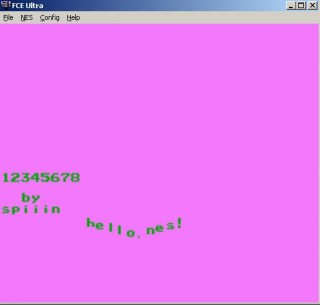
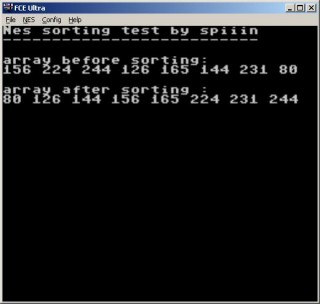

Нашел на винте скачанные когда-то доки и тулзы к приставке [Nintendo Entertaiment System](http://ru.wikipedia.org/wiki/NES)  aka Денди. 
Среди них был и ассемблер. Захотелось чего-нибудь написать попробовать на нем. 

Ссылки на документацию - 
<http://dendy.migera.ru/nes/index.php> - Книжка с описанием архитектуры 
[http://dendy.migera.ru/nes/index.php](http://tv-games.narod.ru/library/nes.htm)  - Много документации на русском и английском 
<http://nesdev.parodius.com> - Основной сайт для тех, кто хочет программировать под NES. 

Много материалов на английском языке и тулзов для разработки. 
После непродолжительного чтения мануалов удалось слепить вот что:
 

Потом надоело, решил поискать что-то более высокоуровневое. 
Гугл в основном выдает ссылки на форумы, где новички спрашивают, как писать игры, а олдфаги говорят, что им еще рано что-то писать, раз у них возникают такие вопросы или отправляют их на <http://nesdev.parodius.com>. 

Сначала я искал исходники движков от каких-нибудь игр, но оказалось, что их там нету :( (или я плохо искал). 
Единственный способ написать что-то на движке игры - реверсить ее и потом записать в РОМ свой код и данные (для спрайтов есть тулзы, код скорее всего придется вбивать в бинарном виде).

Кстати, хакеры уже неплохо изучили самые популярные игрушки, вроде [Super Mario Bros.](http://tasvideos.org/1891S.html) ,  [Duck Tales](http://tasvideos.org/2199S.html)  или  [Darkwing Duck](http://tasvideos.org/1673S.html) .

Достаточно зайти на tasvideos.org и посмотреть, что геймеры могут вытворять с игрой, вооружившись дизассемблером, хекс-редактором и эмулятором с замедлением времени. 

Вот пример прохождения на скорость:



Возвращаясь к теме программирования, исходников движков я не нашел, зато нашел вот это - [cc65](%20www.cc65.org), а именно кросс-компилятор языка С под платформу 6502! То, что нужно для восьмибитного счастья :) 

Все, что нужно скачать - это сам  [компилятор](ftp://ftp.musoftware.de/pub/uz/cc65/cc65-win32-2.12.0-1.zip)  и [библиотеки для nes](ftp://ftp.musoftware.de/pub/uz/cc65/cc65-nes-2.12.0-1.zip), которые нужно будет прилинковать к объектному файлу после компиляции и трансляции.

Также не помешает скачать [мануал](ftp://ftp.musoftware.de/pub/uz/cc65/cc65-doc-2.12.0-1.zip).

Написал тормознутую сортировку для массива случайных чисел:
[код](http://www.everfall.com/paste/id.php?pvbqcv9urcfd)

 

 ...а игру написать с нуля, имея все спрайты, наверно месяц уйдет. эх, пойду спать, а то еще бакалаврскую завтра сдавать. 
 
 P.S. Еще есть  [бейсик](http://bobrost.com/nes/resources.php#devtools) . Жалко питон никто не портировал :)