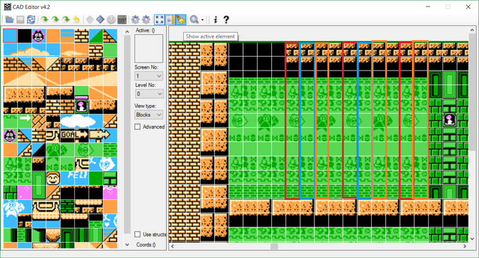

**Felix The Cat** - одна из немногих игр для NES, использующая сжатие данных описания уровня.  
  
Из интереса разобрал формат сжатия (почти не лазил дизассемблером, просто потыкал отдельные байты своими утилитами и проанализировал изменения на экране в эмуляторе).  
  
Уровень состоит из блоков 2x2 (с аттрибутами палитры и физики). Блоков используется 128.  
  
Все подуровни описываются одним массивом, это необязательно в движке, но, видимо, так было удобнее разработчикам). Каждая вертикальная линия описывается отдельно, уровень описывается как массив указателей на линии, если линия полностью повторяет предыдущую, просто используется указатель на эту линию. Повторение линий активно используется, где-то 40-50% линий - повторы. Также в указателях на линии несколько бит используются для кодирования объектов.  
  
Линии сжимаются с помощью алгоритма RLE, после чего из сжатых пар (***количество повторов блока, номер блока для повтора***) образуется словарь и повторы заменяются на слова из словаря. Обычные блоки имеют индексы от 0x00 до 0x7F, слова из словаря нумеруются от 0x80 и дальше, до 124 слов в словаре.  
  
Последние 4 значения 0xFC-0xFF используются для задания второй формы сжатия. Она устроена интереснее и используется на уровнях с мозаичным фоном (например, узоры на стенах пирамид на уровнях 2-2 и 2-3).  
В этом случае в начале линии может использоваться команда из двух байт (***номер\_базовой\_линии, кол-во блоков из базовой линии***). На уровне используется 4 базовые линии (их номера кодируются от 0xFC до 0xFF), которые описывают зацикленную мозаику. Первые несколько блоков берутся из этой линии, а затем нижняя часть дорисовывается обычным способом.  
Пример таких начал линий на скриншоте:  
  
  
На нём выделены рамками повторяющиеся базовые линии.  
  
Эти три приёма (индексирование линий, RLE-словарь и базовые линии) позволяют сжимать уровни размером в 18 килобайт до 4-5 килобайт.

Более детально про сжатие и написание компрессора в [статье на хабре](https://habr.com/ru/post/328516/)