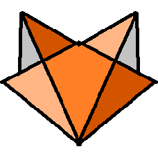
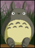
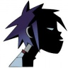

**Hello, world!**
Немного тестов разметки
<!-- more -->

Пример содержания:
<!-- toc -->

---

Заголовки

# Заголовок1

## Заголовок2
## Заголовок2.2
## Заголовок2.3

текст

---

Код:

```nim
echo "code without line numbers"
```

```python
def t1
  pass
  NotImplemented
```

```json
{ "json": true }
```


using namespace std;
cout << "Code";
cout << "with";
cout << "line";
cout << "numbers";
cout << end;



namespace std {
    template<> struct tuple_element<0,Config> { using type = std::string_view; };
    template<> struct tuple_element<1,Config> { using type = std::size_t; };
    template<> struct tuple_element<2,Config> { using type = const std::vector<std::string>&; };
}

template <unsigned K, class RET, class F, class Tup>
struct Expander {
  template <class... Ts>
  static RET expand(F&& func, Tup&& t, Ts && ... args) {
    return Expander<K - 1, RET, F, Tup>::expand (
        forward<F>(func),
        forward<Tup>(t),
        get<K - 1>(forward<Tup>(t)),
        forward<Ts>(args)...
    );}
};



using namespace std;
cout << "Code";
cout << "with";
cout << "line";
cout << "numbers";
cout << end;


```cpp
namespace std {
    template<> struct tuple_element<0,Config> { using type = std::string_view; };
    template<> struct tuple_element<1,Config> { using type = std::size_t; };
    template<> struct tuple_element<2,Config> { using type = const std::vector<std::string>&; };
}

template <unsigned K, class RET, class F, class Tup>
struct Expander {
  template <class... Ts>
  static RET expand(F&& func, Tup&& t, Ts && ... args) {
    return Expander<K - 1, RET, F, Tup>::expand (
        forward<F>(func),
        forward<Tup>(t),
        get<K - 1>(forward<Tup>(t)),
        forward<Ts>(args)...
    );}
};
```

```js
  function compact(arr) {
  // @annotate: left 56 - No editor warnings in JavaScript files<br/><br/>This crashes at runtime.
    if (orr.length > 10) return arr
    return arr
  }
```

```ts
interface IdLabel {id: number, /* some fields */ }
interface NameLabel {name: string, /* other fields */ }
type NameOrId<T extends number | string> = T extends number ? IdLabel : NameLabel;
// This comment should not be included

// ---cut---
function createLabel<T extends number | string>(idOrName: T): NameOrId<T> {
  throw "unimplemented"
}

let a = createLabel("typescript");
```

---

Цитаты:


"Citate from me"


---

Списки:

- список1
- список2
  - список21
  - список22
    - *список221*
- список3

Тест 2

- **Языки**
  - [C++](https://c++)
  - C#
  - Python
- **Движки**
  - Unity
  - Cocos2d
  - Godot
---
Большой список с уточнениями:

**`- Один`**
Объяснение на много
много
много строк.
 
**`- Два`**
Длинное объяснение
 
**`- Три`**
Ещё одно объснение, в несколько предложений.
Или абзацев.

---
Текст

болд - **text**
курсив - *text*
болд+курсив - ***text***
код - `code`
код-болд - **`code-bold`**

---
Ссылки

Глобальная - [Google](https://google.com/)
На пост в блоге - 

---

Спойлер:





---


Текст


---

Хинт

Не работает в начале строки - 

---

Таблицы

| Tables        | Are                      | Cool  |
| ------------- |:------------------------:| -----:|
| col 3 is      | *right-aligned*          | $1600 |
| col 2 is      | centered                 |   $12 |
| zebra stripes | are neat                 |    $1 |

| `Table Header 1` | `Table Header 2` | `Table Header 3` |
| - | - | - |
| Division 1 | Division 2 | Division 3 |
| Division 1 | Division 2 | Division 3 |
| Division 1 | Division 2 | Division 3 |


Backticks escape: \`are\` these!

---

Картинки





---

---
Плагин для youtube:



---
Nomnoml diagram


#fill: #eee8d5;
[hello] -> [world]
[1] -> [2]
[1] -> [3]
[2]  -> [4]


---
Плагин для qrcode 

---

raw html
<div style="color: #d4d4d4;background-color: #1e1e1e;font-family: Consolas, 'Courier New', monospace;font-weight: normal;font-size: 14px;line-height: 19px;white-space: pre;"><div><span style="color: #d4d4d4;">&#160; &#160; </span><span style="color: #c586c0;">let</span><span style="color: #d4d4d4;"> totalTime = ref_time_ticks()</span></div><div><span style="color: #d4d4d4;">&#160; &#160; </span><span style="color: #dcdcaa;">invoke</span><span style="color: #d4d4d4;">(mandelbrot)</span></div><div><span style="color: #d4d4d4;">&#160; &#160; </span><span style="color: #6a9955;">//let func = %bf~++++&gt;&gt;+&lt;+++++++++++++++++++++[-&gt;+&lt;]&lt;.&gt;++++.&gt;.%%</span></div><div><span style="color: #d4d4d4;">&#160; &#160; </span><span style="color: #6a9955;">//invoke(func)</span></div><div><span style="color: #d4d4d4;">&#160; &#160; </span><span style="color: #c586c0;">let</span><span style="color: #d4d4d4;"> totalDt = double(get_time_usec(totalTime)) /</span><span style="color: #b5cea8;">1000000.0l</span><span style="color: #d4d4d4;">f</span></div><div><span style="color: #d4d4d4;">&#160; &#160; to_log(LOG_INFO, </span><span style="color: #ce9178;">"total {</span><span style="color: #9cdcfe;">totalDt</span><span style="color: #ce9178;">} sec</span><span style="color: #d7ba7d;">\n</span><span style="color: #ce9178;">"</span><span style="color: #d4d4d4;">)</span></div></div>

