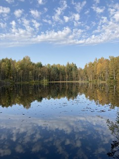

Никогда не подводил итогов года, но почему бы не начать в этом.

<!-- more -->

**`Дисклеймер`**
Я, как и все остальные люди, склонен обращать больше внимания на успехи в своей жизни, чем на пиздецы и фейлы, поэтому перед позитивными итогами этого года, сначала немного негативные итоги предыдущих, но сжато.

Прошлый год стал для меня переломным в том плане, что прекратил попытки решить все накопленные проблемы одновременно. А накопились они по причине того, что загнал себя в замкнутый круг попыткой решать их не по одной, а все сразу - наладить личную жизнь, заняться обустройством дома и поменять работу одновременно.

Вместо полноценной работы выбрал несколько часов фриланса в день, чтобы хватало времени на ремонт старого дома, однако в таком режиме не хватало денег на отдых. Для того, чтобы найти нормальные отношения не хватало времени из-за ремонта и фриланса, а на полноценную работу не хватало времени из-за отношений и ремонта. Сейчас я понимаю, что стоило просто посоветоваться с кем-то, кто был опытнее и умнее, или просто мог посмотреть на мои проблемы со стороны (такие люди были, просто я их не замечал или не слушал). Но спасибо и тем, кто просто был рядом, без всяких советов.

В итоге, после того, как слёг на несколько недель с температурой, пришлось начинать с нуля ещё раз, на этот раз с упором на работу. Мир устроен так, что с помощью денег остальное тоже становится проще, главное не забывать, что это лишь средство, а не цель. Ну и то, что это средство решать не только ваши персональные проблемы, но ещё и тех, кому вы хотите помочь.

Попутно, к сожалению или к счастью, прекратил общение со многими старыми знакомыми – до сих пор плохо умею разрывать контакты. Кто-то перестал общаться со мной, часто обоснованно. Пришлось усвоить несколько неприятных уроков общения, и то, что люди могут быть опаснее для окружающих, чем показывают, и даже, чем думают сами. Самый опасный хищник – тот, кто считает себя праведником.

Тем не менее, я всё ещё уверен, что большинство людей в мире по-умолчанию стремятся к построению любых отношений с другими по принципу win-win, и это прекрасно.

Йоханга.

**`Путешествия`**
В конце прошлого года, перед рождеством, побывал в Сингапуре, в небольшой командировке. Яркий футуристический неоновый город с небоскрёбами, казино и красивейшими Botanic Gargdens.

В этом съездил в Крым зимой и летом – увидеться с родственниками, и погулять с палатками по разным уголкам и устроить гастротур по местным малоизвестным ресторанчикам. Бахчисарай-Севастополь-Инжир-Айа-Коктебель. Хотелось ещё заскочить в западный Крым, но немного не хватило времени.

**`Работа`**

За пару месяцев перед началом локдауна я стал лидом проекта, который скоро нужно было запускать на софт. Поэтому после закрытия офисов (учитывая, что работа вне офиса до этого не практиковалась), баланс между кодингом и решением всевозможных организационных вопросов сместился где-то на 15%/85%, что было очень сильно непривычно в начале. Софт, естественно, немного задержался, но явно меньше, чем мог бы. Хотя в итоге после выхода игры, ещё где-то неделю до отпуска было ощущение не то, что выгорания, а сгорания.

Сама игра – [Crooked Pines](https://mytona.com/game/6)

Одно из самых ярких впечатлений года - в апреле собрались попрощаться втроём в Парке 300-летия с ребятами, с которыми за время работы в офисе установилась какая-то безумная творческая атмосфера, когда понимаешь, что получаешь настоящий кайф от работы, восхищаешься тем, что делают другие и делаешь сам. Грустно понимать, что вчера было так, а через несколько дней разлетаемся на 6000 километров.

Ещё разок удалось вспомнить, что такое тимбилдинг и командный дух во время одного из релизов апдейтов - когда к 4-5 утра исправляются последние ошибки, и нервные шутки от команды QA перед последней (или непоследней, как повезёт) проверкой игры. Это выматывает физически и психологически, зато объединяет, формирует ядро команды, и проявляет волевые качества людей. Все остальные формы корпоративного "тимбилдинга" - это просто пьянки на деньги компании (что, конечно, тоже здорово).

Дальше - обустройство домашнего рабочего места и попытки найти себя в новой реальности пандемии.

**`Личное`**

Работая в it-компании, программисты (особо после релокейта) не особо заморачиваются с обустройством жилища, так как всё равно местом обитания является офис со всеми возможными плюшками, а дом является место ночлежки. Поэтому если приходится проводить дома почти всё время, вынужденно приходится привести рабочее место в порядок (отдельная приятная опция работы в хорошей компании - возмещение расходов на все минимально необходимые вещи).

Надежды, что пандемия закончится быстро, я не питал, поэтому просто принялся перестраивать быт с расчётом на то, что придётся отсиживаться долго. Т.е. просто изучил всё что, было рядом с домом. Я живу в Питере на Пискарёвке - кругом обнаружилось множество парков, старое Богословское кладбище и железнодорожная станция с электричками, на которых можно было начать изучать Ленобласть и окрестности. Особенно запомнились поездки на Хепоярви - там можно бродить пешком, кататься на великах, жарить шашлыки и заниматься активным отдыхом.

Чтобы минимизировать риск заразиться, но не сойти с ума в изоляции, пытался общаться с небольшой замкнутой компанией друзей и коллег, также поддерживающих подобную стратегию изоляции.

Случайно встретил свою вторую половинку.
Просто наплевали на все правила, пили пиво на закрытой на карантин детской площадке (какая разница, если вокруг пост-апокалипсис?), гуляли по всё тому же Парку 300-летия ночью, смотрели на рассвет с какой-то крыши, и поняли, что нашли друг друга.

**`Музыка`**
Мой гимн этой весны, в связи с коронавирусом, однозначно - `AnnenMayKantereit & K.I.Z. - Hurra die Welt geht unter`



Также моим личным открытием стал электро-свинг - музыка и танцы. Мечтаю разучить несколько движений и научиться совмещаться их с жонглёрскими движениями.



Ну, и знатный стёб от Гудкова - `Cream Soda - Никаких больше вечеринок`. В одном из клипов нашёл прикольное место, которое хочется посетить в 2021 году – [Кондуки](https://www.google.com/search?q=%D0%BA%D0%BE%D0%BD%D0%B4%D1%83%D0%BA%D0%B8&source=lnms&tbm=isch&sa=X&ved=2ahUKEwiknfXktKPuAhUomYsKHfKoCUwQ_AUoAXoECBMQAw&biw=1920&bih=947)



**`Приобретения`**

Ещё вначале года я был уверен, что никогда не решусь завести собаку в квартире, и вообще, с собаками так грустно прощаться, что хочется завести её лет за 15-20 до собственной смерти, не раньше. Но к середине года я решил, что мне нужен друг и товарищ, с которым можно бродить по паркам и дрессировать его. Всё детство я жил в частном доме, в котором были дворняги, но при заведения собственного собакена решил попробовать породистого.

С трудом удержался от охотничьего по натуре джека-рассела, переключившись на генетических пастухов – корги. После поездки за город в питомник, у меня дома появился двухмесячный разноглазый кардиган-мерль Халк (потому что цветом как камень `Халцедон`).

Чтобы играть в свободное время, купил себе `Nintendo Switch`, играл в основном в хиты от самой нинтендо, ну и ещё в пару игр. Больше всего зашли:

`- Witcher 3`
Люблю всю серию, во всех проявлениях, особенно приятно попробовать ещё раз на мобильной платформе в дороге.
`- Legend of Zelda: Breath of the Wild`
Интересная песочница, сильно погружает в простой сказочный мир
`- Spiritfarer`
Ферма с несколькими историями про прощание перед смертью, трогательная и в начале, но с запоротой концовкой.

**`Развитие`**

Этот год в основном прошёл в работе (причём, в работе с головой), больше в прокачке софт-скиллов.

Тем не менее, немного занимался более внимательным изучением новых стандартов C++ (11-17), минималистичного подхода в дизайне библиотек для C/C++ (`fmt`, `sokol`, `imgui`, `bgfx`, etc), а также паттерна `ECS`.

Раньше для любого пет-проджекта хотелось взять что-нибудь отличное от C++, из-за очарования battery-included философии Python и C# - проще было взять готовый монструозный пакет со всем сразу, и быстрее начинать писать код. Сейчас стало интереснее научиться решать задачу минимально необходимыми средствами, без виртуальных машин ради простого скрипта. Одно из неочевидных отличий в подходах заключается в том, что в первом случае для решения берётся первый попавшийся инструмент, с помощью которого точно знаешь, что сможешь решить задачу, а во-втором – пытаешься выбрать самый лучший подходящий для задачи инструмент среди всех доступных.

Также к концу года, за время отпуска, нашёл таки время практически закончить экспорт `блога` из [ЖЖ](https://spiiin.livejournal.com/) на [гитхаб](https://spiiin.github.io/). Долго выбирал , тему к нему, и изучал языки разметки и описания стилей. Быстро нашёл и пофиксил [скрипт экспорта постов из жж](https://github.com/spiiin/stuff/tree/master/export_lj) в формат markdown. Затем долго чистил совсем бессмысленные посты и экспортировал оставшиеся (часто, с ручными фиксами разметки). В конце думал, оставлять ли что-то в жж, или нет, и решал, что чем меньше там останется контента (как полезного, так и личного), тем лучше.

За год повзрослел эмоционально, нашёл себя, и снова стал счастливым
