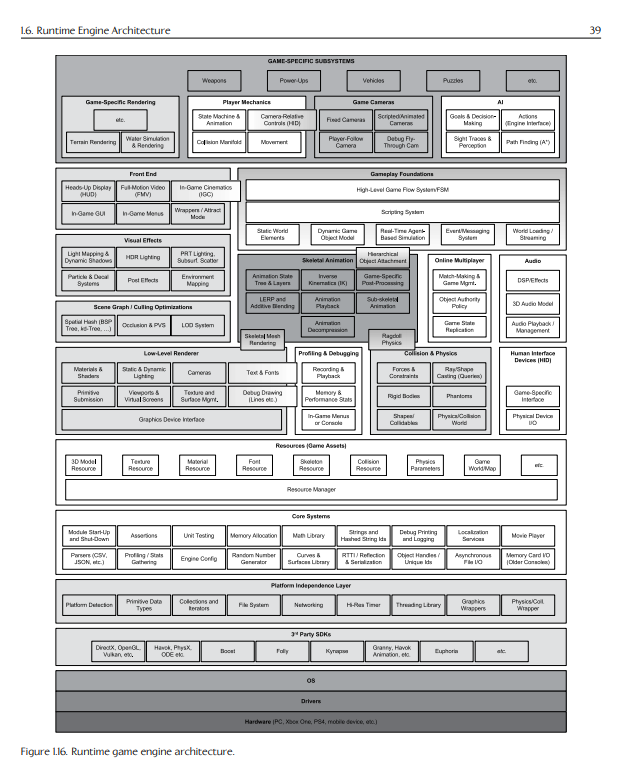
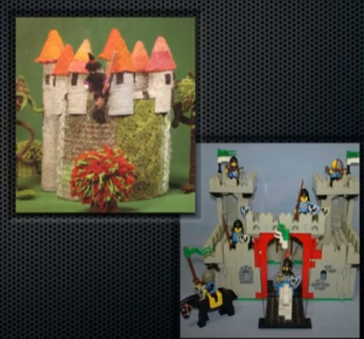

Когда-то давно, когда я учился в университете на втором курсе, мой одногруппник скинул мне ссылку на раздел местного форума о поиске работы. ["Гайдзины"](https://www.gaijinent.com/) искали программистов в офис в Севастополе.
Я уже тогда решил для себя, что хочу делать игры, но не особо хотел бросать учёбу. Сходил на собеседование, после которого мне сказали, что подумают.

Подумали они около месяца, после чего в январе 2008 года пригласили в офис, чтобы начинать работать. Я отнёсся к этому как к стажировке (в универе всё равно были каникулы между семестрами), и согласился.
После каникул решил остаться там работать на полставки (работа, конечно, мешала учёбе, но зато можно было делать игры, и получать за это деньги).

В универе я успел покататься по олимпиадам по программированию, и заработать хорошую репутацию, так что на мои пропуски закрывали глаза, поэтому удавалось балансировать между работой и учёбой ещё 4 года (с учебными отпусками, временным самоувольнением поучиться семестр, и просто с забитием на универ к концу). Посчитал, что с учётом отпусков и перерывов, я профессионально занимаюсь разработкой игр уже около 10 лет.

У меня нет какой-то особенной мудрости, накопленной за эти годы, и поучающих советов другим (даже несмотря на то, что некоторые разделы поста выглядят как советы). Эти заметки написаны просто для себя.

<!-- more -->

## Зачем

Когда давно работаешь в индустрии игр, в какой-то момент сталкиваешься с тем, что забываешь о своих изначальных желаниях и идеях - почему ты пришёл сюда и чего хотел. Каждый приходит в геймдев со своими собственными мечтами и намерениями.

Я пришёл с простой прагматичной целью – узнать, как делаются игры и эффекты в них, понять "магию", которая создаёт картинки на экране. Я только открыл для себя `HoMM3` и `Warcraft3`, и в обеих играх мне дико нравилось заклинание "Цепь молний". Моей локальной целью было сделать такую же.

И, о чудо, после выпуска пары казуалок, мы сделали экшн , с кучей визуальных эффектов, среди которых была и та заветная цепная молния!

Однако, к тому моменту я уже понял, что моя цель - `делать крутые игры`, про которые я мог бы сказать это сам, и про которые так говорили бы игроки.

## Чем вообще занимаются в геймдеве?
Когда-то делал себе пометки, как это – [работать программистом](https://spiiin.livejournal.com/82899.html) в целом.
Недавно также отписывал в [закрытом сообществе](https://vas3k.club/question/7938/#comment-4f9155a7-8650-4551-a716-be5f576c5032) - в чем отличия разработки игр от других сфер:

**`- В геймдеве встречаются очень разные задачи, от создания бекэнда и серверов для мультиплейерных игр до программирования графики, обычные гуи приложения (тулзы), скрипты автоматизации, оптимизации, архитектура движков.`**

 Несмотря на то, что есть специализации, за длительное время работы скорее всего окажется, что позанимаешься всеми. Это и плюс - расширяет кругозор, и не возникнет ощущения, что постоянно занимаешься чем-то одним, и минус - нельзя просто выучить что-то одно и пользоваться этим много лет, загребая деньги лопатой. Тем не менее, C++ из геймдева никуда не ушёл.

(тут должна быть картинка про зарплаты по отношению к другим сферам `"Пишу на C++/Objective C/Java/Lua/Python/C#/GLSL/HLSL и ещё паре малоизвестных языков за еду"`)

**`- Тренды очень динамические, планка качества игр поднимается, и даже если делаешь клон очередной популярной игры, нужно сделать его чем-то лучше (иначе зачем в него играть).`**

Кроме того, постоянно меняются способы монетизации, появляются новые платформы, то что было приемлемо пару лет назад, не сработает сейчас. Может оказаться, что игра, которую вы делали несколько лет, перестала быть актуальной. Игры делать дорого и долго, и всегда есть шанс, что игрокам просто не понравится то, что вы сделали.

**`- Не стоит идти в геймдев, чтобы сделать игру мечты.`**

Игры делают, чтобы зарабатывать деньги, поэтому делать вы будете то, что приносит деньги. Скорее всего, придётся писать очередную матч-3 или слоты для телефонов. Так что, если хотите длительно работать в геймдеве, вам должно нравиться делать вообще любые игры. Просто помните, что и `до разработки игры мечты тоже когда-нибудь доберётесь`.

Если просто хочется сделать свою крутую игру без опыта, **НЕ НАДО**: собирать команду друзей или участвовать в хакатонах (лучше вообще их не касаться, это как олимпиадное программирование). Лучше всего попробовать реализовать то, что хочется, в виде мода для уже существующей игры - так рождались `Counter-Strike`, `DotA`, `Team Fortress`.

**` - В геймдеве чаще встречаются интересные люди, которые интересуются не только покупкой второй машины и куда вложить заработанные 300кк/сек$.`**

Это мой опыт, кто-то отписывается, что видел геймдев-галеры.
Встречаются компании с интересной корпоративной культурой и необычной организацией, можно почитать про устройство [Valve](http://media.steampowered.com/apps/valve/hbook-RU.pdf) или [Supercell](https://habr.com/ru/post/358882/).

**` - Делать игры компанией – всегда челлендж, сверх-усилие и рисковая ставка на вашу игру всей командой.`**

 Т.е. нужно быть немного азартным, и чувствовать себя *причастным* (как бы по сектантски это не звучало) к тому, что происходит.

Наверное, это меньше ощущается, если фрилансить (хотя написание кода в больших проектах аутсорсят намного реже, чем арт), или заниматься чем-то, что не связано с выпуском игры (например, писать игровой редактор или движок).

https://kdicast.com/ - можно послушать, чтобы вникнуть немного, чем живут разработчики игр.
https://habr.com/ru/post/500320/ - автор пытался провести исследование про кол-во людей в разных компаниях, можно представить себе разные по объёму и сложности игр компании.

## Периоды разработки игры

Одно из самых прикольных ощущений – понять, что участвовал в разработки игры с чистого листа и до релиза. Оценить, как труд десятков (или сейчас скорее даже сотен) людей воплощается в виде конечного продукта, в который будут играть миллионы пользователей.

Самые веселые периоды разработки: `придумывание концепта`, и стадия, когда становится понятно, `что представляет собой игра и какая она будет`.
Самые сложные: `полировка игры` (когда уже почти не добавляется ничего нового), и `кранчи перед релизом`.

Печально известные кранчи являются чуть ли не стандартом в разработке игр, их сейчас активно обсуждают повсюду (примеры [один](https://habr.com/ru/post/489946/), [два](https://dtf.ru/games/29454-kranchi-v-igrovoy-industrii-analiz-prichiny-posledstviya), [три](https://dtf.ru/gamedev/14956-rabota-na-iznos-prichiny-i-posledstviya-kranchey-v-igrovoy-industrii) ну или гуглите дальше самостоятельно). Интересно, изменится ли что-то от этих обсуждений :) . В результате люди устают и выгорают.

Последняя ночь перед выходом игры – это нервозное состояние, в котором ты находишься дни/недели/месяцы, и когда ты понимаешь, что от тебя и ещё нескольких человек зависит, получится ли что-то или не придётся ли чинить игру сразу же, как её попробуют игроки. Если поискать плюсы, то это лучший способ тимбилдинга (остальные – это по сути пьянки на деньги компании, что тоже конечно нужно), и проверка волевых качеств людей. В целом, ничего хорошего в этом, естественно, нет, особенно если ты старше 30, и понимаешь, что следующий апдейт/игра будут доделываться в точности так же.

Старая заметка из 2012 года, как вообще работать в таком режиме: 

## Как развиваться

Старые заметки:
 – за короткий промежуток времени несколько одногруппников и один преподаватель задали этот вопрос, поэтому проще было давать им сразу ссылку :)
 – как быть, когда подрос немного.

В нормальных компаниях есть назначаемые менторы/товарищи, которые помогут влиться, и проследят за тем, чтобы не заваливали однообразными тасками, и была возможность делать что-то интересное. В целом, в геймдеве можно и нужно интересоваться всем, что происходит в команде. Тогда среди хаосы и суеты, можно начать видеть закономерности и процессы, и в них участвовать. Если этого нет, стоит хотя бы самому следить за тем, что вообще происходит в индустрии.

- Что происходит с рынком игр?
- Какие тенденции у индустрии вообще?
- Какие есть конкуренты у игры, которую вы делаете?
- Какие игры вообще делает ваша компания, чем она особенная?
- Что вы будете делать через год?
- Новости: какие игры/платформы выходят, чем занимаются крупные студии?

Если с ответами на эти вопросы всё ок (либо вас не особо волнуют), можно задуматься и о том, что изучать.

В первую очередь, конечно язык и движок, которыми пользуетесь, но с опытом вы поймёте, что программировать умеет много кто, а вот людей с пониманием всего процесса разработки намного меньше.

В маленьких командах вынужденно существует совмещение ролей - т.е. программист немного узнаёт о геймдизайне, маркетинге, издании игры, психологии игроков (понимании своей аудитории), и ещё о разных вещах по чуть-чуть. И если в большой команде какой-нибудь хитрец мог "выпустить игру", просто гребя в одной лодке с теми, кто её действительно делал (или вообще, в сторонке кофе попивая на кухне), то в маленькой человек с большой долей вероятности знает в ней (в игре, да и в его команде) всё от начала до конца.

Преимуществом же работы в большой команде является то, что только в таких можно поучаствовать в создании действительно "большой" игры, на которую в маленькой просто не хватило бы ресурсов. Отдельный опыт – это вырасти с компанией от маленькой до большой, изучая, как меняется подход к разработке всё более продвинутых игр.

## Техническое развитие

*"Что всё-таки почитать программисту игр?"*
Найти какой-нибудь список литературы легко - https://github.com/miloyip/game-programmer
(По большей части там ненужные книги, но среди них есть все несколько хороших).

Вся литература делится на 4 категории:

**` - Мануалы к инструменту.`**
Нужны только в начале карьеры, с опытом проще просто документацией пользоваться, а не книгой

**` - Набор суперполезных практик`**
Здесь стоит читать всё, что получится достать и понять (некоторые целиком сразу не осилить). 
Про такие книги стоит написать отдельно более детально, сейчас просто список:
 `Стив Макконнел. "Совершенный код"`
 `Скотт Мейерс. "Эффективное использование С++"/"Эффективный и современный С++"/"Наиболее эффективное использование С++"` (все 3 хороши и покрывают разные темы)
 `Банда четырёх. "Приемы объектно-ориентированного проектирования. Паттерны проектирования"`
 `Robert Nystrom "Game programming patters"` ([ссылка](https://gameprogrammingpatterns.com/))

**` - Фундаментальные книги.`**
Нужны, но только когда появляется желание глубже разбираться в предмете. Обычно читать всё не нужно, достаточно выбрать только по своей специализации. Примеры:
 `Нати Хофман, Томас Мёллер, и Эрик Хэйнс. "Real-Time Rendering"`
 `Джейсон Грегори. "Архитектура игровых движков"`
 `Глейзер Джошуа и Мадхав Санджай. "Многопользовательские игры. Разработка сетевых приложений" (единственная нормальная про сетевые игры)`

**` - Книги-справочники/сборники статей.`**
Как все серии книг `Gems`. Не особо нужны, процентов 80% материала вам там никогда не понадобятся, а если и будет сходная с реальной задача, окажется, что информации для её решения там недостаточно, и всё равно нужно дальше копать.

Кроме книг, чтобы быть в курсе того, что происходит, нужно найти и следить за людьми из тех, кто занимается решением сложных проблем, и находится "на острие прогресса":

`Выступает с интересными техническими докладами (gdc, siggraph, тематические unity/unreal конференции)`.

`Авторы интересных библиотек/движков/фреймворков`.  (для мониторинга: их гитхаб, блоги, твиттеры, reddit/hacker news-сообщества). Почти бесполезны митапы, бесполезные конфы, тусовочки, подкасты.

`Изучить обновляемые подборки open-source библиотек`.
[Awesome c++](https://github.com/fffaraz/awesome-cpp)/[Awesome C++ gamedev](https://github.com/Caerind/AwesomeCppGameDev)/[Awesowe gamedev tools](https://github.com/skywind3000/awesome-gamedev)/подобные

`"Витрины" тулзов и ассетов - Unity asset store, itch.io и подобные`.

`Новые движки и подходы`. 
Когда-то новыми были **Unity**, и открытый публике **Unreal**, из открытых можно было изучать **Cocos-2d**, **Ogre3D**, сейчас, к примеру, **Godot**, middleware инструменты вроде **Bgfx**

## Гештальты геймдева

Объём того, что нужно знать программисту игр, вызывает лёгкую тоску. Это нормально. Вдобавок, знания приходится обновлять где-то раз в 5 лет (это нормально, наверное, для любой области CS). Но, кроме этого, после начала изучения некоторых областей встречаешься с ещё одним явлением, которое я называю "гештальтом". Проще объяснить это на примере. 

**`Графическое программирование`**
Начинающий программист заканчивает читать первую книгу или набор уроков по `OpenGL`/`DirectX`, пробует нарисовать что-либо, и обнаруживает, что кроме текстурированных кубиков и чайников, ничего не получается, вдобавок, они у него какие-то тусклые. Остаётся незакрытый гештальт - желание программировать графику и писать шейдеры, без понимания, как это сделать. Думаю, именно этим вызвано излишне романтизированное отношение начинающих программистов игр к шейдерам и программированию визуальных эффектов.

Почему же ничего не получается? API к видеокарте – это не всё, что нужно изучить. После этого необходимо разобраться с `математикой`,чтобы понять, как вообще устроена компьютерная графика. Это сложнее, чем просто разобраться с API, но зато после понимания основ уже почти не останется вопросов, почему конвейер видеокарты построен именно так. И, наконец, станет возможным реализовать задуманный эффект без того, чтобы слепо копировать его из учебников и статей. Можно попробовать заняться [креативным программированием](https://en.wikipedia.org/wiki/Creative_coding) или, наконец, написать шейдер сложнее, чем просто повторяющий стандартные модели освещения. Но и этого недостаточно, чтобы программировать графику для игр.

Есть и "третья сторона медали" – `изучение железа`, на котором будут выполняться программы. Игры обновляют изображение на экране 30-60 раз в секунду, и нужно научиться представлять себе, что можно успеть сделать за время отрисовки одного кадра на целевой платформе. Где-то на этом этапе по другому начинаешь смотреть на доступное API, и ощущать все его ограничения. Но зато – гештальт с желанием создавать графику наконец может быть закрыт.


#fill: #eee8d5;
[Изучение API] -> [Программирование графики]
[Изучение алгоритмов] -> [Программирование графики]
[Понимание железа] -> [Программирование графики]


Чаще всего эти три направления изучаются именно в таком порядке, из-за доступности материалов и сложности понимания, но они не базируются друг на друге. Т.е. изучить только железо, или только алгоритмы компьютерной графики можно, не это не даст инсайта *"ага, теперь я могу писать крутые шейдеры"*, необходимо разобраться в каждом из трёх.

Из-за того, что эти направления не связаны друг с другом, легко застрять на каком-то этапе на несколько лет с "незакрытым гештальтом", без понимания, из-за чего же не получается выполнять практические задачи. Знаю по себе. Когда-то сам так застрял и смотрел на демосцену как на какое-то непостижимое чудо – 

**`Сетевое программирование`**
Второй обнаруженный мной гештальт – `программирование MMO`. Здесь тоже прежде чем начать что-то делать, необходимо понять сразу несколько идей, без которых перейти от базового повторения готовых идей и простых игр к серьёзным невозможно. Тут я не могу так чётко отделить "домены знаний" друг от друга, но попробую выделить такие направления изучения:

- Протоколы передачи данных
- Создание игрового протокола
- Общая архитектура игры
- Архитектура клиента с авторитарным сервером
- Архитектура масштабируемого сервера
- Архитектура бекэнда и сервисов


#fill: #eee8d5;
[<frame> Общая архитектура
  [Общее]
  [Клиент | логика | архитектура] Протоколы <-> [<table> Сервер | сервер1 | сервер1 || сервер2 | сервер2]
  [Сервер] Протоколы <-> [Бекэнд | DB | Сервисы]
  [Клиент] <-> [Бекэнд]
]

*Примерная диаграмма игры, может отличаться в разных проектах.*

Несмотря на то, что на диаграмме различные компоненты нарисованы отдельно, заниматься разработкой отдельной части без базового понимания архитектуры и устройства других компонент не получится (В целом, отделяется бекэнд, и связь между клиентом и сервером; но писать клиент без знания игрового и лежащего под ним протокола и существования авторитарного сервера не выйдет).

Кроме непосредственно архитектуры отдельных компонент, сами части тоже имеют определённые уровни понимания. Например, для игрового сервера:
- дизайн асинхронных систем
- работа с ОС
- знание о уровнях сетевых протоколов ниже прикладного
- понимание причин задержек и умение их устранять
- синхронизация данных
- навыки написания надёжного кода

Собрать нужную для освоения информацию и проверить её здесь немного сложнее, чем с графикой.

**`Движки`**

Движок выглядит как огромная монолитная система для игрового программиста, со своими правилами, подходами и идиомами.

Ему приходится смотреть на новый движок так:

*(Схема из книги Джейсона Грегори. "Архитектура игровых движков")*

В комплекте с движком обязательно идут игровые тулзы и инструменты, для их описания можно было бы нарисовать ещё одну такую же по размерам схему.

Движки в целом, конечно, намного лучше разбиты на компоненты, которые не требуют понимания других частей системы, но показательно то, что существует очень мало отделяемых от движка компонент, которые могут быть использованными в других игровых движках. Например, на приведённой выше схеме отделяемым и переносимым компонентами отведена **ОДНА** строчка.

Из-за этого я с энтузиазмом на проекты с попытками вынести в отделяемые компоненты, то что ранее не отделялось, например [Bgfx](https://github.com/bkaradzic/bgfx).

**`Не гештальты`**
Сначала хотел попытаться выделить в гештальты ещё какие-либо подходы к `дизайну` систем, однако понял, что это совсем не так – проектировать программы можно без понимания "всей картины". Навыки построения хорошей архитектуры, к счастью, прокачиваются (если их прокачивать) с каждой следующей попыткой.

Также не является гештальтом `навык программирования` в целом. Вполне можно писать программы, не понимая как-либо важных концепций computer science, например, без рекурсии, лямбда-исчисления, или даже указателей. Понимание новых идей расширит арсенал выбора решений и может (только может, не обязано) сделать код компактнее, надёжнее, быстрее, и главное, **ПРОЩЕ**, но не откроет доступ к чему-то принципиально недостижимому ранее.

[Карта информатики](https://www.youtube.com/watch?v=SzJ46YA_RaA&ab_channel=DoS-DomainofScience) занимательна для изучения, но необязательна, чтобы заниматься любой из областей компьютерных наук.

## Инструменты

Одним из свойств человека, возвышающим его над другими животными, является умение и желание создавать инструменты для решения задач. Уровень сложности и скорость решения задач, которые мы можем решить, ограничены тем, можем ли мы найти или создать необходмый инструмент. Сами программы являются нашими инструментами, но иногда, особенно, новичкам, кажется, что инструменты программиста – это ТОЛЬКО программы.

**`Железо`**

`Исследуйте железо и платформу, на которой будет работать ваша игра`
(актульально и для других типов программ, не только игр)

Большой обман индустрии - *"Software is a platform"*. Но карта не территория – *"Hardware is a platform"*.
Тут проще не пересказывать дальше, а просто взять доклад Майкла Эктона - [Three Big Lies: Typical Design Failures in Game Programming](https://www.gdcvault.com/play/1012200/Three-Big-Lies-Typical-Design) (Тайминг 18:52). Или этот вариант на youtube:


Что вам даст понимание железа?

`Возможность получить больше от железа` - или даже подойти к тому, чтобы выжать максимум производительности.
`Использовать особенности железа в свою пользу` - aka "Хакинг". Можно выйти и за пределы максимума.
`Закрытие гештальтов` - добраться наконец до понимания и начать делать крутые вещи.
`Выкинуть клоунов из машины` - [ссылка](https://youtu.be/p65Yt20pw0g?t=112). Железо телефонов и консолей чаще всего достаточно мощное, но вы не можете его использовать оптимально. Если ваша машина едет недостаточно быстро, то, возможно, проблема не в движке, а в том, что машина полна клоунов.

[Разочаровние в софте](https://tonsky.me/blog/disenchantment/ru/) - статья Никиты Прокопова о деградации современного софта.

**`Изучайте способы получения информации о вашей игре`**
Даже понимая устройство железа, сложно предсказать поведение игры с учётом ВСЕХ его особенностей вместе. Оптимизация может не дать ожидаемого результата из-за чего-то неучтённого заранее. Поэтому не стоит забывать об измерениях на реальном железе, или на созданных синтетических тестах. 

Естественно, базовые способы получения информации - это измерение скорости выполнения отдельных частей кода и количества потребляемой памяти.

Возможный выбор улучшаемых параметров игры:
`Уменьшение времени запуска игры`
`Уменьшение потребления памяти в основных сценах`
`Уменьшение требований к мощности процессора и видеокарты игры`
`Уменьшение дистрибутива игры`

Ну и в дополнение к железным параметрам, геймплейные и маркетинговые:
`Уменьшение времени до получения игроков удовольствия от игры (игровая сессия или её часть)`
`Уменьшение необходимых усилий по трате игроков денег`

С учётом времени сборки игры и выполнения самих тестов, стоит задуматься также:
`Уменьшение времени сборки и доставки игры команде разработки, тестирования, поддержки (и остальным)`
`Уменьшение времени проведения проверок и тестов`
`Уменьшение времени реакции на ошибки и их исправления`

**`Старайтесь создавать и находить совместимые друг с другом компоненты`**

   - entity-component-system - подход к дизайну программ, одной из особенностей которого является проектирование компонент так, чтобы переиспользовать их.

   - не только в программировании.

Это сложнее, чем создавать или использовать готовые монолитные решения, и имеет смысл только в длительной перспективе, но даёт возможность переиспользования отдельных частей в других похожих проектах.

## Языки программирования

Рассуждения о языках:
[One year of C](https://floooh.github.io/2018/06/02/one-year-of-c.html) - Andre Weissflog о разных языках и их качествах
[Как я нашёл лучший язык программирования](https://habr.com/ru/post/259831/) - Андрей Платов о поисках лучшего в мире языка

Знать один язык программирования в современном мире для разработчика катастрофически мало.

Во-первых, в многих областях в проектах используется по несколько языков изначально (веб, разделеный по языкам бекенд и фронтенд, системы сборки как недо-язык, скриптовый язык для гуи или логики программы).

Во-вторых, даже если есть "супер-подходящий" для какой-либо области язык, существует большой шанс остаться динозавром, когда ему на смену придёт что-то другое. Даже если кажется, что язык в своей нише будет использоваться много лет, с текущей скоростью обновления версий языков, разница между несколькими версиями одного языка выглядит значительной (программист, знающий только ранние версии C#, Java, C++, скорее всего вообще не поймёт код на современных версиях). "Новые" фичи из обновленных стандартов языков - на самом деле уже обкатаны в других менее известных языках, и значительно проще начинать пользоваться ими не с нуля.

В-третьих, рано или поздно наступает "смена эпох", когда приходит новая парадигма, позволяющая решать задачи быстрее. Это одно из важнейших качеств языка - увеличивать производительность программиста, использующего его (точнее даже, речь не только о самом языке, правильнее наверное называть это сменой технологии). Раньше других обнаружить такое может быть полезно для получения преимуществ над конкурентами.

В-четвёртых, даже если языка хватает для работы, есть ещё программирование "для души". Языки "для работы" могут быть эффективными в какой-либо предметной области (или просто являться де-факто стандартом, не имея каких-либо преимуществ), но быть совершенно неудобными для того, что использовать их для создания домашних проектов. Найти что-то принципиально отличающееся от используемого обычно языка позволяет "расширить сознание" - начать получать больше удовольствия от программирования, по новому взглянуть на старый хорошо известный язык.

Однако изучать все языки подряд не хватит ни времени, ни сил, поэтому удобно подобрать набор языков, из которых составится личный "швейцарский нож" для решения максимально широкого спектра задач.
Моя основная пара языков – С++ и Python.

**`C++`**
Основной годами используемый мной в работе язык - С++, естественно, в разработке игр выбор невелик. Очень хорошо подходит для:

`Разработка движков игр`. Основная причина, по которой используется именно он - это один из немногих языков, которые позволяют писать как на максимально низком уровне, позволяя детально контролировать место и способы расположения данных в памяти, так и на достаточно высоком, не вдаваясь в эти детали там, где это не нужно (правда, и по скорости такой код будет "обычным"). Плата за это - сложность языка и необходимость понимания многих деталей его работы. Причём сложность возрастает с каждым новым обновлением стандарта, и чтобы разобрать все нюансы правил, необходима бригада трактовщиков стандарта, а также специалистов по всем компиляторам, которыми должна быть собрана программа. С++ - это единственный известный мне язык, в котором абсолютно необходимы запреты на использование различных его частей. Для разработки логики игр могут быть использованы и другие языки.
[Sane C++](https://floooh.github.io/2013/06/21/sane-c.html) - небольшая статья про C++ в геймдеве

Для логики игр C++ в основном используют там, где по какой-то причине нельзя использовать другие языки. Или если сложно разделить движковый и игровой код, или нужно остаться в рамках одного языка по другой причине, чтобы не требовать знания двух языков от разработчика. Но идея с вынесением логики на lua или c# (как в Unity) здравая.

`Кросс-языковые библиотеки`. Практически все языки имеют возможность взаимодействовать в библиотеками, написанными на языке C. Если планируется, что код может быть вызван из десятка других языков - лучше написать его на C (или на сильно ограниченном подмножестве языка C++).

Немного хуже для:
`Низкоуровневый код`. Тут наверное даже лучше подходит C, как "обёртка над ассемблером", если где-то это ещё нужно. Почти не сталкивался (для NES собирал бинарники с помощью CC65), возможно лучше подойдёт Go.

`Достоинства` - С++98 платформонезависимый код, написанный десятки лет назад, вероятно скомпилируется и будет работать (минус - и он до сих пор может вам попасться). Код легко собрать под любую архитектуру (хотя с появлением компиляторов в LLVM байт-код, это стало проще и для других языков).
`Минусы` - язык-франкенштейн, к которому продолжают пришивать куски. Надстройки над языком - шаблоны, которые не очень органично сочетаются с самим языком (сообщения об ошибках в шаблонах до сих пор могут взорвать мозг неподготовленному программисту), порождающие свой стиль программирования, тяжелый для изучения; макросы, никак не проверяющие корректность предложенной замены. Ошибки доступа к памяти - утечки, сегфолты, нулевые указатели. Легко упустить ситуацию, когда объекты классов могут выполнить очень много неочевидных действий, ускользнувших от внимания программиста. При работе в команде вам придётся отслеживать различные попытки использовать язык неправильно, или устанавливать запреты на использование "нехороших" (медленных, опасных, недоделанных) фич языка.

Возможные замены:
- D - попытка исправить недостатки С++, малопопулярный язык. 
- Objective C/Objective C++ - такая же *"франкенштейновость"*, vendor-привязка к Apple.
- Rust - сырой (не production-ready для игр).

**`Python`**

Зная только его, можно сделать очень многое!
Очень хорошо подходит для:

`Автоматизации всего` - множество готовых модулей для всего, что только можно. Изначально я изучил его на работе и был впечатлён именно этим - можно было упростить большое количество рутинных задач, причём решения можно записать в несколько строк. Также на тот момент сильно порадовала простая работа с файлами и сетью (хотя, если разбираться глубже, с этим есть проблемы - то баги работы с протоколами в стандартной библиотеки, то ад с заданием кодировок, но это всё было во времена Python 2.4. Второй питон и медленный переход на третий вообще, имхо, был главной проблемой языка). Альтернативы в этом особо нет, возможно, Perl, который отпугивает синтаксисом.

`Cкриптование своих и чужих программ`. Python относительно легко встроить в свои программы, чтобы получить возможность использовать их в качестве библиотеки, или дать возможность продвинутым пользователям выполнять их собственные задачи с помощью вашей программы. Также, он очень часто встроен в различные профессиональные программы, и навыки работы с ним помогут вам пользоваться ими в полной мере. Для скриптования встречается Lua в тех программах, где нужна легковесность взамен мощи, и JavaScript там, где, гмм, программа представляет собой страничку для отображения контента (шутка, на самом деле тоже очень интересный вариант для скриптования). 

`Научных рассчётов`. Много готовых библиотек - NumPy/SciPy - стандарт для "серьёзной науки". При этом чаще всего код, критичный по производительности, пишется на С, и компилируется в динамическую библиотеку, после чего её можно импортировать как модуль в Python. Также очень круто выглядит Jupyter Notebook - в котором можно как писать код, так и оформлять статьи. Про него вообще лучше рассказать как про отдельный инструмент - это оболочка для интерактивной работы с любыми языками, для пользователя выглядящая как страничка в браузере. Альтернативы - Matlab и специализированные программы, или вообще оставаться в рамках си ради скорости.

Немного хуже подходит для:
`Прототипирование`. Быстрая сборка на коленке сложных вещей – моя любимая часть в программировании. Вначале это очень впечатляет, однако именно из-за этой области хочется добавить в свой арсенал какой-нибудь язык, который при сопоставимой скорости разработки и доступности библиотек не имел бы недостатков Python - низкой скорости быстронаписанного кода, невозможности легко запаковать приложение в standalone исполняемый файл (фактически есть два пути - либо учить пользователей ставить интерпретатор и запускать скрипты, либо паковать весь Python и модули вместе с приложением). Также не особо радует динамическая типизация, не хочется отказываться от возможностей компилятора в проверке и оптимизации кода. В качестве замены мог бы подойти [Nim](https://nim-lang.org/)

`Недостатки` - не очень хорошо подходит для функционального стиля программирования (анонимные функции искусственно ограничены в синтаксисе, не всегда возможно красиво записать в "функциональный однострочник" то, что хочется); различия в версиях интерпретатора усложняют проверку кода и библиотек.
Достоинства - код очень идиоматичен, среди множества различных способов что-либо сделать можно найти "самый красивый"; приятный синтаксис; учится за несколько дней. Кроссплатформенный для десктопных ОС (если очень постараться, можно с ограничениями использовать для мобильных платформ, из-за ограничений все прелести теряются - ни для одной из перечисленных целей полноценно использовать не получится).

Вместо Python для прототипирования пробовал:
- Swift
Бегло, приятный python-inspired синтаксис, но за пределами операционных систем от Apple не ясно, как это будет жить.
- C#/Scala/Kotlin
Внимательно. Выразительные языки, после некоторого шаманства можно добавить возможность интерактивной работы и скриптования, с большой базой готовых кроссплатформенных библиотек .Net/JVM и возможностью использовать в связке с другими языками (на самом деле, это не особо удобно именно в плане смешивания языков, чисто совместимость на уровне байткода и интерфейсы к классам), главный минус - раздутость виртуальных машин, для небольших pet-проектов тащить таких монстров грустно. У функциональных языков иногда слишком "математический" синтаксис, к которому нужно привыкнуть.

Кроме C++/Python могут быть полезны, на мой взгляд:
`C#` - быстро накидать формочки гуи и начать писать логику.
`JavaScript` - расковырять что-нибудь в браузере, минимальный код в веб-страничке. Парсинг интернета
Что-нибудь из функциональных языков - просто практиковаться в изучении систем типов.

## Культура разработки

`Пускай код остаётся простым!`
[Simple Made Easy](https://www.youtube.com/watch?v=eWbPLSJZ5Zw) - доклад Рича Хикки о том, как сохранять простоту.
Основное занятие программистов – это борьба с возникающей сложностью, а в простом неспутанном коде сложности будет меньше. Вязанный замок переделать будет сложнее, чем замок, собранный из кубиков лего.

 - моя заметка про строителей и ломателей замков.

Часто в ООП ищут способ дизайна программ, однако (как из названия понятно), его там нет. Так что, подходы к дизайну можно и нужно изучать отдельно.
[Data-Oriented Design](https://dataorienteddesign.com/dodbook/) - книга Richard Fabian.

