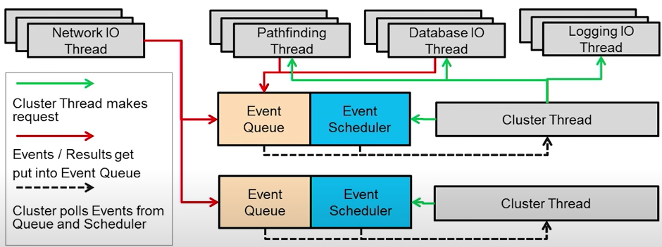

Набор ссылок и подсказки по терминологии для разработки многопользовательских и MMO-игр.

<!-- more -->

## Начальные материалы

Книга:
Многопользовательские игры. Разработка сетевых приложений Глейзер Д., Мадхав С. ([ссылка](https://www.piter.com/collection/programmirovanie-igr/product/mnogopolzovatelskie-igry-razrabotka-setevyh-prilozheniy)).
Описывает основные понятия, ориентирована больше на сессионные игры, иногда отсылает к изучению более продвинутых тем на другие материалы.

Статьи:
[О сетевой модели в играх для начинающих](https://habr.com/ru/post/467025/) - описаны базовые понятия, много отсылок на другие статьи по разным темам.
[Introduction to Multiplayer Game Programming](https://web.archive.org/web/20190519135537/http://trac.bookofhook.com/bookofhook/trac.cgi/wiki/IntroductionToMultiplayerGameProgramming) - хороший разбор вариантов выбора "нижнего уровня" игрового протокола, немного об игровой логике.
[Building a Game Network Protocol](https://gafferongames.com/categories/building-a-game-network-protocol/) - несколько статей о "верхнем уровне" игрового протокола.
[Reading and Writing Packets](https://gafferongames.com/post/reading_and_writing_packets/) - методы сериализации.
[Game Networking Demystified, Part I: State vs. Input (series)](https://ruoyusun.com/2019/03/28/game-networking-1.html) - серия статей с очень кратким обзором базовых понятий.
[MMO scalability is finally irrelevant for Indie MMOs](http://t-machine.org/index.php/2013/06/22/mmo-scalability-is-finally-irrelevant-for-indie-mmos/) - небольшая статья о пропускной способности и мощности серверов.
[The C10K problem](http://www.kegel.com/c10k.html) - о настройке сервера, поддерживающего 10000 TCP-соединений.

## Общая архитектура игры

Условно "Клиент-сервер-бекенд архитектура" (client/game server/web-server(with db), three-tiered server architecture), etc).
Конкретное устройство сильно зависит от потребностей игры. Примеры:

[Building a simple yet powerful MMO game architecture, Part 1](https://www.ibm.com/developerworks/library/ar-powerup1/index.html) - обзор архитектуры от IBM.
[Part 2](https://www.ibm.com/developerworks/library/ar-powerup2/) - вторая часть статьи (в самой статье кривые ссылки).
[Part 3](https://www.ibm.com/developerworks/library/ar-powerup3/ar-powerup3.html) - третья часть.

[Бэкенд-разработка в геймдеве](https://youtu.be/-AU_qlCu9ZI?t=361) – доклад Максима Барышников, Wargaming, тайминг на обзор архитектуры.

## Архитектура игрового сервера



Очень хорошо и понятно описана архитектура всей игры, и возможное устройство сервера MMO (единственный найденный доклад с примером архитектуры реального проекта)

## Архитектура клиента

`Предсказание на клиенте`
  - чтобы не ждать ответа сервера, предсказывать информацию на основе предыдущих данных (если игрок двигается вправо - в следующем кадре скорее всего тоже будет). Если от сервера приходит другая информация, то плавно интерполировать реальные данные с предсказанными, чтобы избежать скачков.

`Разные техники сглаживания позиции`
  - интерполяция ставит клиента на полученное от сервера значение (минус - клиент видит позицию немного в прошлом)
  - экстраполяция - клиент пытается предугадать где будут другие игроки на основе данных с сервера (минус - если позиция резко изменится, будет большее расхождение)
  - (для fps) - компенсация лага - сервер "перематывает время назад", и проверяет, что было на экране игрока в момент, когда тот выстрелил, чтобы не отказывать ему в попадании из-за задержки
  - Обязательно тестировать отладочным выводом и симуляцием лагающего клиента.
https://www.youtube.com/watch?v=7jb0FOcImdg - 8 Frames in 16ms: Rollback Networking in Mortal Kombat and Injustice 2
https://www.youtube.com/watch?v=W3aieHjyNvw - Overwatch Gameplay Architecture and Netcode (вторая половина)

`Переход игрока между зонами`
  - трансфер данных игрока между двумя шардами через бд.
  - можно сделать пересекающиеся зоны, когда игрок существует и видим одновременно из 2х соседних зон, или просто явным телепортом.

`Игровой цикл`
  - нужен апдейт с фиксированным шагом времени вместо обычного "update(dt)+render"
https://martalex.gitbooks.io/gameprogrammingpatterns/content/chapter-3/3.2-game-loop.html

  - очередь событий
Не обрабатывать события напрямую, а ставить в очередь на отправку - можно оптимизировать, сделать батчинг, отбросить повторы, приоритезировать, . При приёмё - сортировать с другими событиями игровой очереди.
https://martalex.gitbooks.io/gameprogrammingpatterns/content/chapter-5/5.2-event-queue.html

## "Нижний уровень" протокола

Понятия, относящиеся к уровню взаимодействия с ОС.

`Оборачивать в заменяемые компоненты`

`Udp vs Tcp vs библиотека для смешанного решения`

  - чаще всего свой протокол - надстройка над udp
  - не надо писать свой, если не уверен в том, что надо :)
  - фичи транспортного протокола можно реализовать на прикладном уровне
- Варианты
    https://github.com/networkprotocol/yojimbo
    https://github.com/ValveSoftware/GameNetworkingSockets
    использовать либу с обёртками

`Порты для одного клиента - один vs несколько`
  - демультиплексинг данных не нужен - всё равно придётся инспектировать протокол
  - можно юзать, если много данных, чтобы получить больший буфер данных от операционной системы на пользователя
  - могут закончиться

`Опрос каждый кадр vs опрос в отдельном потоке`
  - способы опроса: iocp/epoll/kqueue
  - Проблема 10к соединений http://www.kegel.com/c10k.html
  - Библиотеки-обёртки для опроса портов и цикла событий:
  - libuv
  - libevent
  - boost asio
  https://libwebsockets.org/
  https://stackoverflow.com/questions/118945/best-c-c-network-library

`NAT`
 - нужен id клиента кроме его адрес+порт (порт может внезапно измениться)

## "Верхний" уровень протокола

Прикладной уровень протокола

`Разбиение пакетов`
  - если пришёл пакет с пропущенным номером - либо выбросить, либо положить в буфер, чтобы некоторое время подождать предыдущих
  - маленькие пакеты можно группировать в большие (и не забывать всё равно рассылать недозаполненные, чтобы избежать лага)
  - большие пакеты, не вмещающиеся по размеру, делить на подпакеты и слать отдельно, собирая на стороне получателя
  - пакеты с высоким приоритетом и с низким (передаются только когда нет высоких)
  - (возможны и решения на уровне библиотеки)

`Сжатие`
 - cначала убедиться, что клиенту отправляется ТОЛЬКО информация, которая ему необходима! 
 - проверка, что видит игрок, и какие данные нужны его клиенту - pvs - potentionally visible set
 - урезать значения. float->16bit, int->8bit, битовые флаги ->запаковать вместе
 - битовые потоки вместо байтовых
 - удобный трюк - 32 битовой число можно записать как литерал из 4х символов ("l34t" == 0x6C333474)
 - использовать для запаковки знание информации об игре
 - если изменяются не все поля объекта, можно использовать битовую маску, чтобы отметить какие из полей нужно прочитать.
 - отсекать многократно повторяющиеся команды на клиенте перед отправкой, также при обнаруженном сбое отправки отправлять не устаревшие данные, а последние (ещё один слой абстракции между игровым кодом и сетевыми пакетами)
 - слать клиенту не состояние, а дельту между состояниями (т.е. если не было изменения координаты какой-либо - не слать её повторно)
 - сжатие:
   - rle
   - huffman
   - zlib
https://github.com/r-lyeh-archived/quant - библиотека для дискретизации

`Сериализация данных`
- библиотеки (много различий - требуют ли схемы, ending, поддержка rpc, etc)
  - protocolBuffers, flatBuffers, cap'n'proto, thrift, msgpack, cereal, yas, boost::serialization, bitsery
  - своя схема на lex/yacc + кодогенерация
- Схему данных пакетов в теории можно не хранить на клиенте, а передавать на старте сессии - тогда не надо обновлять клиент (но лучше не надо)

## Игровая логика

`Безопасность и читеры`
 - один читер может испортить игру 100-1000 игрокам
 - не слать клиенту информацию вроде "рядом с вами невидимый игрок"
 - проверять, не слишком ли много действий в секунду совершает игрок
 - не верить данным от клиента - авторитарный сервер
 - не изобретать своих шифрований и не хранить ключи симметричного шифрования на клиенте.
 - шифрование - у сервера есть приватный и публичный ключ. Клиент генерирует только симметричный ключ (уникальный для сессии) и передаёт серверу зашифровав публичным ключом сервера. Сервер шифрует данные симметричным ключом клиента.
 - libsodium

`Хинты для оптимизации игрового протокола`
  - Минимизировать или вообще избегать обязательных (reliable) рассылок апдейтов/rpc каждый такт от сервера клиентам.
  - Не реплицировать то, что можно не реплицировать (если какое-нибудь разрушаемое дерево вообще не влияет на геймплей - пусть клиенты считают его как хотят)
  - Если нужно реплицировать на клиент большой кусок данных (стартовое состояние мира при подключении) - передать не за один заход, а разбить на много мелких (иначе можно перегрузить сеть и другие клиенты будут лагать).
  - Возможная оптимизация клиента - удалять на клиенте всех акторов за пределами досягаемости камеры/гильдейских знаний игрока (не рендерить и не знать ничего о том, что он не может увидеть). Можно настроить время очистки.
https://habr.com/ru/company/mailru/blog/352634/ Сетевая оптимизация для Unreal Engine 4

## Отладка сети

`Замеры качества соеднинения`
  - проверка времени - ping
  - проверка потерь - либо считать пакеты, которые пришли с неверным порядковым номером, либо считать количество необходимых ретрансляций

https://docs.unrealengine.com/en-US/InteractiveExperiences/Networking/NetworkProfiler/index.html - по ссылке - описание тулзы профайлинга данных по сети. Standalone тул. Клиент в отладочном режиме пишет в файл протокол, который можно загрузить в тулзу и исследовать.
(https://youtu.be/VusAHXoHF3Y?t=273 - Replication Graph For Optimizing Real-Time Strategy Games | Unreal Fest Europe 2019 | Unreal Engine - пример использования)

  - плейтесты на реальном сервере, тесты с сервером на машине разработчике нерепрезентативны
  - обязательно необходимо симулировать плохую сеть, чтобы понять, как будет вести себя клиент в экстремальных условиях
  - подсчёт трафика : поднимаете дедикейтед. устраиваете на нём плейтест. Смотрите траффик на отдельно взятом порту. Оцениваете, сколько в среднем траффика на вход и на выход.

