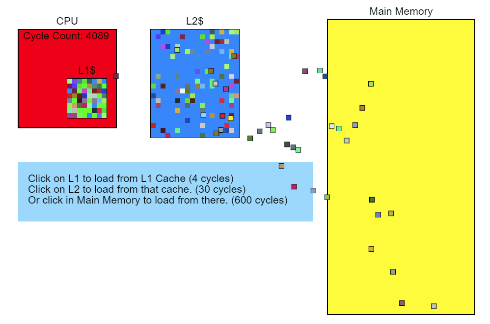
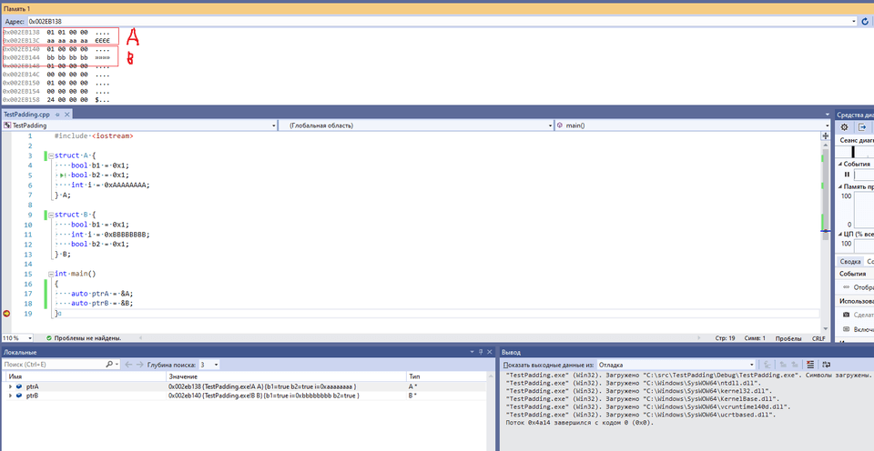
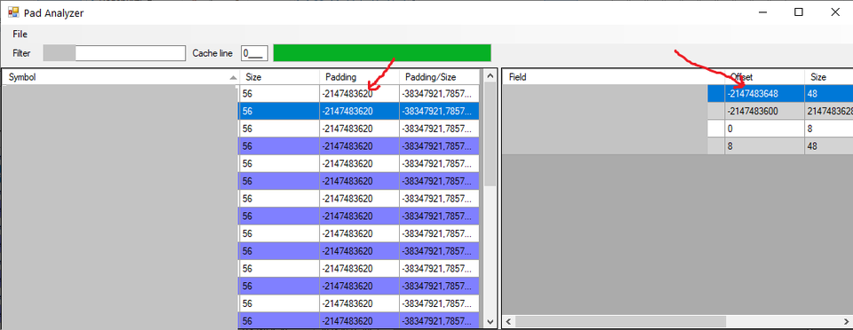
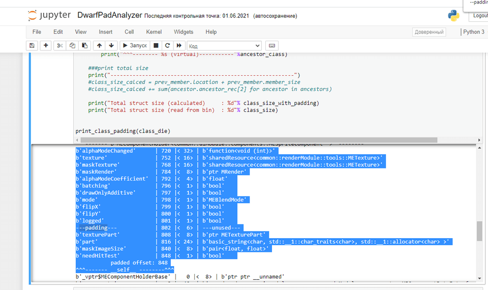
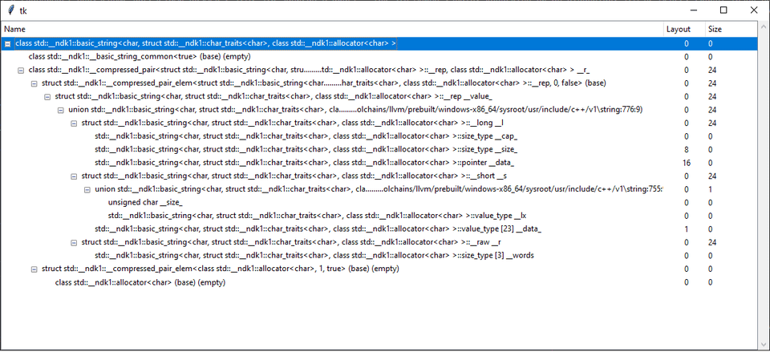

Обычно на вопрос о расположении объекта в памяти программисты C++ отвечают "это зависит от реализации", а как именно зависит - не особо понимают. Это действительно практически не нужно знать для написания корректных программ, но может пригодиться для написания быстрых.

После просмотра доклада об оптимизации `Witcher 3` для Switch ([видео](https://www.gdcvault.com/play/1026635/-Witcher-3-on-the) на 14:28), я решил проверить, возможно ли получить информацию об расположении объектов в памяти таким же или похожим способом для телефонов.
<!-- more -->

**`Зачем это нужно в контексте разработки мобильных игр (и не только):`**
- Пробраться "вглубь" языка, лучше понять его фичи
- Улучшить понимание работы компиляторов и отличия в реализациях
- Получить возможность оценить размер базовых объектов используемых библиотек
- Научиться data-oriented design (если начинать проектировать от данных, хорошо бы понять, как они вообще выглядят)
- **Оптимизировать наиболее часто используемые структуры - уменьшить системные требования игры**

Заметки про `data-oriented design` и `entity-component-system` подход - ,  

**`Когда можно браться за подобные исследования`**
- Если у вас есть много времени
- Если игра не влезает в память и тормозит, а нужно её запихать и разогнать
- Если хотите "достичь невозможного" (Do the impossible! ;) )

**`Когда не стоит`**
Если просто нужно сделать фичу или окошко для игры - то лучше сделать поскорее, закрыть задачу, выпустить апдейт/релиз, выпить шампанского (или коньяка, в зависимости от масштабов запуска). Потом выехать погулять на природу и тогда, возможно, задуматься о расположении объектов в памяти.

## Как уменьшение размера структур уменьшает производительность
Кроме очевидного **`уменьшения времени на копирование`** байт, необходимого для создания объекта, более важным является то, что объекты лучше **`помещаются в кеш`**.

Т.е. во-первых, уменьшается количество страниц оперативной памяти, которые будут выгружена на диск ([Виртуальная память](https://ru.wikipedia.org/wiki/%D0%92%D0%B8%D1%80%D1%82%D1%83%D0%B0%D0%BB%D1%8C%D0%BD%D0%B0%D1%8F_%D0%BF%D0%B0%D0%BC%D1%8F%D1%82%D1%8C)).

Во-вторых, процессор имеет свой [кеш памяти](https://ru.wikipedia.org/wiki/%D0%9A%D1%8D%D1%88_%D0%BF%D1%80%D0%BE%D1%86%D0%B5%D1%81%D1%81%D0%BE%D1%80%D0%B0) нескольких уровней. При запросе данных из памяти он загружает не только запрошенную ячейки, но ещё и соседние ячейки. Количество таких ячеек называется *кеш-линией*. В случае обращения к соседним ячейкам данные будут получены не из оперативной памяти, а из кеша, что **сильно** быстрее.



Разница между получением данных из кеша 1 уровня и основной памяти достигает 2х порядков **(~100 раз быстрее)**, конкретные числа зависят от железа.



(источник - https://technology.riotgames.com/news/profiling-measurement-and-analysis)

Примеры и бенчмарки:
[Data Locality](https://gameprogrammingpatterns.com/data-locality.html) - глава из книги **`Game Programming Patterns`**.
[Latency Numbers Every Programmer Should Know](https://colin-scott.github.io/personal_website/research/interactive_latency.html) - визуализация задержек доступа к разным типам памяти.
[Pitfalls of Object Oriented Programming](http://overbyte.com.au/misc/Pitfalls2009.pdf) - слайды с бенчмарками на PS3 с закрытого доклада Тони Альбрехта.
[Pitfalls of Object Oriented Programming, Revisited - Tony Albrecht (TGC 2017)](https://youtu.be/VAT9E-M-PoE) - публичный доклад 2017 года Тони Альбрехта, бенчмарки для PC и PS4.
[Musings on Data-Oriented Design](https://solid-angle.blogspot.com/2010/02/musings-on-data-oriented-design.html) - статья про то, что компиляторы преобразуют код, но не трогают данные.
[Data-Oriented Design (Or Why You Might Be Shooting Yourself in The Foot With OOP)](https://gamesfromwithin.com/data-oriented-design) - одна из первых статей о дизайне, ориентированном на данные, применительно к геймдеву


## Понятия

**`Размер объекта`** (`size`) - количество байт в памяти, которое занимает (на стеке или в куче) созданный экземпляр класса объекта. Размер объекта можно получить с помощью оператора `sizeof`. Если объект умеет выделять динамическую память в конструкторе (или любой другой функцией), естественно, компилятор не учитают это в размере самого объекта - подобные действия выполняются уже во время работы программы.

**`Выравнивание`** (`alignment`) - способ размещения данных в памяти так, чтобы к ним можно было быстро обращаться (на некоторых процессорах к невыровненным данным вообще невозможно обратиться).
Процессор загружает данные из памяти не по одному байту, а по размеру *машинного слова*.

Например, на машине с 64-битной адресацией, если нужно загрузить адрес из памяти, то он должен быть выровнен в памяти по границе 8 байт (может находиться в памяти только по адресам, заканчивающимся на `0x0` или `0x8`). Если адрес `0x1122334455667788`, например, сохранён начиная с ячейки памяти `0x00000003` (в big-endian формате):

```
0x00000000: 00 00 00 00 00 11 22 33
0x00000008: 44 55 66 77 88 00 00 00
```
Процессор может загрузить только слова по адресам `0x00000000` или `0x00000008`. Таким образом, чтобы "собрать" нужный адрес, ему потребовалось по загрузить 2 слова `0x000000112233` и `0x4455667788000000` и произвести операции сдвига и совмещения адресов, что сильно дольше одной команды загрузки.

Получить выравнивание структуры с помощью оператора `alignof`.

**`Padding`** (иногда переводят тоже как `выравнивание`, что может создать путаницу, так что если пусть называется `паддинг`) - добавление неиспользуемых байт после окончания описания какого-либо объекта в памяти так, чтобы следующий за ним объект оставался выровненным. Оператора, который бы позволил добраться до этих неиспользуемых байт, нет, но прочитать или записать их можно (лучше так никогда не делать).

В совсем тривиальных случаях `размер, выравнивание и паддинг` легко рассчитать, глядя на код, но при малейшем усложнении это резко становится сложным. Собственно, цель заметки - исследовать различные способы получения этой информации для компиляторов C++, используемых мной в работе, т.е. для ОС **`Windows/iOS/Android`** (`Visual C++` и `Clang`).

## Отладка программы

Более продвинутый способ, чем ручной подсчёт - использование средств отладки программы (сюда я включаю сразу как точки остановки, так и просто диагностический вывод или использование подсказок ide компилятора). Для начала подойдёт простой вывод полученных чисел в консоль:
https://gcc.godbolt.org/z/8fKa74j9n
```cpp
struct A {
  bool b1;
  bool b2;
  int i;
};

struct B {
  bool b1;
  int i;
  bool b2;
};

std::cout << "sizeof(A):" << sizeof(A) <<  std::endl;
std::cout << "sizeof(B):" << sizeof(B) <<  std::endl;
//output:
//  sizeof(A):8
//  sizeof(B):12
```

Посмотреть, где именно находится дополнительная "дырка" в структуре `B` можно с помощью макроса [offsetof](https://en.cppreference.com/w/cpp/types/offsetof), хотя здесь проще перейти к способу с отладчиком.
Для идентификации данных в памяти можно "пометить" их при инициализации:

```cpp
struct A {
  bool b1 = 0x1;
  bool b2 = 0x1;
  int i = 0xAAAAAAAA;
};

struct B {
  bool b1 = 0x1;
  int i = 0xBBBBBBBB;
  bool b2 = 0x1;
};
```

При использовании `Visual Studio` можно вызвать посмотреть адрес переменной в окне `Locals`, и затем изучить содержимое памяти с помощью окна [Memory](https://docs.microsoft.com/ru-ru/visualstudio/debugger/memory-windows?view=vs-2019).

```
0x002EB138  01 01 00 00  <---  A.b1, A.b2, padding[2]
0x002EB13C  aa aa aa aa  <---  A.i
0x002EB140  01 00 00 00  <---  B.b1, padding[3]
0x002EB144  bb bb bb bb  <---  B.i
0x002EB148  01 00 00 00  <---  B.b2, padding[3]
```

В `XCode` для просмотра памяти можно воспользоваться командой отладчика:

```
gdb /12xb 0x002EB138
//вывести 12 байт в hex-формате, начиная с адреса 0x002EB138
```

Небольшую хитрость при таком способе представляет лишь просмотр пространства в конце структуры, так как его сложнее пометить, но здесь можно воспользоваться наследованием (данные структуры наследника будут располагаться сразу за предком), массивом из нескольких структур, или просто скопировать все данные в непрерывный массив данных с помощью `memcpy`:

```cpp
char values[1000];
memcpy(values, d1, sizeof(A));
//можем изучать в отладчике содержимое values
```

Собственно, если говорить о [тривиальных типах данных](https://www.cplusplus.com/reference/type_traits/is_trivial/) (без виртуальных функций или множественного/виртуального наследования), то на этом можно было бы и остановиться.

Таким способом можно изучать и сложные классы, некоторые так и делают, например, [статьи](https://shaharmike.com/cpp/vtable-part1/) Shakar Mike по исследованиям содержимого и формата таблиц виртуальной памяти. Однако при этом достаточно сложно на глаз определить работу в случаях, которые находятся за рамками тривиальных разобранных в статьях примерах. Так что лучше сразу читать спецификацию, которую использует `Clang` в том числе и для `iOS/Android` - [Itanium C++ ABI](https://itanium-cxx-abi.github.io/cxx-abi/abi.html#layout).

*не уверен, что это на 100% верно, но скрипты, которые анализируют размеры и расположение в памяти, использующие другие способы, показывают, что используется эти спецификация*.

Главное отличие в поведении компилятора `Visual C++` - он кладёт указатель на виртуальный базовый класс в сам объект, а не добавляет его в виртуальную таблицу класса.

Если *совсем кратко* и на пальцах объяснять виртуальное и множественное наследование - все невиртуальные предки располагаются перед собственными членами класса (в порядке объявления слева направо, но первый класс с таблицей виртуальных функций "всплывает" наверх), а все виртуальные предки - сразу за собственными членами.

Спецификация объясняет все особенности множественного и виртуального наследования, но всё равно, использовать отладчик на классах из реальных проектов сложно, потому что:
- В случае сложных иерархий можно просто запутаться в обычных и виртуальных наследниках
- Тяжело изучать классы из std или чужих библиотек
- Легко пропустить "дырки" в каких-нибудь классах
- Сложно представить, какие данные в какую кеш-линию попадут

Таким образом, вместо изучения программы методом запуска её с отладчиком и написанием диагностического кода хочется воспользоваться более продвинутыми способами.

##Изучение способов достать информацию о типах

К сожалению, в C++ нет интроспекции, но `отладчик ведь как-то получает эту информацию`?

Собственно, об этом способе рассказывается в докладе о Ведьмаке.

Компилятор пишет её в отладочную секцию исполнимого файла в бинарном виде, откуда её могут прочитать какие-либо тулзы.


Из этой информации кстати можно сделать полезный вывод о том, как работает сборка в режиме Release with Debug info - она не замедляет код, а просто добавляет в испонимый файл эту дебажную информацию, которую потом можно просто отрезать не пересобирая исполнимый файл.


Автор доклада взял браузер отладочного формата ([статья](http://msinilo.pl/blog2/post/p425/), сейчас [используется](https://issues.unrealengine.com/issue/UE-96827) где-то в `Unreal Engine`), который использует `Visual Studio`, и [зафигачил](https://github.com/rdev0/PadAnalyzer/commits) туда поддержку форматов PDB (отладочная база данных `Visual Studio` для x86/x64/XboxOne), и чтение отладочной информации в формате `Dwarf` из `Elf`-файлов (Switch, PS4).

В этом месте я очень обрадовался, так как Elf-файлы и отладочные секции в [формате Dwarf](http://dwarfstd.org/) - стандартные для `Unix`, а значит, был шанс, что получится загрузить в утилиту и бинарники для `iOS` и `Android`. С некоторыми усилиями я собрал тулзу и запустил её, но понял, что радоваться рановато - `iOS/macOS` бинарники не загружались, так как отличались от стандартного формата, но `Android` so-файл удалось загрузить! Но даже с ним возникли проблемы, оказалось, что тулза неправильно показывает расположение объектов с виртуальным наследованием - в Ведьмаке 3, видимо, не было сложных схем наследования, так что автор порта просто не обратил внимание на этот баг, но в моём проекте это широко использовалось.


Было грустно, что `Pad Analyzer` *как будто* должен был подойти для изучения мобильных платформ, но не помог. Однако им можно было воспользоваться как референсом для других скриптов, так что я решил попробовать разобраться с Dwarf-форматом чуть детальнее.

С загрузкой `iOS/macOS` оказалось относительно просто - в Apple решили не писать в финальный бинарник отладочную секцию, а сохранить в нём просто айдишник, по которому может быть найден **`dsym`**-файл со ссылками на реальную отладочную информацию, находящуюся в **`*.o-файлах`**.

Ссылки с детальными объяснениями:
[Ответ на stackoverflow](https://stackoverflow.com/questions/10044697/where-how-does-apples-gcc-store-dwarf-inside-an-executable/12827463#12827463) от программера из Apple.
[Apple's "Lazy" DWARF Scheme](http://wiki.dwarfstd.org/index.php?title=Apple%27s_%22Lazy%22_DWARF_Scheme) - "Ленивые дворфы от Эпл"
[Описание структуры dsym-файла](https://stackoverflow.com/questions/24961746/what-the-structure-of-dsym-file) - со ссылкой на тулзу на Python, которая может загружать Mach-O файлы.


Здесь тоже есть полезное знание о том, из-за чего XCode после перегенерации проекта вынуждена перекомпилировать все файлы - она не может расшарить отладочную информацию из предыдущих сборок.



Pad Analyzer не умеет загружать *.o файлы, но можно было либо разобраться, как добавлять их, либо попробовать собрать пустой Elf-файл, и "пересадить" в него отладочную секцию из *.o файла. Звучит безумно, но задача выполнима:
[Converting a Raw Binary File Into an ELF/Dwarf File](https://dzone.com/articles/converting-a-raw-binary-file-into-an-elfdwarf-file)
[Рецепты для ELF-ов](https://habr.com/ru/company/inforion/blog/460247/)

Но, к счастью, по одной из ссылок я натолкнулся на библиотеку [pyelftools](https://github.com/eliben/pyelftools) и визуализатор dwarf-формата [dwex](https://github.com/sevaa/dwex). Это был шаг вперёд, потому что он умел открывать 32- и 64-битные `.o-файлы для MacOSx`, собранные 32- и 64-бинарники для `.so бинарники для Android`, и 32-битные `.o бинарники для Android`. Оставалась проблема с тем, что [не работали](https://github.com/eliben/pyelftools/issues/317) 64-битные *.o-файлы для Android. 

Сам `Dwarf Explorer` не предназначен для показа полной информации об объекте, но, раз у него есть дерево со ссылками на предков, можно написать свой алгоритм, который соберёт все данные.

##Статическое изучение отладочной информации

Я набросал примерно [такой скрипт](https://gist.github.com/spiiin/d9edf2c32f555b530b1413d632c14888) в `Jupyter` с использованием библиотеки `Dwex/pyelftools`, чтобы проверить результаты. После нескольких исправлений он работает *почти правильно* (не ходит рекурсивно по всем членам, из-за чего не может узнать их выравнивание, так что предполагает выравнивание в 8 байт (зачастую оказывается прав из-за того, что классы содержат указатели :), и сравнивает полученные рассчётами размер с тем, что записан в dwarf - так что можно узнать, корректно ли он отработал. Тем не менее, скрипт точно показывает **`относительное смещение`** каждого члена структуры и знает **`размер каждого члена`**, а значит, и **`паддинг`**, т.е. его в большинстве случаев можно использовать для того, чтобы найти "дыры" внутри структур.


Пример вывода скрипта:
```
b'alphaModeChanged'      | 720 |< 32> | b'function<void (int)>'
b'texture'               | 752 |< 16> | b'sharedResource<tex>'
b'maskTexture'           | 768 |< 16> | b'sharedResource<tex>'
b'maskRender'            | 784 |<  8> | b'ptr render'
b'alphaModeCoefficient'  | 792 |<  4> | b'float'  
b'batching'              | 796 |<  1> | b'bool'   
b'drawOnlyAdditive'      | 797 |<  1> | b'bool'   
b'mode'                  | 798 |<  1> | b'blendMode'
b'flipX'                 | 799 |<  1> | b'bool'   
b'flipY'                 | 800 |<  1> | b'bool'   
b'logged'                | 801 |<  1> | b'bool'   
---padding---            | 802 |<  6> | ---unused---
b'texturePart'           | 808 |<  8> | b'ptr texPart'
b'part'                  | 816 |< 24> | b'basic_string<char, std::__1::char_traits<char>, std::__1::allocator<char> >'
b'maskImageSize'         | 840 |<  8> | b'pair<float, float>'
b'needHitTest'           | 848 |<  1> | b'bool'   
           padded offset: 848
^^^------- sprite--------^^^
```

Для Linux есть утилита [pahole](https://lwn.net/Articles/335942/) и скрипт ~~[struct_layout](https://github.com/arvidn/struct_layout) (он использует linux утилиту dwarfdump)~~ (сырая и не работает), которые также умеют показывать пустоты внутри структур, но мне не удалось завести их `Android/iOS`.

##Получение данных от Clang во время компиляции

Другой интересный подход - `Clang` с ключом **`-Xclang  -fdump-record-layouts`** ([статья](https://eli.thegreenplace.net/2012/12/17/dumping-a-c-objects-memory-layout-with-clang/)) выводит прямо в stdout данные о расположении структур в памяти (аналогично, для `Visual C++` - **`/d1reportAllClassLayout`**.

Это удобно для небольших типов, пример: https://gcc.godbolt.org/z/3fev6fc5d, но на реальных проекта выдаёт несколько десятков мегабайт текста на каждый файл (так что приходится не добавлять ключ в `XCode/Android Studio`, а просто скопировать командную строку из среды разработки и вызывать её из консоли для одного файла, иначе есть риск получить десятки гигабайт текста).

Тогда можно набросать [скрипт](https://gist.github.com/spiiin/9b19c549d1367fb00ad301896423a82b), который парсит текстовый вывод и отображает его в виде дерева:

*(если анализировать не stl, а свои типы, то всё выглядит понятнее)*

Этот подход показывает корректные **`выравнивания`** всех структур, но Clang не показывает **`размеры`** вложенных членов (на скриншоте размеры, полученные другим способом), а значит, в таком выводе не видны **`паддинги`**.

Cкорее всего можно получить все нужные данные от Clang, если не охотится за его выводом в текстовом виде, а использовать его [API](https://clang.llvm.org/docs/Tooling.html), однако его компиляция - отдельное приключение =\ Кажется, [что-то подобное](https://github.com/def-/ycmd/commit/2a7124bcb5730f301e3e73a4af81316bbff81926) - обращение к libclang за размером типы и выравниванием).

##Выводы
Если немного заморочиться с написанием вспомогательных скриптов (каждый из них пока не доделан до конца, когда-нибудь я их закончу), то можно заглянуть сквозь тему внутрь объектов. Только осторожно, есть шансы наткнуться там на упырей, питающихся памятью, с которыми потом придётся начинать бороться!


