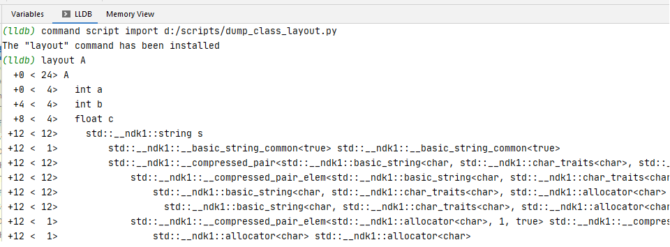
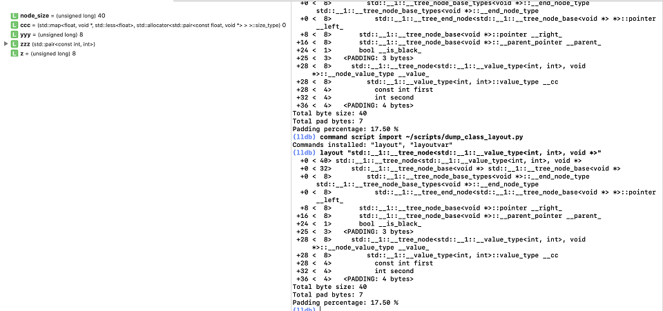
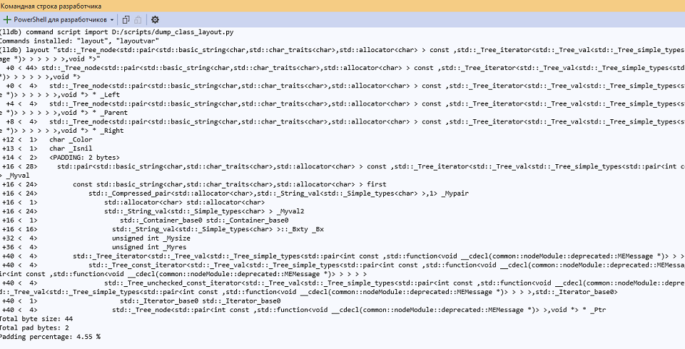

Продолжение экспериментов с изучением расположения объектов C++ в памяти.
<!-- more -->

 
закончилась на том, что самым удобным способом изучения оказался статический анализ информации для отладчика из исполнимого файла или отладочной базы данных. Этот способ удобен, если нужно оптимизировать большую готовую кодовую базу. Но у него есть два серьёзных минуса.

##Минусы статического анализа

Во-первых, инструменты и библиотеки требуют написания большого количества кода, из-за чего 1) ни одна из них не покрывает нормально бинарники обеих платформ iOS/Android, 2) написанные руками формулы по спецификации не покрывают всех corner-case и могут содержать ошибки, которые сложно заметить и исправить - поддерживать такой скрипт/инструмент сложно. Было бы намного удобнее воспользоваться кодовой базой самого компилятора или отладчика, чтобы избавиться от необходимости поддержки своего кода.

Во-вторых, изучение базы классов и оптимизация таким способом производится слишком редко, и зачастую слишком поздно, когда времени остаётся только на исправление самых больных мест.

##Ранняя оптимизация
Идеология "не оптимизировать код пока не потребуют" растёт из цитаты Дональда Кнута *"Преждевременная оптимизация – корень всех зол"*.

Проблема такого подхода - программисты пишут изначально плохой код, вообще не задумываясь о том, чтобы его оптимизировать. Ведь пока не найдено "бутылочное горлышко" - твой код не самый плохой, и трогать его не надо. В итоге получается, что среднестатистический код проекта содержит большое количество балласта, который можно было легко выбросить, если сразу его увидеть.

Сама стадия измерения производительности откладывается как можно дальше, чаще всего на оставшееся до релиза время (а его никогда не бывает слишком много), или вообще забрасывается. Любая некритическая, а, возможно, и критическая) todo-шка в коде в стиле "я сделаю это нормально" рискует прожить в коде много лет. Чаще всего программисты относятся к кодовой базе по принципу "работает - не трогай", такой подход имеет определенный смысл - переписывание всегда добавляет новые ошибки, но он совсем не способствует тому, чтобы переписывать код на более быстрый.

Можно попробовать сменить подход, и вытащить стадию оптимизации размера структур и расположения их в памяти как можно раньше. В идеале, ещё до написания кода или хотя бы на момент его компиляции.

Тогда каждая компиляция станет проверкой прототипа лучшей версии кода.

**`Чем раньше узнаешь, что с твоими данными что-то не так, тем скорее можешь это исправить`** ([It's all about your data!](https://www.dataorienteddesign.com/dodbook/node2.html)).

Такое исправление не будет "корнем зол", если на него не потребуется много времени - а с этим и должны помочь инструменты.

##Получение данных от компилятора

Простое получение данных от `Clang` и `Visual C++` во время компиляции рассматривалось в предудыщей заметке - они поддерживают ключи `fdump-record-layouts`/`d1reportAllClassLayout` для вывода выравнивания структуры в stdout, однако оно не удобно, так как порождает слишком много текста, плохо фильтруется, и показывает абсолютное выравнивание структур и классов вместо относительного и держать его включенным постоянно неудобно.

Другой возможный подход - написание плагина к компилятору. Это не очень сложно в теории, Clang задумывался расширяемым, несколько статей для поисков в нужном направлении:
[Clang tutorial introduction](https://kevinaboos.wordpress.com/2013/07/23/clang-tutorial-part-i-introduction/) - примеры использования интерфейсов к Clang - `плагины, LibTooling, LibClang`.
[External Clang examples](https://clang.llvm.org/docs/ExternalClangExamples.html) - примеры расширения компилятора, в частности:
[LibreOffice compiler plugins](https://github.com/LibreOffice/core/tree/master/compilerplugins/clang) - примеры плагинов, реализующих различные проверки. Местами linux-specific (pahole-all-classes.py использует linux-утилиту pahole, чтобы показывать выравнивание и дыры в структурах, почто то что нужно).
[Creating and Using the Clang Plugin in Xcode](https://sudonull.com/post/114803-Creating-and-Using-the-Clang-Plugin-in-Xcode) - "Hello, world"-плагин для Xcode.

Плагин собирается в dll/.so/.dylib файл, который передаётся компилятору через командную строку:

```bash
$LLVM_HOME/llvm_build/bin/clang ../test.cpp \
  -Xclang -load \
  -Xclang lib/Debug/TestClangPlugin.dylib \
  -Xclang -plugin \
  -Xclang TestClangPlugin
```

Но, ключевое слово здесь "в теории". Сборка плагина требует сборки компилятора из исходников, причём исходников той версии, для которую собирается плагин. Для большой кодовой базы старые версии исходников могут просто не собраться новые версиями средств сборки (а учитывая желание иметь кросс-платформенный плагин - количество требуемых усилий нужно умножать на количество платформ). Кроме того, автор плагина для Xcode отмечает, что компилятор Clang от Apple не поддерживает плагины (и скорее всего может ещё в чем-то отличаться от оригинального), что уже не очень удобно - требуется или использовать обычный компилятор для сборки приложения и модифицированные - для работы с плагинами, либо положиться на то, что Apple не использовала каких-либо специфичных хаков для сборки своего компилятора.

Кроме того, API компилятора [нестабильно](https://chromium.googlesource.com/chromium/src/+/HEAD/docs/writing_clang_plugins.md), так что всё равно возникает необходимость поддержки своих плагинов, а код плагина может быть немаленьким (хотя, по большей части, нужная функциональность почти вся сосредоточена в [одном файле](https://clang.llvm.org/doxygen/RecordLayoutBuilder_8cpp_source.html).

Дополнительной проблемой может стать увеличенное время компиляции (я не измерял, насколько постоянно включенные плагины замедляют сборку), хотя тут можно было бы попробовать помечать для обработки отдельные классы (например, [атрибутом](https://en.cppreference.com/w/cpp/language/attributes)) и перекомпилировать только отдельные единицы компиляции, а не весь проект.

Но пока я возился с документацией по плагинам, я нашёл способ удобнее. Расширяемым сделан не только компилятор, но и отладчик [LLDB](https://lldb.llvm.org/use/python.html). И самое главное, он расширяется не плагинами, а имеет python-интерфейс. А значит, есть шанс, что скрипт будет работать под любую платформу!

##Интерактивная отладка в LLDB с Python

После небольших экспериментов я понял, что это то, что нужно, скрипт работает в `XCode`, `Android Studio` и `Visual Studio Code` (с использованием плагина [CodeLLDB](https://marketplace.visualstudio.com/items?itemName=vadimcn.vscode-lldb)).

https://github.com/spiiin/lldb_dump_class_layout - скрипт для LLDB.

Для загрузки скрипта из отладчика нужно выполнить команду для импорта скрипта:

```
command script import ~/PATH_TO_SCRIPT/dump_class_laouyt.py
```
После чего из lldb можно выполнять команды `layout STRUCT_NAME` (для поиска в загруженных образах информации о типе STRUCT_NAME) и `layoutvar VARIABLE_NAME` (для получения информации о переменной на фрейме стека).





Одна из интересных возможностей скрипта - изучения памяти для типов из STL, например, для `std::map`:

```cpp
std::map<int,int> aaa;
(void)sizeof(aaa); //чтобы компилятор не выбросил неиспользуемый тип
```

```cpp
(lldb) layoutvar aaa
std::__1::map<int, int, std::__1::less<int>, SimpleAllocator<std::__1::pair<const int, int> > >
 +0 < 24> std::__1::map<int, int, std::__1::less<int>, SimpleAllocator<std::__1::pair<const int, int> > >
 +0 < 24>   std::__1::map<int, int, std::__1::less<int>, SimpleAllocator<std::__1::pair<const int, int> > >::__base __tree_
 +0 < 8>    std::__1::__tree<std::__1::__value_type<int, int>, std::__1::__map_value_compare<int, std::__1::__value_type<int, int>, std::__1::less<int>, true>, SimpleAllocator<std::__1::__value_type<int, int> > >::__iter_pointer __begin_node_
 +8 < 8>     std::__1::__compressed_pair<std::__1::__tree_end_node<std::__1::__tree_node_base<void *> *>, SimpleAllocator<std::__1::__tree_node<std::__1::__value_type<int, int>, void *> > > __pair1_
 +8 < 8>       std::__1::__compressed_pair_elem<std::__1::__tree_end_node<std::__1::__tree_node_base<void *> *>, 0, false> std::__1::__compressed_pair_elem<std::__1::__tree_end_node<std::__1::__tree_node_base<void *> *>, 0, false>
 +8 < 8>         std::__1::__tree_end_node<std::__1::__tree_node_base<void *> *> __value_
 +8 < 8>          std::__1::__tree_end_node<std::__1::__tree_node_base<void *> *>::pointer __left_
 +8 < 1>       std::__1::__compressed_pair_elem<SimpleAllocator<std::__1::__tree_node<std::__1::__value_type<int, int>, void *> >, 1, true> std::__1::__compressed_pair_elem<SimpleAllocator<std::__1::__tree_node<std::__1::__value_type<int, int>, void *> >, 1, true>
 +8 < 1>         SimpleAllocator<std::__1::__tree_node<std::__1::__value_type<int, int>, void *> > SimpleAllocator<std::__1::__tree_node<std::__1::__value_type<int, int>, void *> >
 +8 < 1>           std::__1::allocator<std::__1::__tree_node<std::__1::__value_type<int, int>, void *> > std::__1::allocator<std::__1::__tree_node<std::__1::__value_type<int, int>, void *> >
 +16 < 8>     std::__1::__compressed_pair<unsigned long, std::__1::__map_value_compare<int, std::__1::__value_type<int, int>, std::__1::less<int>, true> > __pair3_
 +16 < 8>       std::__1::__compressed_pair_elem<unsigned long, 0, false> std::__1::__compressed_pair_elem<unsigned long, 0, false>
 +16 < 8>        unsigned long __value_
 +16 < 1>       std::__1::__compressed_pair_elem<std::__1::__map_value_compare<int, std::__1::__value_type<int, int>, std::__1::less<int>, true>, 1, true> std::__1::__compressed_pair_elem<std::__1::__map_value_compare<int, std::__1::__value_type<int, int>, std::__1::less<int>, true>, 1, true>
 +16 < 1>         std::__1::__map_value_compare<int, std::__1::__value_type<int, int>, std::__1::less<int>, true> std::__1::__map_value_compare<int, std::__1::__value_type<int, int>, std::__1::less<int>, true>
 +16 < 1>           std::__1::less<int> std::__1::less<int>
 +16 < 1>             std::__1::binary_function<int, int, bool> std::__1::binary_function<int, int, bool>
Total byte size: 24
Total pad bytes: 0
```

Итог, 24 байта на стеке. Плюс, что интереснее, можно посмотреть, сколько занимает каждая нода в куче.
Напрямую сама нода спрятана от программиста, но можно написать код аллокатора, который может засечь размер:

```cpp
template<typename T>
struct SimpleAllocator : private std::allocator<T>
{
	using value_type = T;
	using pointer = typename std::allocator<T>::pointer;
	using size_type = typename std::allocator<T>::size_type;
	pointer allocate(size_type n)
	{
		std::cout << "Allocator sizeof(T)==" << sizeof(T) << '\n';
		return std::allocator<T>::allocate(n);
	}
	void deallocate(pointer p, size_type n)
	{ return std::allocator<T>::deallocate(p, n); }
};
std::map<int, int, std::less<int>, SimpleAllocator<std::pair<const int,int>>> aaa;
aaa[0]=0;

//Allocator sizeof(T)==40 bytes
```

Или запросить у скрипта нужную структуру данных (название структуры можно узнать из вывода предыдущего запроса:

```cpp
(lldb) layout "std::__1::__tree_node<std::__1::__value_type<int, int>, void *>"
 +0 < 40> std::__1::__tree_node<std::__1::__value_type<int, int>, void *>
 +0 < 32>   std::__1::__tree_node_base<void *> std::__1::__tree_node_base<void *>
 +0 < 8>     std::__1::__tree_node_base_types<void *>::__end_node_type std::__1::__tree_node_base_types<void *>::__end_node_type
 +0 < 8>      std::__1::__tree_end_node<std::__1::__tree_node_base<void *> *>::pointer __left_
 +8 < 8>    std::__1::__tree_node_base<void *>::pointer __right_
 +16 < 8>    std::__1::__tree_node_base<void *>::__parent_pointer __parent_
 +24 < 1>    bool __is_black_
 +25 < 3>  <PADDING: 3 bytes>
 +28 < 8>   std::__1::__tree_node<std::__1::__value_type<int, int>, void *>::__node_value_type __value_
 +28 < 8>     std::__1::__value_type<int, int>::value_type __cc
 +28 < 4>      const int first
 +32 < 4>      int second
 +36 < 4>  <PADDING: 4 bytes>
Total byte size: 40
Total pad bytes: 7
Padding percentage: 17.50 %
```
Каждая нода красно-чёрного дерева пар из двух 32-битных целых занимает 40 байт - 3 указателя  (на родителя, левую и правую ноды), один флаг (красная/чёрная нода), выровненный на 8 байт, ну и само значение ноды - пара из двух целых 8 байт:
```cpp
void * __left_, __right_, __parent_; //24 bytes
bool __black_;                       //1 bytes
char padding[3];                     //3 bytes padding
std::pair<const int, int> __value_;  //8 bytes
char padding[4];                     //4 bytes paddding
```

(попробуйте найти эти данные, читая код `map.h/tree.h`)

Для сравнения - положив пары целых в отсортированный `std::vector`, можно полностью избавиться от лишних данных ([бенчмарк результатов](https://cpp-optimizations.netlify.app/dont_need_map/)).

С плагином можно смотреть в получающуюся структуру класса в памяти для загруженного приложения в любой момент из любой среды разработки или просто из консоли, `LLDB` умеет загружать данные как из DWARF-секций, так и из PDB-базы Visual Studio.