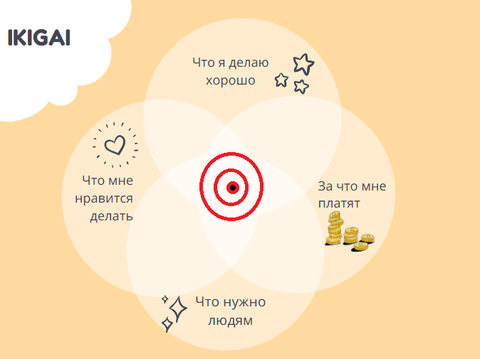

В конце [доклада](https://gdcvault.com/play/1022375/World-of-Tanks-Blitz-Postmortem) `World of Tanks Blitz Postmortem: Building a AAA MMO for Mobile Devices` Виталий Бородовский рассказывает короткую историю о том, что за длительное время работы в индустрии люди часто забывают собственные стимулы и мотивы, с которыми пришли делать игры.

Я уже описывал собственные стимулы работы в геймдеве в разделе `Зачем` в заметке .

>К тому моменту я уже понял, что моя цель - `делать крутые игры`, про которые я мог бы сказать это сам, и про которые так говорили бы игроки.

Через какое-то время я понял, что больше не горю именно такой мотивацией и задумался, что я делаю сейчас и зачем.
<!-- more -->

##1. Честность с собой
**`Познай самого себя`**

Первое, что нужно сделать, чтобы разобраться - приготовиться не врать самому себе, и искать свою цель честно. Честно найти свои сильные и слабые стороны, и признать их. Без этого невозможно что-то изменить.

Без готовности найти ответ его невозможно увидеть. Скорее всего, придётся столкнуться с тем, что нужно быть честным с собой не только в работе, а в первую очередь – в жизни.

##2. Нежелание жить и работать в грязи!
**`Правило бойскаутов - Оставь после себя лагерь чище, чем он был, когда ты пришел`**

Важная особенность хороших программистов - не проходить мимо грязи, а убирать её. Я создал опрос в закрытом сообществе программистов: *Приходилось ли вам что-то глобально улучшать или менять в компании, в которой вы работаете?*

Вопрос родился из такой цепочки рассуждений:
- В любой компании вначале всё делается максимально быстро и как попало - нужно как-то выйти на рынок, плюс вначале никто не знает, как делать правильно.
- В дальнейшем переделывать нормально тоже почти всегда некогда, чаще всего делается по уже опробованной схеме - "если раз сработало, то сработает и дальше" и "работает – не трогай".
- В результате у всех всегда в коде бардак.
- Тем не менее, степень бардака в разных компаниях разная, т.е. в какой-то момент находится кто-то, кто способен всё-таки привести какую-либо часть системы в порядок.
- При этом чаще всего программисты хотят работать в компаниях, где всё хорошо (ну, хотя бы не полный хаос) - думаю, иногда это даже основная причина смена места работы.

Из ответов составил для себя картину - ключевой мотивацией для глобальных улучшений является `нежелание прежде всего жить в грязи`. Если можешь и хочешь навести порядок в собственной жизни, то скорее всего сможешь сделать это и в работе. Причём не только для себя, но и для других тоже.

В книгах по Agile-разработке (Роберт Мартин) и экстремальному программированию (Кент Бек), встречал такие определения этой мотивации, как `"Смелость"` – храбрость действительно начать делать более удобным способом, а не проходить мимо; и `"Правило бойскаутов"` - требование оставлять после себя репозиторий проекта в лучшем виде, чем был до твоих коммитов.

##3. Ценить своё и чужое время (Личная жизнь)
**`Философия Убунту - "Личность - это личность через другие личности"`**
`"Код - это код через чужой код"` - мой хороший код делает ваш код лучше, а мой плохой код делает ваш код хуже, мы вместе владеем кодом проекта.

Ваш плохой код - причина того, что вы отнимаете время того, кто будет это исправлять. У нас всех кроме работы есть ещё и личное время, нужно ценить в первую очередь свое, а затем и чужое время.

Кроме этого стоит искать методы разработки, позволяющие даже немного сокращать потери рабочего времени.

`Эмоции - вне работы`
Эмоции мешают работе, любые. У всех бывают проблемы в жизни, но их нужно оставлять вне работы. Почему так? Наше мышление содержит множество багов (когнитивные искажения), и мы должны научиться относится к нему критически, а эмоции всегда только мешают критическому мышлению.

##4. Работа на конечный результат
**`Совершенство достигнуто не тогда, когда нечего добавить, а тогда, когда нечего убрать.`**
Если последовательно: начать быть честными с собой, стремиться к комфортной взаимной работе и принять ограниченность нашего времени работы над игрой, – то можно придти к следующему простому правилу: `убрать всё лишнее, что не требуется для достижения результата`.

Мы работаем не чтобы запилить максимальное количество фич, или чтобы развиваться и получать зарплату, а чтобы выпускать игры ДЛЯ ИГРОКОВ, и результат – их положительный опыт от игры.

##5. Икигай
Если более развёрнуто сформулировать моё желание работать на результат, то в него будет входить не только желание `делать крутые игры` (по собственной оценке и оценке игроков), но и требование `делать успешные игры` - ценить результаты работы своей команды.

**`Икигай`** - японский термин, обозначающий то:
- что я умею делать (сам считаю крутой игрой)
- что я люблю делать (получаю удовольствие от процесса разработки)
- что полезно другим (игроки считают игру крутой)
- за что хорошо платят (игра успешна на рынке)

Круто если геймдев для вас – икигай.

