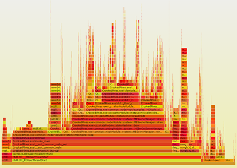
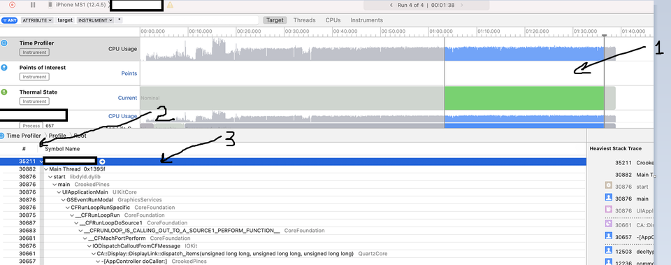
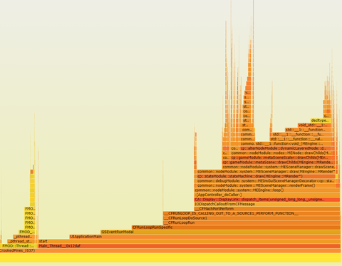

В прошлой заметке я писал, что флеймграфы можно генерировать из данных различных профайлеров, сейчас решил проверить, насколько это удобно на практике.


<!-- more -->

`Флеймграфы` позволяют детально изучить какие функции занимают время процессора (не только пару самых тяжёлых, но и относительное время выполнения любых функций в любой части программы).

С их помощью можно измерить время выполнения(точнее, количество сэмплов), `частей "ядра" приложения` (библиотеки, фреймворки, STL, системный вызовы ОС), `увидеть стоимость абстракций` (rtti/dynamic_cast, malloc/new), `исследовать горячие места программы` (не только самые тяжёлые места, с которыми иногда ничего нельзя сделать, но и "локальные" горячие точки), измерить, `на какие именно части программы влияет оптимизация` (как собственные, так и компилятора).

Также возможно сохранение отчётов для последующего изучения и дифференциальное сравнение (чтобы увидеть регрессию/оптимизацию при развитии программы).

## Windows

Сходу оказалось, что экспорт данных в csv формате, необходимый для анализа, из встроенного в студию профайлера в версии 2019 [выбросили](https://developercommunity.visualstudio.com/t/vs2019-profiling-report-is-missing-export-report-d/714378), потому что "никому не нужно".

Что ж, на офф-сайте Flamegraph упоминается, что можно экспортировать данные из отчёта, собираемого другим профайлером для Windows `XPerf`. Однако [скрипт](https://randomascii.wordpress.com/2013/03/26/summarizing-xperf-cpu-usage-with-flame-graphs/) для конвертации данных писался сторонним разработчиком и спустя 8 лет уже не работает, так что я забил на поиски и решил, что быстрее будет написать конвертер самому, чем искать и править чужие решения.

В качестве сборщика данных можно взять не сам `XPerf`, а open-source профайлер, использующий тот же API Event Tracing for Windows - [etfprof](https://github.com/Donpedro13/etwprof). Он позволяет сразу отфильтровать события профилируемого приложения от других процессов, за счёт чего экономится размер собираемых данных.

```
//-t - id процесса или имя запущенного приложения
etwprof profile -t=418996 --output profile_result -m
```

Профайлер создаёт файл `ИМЯ_ПРОЦЕССА_дата.etl`. Его можно открыть в программе [Windows Performance Analyzer](https://www.microsoft.com/en-us/p/windows-performance-analyzer/9n0w1b2bxgnz#activetab=pivot:overviewtab), которая может [отобразить результаты](https://randomascii.wordpress.com/2016/09/05/etw-flame-graphs-made-easy/) в виде флеймграфа.

Но мне захотелось пойти дальше и экспортировать данные в текстовом виде для преобразования их оригинальными скриптами. Во первых, чтобы проверить понимание работы этих скриптов, имея референсную картинку от `Windows Performance Analyzer`, во-вторых, чтобы иметь возможность отфильтровать вывод и воспользоваться другими преимуществами оригинальных скриптов, например, построением диференциальных графов по результатам двух измерений.

Для этого нужно сконвертировать данные из бинарного etl формата в текстовый утилитой `xperf` (ставится вместе с `Windows Performance Analyzer`):

```
xperf -i "profile.etl" -o perf.csv -target machine -symbols
```

На выходе получается файл с записью о сэмплах, сделанных профайлером, примерно в таком виде:
```
SampledProfile,     508414, MyProc.exe (425204),     404904, 0xffff8563393bcd20,   0, MyProc.exe!$$Thunk@00002a54,   win32kbase.sys!ValidateHwnd,     1, Unbatched
                  Stack,     508414,     404904, win32kbase.sys!ValidateHwnd, win32kfull.sys!xxxRealInternalGetMessage, win32kfull.sys!NtUserPeekMessage, ntoskrnl.exe!KiSystemServiceCopyEnd
                  Stack,     508414,     404904, wow64win.dll!ZwUserPeekMessage, wow64win.dll!whNtUserPeekMessage, wow64.dll!Wow64SystemServiceEx, wow64cpu.dll!ServiceNoTurbo, wow64cpu.dll!BTCpuSimulate, wow64.dll!RunCpuSimulation, wow64.dll!Wow64LdrpInitialize, ntdll.dll!LdrpInitializeProcess, ntdll.dll!_LdrpInitialize, ntdll.dll!LdrpInitialize, ntdll.dll!LdrInitializeThunk, win32u.dll!NtUserPeekMessage, user32.dll!_PeekMessage, user32.dll!PeekMessageW, MyProc.exe!update, MyProc.exe!processEvents, MyProc.exe!loop, MyProc.exe!WinMain, MyProc.exe!invoke_main, MyProc.exe!__scrt_common_main_seh, MyProc.exe!__scrt_common_main, MyProc.exe!WinMainCRTStartup, kernel32.dll!BaseThreadInitThunk, ntdll.dll!__RtlUserThreadStart, ntdll.dll!_RtlUserThreadStart
```

Этот файл необходимо распарсить и преобразовать в формат `folded stacks`, который выглядит так:
```
win32kbase.sys!ValidateHwnd;win32kfull.sys!xxxRealInternalGetMessage;win32kfull.sys!NtUserPeekMessage;ntoskrnl.exe!KiSystemServiceCopyEnd 42
```

То есть:
- "Разворачиваем" порядок вызова функций в стеке, и заменяем разделитель на ";"
- Небольшая хитрость - нужно сосчитать все повторяющиеся стеки и в конце строки записать их количество
- Манглинг имён - некоторые спецсимфолы нужно заэкранировать, чтобы на следующем этапе скрипты flamegraph не сломались

Результат:
https://github.com/spiiin/converters_to_flamegraph/blob/master/xperf_csv_to_collapsed_stacks.py

Дальше ставим [perl](https://strawberryperl.com/) и выполняем скрипт [flamegraph.pl](https://github.com/brendangregg/FlameGraph/blob/master/flamegraph.pl), чтобы сконвертировать файл со свёрнутыми стеками, которые сгенерировал питоновский скрипт, в svg-файл для изучения.

```
flamegraph.pl perf.folded > perf.svg
```

На выходе получается файл svg (содержащий xml-данные и js-код), который можно открыть в любом браузере и изучить.


## macOS/iOS

В Apple тоже решили, что экспорт в CSV никому не нужен и убрали его, потому тут тоже приходится искать обходные пути.

Самый простой найденный мной - собрать данные с помощью `Instruments -> Time profile` и скопировать их в виде текста самому.
Также что порядок действий такой:


**`1. Выделить промежуток времени, данные для которого хочется изучить`**
**`2. Настроить отображение колонок для экспорта`**
Нужно отключить все, кроме количества сэмплов (символ "#") и имён функций (`Symbol Name`). Не забыть выключить также отображение иконок функций (они создают дополнительный символ табуляции и пробела при экспорте).
**`3. Выделить корневой (ТОЛЬКО корневой!) элемент для экспорта мышкой и в меню XCode выбрать пункт Edit->Deep Copy`**

Дальше скопированные данные нужно вставить в текстовый файл и сохранить (под именем `sample.txt`, как ожидает скрипт конвертации).
Пример экспортированных данных
```
# Samples	Symbol Name
34532	MyApp (637)
28052	 Main Thread  0x12daf
28048	  start
28048	   UIApplicationMain
28048	    GSEventRunModal
28048	     CFRunLoopRunSpecific
28048	      __CFRunLoopRun
27796	       __CFRunLoopDoSource1
27789	        __CFRUNLOOP_IS_CALLING_OUT_TO_A_SOURCE1_PERFORM_FUNCTION__
27789	         __CFMachPortPerform
27787	          IODispatchCalloutFromCFMessage
27766	           CA::Display::DisplayLink::dispatch_items(unsigned long long, unsigned long long, unsigned long long)
27741	            -[AppController doCaller:]
```

Здесь чуть хитрее, чем в Windows версии, так как данные о глубине стека сохранены в виде количества пробелов относительно предыдущей строки. Зато уже подсчитано количество сэмплов.

Готовые скрипты типа [этого](https://github.com/brendangregg/FlameGraph/blob/master/stackcollapse-instruments.pl), конечно, больше не работают- видимо формат экспорта данных немного сменился с обновлениями. Так что, как и для win-версии пришлось сделать свой на питоне:
https://github.com/spiiin/converters_to_flamegraph/blob/master/instruments_to_collapsed_stacks.py

Он не такой короткий, как оригинальный на перле ([расступитесь, я знаю регулярные выражения!](https://xkcd.ru/208/)), зато его проще понять и подправить, если формат экспорта снова изменится. 

Последний шаг - конвертация:
```
flamegraph.pl perf.folded > perf.svg
```

И уииии, у меня есть флеймграф выполнения программы:


## Android

Здесь я не стал возиться с экспортом данных, потому что штатный профайлер Android Studio [умеет](https://youtu.be/O5V9ZSL0BsM?t=86) отображать флеймграфы. Данные можно экспортировать в виде .track-файла и загружать его для изучения в Android Studio.
Тем не менее, вроде бы, при большом желании, используя [simpleperf](https://android.googlesource.com/platform/prebuilts/simpleperf/+/67b5f82a399fba110faf781a8be55aaaa0f21084/README.md#show-flamegraph) из командной строки можно заставить сгенерировать данные в виде сжатых графов.

## Замечания

Исследуя фреймграфы, стоит помнить о стандартных штуках при профилировании приложений и игр:
- Статистические профайлеры отмечают, в каком месте выполнения находится процессор, ""включаясь" с определенной заданной частотой, им нужно некоторое время (несколько секунд), чтобы собрать данные. Они не очень подходят для отображения пиков-фризов в определенном кадре.
- Для регрессионного профилирования нужно подумать о хорошо воспроизводимых тестовых сценариях.
- Флеймграфы показывают не абсолютное время работы конкретных функций, а сгруппированное количество сэмплов в ходе профилирования - этого достаточно, чтобы понять, чем "обычно" занят процессор в ходе выполнения программы.
- Изредка слетает отображение имён символов. Нужно изучать документацию к конкретному профайлеру. Часто помогает просто провести повторное измерение.
- Данные, относящиеся к вызовам графического API, показывают работу CPU по отправке команд на GPU - отрисовка этих данных начинает выполняться позже и выполняется параллельно с последующей работой CPU. То же самое касается работы со звуковым чипом. Профилирование сети и обращений к диску возможно и обычными профайлерами (Off-CPU profiling).
- Придётся научиться читать и понимать STL-код, и расшифровывать замангленные имена функций компилятора (например, лямбда-функции).

## Репозиторий со скриптами
https://github.com/spiiin/converters_to_flamegraph
