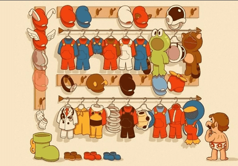

Попытка обобщить принципы, которые применяют различные геймдев команды для улучшения организации разработки уровней, механик, контента. На основе компиляции и конспекта материалов из различных источников.
<!-- more -->

#Интро

Занимался сканированием различных материалов о разработке игр в поисках методов улучшения процесса. Общеизвестные частые и повторяющиеся проблемы различных команд – затягивание сроков разработки, отсутствие способов получить информацию о качестве геймплея на ранних этапах разработки, из-за чего части игры могут быть выброшены или сильно изменены. Общий вектор поиска: сбор информации о методах быстрого создания прототипов для игр, построения этапов пайплайна разработки, организации плейтестов и тестирования кода, а также организационных методах, позволяющих изменить подход к разработке на более аккуратный. Материалы в заметке в основном касаются улучшения пайплайна создания контента, остальное пока в очереди.

Большая часть этапов создания игры задействует усилия практически всех отделов разработки. Каждый отдел имеет собственный пайплайн, построенный тим-лидом, или иногда проджект-менеджером команды. К примеру, программисты часто применяют наработанные в других отраслях разработки ПО методики - элементы SCRUM, agile разработки, методы канбан, и бережливого производства. Эти же принципы разработки могут быть использованы и в построении пайплайна других отделов, но им необходима некоторая адаптация. Наиболее сложный уровень организации (и самый интересный!) – полный пайплайн разработки игры, с минимизацией простаивания каждого из отделов, и количества лишней работы.

У меня нет опыта управления всей командой разработки, но, кроме руководства небольшой командой программистов, есть некоторый опыт построения отдельных пайплайнов для различных отделов:
- Помощь в построении пайплайнов работы с ассетами, от переноса ассетов с shared disk в системы контроля версий, и создания системы неймингов, до координации процесса создания моделей, начиная с определения способов экспорта из DCC-приложений, до создания тулзов для компиляции анимаций и тестирования их в игре.
- Создание пайплайна работы с игровыми сценами, начиная с ручной правки текстовых файлов программистами и до организации найма нескольких человек, отдельно для поддержки работы с редактором, и создания в ассетов в игровом редакторе (в ходе этого, организационная работа: трансформация понятий определённых должностей в проекте). Один программист тулзов + 2-3 дизайнера в итоге могут быть сильно дешевле, чем 5-6 "программистов данных".
- Внедрение в пайплайн разработки контента этапов технической оптимизации (создания необходимых инструментов, документации, инициатива по поиску ресурсов на регулярное проведение этого процесса).

При этом я чётко понимаю, что оптимизация пайплайна – трудный процесс, который включает в себя не "оптимизацию циферок", а создание тулзов, перестройку рабочих процессов людей, преодоление организационного сопротивления. Зачастую в ходе внедрения новых процессов появляются непредвиденные проблемы, которые нужно решить так, чтобы не получилось хуже, чем было раньше – нельзя просто "улучшить" и уйти в закат, требуется обучение людей, которые смогут поддерживать работу в новом формате, а не вернут всё назад. Это не самоцель, а вынужденная мера, горькое лекарство в тех случаях, когда работать становится тошно.

Создание и оптимизация пайплайнов для управления всей командой проекта, на мой взгляд, "следующий уровень" после налаживания таких отдельных пайплайнов, в которых замешаны несколько отделов (артисты - моделлеры, риггеры, аниматоры; технические артисты, программисты, сценаристы, нарративные дизайнеры и левел-дизайнеры, qa). В статье далее я не описываю собственной опыт, а просто компилирую чужой, основываясь на собственном понимании выстраивания пайплайнов и управления небольшими командами. Моя точка зрения – профдеформированное видение "непрограммерской" части разработки игры программистом.

Статья не о принципах `создания уровней`, а о принципах `организации создания уровней` (и другого контента игры). Акцент сделан на создании уровней, потому что 1) про это удалось собрать больше всего публично доступной информации (в основном, благодаря докладам Джоэла Бёрджесса) 2) сборка уровней с нуля – процесс, в который вовлечены различные отделы команды, каждый со своим отличающимся пайплайном производства, которые нужно уметь занять чем-либо, когда они ожидают результатов работы других отделов.

##Материалы
[к1] [Михаил Кадиков - Проектирование виртуальных миров](http://level-design.ru/pro-ld-book-index/pro-ld-book-about/)
[к2] `Роберт Мартин - Чистый Agile. Основы гибкости`
[к3] `Кент Бек - Экстремальное программирование`
[к4] `Кент Бек - Экстремальное программирование. Разработка через тестирование`
[к5] [Хенрик Книбберг и Маттиас Скарин - Scrum и Канбан: выжимаем максимум](http://scrum.org.ua/wp-content/uploads/ScrumAndKanbanRuFinal.pdf)
(использовалась в построении пайплайна `World of Tanks: Blitz`, [линк](https://gdcvault.com/play/1022375/World-of-Tanks-Blitz-Postmortem))
[к6] `Джейсон Шрейер - Кровь, пот и пиксели`.

[д1] [Prototype Based Design](https://youtu.be/H-5m_KDCZdQ) - доклад лид-дизайнера `Gear of War 2` про прототипирование механик.
[д2] [Play Early, Play Often: Prototyping Civilization 4](https://youtu.be/y7AV3tNYd5g) - этапы прототипирования `Civilization 4`.
[д3] [Stan Just (CD Projekt RED)- Better, Faster, Smarter, Witcher](https://youtu.be/DjJoy3Zyk2A) - пайплайн `Witcher 3` и аддонов.
[д4] [Stan Just (CD Projekt Red) - Creating Amazing Art in The Witcher 3: Wild Hunt](https://youtu.be/pzvkB3w1qXQ) - этапы создания контента `Witcher 3`.
[д5] [Александр Штаченко (Playbeat) - Три главных фокуса продюсера](https://youtu.be/a9wSZ9L_Jk8) - или "о чём задумался продюсер". В начале есть несколько хороших примеров организации команды/структуры проекта, [слайды](https://www.slideshare.net/flashgamm/ss-79324254.)
[д6] ["Что делать программисту, которого жизнь заставляет заниматься менеджментом?"
](https://youtu.be/_jcvAGqBWzs) - про переход программистов в менеджеры. Описание организации команд с техническим лидеров в команде управления.
[д7] [How We Used Iterative Level Design to Ship Skyrim and Fallout 3](https://youtu.be/PhW8CY8XkFg) - принципы итеративного дизайна от разработчиков из `Bethesda`.
[д8] [Fallout 4's Modular Level Design] - модульный подход к левел-двизайну `Fallout 4`.
[д9] [How Modding Made Bethesda Better](https://youtu.be/GxthbWfSak8) - как моддинг помогает улучшить качество и время жизни игры.

[с1] [Теория: прототипирование геймплея](http://level-design.ru/2011/04/gow2-prototype-based-gameplay/) - перевод и анализ доклада [д1].
[c2] [Notes about a new software world](https://osoco.es/thoughts/2020/06/notes-about-a-new-software-world/) - статья о Domain Driven Design.
[c3] [Teamlead Roadmap](https://tlroadmap.io/) - карта навыков и компетенций тимлидов (всё возможные и невозможные обязанности тимлида, составленные по коллективному опросу десятков российских компаний).
[c4] [Итеративные процессы в левел-дизайне на опыте Fallout 3 и Skyrim](https://leaden.ru/2015/07/iterative-level-design-process/) - перевод материалов из лекции [д7].
[c5] [Skyrim’s Modular Approach to Level Design](http://blog.joelburgess.com/2013/04/skyrims-modular-level-design-gdc-2013.html) - модульный подход к дизайну `Skyrim`.
[c6] [Устройство уровней в NES-играх](https://habr.com/ru/post/259171/) - описание тайловой системы уровней в старых консольных играх.

#Паттерны

##"Стандартный" пайплайн

В качестве примера для того, чтобы показать способы изменения организации разработки, можно взять обобщённый [стандартный пайплайн создания уровней](http://level-design.ru/pro-ld-book-index/08-production-pipeline/), приведённый в [к1].

>В каждой дисциплине, будь то создание анимаций, спецэффектов, материалов или моделей, существует свой собственный порядок производства контента. Разработка уровней также подразумевает особый цикл работ (в англ. терминологии — “pipeline”)...

Эти этапы, в моём пересказе:
- Планирование
  - Концептуализация (поиск идеи)
  - Визуализация (подбор референсов)
  - Планирование на бумаге
  - Создание технической документации
- Играбельный прототип
  - Сборка уровня из коробок (gray boxes)
  - Настройка игрового функционала
  - Тестирование геймплея
  - Обычно - "заморозка" возможности радикальных изменений.
- Прототип геометрии
  - Создание черновых моделей всех объектов (с учётом принятых стандартов, привязок/пивотов к сетке мира, модульности)
  - Сборка уровня из временных моделей (на основе прототипа), совместная работа художника по окружению и левел-дизайнера.
  - Приведение уровня в играбельное состояние (фиксы). Черновая логика диалогов и триггеров.
- Финальная сборка
  - Замена временных ассетов на финальные
  - Оптимизация производительности
  - Тестирование финальной версии

Пара примеров внешнего вида уровней в играх. Стандии играбельного прототипа/прототипа геометрии/финальной сборки в `Uncharted 4`:

Играбельный прототип в `CS:GO` (использованы специальные текстуры с нанесёнными отметками размеров), [отсюда](http://level-design.ru/pro-ld-book-index/08-gameplay-prototype/):

Такая модель последовательного перехода от одной стадии к другой напоминает [каскадную модель](https://ru.wikipedia.org/wiki/%D0%9A%D0%B0%D1%81%D0%BA%D0%B0%D0%B4%D0%BD%D0%B0%D1%8F_%D0%BC%D0%BE%D0%B4%D0%B5%D0%BB%D1%8C) в разработке ПО ("сначала планируем, потом создаём, потом проверяем, потом считаем готовым").

##Использование готовой модели разработки
Антипаттерн - "взять готовую модель и попробовать использовать в разработке игр".

В качестве примера применения метода разработки на основе "стандартного" пайплайна, можно рассмотреть [д3] и [д4] – доклады об организации пайплайнов производства контента `Witcher 3` и собственно производства по выстроенному пайплайну, показывающие типичные проблемы такого подхода. Стэн Джаст, продюсер проекта, сертифицированный скрам-мастер, и пайплайн производства, естественно, максимально, "по скраму".

*Ведьмак 3 – моя любимая игра, и с уважением отношусь к продюсеру этого проекта – под его руководством были выпущены крутые игры, и создано колоссальное количество контента в Ведьмаке, скорее всего выбранный метод разработки принёс неоспоримые преимущества, но по каким-то причинам в докладе они не отмечены, а сюжет можно пересказать так: "В ведьмаке мы использовали скрам, это такая методология разработки, ведьмак у нас получился отличный, отака хуйня, малята!"*

Пример плохого использования подхода – схема оптимизации процессов:

Максимально общие слова, которые могут быть вообще никак не связаны с процессом разработки (может как-то и связаны, но в докладе это не показано), а отнесены к абсолютно любому проекту: "Собрать данные, проанализировать данные, найти точки блокировки, улучшить дизайн, создать дизайн, поправить ожидаемую дату выхода, повторить".

Улучшение показателей может быть достигнуто не за счёт общих слов, а за счёт изменения порядка выполнения каких-либо действий, причём это изменение - это не применение какого-нибудь незыблемого универсального закона, это подстраивание "ручками" существующего в команде процесса. Он зависит от имеющихся ресурсов, в том числе от самой команды - количества людей и их навыков. Например, наблюдение, что на ранних стадиях разработки дизайнерам уровней ещё особо нечего делать, кроме как составлять базовые документы, позволяет перенаправить их на работы с текстами или дизайн других систем.

Раскидывание задач по этапам - что стоит или не стоит делать на данном этапе, подстроено под сроки выполнения задач специалистов, и может корректироваться от проекта к проекту. Важная часть - сам факт разбиения на необходимое число итераций, каждая из которых несёт определённый смысл, а не придумана "для галочки". Получить данные о бутылочном горлышке пайплайна, можно с помощью самой используемой системы (для управления временем прохождения этапов подходят, к примеру, "традиционные" для разработчиков доски канбан).

Для сравнения можно посмотреть на паттерн `Выделение стадий прототипирования для устранения взаимозависимостей`, который учитывает особенности выполняемых работ.

Другой настораживающий пример, [подход](https://youtu.be/DjJoy3Zyk2A?t=2207) к оценке финальных сроков - *"(стандартная оценка всех работ в проекте в часах + запланированные отгулы)/количество людей в проекте = необходимое на разработку игры количество часов"*.

Это так не работает! Но в мире "чистой методологии" могут применяться даже подобные абсурдные подходы к оценке. Проблема тут в том, что получение ошибок в рассчётах будет приводить к тому, что её адепт станет просто поправлять сроки стандартной оценки работ, а не задумается о том, что время может теряться где-то, кроме непосредственного выполнения работы исполнителем. Другая проблема - "средняя скорость выполнения задач" в мире геймдева это сферический конь в вакууме, сами задачи на разных этапах разработки сильно различаются, отдельные задачи могут зависеть друг от друга не только как этапы конвейера, но и так, что одна задача может создавать или удалять другие.

В качестве примеров проблем подхода:
- Большие проблемы с кросс-коммуникацией отделов, ежедневные планёрки не работают (https://habr.com/ru/post/456762/)
- Из игры была выброшена половина квестов (`Кровь, вот и пиксели`, интервью с Матеушем Томашкевичем, https://cyber.sports.ru/tribuna/blogs/gamesherald/2926468.html)
- В [д4] приводятся примеры, когда "внезапно" всплывала необходимость создания неучтённого  контента объёмом в 200 человеко-дней (квестовые предметы для кастомизации стандартных NPC). Другой прмер – [ошибки в скорости звука в локализациях](https://youtu.be/AweOAU3q8Fg), которые исправлять оказалось дорого.
- Недопроверенные прототипы, в [д4] есть пример с разрубанием тел, которое прототипировали, но в игре оно не заработало как надо, из-за чего его пришлось маскировать арт-хаками.
- Сам факт гигантомании игры, если рассматривать его не как заявленную фичу, а как организационную неспособность получить заявленные результаты и качество в установленные сроки.

[Заявленные способы оптимизации процессов](https://youtu.be/DjJoy3Zyk2A?t=1120). На первом месте "оптимизация пайплайна". В то же время, на слайдах приводятся, как отмечает Стэн, упрощённые (чтобы влезли на слайды) схемы их пайплайнов.

*(отметка на слайде - предшествующие этапы пайплайна не показаны)* ([ссылка](https://www.slideshare.net/flashgamm/better-faster-smarter-witcher-production-tips-from-the-witcher-3-wild-hunt-hearts-of-stone) на слайды в нормальном разрешении)
Заявленная "оптимизация пайплайна" - это лишь то, что они использовали в дополнениях уже готовые ассеты из оригинальной игры в качестве базовых плейсхолдеров, другие отличия не показаны. Все остальные пайплайны максимально похожи на стандартную модель без всяких оптимизаций.

##Четыре схемы геймдев команд

Из обнаруженных работающих методов в докладе о "Ведьмаке":
**`- Построение руководства команды по схеме "Продюсер + Лид"`** (в подчинении: 3 2д-артиста, 10 3д-артистов, выделенный QA и тех.артист). Один отвечает за определение сроков, второй за качество. Эти две противоположных цели, и в случае, если руководит один человек, будет перекос в какую-либо сторону.

Два работающих подхода, "на пальцах", приведены в [д5]. Там же более серьёзно рассмотрены зоны ответственности и задачи, которые по разному распределяются в различных форматах команды.

Это, на мой взгляд, важная характеристика структуры команды, соотношение её "вертикальности" (иерархии) и "горизонтальности" (плоских связей). Управленческие роли могут как быть сконцентрированы в одном человеке, так и размазаны между двумя лидерами, или большим количеством людей. Важно это потому, что список навыков и компетенций, которые требуются для руководства проектом, настолько широкий, что один человек не сможет прокачаться во всём. Помимо этого от типа команды зависит, кто в ней может инициировать применение перечисленных ниже паттернов перестройки пайплайна.

**`Тип 1. Продюсер + линейная команда`**

Сверху - заказчики, издатели, директора компании, стейкхолдеры. Лид-геймдизайнер и скрам-мастер организовывают работу отделов, но находятся на одном уровне с остальной командой. По сути, не один лидер, а три.
**`Тип 2. Проджект менеджер + продакт менеджер`**

Два управляющих, разделяющих ответственность. Один отвечает за процессы (результат должен был сделан в срок, качественно, минимальными ресурсами), другой – за продукт (чтобы соотвествовало "хотелкам" стейкхолдеров и рынка).
**`Тип 3. Проджект менеджер + Продакт + Техлид`**
Больше характерный не для игровых команд. [Пример](https://youtu.be/_jcvAGqBWzs?t=3520):

Другой пример – [Teamlead Roadmap](https://tlroadmap.io/), карта навыков тим-лида, обобщённое видение крупных российских компаний, список компетенций включает ветки, которые явно очень сильно перемешиваются с компетенциями других управляющих ролей в проекте.

Добавляется человек, который может оценивать организацию разработки, изучать её и улучшать, по сути не связан напрямую с продуктом, но имеет ресурсы и компетенции, чтобы улучшать качество работы для всех.
**`Тип 4. Плоская команда`**
Роли распределяются внутри команды по мере возникновения необходимости, а не "даются свыше". Пример - [Valve](http://media.steampowered.com/apps/valve/hbook-RU.pdf) и прочие "бирюзовые" компании.

##Выбрасывание лишних этапов пайплайна разработки

Доклады [д1] и [д2], посвященные прототипированию механики, играбельного геймплея и уровней в `Gears of War 2` и `Civilization 4` объединяет общая идея – зачем нужны "традиционные" этапы пайплайна в тех случаях, когда они только замедляют время создания чего-то, что можно протестировать?

[Выброшенные этапы](https://youtu.be/H-5m_KDCZdQ?t=676):
- Дизайн в голове
- ~~Документирование~~
- ~~Дебаты с обсуждением идеи~~
- ~~Сбор команды прототипирования~~
- ~~Наигрывание и тюнинг, пока не станет интересно~~
- Ревью перед отправкой в продакшн

Условия, при которых возможно выбросить этапы пайплайна (в основном – ранние):

**`- Опытная команда`**
Один из авторов доклада [д2] подписан как *"Программист/Лид дизайнер"* – способен и придумывать идеи, и прототипировать их, без необходимости написания документации. 

Дизайнеры GoW фактически рассказывают о том, что сами программируют достаточно продвинутые механики с помощью `Kismet` (предок `Blueprint-ов` в Unreal) и сравнивают [два сценария](https://youtu.be/H-5m_KDCZdQ?t=890) - 1) с документированием и обсуждением (по "традиционному" пайплайну, и 2) сразу визуально проверяя какую-либо идею, комбинируя готовые готовые ассеты с написанием тестовых скриптов.

Секрет ускорения - наличие "комбинированных" специалистов.

**`- Наличие хорошего инструмента для прототипирования`**
В обоих примерах разрабатывается не первая часть игры, разработчики имеют в наличии набор инструментов и ассетов, с помощью которых быстро могут проверять идеи, а также набор некоторых проверенных базовых механик. Дизайнеру не нужно просить программиста помочь с написанием простых вещей, вроде логики нажатия на кнопки, или способа создать игровой скрипт - таким образом снижаются требования к уровню квалификации дизайнера в программировании. В общем случае, для прототипа и реальной игры могут использоваться различные инструменты.

*В статье [с2] описаны среды разработки программ, к которым, возможно, стремятся среды разработки Unity и Unreal в плане лёгкости прототипирования и совместной работы (хотя по многим параметрам редакторы универсальных игровых движков обгоняют чьё-то видение будущего программирования).*

**`- Небольшая команда`**
[Преимущества](https://youtu.be/y7AV3tNYd5g?t=219) работы небольшой команды из доклада [д2]:
- Дизайнер+программист - супер быстрое прототипирование без необходимости коммуникации
- Хорошая коммуникация
- Плоский процесс принятия решений
- Меньшее давление из-за необходимости показывать качественные результаты

Про размеры команды, конфигурация: в первый год разработки: 5 программистов, 2 артиста, 1 продюссер. Возможны и более мелкие команды.

"Традиционная" (по [к2]) гибкая методология разработки создана для небольших команд, решающих небольшие задачи. В случаях, когда необходимо взаимодействие больших разношёрстных команд, авторы рекомендуют использовать традиционные методы управления большими командами, которые проверены временем, но более расточительны.

`Плюсы использования подхода с выбрасыванием итераций`, собраны в [с1]:
- Минимум задействованных в создании прототипа людей.
- Быстрая реализация функционального прототипа.
- Возможность сразу же оценить плюсы и минусы концепта и оперативно внести изменения.
- Возможность сразу получить отзывы и видеть нравится ли людям концепт или нет.
- Творческая свобода.
- Использование существующих ассетов и возможность создать новое из старого.
- Отличный способ продать свою идею людям, впечатлить и заинтересовать без каких-либо ощутимых затрат.

Построение и распараллеливание ранних стадий пайплайна сложно, потому что затрагивается работа нескольких специалистов, зависящих друг от друга. Отдельные команды могут заниматься задачами параллельно, но без явного разбиения не небольшие черновые этапы может получиться так, что процесс "свернёт" в другую сторону и план работ отделов изменится. В этом случае полезно иметь разносторонне развитых разработчиков, которые могут заниматься всем. В небольших командах эти ребята сами найдут чем заняться на текущем этапе, в больших скорее всего без явных задач часть команды не сможет делать ничего.

## Выделение стадий прототипирования для устранения взаимозависимостей

Пример описания процесса разбиения ранних стадий создания контента на несколько итераций с обоснованиями разделения - [д7], описание создания уровней для `Skyrim` и `Fallout 3`, [c4] - перевод-пересказ лекции на русском.

Гигантомания `Skyrim` сопоставима с гигантоманией `Witcher 3` - 5 больших городов, 300+ подземелий, 140+ точек интереса, 37 населенных пунктов – и 7 левел-дизайнеров.

Подход с итерациями основан на работе Nielsen 93 года `Iterative UI Design Study`.

Выделяют два различных процесса, которые действую на различных этапах создания уровня – структурные итерации (пока уровень делается), и итерации повышения качества (полировка). Первая стадия – структурная, от идеи до доведения уровня до этапа *"Можем выходить и так, но стыдно"* (*Ship with shame*).

Отмечают, что сам процесс создания итераций также может изменяться итеративно.

Особенности ситуации и цели создания процесса:
- Желание упростить работу с огромным массивом контента.
- Улучшение качества дизайна.
- Известные дедлайны.
- Известные зависимости между отделами (!) - измерили в предыдущих проектах.
- Известный состав команд - без планов донанимать людей в ходе разработки.
- Желание хорошего качества жизни (!) - важно, что это заложено в цели, потому что это ведёт к реалистичному планированию.

Выстроенный ими подход сильно похож на принципы [бережливого производства](https://ru.wikipedia.org/wiki/%D0%91%D0%B5%D1%80%D0%B5%D0%B6%D0%BB%D0%B8%D0%B2%D0%BE%D0%B5_%D0%BF%D1%80%D0%BE%D0%B8%D0%B7%D0%B2%D0%BE%D0%B4%D1%81%D1%82%D0%B2%D0%BE), включая идею уважения людей.

Разработчики отмечают хаотичность процесса разработки игры:
- Множество меняющихся частей
- Много взаимопересекающихся частей (неважно, сколько людей в команде, изменения в одном месте могут распространиться на десяток других мест)
Как вывод из предыдущего пункта:
- Очень важно, в какие именно моменты что можно поменять безболезненно, а что уже нет.

Следствием из этого является необходимость отслеживания, что на каких стадиях менять относительно безопасно.

>Т.е. итерации здесь не возникают из карго-культа каких-либо методологий разработки, не позаимствованы из других отраслей типа кино (предпродакшн/продакшн), это наблюдения за тем, сколько изменений повлечёт за собой то или иное изменение НА ТЕКУЩЕМ ЭТАПЕ разработки.

Даже в случае отсутствия способа управления командой на ранних этапах можно попробовать разделять задачу на короткие итерации с постепенным наращиванием качества. Т.е. левел-дизайнеры делают максимально черновое описание локации -> художники делают максимально черновой арт для набора блоков, левел-дизайнеры составляют из этих "серых ящиков" болванку уровня, затем на которой начинают составляться такие же черновые планы игровых систем. Какие-то системы могут отваливаться, какие-то части уровня могут выбрасываться, какие-то наборы будут переделываться - выбросить любой компонент всё ещё дёшево. Система Bethesda направлена лишь на то, чтобы не откатываться назад на целый этап. Однако у них к концу составления черновой версии есть способы избавиться от того, что не получилось.

Главное условие для возможности использования такого паттерна – **`собрать данные о том, какие изменения влекут за собой самое большое количество изменений, на каждом из этапов разработки`**. Это может быть сделано как неформальными способами (опросом специалистов), так и более формальными - составлением серии таблиц на каждый из существующих в пайплайне этапов, с отражением в таблицах численных оценок "вреда" какого-либо изменения, выраженного в виде суммы необходимых изменений в каждой из готовых к этому моменту частях.

Улучшение пайплайна здесь – это выбор такого порядка итераций, чтобы:

**`- к началу этапа уже были выполнены необходимые для начала производства работы`**
**`- раньше других зафиксировать изменения, которые могут повлечь за собой большое число других переделок`**
**`- к моменту прохождения начальных итераций был расписан порядок, что делать, если не получилось достичь нужного качества. Гораздо важнее тратить время на доведений хорошего уровня до лучшего, чем посредственного до среднего. В дополнение на помошь может напрявляться "команда решения проблем"`**
**`- кросс-зависимости устраняются тем, что какой-либо отдел (кому проще) делает максимально быстро черновое качество ассетов, которое будет достаточно для реальной проверки геймплея`**
**`- не занятые отделы могут заняться чем-либо другим. На ранних стадиях левел-дизайнеры могут помогать в написании сюжета, геймдизайне механик (Layout, Gameplay, Markup, Scripting, Performance, Writing, Systems, Prototyping, Tools, more...)`**
*(список составлен мной, не дословный пересказ)*

*Геймдизайнер Betheda выбирает, чем ему заняться на раннем этапе разработке*
>В моей концепции развития специалиста в геймдеве, точнее подходит модель профессий из `Final Fantasy Tactics` – возможны неожиданные комбинации профессий, дающие новую неожиданную специализацию. Например специализация "дизайнер-программист", которая открывает возможность пропускать ранние этапы прототипирования, или "модульный дизайнера уровней" описанный далее в разделе "модульность" - по ссылке [с5] Джоэл пишет, что для создания модульных элементных уровней артист должнен обладать определёнными дополнительными инженерными навыками, которые часто отстуствуют у непрокачанных артистов. 

Основные этапы раннего периода разработки:

*Начиная с beauty у них запускается другой процесс – полировка уровней*

Каждая из стадий содержит определённые правила, что можно и что нельзя делать на этой стадии разработки. После перехода на следующую стадию вносить изменения предыдущего уровня нельзя, в том числе запрещается выбрасывание созданных частей и полная переделка (причина запрета – новое будет не лучше, как часто кажется дизайнеру, просто другое). Фидбеки, собранные во время плейтестов предыдущих стадий исправляются на следующей стадии-итерации.

Поздние стадии, в том числе и итерации полировки, также могут выглядеть по разному, в зависимости от того, что именно необходимо дорабатывать (по количеству фидбеков и изменений после плейтестов), т.е. предсказать изначально количество времени на этот процесс было бы невозможно.

Я не буду пересказывать, что именно они выделяют в конкретные стадии, можно посмотреть оригинальный доклад, это не важно в случае, если речь идёт о самом `паттерне устранения зависимостей за счёт создания итераций`.

##Раздельные итерации
*(Spaced iteration)*

Другой паттерн из этого же доклада - `раздельные итерации`. После определения списка этапов создания уровня чаще всего команды начинают последовательное выполнение этих этапов для каждого из уровней.

В случае больших команд, при этом, получается немного распараллелить создание уровней, отдав разные уровни различным командам. Но можно пойти другим путём, и изменить приоритет выполнения задач. Вместо построения какого-либо из уровней целиком, можно сперва заняться самой ранней стадией для всех уровней, и только затем перейти к началу второго этапа работы.

Что от этого меняется? Разделение между выполнением итерации над одним из уровней даёт определённые преимущества.
- Дизайнер отдыхает от уровня и смотрит на него свежим взглядом, появляется время для переосмысления уровня.
В некоторых командах даже начинают разработку не с первых уровней, чтобы левел-дизайнеры могли натренироваться на менее важных уровнях, которые получатся хуже качеством, чем те, которые делаются последними.
- Появляется время для сбора и обработки фидбеков, полученных во время плейтестов уровня, которые можно будет обработать на следующей итерации (в противном случае, фидбеки приходили бы в середине работы над следующей итерацией уровня).
- Ожидание фидбеков перестают быть бутылочным горлышком в пайплайне (!)

>Вместо "я закончил уровень/фичу в пятницу вечером, гляньте плиз к понедельнику", можно сказать: "я закончил итерацию этого уровня, гляньте пожалуйста и отфидбечьте,ну, к началу июня". Фидбеки можно группировать и анализировать, а не сразу добавлять в беклог/брать в работу.

- Левел-дизайнеры фокусируются на текущей итерации, а не переключаются между задачами различной направленности (после финальной стадии уровня 1 тяжело вернутся к черновому формату работы над уровнем 2)
- Позволяет запланировать время ожидания, когда левел-дизайнеру из-за изменившихся требований нужно что-то незадуманное изначально, у программистов и артистов появится время "до следующей итерации".
- Позволяет сгруппировать "простои" левел-дизайнеров во времени на ранних итерациях, чтобы они могли переключаться на другие задачи (один длинный простой удобнее, чтобы заняться другой задачей, чем небольшие "окошки" в начале работы над каждым уровнем). Как следствие, команда может обходиться меньшим количеством широкопрофильных специалистов вместо содержания большого штата узкопрофильных.
- Исключает ситуации, когда к запланированной дате не готовы несколько уровней. Вместо этого с какого-то момента всегда будут готовы все уровни в определённой степени готовности.

Что нужно для возможности применения? Практически ничего, кроме того, чтобы в каком-то виде **`провести декомпозицию разработки уровней на этапы`**.

## Зацикливание этапов

Самый известный и широко освещённый в литературе способ уменьшить риски неверного планирования – повторить основные этапы пайплайна несколько раз, добавив в конце каждой итерации этап проверки результатов, который позволит скорректировать цели следующей итерации. Для игр таким этапом являются плейтесты, организации которых нужно посвятить отдельный пост.

Если зациклить весь пайплайн, получится [спиральная модель](https://ru.wikipedia.org/wiki/%D0%A1%D0%BF%D0%B8%D1%80%D0%B0%D0%BB%D1%8C%D0%BD%D0%B0%D1%8F_%D0%BC%D0%BE%D0%B4%D0%B5%D0%BB%D1%8C). Более грамотное решение – начать использовать цикл **`"полируем прототип -> проводим плейтесты -> собираем фидбеки. Повторяем многи раз"`** тогда, когда готов прототип, чтобы избежать хаоса, связанного с большим количеством изменений при прототипировании.

>Последний этап создания прототипа в основном не про качество, а про уверенность. Уверенность, что все уровни будут готовы согласно плана. И, что более важно, уверенность в том, что можно повысить уровень качества за то время, что пройдет между концом последнего этапа создание прототипа и настоящим релизом.

Оставшееся после создания прототипа время на полировку – `время возможностей` отполировать игру и сделать её действительно крутой.

Фактически, с момента начала полировки, игра должна быть готова к выходу в любой момент. Чтобы обеспечить это, в итерацию добавляют этапы тестирования и автоматической сборки/развёртывания. Для получения наиболее мощного результата от применения паттерна, циклы должны быть достаточно короткими. В общем случае, после каждого цикла должны быть заново протестированы все уже готовые фичи, чтобы полировка не сломала что-либо. В этом случае помимо ручного тестирования отделом QA, могут быть использованы какие-либо методы автоматического тестирования.

В каком-либо виде метод используется при разработке практически любой игры.

## Итерация выбрасывания
Другие отрасли разработки ПО реже сталкиваются с тем, что приходится выбрасывать контент хорошего качества потому, что собранные вместе части оказываются неинтересными.

Программистам достаточно просто отключить неработающую фичу так, чтобы её было не видно, но дизайнерам отдельно полезно проработать итерацию грамотного выбрасывания контента, которая будет задействована, если итоговый уровень не прошёл "интеграционный плейтест", и не попадёт в игру.

Что можно сделать с контентом, который не дотягивает до нужного качества? Не особо много (все по тому же докладу [д7]):
- Попробовать разобрать уровень, и растащить хорошие части в другие уровни
- Попробовать сузить фокус и оставить только хорошую часть уровня
- Собрать "ударную группу", которая займётся доработкой уровня/фичи (пропадёт на месяц, но в итоге вернётся с чем-то интересным в плане геймплея)
- Фичекат
- Дать посмотреть продюсеру ещё раз, может разрешит оставить
- Кранч (в случае, если дизайнер, который собрался кранчить, не делал этого всё время до того, как собрался закончить эту фичу)

У программистов намного хуже проработаны методы вырезания какого-либо функционала, поэтому методологии разработки редко говорят о том, как правильно выстроить этап уничтожения ненужного кода. Неиспользуемый арт намного легче обнаружить, чем код, который не делает ничего полезного. Для обнаружения такого кода нужен профессиональный "нюх" у программиста, особое чувство [запаха кода](https://ru.wikipedia.org/wiki/%D0%9A%D0%BE%D0%B4_%D1%81_%D0%B7%D0%B0%D0%BF%D0%B0%D1%88%D0%BA%D0%BE%D0%BC), и потребовалось много лет для формализации признаков этого чувства (и всё так же, как и раньше, программисты должны несколько лет постоянно нюхать код, чтобы выработать это чувство у себя).

>Лучше потратить доступное время на улучшение хорошего уровня до отличного, чем на улучшение плохого до среднего

## Создание комбинируемого контента
*(Модульность)*

`Небольшое отступление`
Программисты используют понятие модульности, под этим понимается свойство системы не зависеть от своих частей (в плане надёжности и взаимной связности - один компонент может быть изменён независимо от других, а в идеале даже отключен или сломан так, чтобы другие компоненты могли продолжать работать). Свойство построения высоких уровней над более низкими не имеет отдельного названия, но "уровневость" проявляется в различных формах - от архитетуры системы (несвязанный с играми пример – [стек протоколов TCP/IP](https://ru.wikipedia.org/wiki/TCP/IP)), и отдельных рекомендаций использовать свои абстракции вместо базовых примитивов, и до создания отдельных от игрового движка способов описания игровой логики:
  - Domain-specific языки (DSL - отдельные или встроенные языки описания игровой логики типа `GameMaker`, попытка создания отдельного языка для игр `Jai`, описание игровой логики в файлах с данными – паттерн [Bytecode](https://gameprogrammingpatterns.com/bytecode.html))
  - Универсальные скриптовые языки (обвязка над объектами на базовом языке, пример – `Lua`, `C#` в Unity)
  - Использование визуальных языков (`Blueprint` в Unreal)

`Модульность в левел-дизайне` – это построение уровней из повторяющихся блоков. Это не новая идея левел-дизайнеров Bethesda (статья [c5] о `Skyrim`, и продолжающий её доклад [д8] о `Fallout 4`), можно посмотреть [список других примеров](http://level-design.ru/pro-ld-book-index/03-modular-level-design/) из [к1].

*(подсвечены повторяющиеся части уровня `Gear of War 2`)*

Принцип модульности использовался в создании уровней со времён первых консолей с тайловой графикой, там уровни часто строились из тайлов и мета-тайлов для экономии памяти и количества контента (я исследовал устройство NES и SMD [множества](https://spiiin.github.io/CadEditor/cadeditor-supported-games.html) игр и писал небольшую обзорную [статью](https://habr.com/ru/post/259171/) о принципах такого подхода).

Основное преимущество использования данного метода – `существенное уменьшение работ по созданию уникального контента`. На скриншоте показан объём работ арт-отдела (жёлтым), левел-дизайна (тёмно-оранжевым), и серым – консервативная оценка объёма работ по созданию подземелий `Skyrim` без использования модульных элементов (скриншот из статьи [c5]).

- В первом приближении "модули" - это набор строительных блоков для уровня, которым пользуется левел-дизайнер (качество этого набора также может проходить итерации).
- В более продвинутой версии – сами блоки составляются из набора отдельных поверхностей, слотов под соединения, отверствия и декали.
- Модули могут иметь настраиваемые динамические свойства, вроде трансформаций при взрывах ([сломо](https://youtu.be/QBAM27YbKZg?t=2823)).
- Значительно ускоряется скорость внесения изменений, модули позволяют легко вносить как небольшие, так и существенные правки (!) - [пример](https://youtu.be/QBAM27YbKZg?t=2570).
- Для маскировки повторяющихся элементов – [декали](https://youtu.be/QBAM27YbKZg?t=2852) и грамотный левел-дизайн без видимых повторов паттернов.
- В конструкторе блоки 3х типов – универсальные, блоки-кастомизаторы и блоки-герои (которые используются только один раз). Предпочтения отдаются разработке первых двух типов.
- Готовые наборы блоков могут быть использованы в открытых инструментах по созданию контента для игры сообществом игроков (доклад [д9]).

Условия, при которых возможно использовать модульный дизайн уровней:
**`- Особый склад ума у артиста, создающего модули`**
Авторы отмечают, что у них всего два артиста, работающих над паками модулей, из-за того, что это сложная работа. Артист должен обладать как отличными художественными навыками, так и глубоким пониманием принципов работы редактора и пайплайна такой разрботки.
*"..редкое сочетание работы правой и левой сторон мозга, которое редко встречается у профессиональных артистов"*

**`- Готовность продюсера использовать в игре такой тип контента`**
Необходима проверка качества получающихся уровней. Это зависит от способности левел-дизайнеров творчески маскировать использование небольшого количества базовых элементов и необычную композицию так, чтобы игроки этого не заметили.

**`- Наличие инструментария, поддерживающего удобную работу с модульными наборами`**

#Резюме

Паттерны улучшения пайплайна производства уровней:
**`- Выбрасывание лишних этапов пайплайна разработки`**
**`- Выделение стадий прототипирования для устранения взаимозависимостей`**
**`- Раздельные итерации`**
**`- Зацикливание этапов (с плейтестами для оценки промежуточных результатов)`**
**`- Итерация выбрасывания (если уж пришлось - обдумать, как минимизировать потери)`**
**`- Создание комбинируемого контента`**

Всё это – крупицы чужого опыта, который может помочь спасти разработчиков от выгорания и кранчей во время марафона создания игры.

`Паттерн` – возможно, слишком смелое название для описанных принципов. Иногда это просто методы, которые применяли в конкретных играх, и стоит называть их так. Метод, в статье – это правило для решения конкретного типа задач. Паттерн – объединение нескольких методов в более общий принцип, позволяющий выводить новые методы, а также "деконструировать" метод, выделив в нём один или несколько паттернов.

Конечно, сравнение `модульности`, как её понимают в левел-дизайне и в программировании, это сверхобобщение и сравнение тёплого с мягким. Но пускай слово `паттерн` служит комплиментом разработчикам-изобретателям, которые сэкономили этим методом тысячи человеко-часов своей команде, и стёбом над теми карго-менеджерами, для которых деятельность по оптимизации процессов сводится к рисованию диаграмм различных форм – в их случае форма диаграммы действительно является хорошим обобщением того, что они делают.

