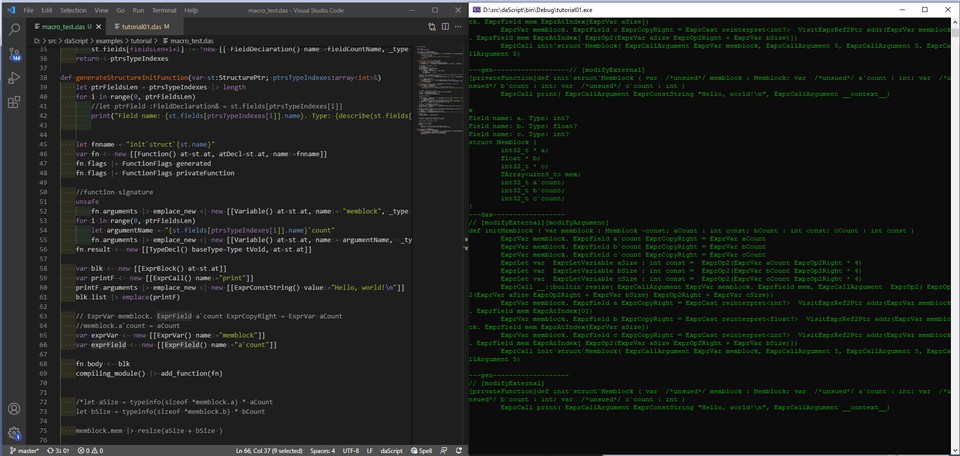

[daScript](https://dascript.org/) - скриптовый язык для игр от Gaijin Entertaiment.

После нескольких дней изучения понял, что испытываю интерес и хороший страх по отношению к этому языку. Такой, как если бы нашёл лазерную указку и решил поиграть с котом, но понял, что этой указкой можно легко резать металл. 

Гайдзины делают не замену `Lua`, они делают замену `C++`! Точнее даже, не "делают", а практически "сделали", язык сейчас находится в версии 0.2, но полноценно используется ими в продакшене в `Warthunder`.

Доклад и документация акцентируют внимание на быстродействии языка и возможности серьёзных изменений без перезапуска игры, но только вскользь упоминают о мощных возможностях макросов. Так что я решил попробовать решить задачку, требующую их использования. Это моя первая программа на `daScript`, после трёх дней изучения, так что где-то возможны и неизбежны косяки.

<!-- more -->

## Задача

В качестве задачи выбрал такую, которую было бы нетривиально или сложно решить на C++:


- Подсказка компилятору аллоцировать блок данных для структуры в линейном блоке памяти без явного написания кода работы с указателями в самой структуре


Формулировка проблемы из видео про язык [Jai](https://youtu.be/TH9VCN6UkyQ?t=4047) -- пример кода, в котором тривиальное объявление медленнее сложного, но быстрого.

```c++
//Тривиальное объявление меша для моделей
//  2 аллокации, возможно в разных местах памяти
struct Mesh {
    std::vector<Vector3> positions;
    std::vector<int> indexes;
}
```

```c++
//Более реальный вариант для продакшена
//  синтаксис сильно отличается от тривиального варианта 
struct Mesh {
    void* memblock = nullptr;
    Vector3* positions = nullptr;
    int* indices = nullptr;
    int num_vertices = 0;
    int num_indices = 0;
}

int positions_size = num_vertices * sizeof (positions[0]);
int indices_size = num_indices = sizeof(indices[0]);
mesh->memory_block = new char[positions_size + indices_size];
mesh->positions = (Vector3*)mesh->memblock;
mesh->indices = (int*)(mesh->memblock + positions_size);
```

Второй вариант требует написания рутинного кода вручную при добавлении новых полей в структуру, а также ёмкий в плане количества переписывания кода из существующего. Если захочется переделать в таком стиле для ускорения несколько структур -- для каждой потребуется ручная работа. Из-за этого большинство структур навсегда останутся описанными в первой, медленной форме.

Джонатан Блоу предлагает в качестве решения проблемы вариант синтаксиса своего языка, который позволит легко "переключить" структуру из медленной формы в быструю.

```c++
struct Mesh {
    Vector3 []! positions;           //[]! - семантика для указателя на память, которую должна выделить и освободить сама структура
    int[]! indices; @joint positions //@joint - семантика для того, что попросить компилятор
                                     //    расположить данные в памяти одним блоком
}
```

Я захотел попробовать реализовать подобную подсказку компилятору daScript с помощью макросов.

## Документация к daScript
Порядок изучения информации про язык:
- Доклад Антона Юдинцева


- Инфа с оффициального сайта и [документация](https://dascript.org/doc/index.html)
- [Live Stream Coding on daScript - Breakoid](https://youtu.be/inGb9R1NowY) - стрим с примером реализации арканоида, можно посмотреть на макросы и синтаксис системы ECS, реализованной с помощью макросов
- [Серия туториалов](https://github.com/GaijinEntertainment/daScript/tree/073bc29145207b39180069ae60f00ed43fad6ea7/examples/tutorial) - примеры привязки скриптов к C++, Ahead-of-Time компиляции, реализация генерации кода через cmake, архитектура игрового объекта с возможностью hot-reloading кода из скриптов.
- [Больше примеров кода](https://github.com/GaijinEntertainment/daScript/tree/073bc29145207b39180069ae60f00ed43fad6ea7/examples/test/misc), в том числе несколько макросов
- [Стандартная библиотека](https://github.com/GaijinEntertainment/daScript/tree/073bc29145207b39180069ae60f00ed43fad6ea7/daslib) языка и [модули](https://github.com/GaijinEntertainment/daScript/tree/073bc29145207b39180069ae60f00ed43fad6ea7/modules), можно использовать поиск по коду с гитхаба, чтобы найти пример использования той или иной фичи

Макросы являются достаточно сложной темой, и освещены в документации daScript-а достаточно кратко, поэтому приведу несколько ссылок на туториалы из других языков:
[Fear of macros](https://www.greghendershott.com/fear-of-macros/) - Racket
[Макросы в Nemerle](https://rsdn.org/article/nemerle/NemerleStingFormating.xml) - Nemerle
[Nim Tutorial Part 3](https://nim-lang.org/docs/tut3.html) - Nim

##Наивная реализация

Прежде, чем начинать шаманить с макросами, нужно набросать наивную реализацию "быстрой" версии класса, хранящего свои данные в одном блоке памяти. Для этого можно использовать [онлайн компилятор tio](https://tiorun.gaijin.team/##S0ksTi7KLCj5/z86taIgv6gklislNU0hNzEzj0sBCAqKMvNKNJQ8UnNy8nUUwvOLclIUlTS5/v8HAA).

```dascript
struct Memblock
    mem : array<uint8>
    a: int?
    aCount: int
    b: float?
    bCount: int

def initMemblock(var memblock: Memblock; aCount:int; bCount:int)

    let aSize = typeinfo(sizeof *memblock.a) * aCount
    let bSize = typeinfo(sizeof *memblock.b) * bCount

    var arr: array<uint8>
    arr |> resize(aSize + bSize )
    memblock.mem <- arr

    memblock.aCount = aCount
    memblock.bCount = bCount
    unsafe
        memblock.a = reinterpret<int?> addr(memblock.mem[0])
        memblock.b = reinterpret<float?> addr(memblock.mem[aSize])

        memblock.a[0] = int(0x11223344)
        memblock.a[1] = 0
        memblock.a[2] = -1

        memblock.b[0] = reinterpret<float>(0x55667788)
        memblock.b[1] = 0.0
        memblock.b[2] = 123.456

[export]
def main
    var memblock: Memblock
    memblock |> initMemblock(5,5)
    print("Memblock = {memblock}")

//Output:
//  Memblock = [[ [[0x44; 0x33; 0x22; 0x11; 0x0; 0x0; 0x0; 0x0; 0xff; 0xff; 0xff; 0xff; 0x0; 0x0;
//     0x0; 0x0; 0x0; 0x0; 0x0; 0x0; 0x88; 0x77; 0x66; 0x55; 0x0; 0x0; 0x0; 0x0; 0x79; 0xe9; 0xf6; 
//     0x42; 0x0; 0x0; 0x0; 0x0; 0x0; 0x0; 0x0; 0x0]]; 287454020; 5; 15837566074880.000000000; 5]]
```

Несколько замечаний про язык:
- Питоноподобный синтаксис с отступами. Для тех, кто не переносит такой формы синтаксиса, есть вариант без оступов, со скобочками и точками-с-запятыми.
- Пайпы (`|>` и `<|`) как синтаксический сахар различных записи вызова функции ([UFCS](https://en.wikipedia.org/wiki/Uniform_Function_Call_Syntax)).
- Более строгая типизация, чем в C/C++, из-за чего сложнее изучать язык и играться с ним -- иногда приходится отвлекаться на то, чтобы разобраться, что именно компилятор от тебя хочет. По идее, должно помогать ловить в компайл-тайм больше того, что поймалось бы только в рантайме.
- *unsafe*, чтобы сказать компилятору "дай мне играться с указателями, как мне хочется, я знаю, что делаю".
- print умеет выводить внутренности структуры, можно убедиться, что данные действительно лежат в одном блоке памяти, как задумывалось.
- Отсутствие семантики "=" для типов, для которых нет её однозначного определения. Вместо этого компилятор явно предлагает выбрать между клонированием (":=") и перемещением ("<-"). В языке есть generic-функции, в них вроде можно попросить у компилятора данные о типах так, чтобы выбрать желаемое поведение.

##Первый макрос

Попробуем для начала написать простейший макрос, который выведет на экран список полей структуры. С этого момента не получится использовать онлайн компилятор, так как он не поддерживает загрузку кода из нескольких файлов, а макрос должен располагаться в отдельном модуле.

Причина того, что макрос не может находиться в том же модуле, что и структура, которую он обрабатывает, понятна -- чтобы выполнить какой-либо код, обрабатывающий структуру на этапе компиляции, необходимо, чтобы сам этот код к этому моменту был уже скомпилирован.

В репозитории языка валяется готовый [пример](https://github.com/GaijinEntertainment/daScript/blob/073bc29145207b39180069ae60f00ed43fad6ea7/examples/test/misc/dump_fields.das) такого макроса, но в учебных целях немного перепишем его:

```dascript
module macro_test

require ast
require daslib/ast_boost

[structure_macro(name=memblock)]
class DumpFields : AstStructureAnnotation
    def override finish ( var st:StructurePtr; var group:ModuleGroup; args:AnnotationArgumentList; var errors : das_string ) : bool
        print("struct {st.name} \{\n")
        for field in st.fields
            print("\t{describe_cpp(field._type)} {field.name};\n")
        print("\}\n")
        return true
```

Макрос наследуется от класса `AstStructureAnnotation`, определённого в модуле [ast](https://github.com/GaijinEntertainment/daScript/blob/073bc29145207b39180069ae60f00ed43fad6ea7/src/builtin/ast.das#L75), который представляет собой шаблон для аннотации структуры. К самому классу также применяется аннотация `structure_macro`, которая регистрирует данный макрос для применения к каждой структуре, отмеченной аннотацией `memblock`.

```dascript
class AstStructureAnnotation
    def abstract apply ( var st:StructurePtr; var group:ModuleGroup; args:AnnotationArgumentList; var errors : das_string ) : bool
    def abstract finish ( var st:StructurePtr; var group:ModuleGroup; args:AnnotationArgumentList; var errors : das_string ) : bool
    def abstract patch ( var st:StructurePtr; var group:ModuleGroup; args:AnnotationArgumentList; var errors : das_string; var astChanged:bool& ) : bool
```

Интерфейс макроса позволяет переопределить три функции, чтобы "вклиниться" в процесс того, как компилятор обрабатывает определения структуры, на различных этапах. [Документация по фазам компиляции](https://dascript.org/doc/reference/language/macros.html?highlight=macro#compilation-passes). `Apply` - наиболее подходящий момент, чтобы попробовать изменить поля структуры или сгенерировать код.

Если теперь отметить описание структуры аннотацией `memblock`, то компилятор "пропустит" её определение через макрос, который выведет названия полей на экран. В момент обработки информация о создаваемой структуре хранится в классе `StructurePtr`, определение которого можно найти поиском по C++ коду. На данном этапе макрос просто проходит по всем полям структуры и выводит информацию о каждом из них на экран. `describe_cpp` - это функция, которая выводит определения типа, как если бы он был объявлен в C++.

При запуске приложения на экран выведется:
```cpp
struct Memblock {
    TArray<uint8_t> mem;
    int32_t * a;
    int32_t aСount;
    int32_t * b;
    int32_t bCount;
}
```

Можно немного поиграться с определением макроса:

```dascript
[structure_macro(name=memblock)]
class GenMemblock : AstStructureAnnotation
    def override apply ( var st:StructurePtr; var group:ModuleGroup; args:AnnotationArgumentList; var errors : das_string ) : bool
        var mkS <- new [[ Structure() ]]         //создаём новую структуру
        mkS.name := "MemblockTest"               //с именем MemblockTest
        let fieldsLen = st.fields |> length
        mkS.fields |> resize(fieldsLen)       
        for i in range(0, fieldsLen)
            mkS.fields[i] := st.fields[i]        //копируем в неё все поля из обрабатываемой структуры
        compiling_module() |> add_structure(mkS) //добавляем в компилирующийся сейчас модуль новый тип
        return true

//Скрипт, использующий модуль с макросом
require macro_test

[memblock]
struct Memblock
    mem : array<uint8>
    a: int?
    aCount: int
    b: float?
    bCount: int

var memblock1: Memblock
var memblock2: MemblockTest //ага, новый тип MemblockTest!
print("MemblockTest = {memblock2}")
```

## Генерация полей

Следующим шагом попробуем убрать поле `mem` из исходной структуры, и создать его из макроса.

```dascript
[structure_macro(name=memblock)]
class GenMemblock : AstStructureAnnotation
    def override apply ( var st:StructurePtr; var group:ModuleGroup; args:AnnotationArgumentList; var errors : das_string ) : bool
        var mkS <- new [[ Structure() ]]
        mkS.name := "MemblockTest"
        let fieldsLen = st.fields |> length
        mkS.fields |> resize(fieldsLen+1)

        //определение типа uint8, как это видит компилятор
        var uint8Type <- new [[TypeDecl() baseType=Type tUInt8]]
        //определение array<uint8> 
        var uint8ArrayType <- new [[TypeDecl() baseType=Type tArray, firstType <- uint8Type]]
        //декларация нового поля с именем mem и типом array<uint8> 
        mkS.fields[0] := *new [[ FieldDeclaration() name:="mem", _type <- uint8ArrayType]]

        for i in range(0, fieldsLen)
            mkS.fields[i+1] := st.fields[i]
        compiling_module() |> add_structure(mkS)
        return true

//Скрипт, использующий модуль с макросом
[memblock]
struct Memblock
    //mem : array<uint8>  //теперь поля нет в исходной структуре
    a: int?
    aCount: int
    b: float?
    bCount: int

var memblock: MemblockTest
//у структуры MemblockTest появилось поле mem, сгенерированное макросом
print("MemblockTest = {memblock.mem}") 
```

- функция `resize` изменяет размер массива, [документация](https://dascript.org/doc/stdlib/builtin.html#containers) функций для работы с контейерами.
- можно изменять поля определяемой структуры прямо на месте - макрос выполняется в сам момент её определения. Создание новой структуры с другим именем сделано для наглядности примера.
- генерация структур компилятора для определения поля сперва выглядит немного "космически", дальше будет пример использования функции `quote`, которая позволяет перевести код как его писал бы человек, в выражение, которое сгенерирует компилятор при парсинге этого кода. Но полезно разобраться с таким способом генерации кода, чтобы привыкнуть к нему. Также стоит найти определения `TypeDecl` и `FieldDeclaration` в исходном коде компилятора, это самая надёжная документация.
- "оператор" обращения к конкретному значению перечисления -- пробел (`Type tArray` - значение `tArray` перечисления `Type`). Очень необычное решение.
- при кодогенерации необходимо заботиться о том, чтобы сгенерированное имя не пересекалось с тем, которое может захотеть использовать программист. В этом смысле `mem` -- плохое имя для сгенерированного поля, в реальном коде необходимо было бы какое-либо соглашение об именах, авторы языка используют символ '`' (гравис, backquote) для отметки генерированного кода.

Таким же образом можно перенести поля `aCount` и `bCount` в генерирующий макрос:

```dascript
[structure_macro(name=memblock)]
class GenMemblock : AstStructureAnnotation
    def override apply ( var st:StructurePtr; var group:ModuleGroup; args:AnnotationArgumentList; var errors : das_string ) : bool
        //create "mem" field of type array<uint8>
        var uint8Type <- new [[TypeDecl() baseType=Type tUInt8]]
        var uint8ArrayType <- new [[TypeDecl() baseType=Type tArray, firstType <- uint8Type]]

        let fieldsLen = st.fields |> length
        var ptrsCount = 0
        var ptrsTypeIndexes : array<int>
        ptrsTypeIndexes |> reserve(fieldsLen)

        //Проходим по списку всех полей и сохраняем индексы полей, тип которых -- указатель
        for i in range(0, fieldsLen)
            if st.fields[i]._type.baseType == Type tPointer //проверка типа поля
                ptrsCount++
                ptrsTypeIndexes |> push(i)

        //add one field for memblock and one field per pointer type to handle count of object per type
        st.fields |> resize(fieldsLen+ ptrsCount + 1)
        st.fields[fieldsLen] := *new [[ FieldDeclaration() name:="mem", _type <- uint8ArrayType]]

        for i in range(0, ptrsCount)
            //генерируем имя поля - добавляем к нему постфикс `count
            let fieldCountName = "{st.fields[ptrsTypeIndexes[i]].name}{"`count"}"
            //генерируем новое поля типа int для каждого поля
            st.fields[fieldsLen+1+i] := *new [[ FieldDeclaration() name:=fieldCountName, _type <- new [[TypeDecl() baseType=Type tInt]]]]

        return true

[memblock]
//сама структура теперь содержит только определение полей
struct Memblock
    a: int?
    b: float?

//вывод скрипта -- сгенерированные поля
struct Memblock {
        int32_t * a;
        float * b;
        TArray<uint8_t> mem;
        int32_t a`count;
        int32_t b`count;
}
```

Разумеется, в реальном мире бывают структуры, которые могут содержать одновременно как указатели на память, которую должна выделять и освобождать сама структура, так и те, которые указывают на память, которую структура трогать не должна. Пока что мы считаем, что структура, отмеченная как `memblock`, содержит только указатели на память, которую выделяет и освобождает сама. Забегая наперёд, реализовать поддержку обоих типов указателей можно с помощью аннотаций типа (я не нашёл ссылок на аннотации в документации, но их можно найти в коде ([пример](https://github.com/borisbat/dasBGFX/blob/a1e10ab439e5996a0a4d8722689e2b0fab4e72d9/examples/01_hello_triangle.das#L7))). Аннотации типа будут рассмотрены сильно дальше, при реализации наследования от memblock-структур.

На данном этапе мы получили возможность описать структуру с любым количеством полей, и с помощью макроса сгенерировать по этому описанию недостающие поля. К сожалению, функцию `initMemblock` (конструктор структуры), по прежнему необходимо писать руками, что очень неприятно.

## Подготовка к генерация кода конструктора

Для начала стоит немного переписать код `initMemblock`, чтобы отделить часть инициализации структуры, которую нужно сгенерировать. Также добавлено третье поле, для того, чтобы увидеть, какие изменения потребуется сейчас внести в код `initMemblock`

```dascript
//аннотация того, что к структуре надо применить 2 макроса, добавляющий поля, и дебажный, отображающий все поля
[memblock, dump_fields]
struct Memblock
    a: int?
    b: float?
    c: int?

//Шаблонный код инициализации, типовой для memblock-структур
//  необходимо научиться генерировать его, чтобы не писать руками для каждой структуры
def initMemblock(var memblock: Memblock; aCount:int; bCount:int; cCount:int)
    memblock.a`count = aCount
    memblock.b`count = bCount
    memblock.c`count = cCount                                          //новое

    let aSize = typeinfo(sizeof *memblock.a) * aCount
    let bSize = typeinfo(sizeof *memblock.b) * bCount
    let cSize = typeinfo(sizeof *memblock.c) * cCount                  //новое

    memblock.mem |> resize(aSize + bSize + cSize)                      //новое

    unsafe
        memblock.a = reinterpret<int?> addr(memblock.mem[0])
        memblock.b = reinterpret<float?> addr(memblock.mem[aSize])
        memblock.c = reinterpret<int?> addr(memblock.mem[aSize+bSize]) //новое

//Пример использования структуры
def fillMemblock(var memblock: Memblock)
    unsafe
        memblock.a[0] = int(0x11223344)
        memblock.a[1] = 0
        memblock.a[2] = -1

        memblock.b[0] = reinterpret<float>(0x55667788)
        memblock.b[1] = 0.0
        memblock.b[2] = 123.456

        memblock.c[0] = int(0xAABBCCDD)
        memblock.c[1] = 0
        memblock.c[2] = -1

//Тест
[export]
def test
    var memblock: Memblock
    memblock |> initMemblock(5,5,5) //кол-во аргументов конструктора, зависит от количества полей структуры
    memblock |> fillMemblock
    print("Memblock = {memblock}")
```

Прежде, чем приступать к написанию макроса, генерирующего функцию `initMemblock`, стоит разобраться с парой примеров:

[gen_field.das](https://github.com/GaijinEntertainment/daScript/blob/073bc29145207b39180069ae60f00ed43fad6ea7/examples/test/misc/gen_fields.das) -- генерация функции, логгирующей создание полей структуры.

- Приведены два макроса `DumpFields` и `Dump2Fields`, работающие на различных стадиях (apply/finish), во время генерации структуры, и после окончания.
- На момент написание заметки пример был сломан, для фикса необходимо убрать код, касающийся типа `EntityId` -- видимо, пример выдран из какого-то более масштабного кода, и опредения то ли забыли перенести, то ли забыли добавить модуль, содержащий их.
- флаг функции "`fn.flags |= FunctionFlags init`" говорит компилятору о том, что функция должна быть вызвана сразу после генерации (я какое-то время тупил с тем, чтобы понять, на какой стадии компиляции, кто и почему её вызывает).

[ast_print.das](https://github.com/GaijinEntertainment/daScript/blob/073bc29145207b39180069ae60f00ed43fad6ea7/examples/test/misc/ast_print.das) - макрос, выводящий исходный текст на dascript переданного ему выражения на daScript.

- этот пример в репозитории тоже немного сломан ([Fixed version](https://github.com/spiiin/dascript_macro_tutorial/blob/master/examples/ast_print.das))

Теперь применим немного рекурсивной магии.

Этот макрос может быть очень полезным, если переделать его так, чтобы он печатал не исходный текст переданного ему выражения, а исходный текст МАКРОСА, генерирующего при выполнении само это выражение.

Это очень важная для упрощения метапрограммирования часть, поэтому повторю ещё раз. Вместо написания макроса, генерирующего функцию `initMemblock`, мы сначала напишем **`макрос ast_print_expression, который выведет на экран текст, который поможет нам написать макрос generateInitMemblockFunction, генерирующий функцию initMemblock`** (или любую другую функцию). Звучит запутанно, но это не так сложно, как кажется.
(всё, больше не буду повторять, язык сломать можно)

Модифицируем функцию `ast_print` так, чтобы она не просто печатала исходный текст переданного ей выражения, а дополнительно печатала тип каждого подвыражения (`Subexpression`) этого выражения.
Вот такая функция:
[ast_print_expression](https://github.com/spiiin/dascript_macro_tutorial/blob/master/examples/macro_print_ast.das) (конечно, немного "наколенная")

Теперь можно начать последовательно копировать типы подвыражений в макрос, генерирующий функцию `initMemblock`, постепенно модифицируя его так, чтобы добавлять параметры, позволяющие генерировать различные варианты этой функции.

Рабочий процесс на этом этапе удобно зациклить так:
- Модифицируем текст initMemblock
- Перезапускаем компиляцию функции, чтобы макрос ast_print_expression применился к этой функции и вывел на экран выражение, в которое преобразуется функция
- Копируем часть выражения в макрос generateInitMemblockFunction, который должен сгенерировать новую функцию initMemblock_generated, идентичную самой функции initMemblock
- Модифицируем макрос generateInitMemblockFunction, чтобы добавить в него код, генерирующий переменную часть функции
- Перекомпилируем функцию initMemblock_generated, чтобы применить к ней макрос ast_print, для того, чтобы получить исходный код функции и сверить его с исходный кодом initMemblock

Выглядит запутанно, но это необходимо для того, чтобы иметь возможность выполнить шаг 4 - "переменная часть функции" -- те строчки, которые изменяются в функции `initMemblock` после того, как мы изменяем какое-либо поле структуры `Memblock` (посмотрите исходный код функции `initMemblock` и отметки `//новое`, это строчки, которые добавились после добавления поля с именем `c` -- это как раз эта "переменная часть функции").

Самое интересное, что перевести программу в режим REPL практически элементарно, достаточно зациклить C++ часть самого первого туториала из репозитория daScript, перекомпилируя daScript-ы заново при вводе любого символа:

```cpp
int main( int, char * [] ) {
    NEED_ALL_DEFAULT_MODULES;
    Module::Initialize();
    char a = 'x';
    while (1) {
        tutorial();
        //тут скорее всего надо не забыть очистить память, выделенную в цикле работы
        std::cin >> a;
    }
    Module::Shutdown();
    return 0;
}
```

Рабочий процесс выглядит примерно так:

Слева код в [Visual Studio Code](https://marketplace.visualstudio.com/items?itemName=profelis.dascript-plugin), справа программа, выполняющая этот код без необходимости перезапуска. После подготовки можно переходить и к генерации кода, с Repl-режимом это будет значительно проще.

## Генерация функции initMemblock

Макрос `ast_print_expression` применённый к функции initMemblock, выводит на экран:

```dascript
---das------------------// [modifyExternal][modifyArgument]
def initMemblock ( var memblock : Memblock -const; aCount : int const; bCount : int const; cCount : int const )
        ExprVar memblock. ExprField a`count ExprCopyRight = ExprVar aCount
        ExprVar memblock. ExprField b`count ExprCopyRight = ExprVar bCount
        ExprVar memblock. ExprField c`count ExprCopyRight = ExprVar cCount
        ExprLet var  ExprLetVariable aSize : int const =  ExprOp2(ExprVar aCount ExprOp2Right * 4)
        ExprLet var  ExprLetVariable bSize : int const =  ExprOp2(ExprVar bCount ExprOp2Right * 4)
        ExprLet var  ExprLetVariable cSize : int const =  ExprOp2(ExprVar cCount ExprOp2Right * 4)
        ExprCall __::builtin`resize( ExprCallArgument ExprVar memblock. ExprField mem, ExprCallArgument  ExprOp2( ExprOp2(ExprVar aSize ExprOp2Right + ExprVar bSize) ExprOp2Right + ExprVar cSize))
        ExprVar memblock. ExprField a ExprCopyRight = ExprCast reinterpret<int?>  VisitExprRef2Ptr addr(ExprVar memblock. ExprField mem ExprAtIndex[0])
        ExprVar memblock. ExprField b ExprCopyRight = ExprCast reinterpret<float?>  VisitExprRef2Ptr addr(ExprVar memblock. ExprField mem ExprAtIndex[ExprVar aSize])
        ExprVar memblock. ExprField c ExprCopyRight = ExprCast reinterpret<int?>  VisitExprRef2Ptr addr(ExprVar memblock. ExprField mem ExprAtIndex[ ExprOp2(ExprVar aSize ExprOp2Right + ExprVar bSize)])
        ExprCall init`struct`Memblock( ExprCallArgument ExprVar memblock, ExprCallArgument 5, ExprCallArgument 5, ExprCallArgument 5)
```

Здесь перед каждым daScript выражением показан тип этого выражения. Почти все типы выражений объявлены в заголовочных файлах [ast_*.h](https://github.com/GaijinEntertainment/daScript/tree/master/include/daScript/ast).


С определенного момента начинаешь ценить простые языки -- вместо того, что изучать сложные и разрастающиеся правила языка, можно упростить их, чтобы ускорить изучение языка и сделать его более понятным, но при этом дать возможность задавать более сложные правила только в тех местах, где они действительно нужны программисту.


**`Работа с макросами сначала кажется сложной, но с какого-то момента понимаешь, что типичная программа содержит почти все распространённые типы выражений, и понимаешь, что вот они, все перед тобой, других, скрытых мелким шрифтом в примечаниях на 666-й странице стандарта, нет.`**

Можно было бы пойти ещё дальше, и написать макрос, который выводит код, создающий выражение, но в образовательных целях можно попробовать для начала составить выражения вручную.

Для генерации функции нужно научиться генерировать строки 5 типов:
- Декларация функции `def initMemblock ( var memblock : Memblock, ...)`
- Присваивание  `memblock.a`count = aCount`
- Объвление переменной `let aSize = typeinfo(sizeof *memblock.a) * aCount`
- Вызов функции `memblock.mem |> resize(aSize + bSize + cSize)`
- Ещё одно присвание - ` memblock.a = reinterpret<int?> addr(memblock.mem[0])`

**`Декларация функции`**

Практически готовый пример нужного кода есть в примерах из daScript-a `gen_field.das`.

```dascript
def generateStructureFields(var st:StructurePtr)
    //create "mem" field of type array<uint8>
    var uint8Type <- new [[TypeDecl() baseType=Type tUInt8]]
    var uint8ArrayType <- new [[TypeDecl() baseType=Type tArray, firstType <- uint8Type]]

    let fieldsLen = st.fields |> length
    var ptrsCount = 0
    var ptrsTypeIndexes : array<int>
    ptrsTypeIndexes |> reserve(fieldsLen)
    for i in range(0, fieldsLen)
        if st.fields[i]._type.baseType == Type tPointer
            ptrsCount++
            ptrsTypeIndexes |> push(i) //сохраняем индексы полей-указателей

    //add one field for memblock and one field per pointer type to handle count of object per type
    st.fields |> resize(fieldsLen+ ptrsCount + 1)
    st.fields[fieldsLen] := *new [[ FieldDeclaration() name:="mem", _type <- uint8ArrayType]]

    for i in range(0, ptrsCount)
        let fieldCountName = "{st.fields[ptrsTypeIndexes[i]].name}{"`count"}"
        st.fields[fieldsLen+1+i] := *new [[ FieldDeclaration() name:=fieldCountName, _type <- new [[TypeDecl() baseType=Type tInt]]]]
    return <-ptrsTypeIndexes

//--------------------------
// Генерация функции
def generateStructureInitFunction(var st:StructurePtr; ptrsTypeIndexes:array<int>&)
    let ptrFieldsLen = ptrsTypeIndexes |> length

    let fnname = "init`struct`{st.name}"

    //генерируем объявление функции с именем init`struct`ИмяСтрутуры
    var fn <- new [[Function() at=st.at, atDecl=st.at, name:=fnname]]
    fn.flags |= FunctionFlags generated
    fn.flags |= FunctionFlags privateFunction

    //генерируем список аргументов и тип результата функции
    unsafe
        fn.arguments |> emplace_new <| new [[Variable() at=st.at, name:= "memblock", _type <- new [[TypeDecl() baseType=Type tStructure, structType=addr(*st)]]]]
    for i in range(0, ptrFieldsLen)
        let argumentName = "{st.fields[ptrsTypeIndexes[i]].name}`count"
        fn.arguments |> emplace_new <| new [[Variable() at=st.at, name:= argumentName,  _type <- new [[TypeDecl() baseType=Type tInt]] ]]
    fn.result <- new [[TypeDecl() baseType=Type tVoid, at=st.at]]

    //генерируем тело функции, пока просто вызов `print("Hello, world!")`
    var blk <- new [[ExprBlock() at=st.at]]
    var printF <- new [[ExprCall() name:="print"]]
    printF.arguments |> emplace_new <| new [[ExprConstString() value:="Hello, world!\n"]]
    blk.list |> emplace(printF)

    fn.body <- blk
    compiling_module() |> add_function(fn)
```

Теперь если сгенерировать макросом функцию, и передать эту функцию в макрос, который возвращает исходный текст функции, то получится такой результат:

```dascript
def init`struct`Memblock ( var memblock : Memblock; var a`count : int; var b`count : int; var c`count : int )
    print("Hello, world!",__context__)
```

**`Присваивание и объявление переменной`**

```dascript
//-------------------------
//1. Make Expressions
//-------------------------
//memblock.a`count = aCount
//  ExprVar memblock. ExprField a`count ExprCopyRight = ExprVar aCount
var exprVar_memblock <- new [[ExprVar() name:="memblock"]]
var exprField_acount <- new [[ExprField() name:="a`count", value <- exprVar_memblock]]
var exprVar_acount <- new [[ExprVar() name:="a`count"]]
var exprCopy <- new [[ExprCopy() op:="=", left <- exprField_acount, right <- exprVar_acount]]
blk.list |> emplace(exprCopy)
```

Тут всё достаточно тривиально, пока составляем только первую строку "memblock.a`count = aCount"

```dascript
//-------------------------
//2. Quotes
//-------------------------
//let aSize = typeinfo(sizeof *memblock.a) * aCount
//  ExprLet var  ExprLetVariable aSize : int const =  ExprOp2(ExprVar aCount ExprOp2Right * 4)
var exprLet_aSize_value <- quote(
    typeinfo(sizeof * memblock.a) * a`count
)

var exprLet_aSize <- new [[ExprLet()]]
exprLet_aSize.variables |> emplace_new() <| new [[Variable()
    name := "aSize",
    _type <- new [[TypeDecl() baseType=Type tInt]],
    init <- exprLet_aSize_value
]]
blk.list |> emplace(exprLet_aSize)

//prevent drop unused code
var exprCall_printUnused <- quote(
    print("{aSize}")
)
blk.list |> emplace(exprCall_printUnused)
```

При генерации следующей строки можно заметить, что:
- макрос ast_print_expression не описал выражение "typeinfo(sizeof *memblock.a)", а вместо этого вывел его результат. Это происходит потому, что макрос был применён к уже сгенерированной и оптимизированной функции, для которой часть выражений может быть вычислена компилятором.
- макрос ast_print, применённый к сгенерированной функции, не показывает неиспользуемые переменные, так как они были выброшены компилятором, так что увидеть их можно, если добавить использование (print"{aSize}" в данном случае).

Кроме генерации выражений, здесь показано использование макроса `quote`, который превращает код в выражение:
```dascript
var exprLet_aSize_value <- quote(
    typeinfo(sizeof * memblock.a) * a`count
)
```

Вот [пример](https://github.com/GaijinEntertainment/daScript/blob/726d440be7618fb431815b18e6f785c37a335d5d/examples/test/misc/template_example.das) ([Fixed version](https://github.com/spiiin/dascript_macro_tutorial/blob/master/examples/template_example.das)) более продвинутого использования цитирования, с возможностью задать правила переписывания выражения. Это можно использовать для того, чтобы перейти от явного указания названия поля структуры к переменной, в которую можно передать любое имя или выражение:

```dascript
require daslib/templates
require daslib/templates_boost

//-------------------------
//2. Quotes and templates
//-------------------------
//let aSize = typeinfo(sizeof *memblock.a) * aCount
//  ExprLet var  ExprLetVariable aSize : int const =  ExprOp2(ExprVar aCount ExprOp2Right * 4)

for i in range(0, ptrFieldsLen)
    let argumentName = "{st.fields[ptrsTypeIndexes[i]].name}"
    var exprLet_aSize_value <- quote(
        typeinfo(sizeof *ELEMENT) * ELEMENTS_COUNT
    )

    var exprVar_memblock2 <- new [[ExprVar() name:="memblock"]]
    var exprField_acount2 <- new [[ExprField() name:=argumentName, value <- exprVar_memblock2]]

    var exprLet_rules : Template                                               //правила переписывания выражения
    exprLet_rules |> replaceVariable("ELEMENT", exprField_acount2)             //подставляем выражение
    exprLet_rules |> renameVariable("ELEMENTS_COUNT", "{argumentName}`count")  //подставляем имя переменной
    apply_template(exprLet_rules, exprLet_aSize_value.at, exprLet_aSize_value)
    
    var exprLet_aSize <- new [[ExprLet()]]
    exprLet_aSize.variables |> emplace_new() <| new [[Variable()
        name := "{argumentName}Size",
        _type <- new [[TypeDecl() baseType=Type tInt]],
        init <- exprLet_aSize_value
    ]]
    blk.list |> emplace(exprLet_aSize)

    //Временно руками добавляем код использования переменных, чтобы их не отбросил компилятор
    var exprCall_printUnused <- quote(
        print("{aSize},{bSize},{cSize}")
    blk.list |> emplace(exprCall_printUnused)
```

Половина кода генерации написана, нужно двигаться дальше.

**`Вызов функции memblock.mem |> resize(aSize + bSize + cSize)`**

Здесь есть небольшая хитрость. Строка `aSize + bSize + cSize`, трансформируется в выражение:
```dascript
ExprOp2( ExprOp2(ExprVar aSize ExprOp2Right + ExprVar bSize) ExprOp2Right + ExprVar cSize))
```

У выражения есть определённый шаблон:
```dascript
((((a+b)+c)+d)+...)
```

Подобные выражения удобно сгенерировать с помощью функции [свёртки](https://en.wikipedia.org/wiki/Fold_(higher-order_function)). Я зачём-то использовал правостороннюю свёртку, но для ассоциативных операторов конечный результат будет одинаковым (не нашёл готовой в стандартной библиотеке):

```dascript
def foldR(var a:array<ExpressionPtr>; foldOp:function<(arg1, arg2: ExpressionPtr) : ExpressionPtr> )
    let aLen = a |> length
    var from <- a[aLen-1]
    for i in range(1, aLen)
        from := foldOp |> invoke(a[aLen-1-i], from)
    return from

def makeSumExpr(a, b: ExpressionPtr const): ExpressionPtr
    return new [[ExprOp2() op:="+", left := a, right := b]]

//-------------------------
// 3. Foldr
//-------------------------
//memblock.mem |> resize(aSize + bSize + cSize)
//     ExprCall __::builtin`resize( ExprCallArgument ExprVar memblock. ExprField mem, ExprCallArgument  ExprOp2( ExprOp2(ExprVar aSize ExprOp2Right + ExprVar bSize) ExprOp2Right + ExprVar cSize))

var sumArgumentsArray: array<ExpressionPtr>
for i in range(0, ptrFieldsLen) 
    let argumentName = "{st.fields[ptrsTypeIndexes[i]].name}"
    let nameSize := "{argumentName}Size"
    sumArgumentsArray |> emplace(new [[ExprVar() name:=nameSize]])
var sumExpr <- foldR(sumArgumentsArray, @@makeSumExpr) //ага, свёртка массива в выражение

//--------
var exprLet_totalSize <- new [[ExprLet()]]
exprLet_totalSize.variables |> emplace_new() <| new [[Variable()
    name := "totalSize",
    _type <- new [[TypeDecl() baseType=Type tInt]],
    init <- sumExpr
]]
blk.list |> emplace(exprLet_totalSize)
//prevent drop unused code
var exprCall_printUnused2 <- quote(
    print("{totalSize}")
)
blk.list |> emplace(exprCall_printUnused2)

//сгенерирует код:
//let totalSize : int = (aSize + (bSize + cSize))
//__::builtin`resize(memblock.mem,totalSize)
```
(__::builtin`resize здесь просто замангленное название встроенной функции resize)

**`memblock.a = reinterpret<int?> addr(memblock.mem[0])`**

Можно немного изменить функцию `foldr`, чтобы она могла генерировать частичные суммы для получения кода вида:
```dascript
memblock.a = reinterpret<int?> addr(memblock.mem[0])
memblock.b = reinterpret<float?> addr(memblock.mem[(aSize + 0)])
memblock.c = reinterpret<int?> addr(memblock.mem[(aSize + (bSize + 0))])
...
```

```dascript
//теперь можно задать, какую часть массива превратить в выражение
def foldR_partial(var a:array<ExpressionPtr>; foldOp:function<(arg1, arg2: ExpressionPtr) : ExpressionPtr>; initial: ExpressionPtr; endIndex:int)
    let aLen = a |> length
    var from := initial
    for i in range(endIndex, aLen)
        from := foldOp |> invoke(a[aLen-1-i], from)
    return from

var exprCall_resize <- quote(
        memblock.mem |> resize(totalSize)
    )
    blk.list |> emplace(exprCall_resize)

//-------------------------
// 4. castType
//-------------------------
//memblock.a = reinterpret<int?> addr(memblock.mem[0])

for i in range(0, ptrFieldsLen)
    let argumentName = "{st.fields[ptrsTypeIndexes[i]].name}"
    var exprVar_memblock <- new [[ExprVar() name:="memblock"]]
    var exprField_a <- new [[ExprField() name:=argumentName, value <- exprVar_memblock]]
    var exprAddr <- quote(
        addr(memblock.mem[START_ADDRESS])
    )

    var exprZero <- new [[ExprConstInt() value=0]]
    var exprStartAddress <- foldR_partial(sumArgumentsArray, @@makeSumExpr, exprZero, ptrFieldsLen-i)
    var exprAddr_rules : Template
    exprAddr_rules |> replaceVariable("START_ADDRESS", exprStartAddress)
    apply_template(exprAddr_rules, exprAddr.at, exprAddr)

    var exprReinterpretCast<- new [[ExprCast() 
        castType := st.fields[ptrsTypeIndexes[i]]._type,
        castFlags = ExprCastFlags reinterpretCast,
        subexpr <- exprAddr]]
    
    var exprUnsafe<- new [[ExprUnsafe() body <- exprReinterpretCast]]
    var exprCopy <- new [[ExprCopy() op:="=", left <- exprField_a, right <- exprUnsafe]]
    blk.list |> emplace(exprCopy)
```

Все части генерации, составленные вместе, генерируют теперь такую функцию:
```dascript
def init`struct`Memblock ( var memblock : Memblock; var a`count : int; var b`count : int; var c`count : int )
        memblock.a`count = a`count
        memblock.b`count = b`count
        memblock.c`count = c`count
        let aSize : int = (a`count * 4)
        let bSize : int = (b`count * 4)
        let cSize : int = (c`count * 4)
        let totalSize : int = (aSize + (bSize + cSize))
        __::builtin`resize(memblock.mem,totalSize)
        memblock.a = reinterpret<int?> addr(memblock.mem[0])
        memblock.b = reinterpret<float?> addr(memblock.mem[(aSize + 0)])
        memblock.c = reinterpret<int?> addr(memblock.mem[(aSize + (bSize + 0))])
```

Сгенерированная функция делает то же, что и написанная руками. Но разница в том, что для любых новых типов структур больше не нужно писать код объявления полей и инициализации руками совсем!

## Наследование

Теперь можно использовать макрос, чтобы сгенерировать поля структуры и конструктор:
```dascript
[memblock]
struct Memblock
    a: int?
    b: float?
    c: int?

[export]
def test
    unsafe
        var memblock: Memblock
        memblock |> init`struct`Memblock(5,5,5)
        memblock |> fillMemblock
        print("Memblock = {memblock}\n")
```

Всё работает как задумано (реальный код потребовал бы ещё некоторых доработок, вроде добавления паддинга для выравнивания полей в блоке памяти, а также обёрток для того, чтобы скрыть необходимость unsafe доступа к полям, раз уж границы массивов известны).

Но что будет, если отнаследоваться от такой структуры?

```dascript
struct Vec2
    x, y : float

[memblock, dump_fields]
struct Memblock
    a: int?
    b: float?
    c: int?
    d: Vec2?

[memblock, dump_fields]
struct MemblockInheritor : Memblock
    e: int?

[export]
def test
    unsafe
        var memblock: Memblock
        memblock |> init`struct`Memblock(5,5,5,1)
        memblock |> fillMemblock
        print("Memblock = {memblock}\n")

        var memblock2: MemblockInheritor
        //memblock2 |> fillMemblock
        memblock2 |> init`struct`MemblockInheritor(5,5,5,1,10)
        print("Memblock2 = {memblock2}\n")

//out:
struct Memblock {
        int32_t * a;
        float * b;
        int32_t * c;
        Vec2 * d;
        TArray<uint8_t> mem;
        int32_t a`count;
        int32_t b`count;
        int32_t c`count;
        int32_t d`count;
}
struct MemblockInheritor {
        int32_t * a;
        float * b;
        int32_t * c;
        Vec2 * d;
        TArray<uint8_t> mem;
        int32_t a`count;
        int32_t b`count;
        int32_t c`count;
        int32_t d`count;
        int32_t * e;
        TArray<uint8_t> mem;
        int32_t a`count;
        int32_t b`count;
        int32_t c`count;
        int32_t d`count;
        int32_t e`count;
}
```

Ауч, все поля в наследнике продублированы. Обработка объявления наследования в языке реализована как копирование деклараций всех полей структуры-предка в дочернюю (можно порыться в документации, или написать макрос, который покажет, что происходит).

Возможно реализовать пару стратегий правильного размещения полей наследника в памяти:
- каким-либо образом пометить, что базовая структура имеет сгенерированные поля, и добавить только новые
- каким-либо образом пометить поля структуры-предка, удалить их, и перестроить всю структуру заново

Для пометки полей можно использовать аннотации типов (пример -- [аннотации типов шейдеров](https://github.com/borisbat/dasBGFX/blob/a1e10ab439e5996a0a4d8722689e2b0fab4e72d9/examples/01_hello_triangle.das#L7)).

Простой макрос, который проверяет список аннотаций типа:
```dascript
def checkFields(var st:StructurePtr)
    for field in st.fields
        var memblockAnnExist = find_arg("in_memblock", field.annotation) ?as tBool ?? false
        if memblockAnnExist
            print("\t[in_memblock]\n")

//можно добавить аннотацию типа
 st.fields[i].annotation |> add_annotation_argument("in_memblock", true)
```

Теперь можно реализовать логику добавления новых полей в уже существующий мемблок, а также генерацию конструктора с правильным количестом полей:

```dascript

struct Vec2
    x, y : float

[memblock, dump_fields]
struct Memblock
    a: int?
    b: float?
    c: int?
    d: Vec2?

[memblock, dump_fields]
struct MemblockInheritor : Memblock
    e: int?

def fillMemblock(var memblock: Memblock)
    unsafe
        memblock.a[0] = int(0x11223344)
        memblock.a[1] = 0
        memblock.a[2] = -1

        memblock.b[0] = reinterpret<float>(0x55667788)
        memblock.b[1] = 0.0
        memblock.b[2] = 123.456

        memblock.c[0] = int(0xAABBCCDD)
        memblock.c[1] = 0
        memblock.c[2] = -1

[export]
def test
    unsafe
        var memblock: Memblock
        memblock |> init`struct`Memblock(5,5,5,1)
        memblock |> fillMemblock
        print("Memblock = {memblock}\n")

        var memblock2: MemblockInheritor
        //memblock2 |> fillMemblock
        memblock2 |> init`struct`MemblockInheritor(5,5,5,1,10)
        print("Memblock2 = {memblock2}\n")

//Вывод:
struct Memblock {
        int32_t * a;
        float * b;
        int32_t * c;
        Vec2 * d;
        TArray<uint8_t> mem;
        int32_t a`count;
        int32_t b`count;
        int32_t c`count;
        int32_t d`count;
}
struct MemblockInheritor {
        int32_t * a;
        float * b;
        int32_t * c;
        Vec2 * d;
        TArray<uint8_t> mem;
        int32_t a`count;
        int32_t b`count;
        int32_t c`count;
        int32_t d`count;
        int32_t * e;
        int32_t e`count;
}
Memblock = [[ 287454020; 15837566074880.000000000; -1430532899; [[ 0.000000000; 0.000000000]]; [[ 0x44; 0x33; 0x22; 0x11; 0x0; 0x0; 0x0; 0x0; 0xff; 0xff; 0xff; 0xff; 0x0; 0x0; 0x0; 0x0; 0x0; 0x0; 0x0; 0x0; 0x88; 0x77; 0x66; 0x55; 0x0; 0x0; 0x0; 0x0; 0x79; 0xe9; 0xf6; 0x42; 0x0; 0x0; 0x0; 0x0; 0x0; 0x0; 0x0; 0x0; 0xdd; 0xcc; 0xbb; 0xaa; 0x0; 0x0; 0x0; 0x0; 0xff; 0xff; 0xff; 0xff; 0x0; 0x0; 0x0; 0x0; 0x0; 0x0; 0x0; 0x0; 0x0; 0x0; 0x0; 0x0; 0x0; 0x0; 0x0; 0x0]]; 5; 5; 5; 1]]
Memblock2 = [[ 0; 0.000000000; 0; [[ 0.000000000; 0.000000000]]; [[ 0x0; 0x0; 0x0; 0x0; 0x0; 0x0; 0x0; 0x0; 0x0; 0x0; 0x0; 0x0; 0x0; 0x0; 0x0; 0x0; 0x0; 0x0; 0x0; 0x0; 0x0; 0x0; 0x0; 0x0; 0x0; 0x0; 0x0; 0x0; 0x0; 0x0; 0x0; 0x0; 0x0; 0x0; 0x0; 0x0; 0x0; 0x0; 0x0; 0x0; 0x0; 0x0; 0x0; 0x0; 0x0; 0x0; 0x0; 0x0; 0x0; 0x0; 0x0; 0x0; 0x0; 0x0; 0x0; 0x0; 0x0; 0x0; 0x0; 0x0; 0x0; 0x0; 0x0; 0x0; 0x0; 0x0; 0x0; 0x0; 0x0; 0x0; 0x0; 0x0; 0x0; 0x0; 0x0; 0x0; 0x0; 0x0; 0x0; 0x0; 0x0; 0x0; 0x0; 0x0; 0x0; 0x0; 0x0; 0x0; 0x0; 0x0; 0x0; 0x0; 0x0; 0x0; 0x0; 0x0; 0x0; 0x0; 0x0; 0x0; 0x0; 0x0; 0x0; 0x0; 0x0; 0x0; 0x0; 0x0]]; 5; 5; 5; 1; 0; 10]]
```

## Финал

С данным макросом можно продолжать играться, делая его всё круче, но примерно на этом этапе можно сказать, что исходная задача решена.

Макросы добавляют в язык способ серьёзно модифицировать код и данные по правилам, которые захочет реализовать программист. При этом разница между тривиальной структурой и "продвинутой" с точки зрения клиентского кода -- всего одна аннотация.

Для сравнения с C++, например [доклад  Louis Dionne](https://youtu.be/gVGtNFg4ay0) про реализацию библиотеки, позволяющей переопределить способ реализации полиморфизма. Без макросов невозможно реализовать идею синтаксически так, чтобы это выглядело как наследование -- в компиляторе жёстко прошиты правила того, что сгенерирует комплиятор при наследовании одной структуры от другой.

Естественно, что макросы -- это не средство повседневного решения задач. Скорее это средство для того, чтобы лучше "подстроить" язык под предметную область, и уменьшить количество рукописного рутинного кода, не относящего непосредственно к решаемой задаче.

Для `daScript` предметная область -- это разработка игр, и, возможно, макросы позволят ему уйти далеко вперед по сравнению с тем, что умели делать любые другие скриптовые языки для игр раньше.

[https://github.com/spiiin/dascript_macro_tutorial](https://github.com/spiiin/dascript_macro_tutorial) - репозиторий с кодом из заметки:
    `/src_dirty` -- можно посмотреть диффами между парами файлов эволюцию примера из статьи. Хостом для выполнения может послужить tutorial01 - базовый пример работы с языком из официального репозитория. В остальном -- непричёсанный код.
    `/examples` -- пофикшенные примеры макросов из официального репозитория.


