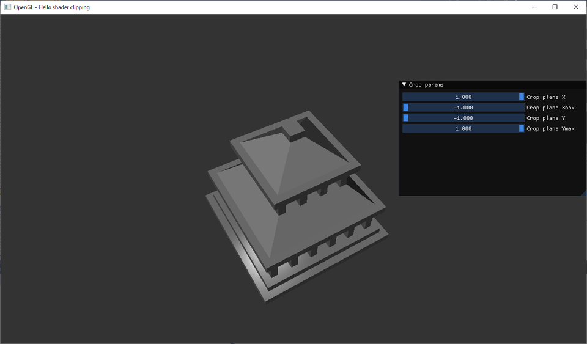
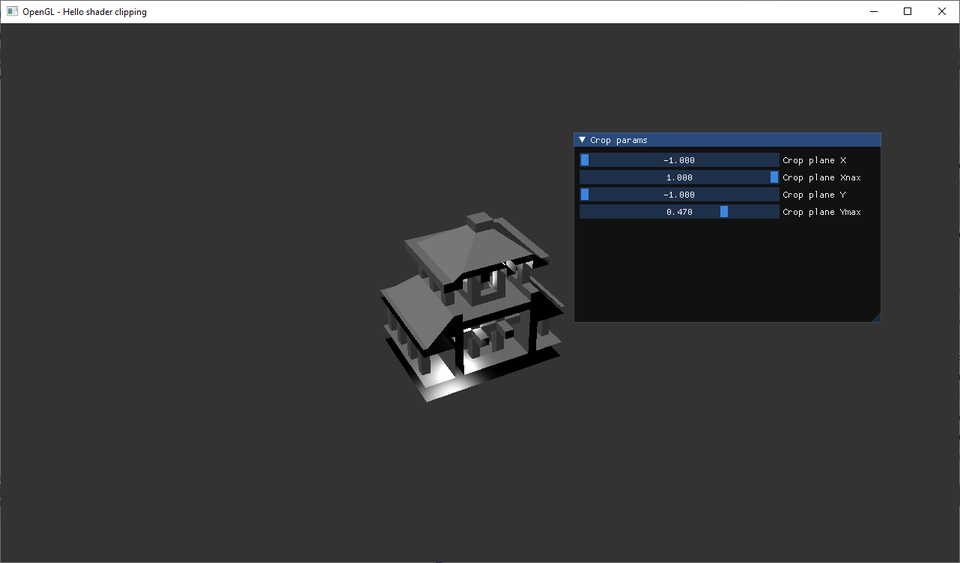
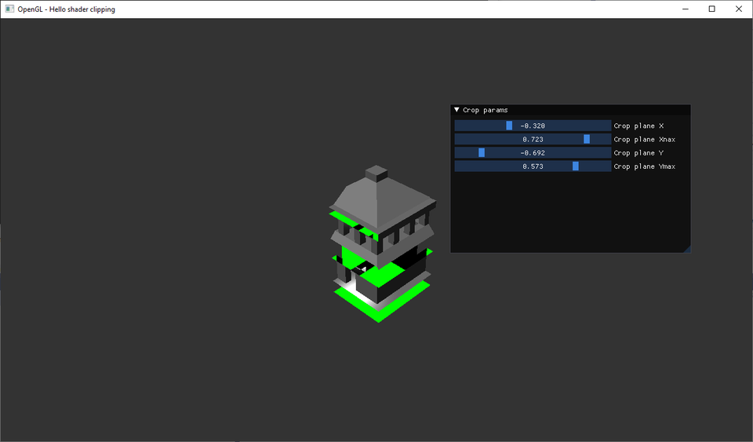
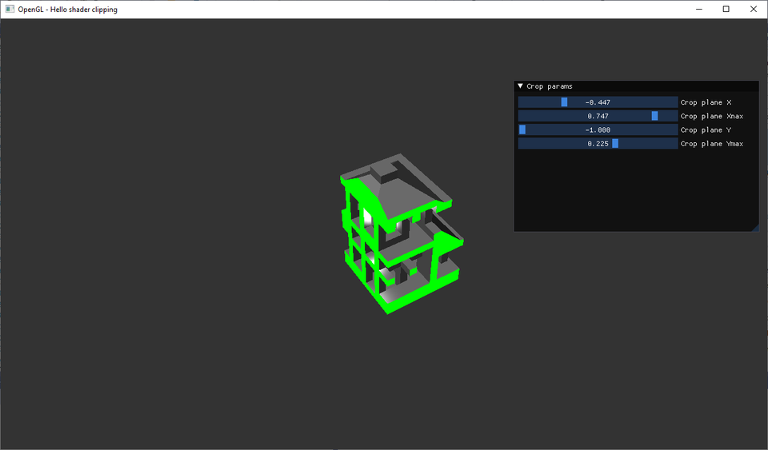

Пример использования байдингов OpenGL для языка daScript
<!-- more -->

Попробовал разобраться с использованием байндингов библиотек к языку daScript. В качестве тестовой задачки решил портировать на daScript + OpenGL [эту демку](https://github.com/bkaradzic/bgfx/issues/1857). Программа реализует алгоритм клиппинга модели несколькими плоскостями, с заполненнием отрезанных частей "крышками", чтобы не было видно внутренней поверхности модели ([скрин](https://github.com/daign/clipping-with-caps/blob/master/screenshot_01.png)).

Алгоритм:
- Отрисовать модель с шейдером отсечения (с "дырками")
- Заполнить буфер трафарета значениями так, чтобы пометить пиксели, которые нужно закрыть:
-- Отрисовать внутреннюю сторону модели, увеличивая значение в буфере трафарета
-- Отрисовать внешнюю сторону модели, уменьшая значение в буфере трафарета
-- Заполнять буфер трафарета в только в точках, в которых плоскость отсечения повернута к камере (для корректной работы нескольких плоскостей отсечения одновременно)
- Отрисовать плоскости отсечения по полученной маске (получаются закрывающие "крышки")

## Каркас приложения

Для создания байндингов библиотек к daScript используется [dasClangBind](https://github.com/GaijinEntertainment/daScript/issues/231), с помощью которого сделаны обёртки для [нескольких](https://github.com/GaijinEntertainment/daScript/tree/master/modules) библиотек, включая OpenGL. Последний из [примеров](https://github.com/GaijinEntertainment/daScript/blob/master/modules/dasOpenGL/examples/09_hello_mesh.das) демонстрирует загрузку и отображение модели из obj-файла. Этот пример можно взять за основу. Для задания настроек отсекающих плоскостей можно взять байндинг к [imgui](https://github.com/borisbat/dasImgui/).

Эти модули также тащат за собой `glfw` для создания окна и `stbImage`. Шаблон C++ кода для подключения модулей:

```cpp
#include "../modules/dasGlfw/src/dasGLFW.h"
#include "../modules/dasImgui/src/dasIMGUI.h"
#include "../modules/dasStbImage/src/dasStbImage.h"

...

int main( int, char * [] ) {
    NEED_ALL_DEFAULT_MODULES;
    NEED_MODULE(Module_dasGLFW)
    NEED_MODULE(Module_StbImage)
    NEED_MODULE(Module_dasIMGUI)
    NEED_MODULE(Module_imgui_app)
    Module::Initialize();
    tutorial();
    Module::Shutdown();
    return 0;
}
```

Пустое окно на glfw + imgui можно создать так:

```fsharp
def imgui_app(title:string; blk : block)
    if glfwInit()==0
		panic("can't init glfw")
    defer <|
        glfwTerminate()
    glfwInitOpenGL(3,3)
    var window = glfwCreateWindow(1280, 720, "OpenGL - Hello shader clipping", null, null)
    if window==null
		panic("can't create window")
    defer <|
        glfwDestroyWindow(window)
    glfwMakeContextCurrent(window)

    CreateContext(null)
    var io & = unsafe(GetIO())
    StyleColorsDark(null)
    ImGui_ImplGlfw_InitForOpenGL(window, true)
    ImGui_ImplOpenGL3_Init("#version 330")

    while glfwWindowShouldClose(window)==0
        glfwPollEvents()

        ImGui_ImplOpenGL3_NewFrame()
        ImGui_ImplGlfw_NewFrame()

        invoke(blk)

        var display_w, display_h : int
        glfwGetFramebufferSize(window, display_w, display_h)
        let aspect = display_h!=0 ? float(display_w)/float(display_h) : 1.
        // render
        glViewport(0, 0, display_w, display_h)
        glClearColor(0.2, 0.2, 0.2, 1.0)
        glClearDepth(1.0lf)
        glClear(GL_COLOR_BUFFER_BIT|GL_DEPTH_BUFFER_BIT|GL_STENCIL_BUFFER_BIT)

        ImGui_ImplOpenGL3_RenderDrawData(GetDrawData())

        glfwMakeContextCurrent(window)
        glfwSwapBuffers(window)
    //close app
    DestroyContext(null)
    glfwDestroyWindow(window)
    glfwTerminate()

[export]
def test
	imgui_app("imgui") <|
        NewFrame()
        Begin("Crop params");
        End();
        Render()
```

- не забыли создать и очистить буфер трафарета (GL_STENCIL_BUFFER_BIT)
- [block](https://dascript.org/doc/reference/language/blocks.html?highlight=block) в daScript -- безымянная функция, которая захватывает переменные по ссылке (более быстрая, чем лямбда-функции, которые могут управлять способом захвата)
- `defer` -- макрос для добавления выражений в блок [finally](https://dascript.org/doc/reference/language/statements.html?highlight=defer#finally-statement)


Исходная демка использует библиотеки three.js и ColladaLoader.js для загрузки меша из dae файла, но можно [конвертировать](https://products.aspose.app/3d/ru/conversion/dae-to-obj) dae в obj, чтобы использовать код загрузки меша из примера daScript. Загрузка меша:

```fsharp
require opengl/opengl_gen

let mesh_file_name = "{get_das_root()}/house.obj"
var mesh <- load_obj_mesh(mesh_file_name) |> create_geometry_fragment
```

## Отрисовка меша

Задание стандартных шейдеров:

```fsharp
require glsl/glsl_common
require glsl/glsl_internal

var [[in, location=0]] v_position : float3
var [[in, location=1]] v_normal   : float3
var [[in, location=2]] v_texcoord : float2
var [[uniform]] v_model : float4x4
var [[uniform]] v_view : float4x4
var [[uniform]] v_projection : float4x4
var [[inout]] f_texcoord : float2
var [[inout]] f_normal : float3
var [[inout]] f_position : float3
var [[inout]] f_worldpos : float3

var [[uniform, stage=0]] f_tex : sampler2D
var [[out]] f_FragColor : float4

[vertex_program]
def vs_preview
    f_texcoord = v_texcoord
    f_normal = normalize ( float3x3(v_model) * v_normal )
    let tpos = v_model * float4(v_position, 1.0)
    f_position = tpos.xyz
    f_worldpos = v_position
    gl_Position = v_projection * v_view * tpos

[fragment_program (version=400)]
def fs_preview
    let pS = 24.0

    let light_dir = normalize(float3(-1,-2,-3))
    let camera_dir = normalize(f_position)
    let normal = normalize(f_normal)
    let k = -dot(light_dir,normal)
    let diffuse = float3(saturate(k))
    let refl = normalize ( reflect(camera_dir,normal) )
    let kS = saturate(dot(-light_dir,refl))
    let kS1 = saturate(dot(-light_dir,refl))
    let specular = float3(pow(kS,pS)*kS)
    f_FragColor.xyz = texture(f_tex,f_texcoord).xyz * diffuse + specular
    f_FragColor.w = 1.
```

Интересная штука -- DSL для работы с шейдерами ([glsl_internal](https://github.com/GaijinEntertainment/daScript/blob/master/modules/dasGlsl/glsl/glsl_internal.das), набор макросов для того, чтобы писать шейдеры как обычные функции в daScript, а также работать с uniform переменными почти как с обычными переменными языка. Пример передачи uniform-ов в шейдер:

```fsharp
var [[uniform]] v_projection : float4x4                                     //объявление uniform переменной для шейдера

let aspect = display_h!=0 ? float(display_w)/float(display_h) : 1.
v_projection = perspective_rh_opengl( 45.0f*PI/180., aspect, 0.1f, 10.0f)   //определяем матрицу проекции (daScript-структура)
vs_preview_bind_uniform(program_front)                                      //передаём uniform переменные в шейдер
fs_preview_bind_uniform(program_front)                                      // vs_preview_bind_uniform - сгенерированная макросом [vertex_program] функция! 
```

Помимо простой привязки функций библиотеки, сгенерированной с помощью `dasClangBind`, написаны также макросы для "daScript-ивизации" кода. Вместо императивного вызова функции `glUniformXXX`, программист декларирует намерение "эта переменная - uniform для шейдера" -- аннотация `uniform`.

**`За счёт этого скриптовый язык становится не "условным бейсиком" для императивного вызова функций, а способом приблизить библиотеку к предметной области, в терминах которой мыслит и работает программист`**

Отрисовка:

```fsharp
glUseProgram(program)
vs_preview_bind_uniform(program)
fs_preview_bind_uniform(program)
draw_geometry_fragment(mesh)
```



## Клиппинг плоскостями отсечения

Изменим пиксельный шейдер отрисовки объекта:
```fsharp
[fragment_program (version=400)]
def fs_preview
    //если вершина отсекается плоскостями -- отбросить её
    if (f_worldpos.x < f_crop_plane_x) || (f_worldpos.y < f_crop_plane_y) || (f_worldpos.x > f_crop_plane_x_max) || (f_worldpos.y > f_crop_plane_y_max)
        discard()
...

Установка uniform-переменных через панель imGui
```fsharp
    Begin("Crop params");
    SliderFloat("Crop plane X", safe_addr(f_crop_plane_x), -1.0f, 1.0f)
    SliderFloat("Crop plane Xnax", safe_addr(f_crop_plane_x_max), -1.0f, 1.0f)
    SliderFloat("Crop plane Y", safe_addr(f_crop_plane_y), -1.0f, 1.0f)
    SliderFloat("Crop plane Ymax", safe_addr(f_crop_plane_y_max), -1.0f, 1.0f)
    End();
```


Сквозь отброшенные пиксели пока видны внутренние грани объекта.

## Заполнение буфера трафарета

Исходная демка на three.js использует для описания состояния рендера концепцию [материалов](https://github.com/daign/clipping-with-caps/blob/master/js/material.js) этой библиотеки, но несложно сопоставить свойства материлов с параметрами OpenGL

```fsharp
//упрощенный шейдер для вывода в буфер трафарета
[fragment_program (version=400)]
def fs_preview_front
    let not_inside_camera = (f_worldpos.x < f_crop_plane_x) || (f_worldpos.y < f_crop_plane_y) || (f_worldpos.x > f_crop_plane_x_max) || (f_worldpos.y > f_crop_plane_y_max)
    if not_inside_camera
        discard()
    f_FragColor = float4(0.0, 0.0, 0.0, 1.0)

...

//Включаем рендер в буфер трафарета, отключаем запись в буфера цвета и глубины
glEnable(GL_STENCIL_TEST)
glColorMask(false, false, false, false)
glDepthMask(false)

//установка шейдера
glUseProgram(program_front)
vs_preview_bind_uniform(program_front)
fs_preview_front_bind_uniform(program_front)

//рендер только задних граней объекта с увеличением значения в буфере трафарета
glEnable(GL_CULL_FACE);
glCullFace(GL_FRONT);
glStencilFunc(GL_ALWAYS, 1, 0xFF)
glStencilOp(GL_KEEP, GL_KEEP, GL_INCR)
draw_geometry_fragment(mesh)

//Рендер только передних граней объекта с уменьшения значения в буфере трафарета
glEnable(GL_CULL_FACE);
glCullFace(GL_BACK);
glStencilFunc(GL_ALWAYS, 1, 0xFF)
glStencilOp(GL_KEEP, GL_KEEP, GL_DECR)
draw_geometry_fragment(mesh)
```

Вывод отсекающих граней:

```fsharp
//функция генерации прямоугольника заданного размера
def gen_axis_rect(plt : GenDirection; x1, x2, y1, y2, coord: float)
    var frag : GeometryFragment
    frag.vertices <- [{GeometryPreviewVertex
        xyz=float3( x1, y1, coord), normal=float3(  0, 0, 1),  uv=float2(0,0);
        xyz=float3(x2, y1, coord), normal=float3(  0, 0, 1),  uv=float2(1,0);
        xyz=float3(x2,y2, coord), normal=float3(  0, 0, 1),  uv=float2(1,1);
        xyz=float3( x1,y2, coord), normal=float3(  0, 0, 1),  uv=float2(0,1)
    }]
    apply_gen_direction_tm(plt, frag)
    frag.indices <- [{int 0; 1; 2; 2; 3; 0 }]
    frag.prim = GeometryFragmentType triangles
    gen_bbox(frag)
    return <- frag

...

[fragment_program (version=400)]
def fs_preview_caps
    f_FragColor = float4(0.0, 1.0, 0.0, 1.0)

glUseProgram(program_caps)

//отрисовка через полученную в буфере трафарета маску
glStencilFunc(GL_EQUAL, 1, 0xFF)
glStencilOp(GL_KEEP, GL_KEEP, GL_KEEP)
vs_preview_bind_uniform(program_caps)
fs_preview_caps_bind_uniform(program_caps)

//генерация отсекающих плоскостей
var planeX <- gen_axis_rect(GenDirection yz, 2.0, -2.0, f_crop_plane_y_max, f_crop_plane_y, -f_crop_plane_x) |> create_geometry_fragment
draw_geometry_fragment(planeX)
var planeXMax <- gen_axis_rect(GenDirection yz, 2.0, -2.0, f_crop_plane_y_max,f_crop_plane_y, -f_crop_plane_x_max) |> create_geometry_fragment
draw_geometry_fragment(planeXMax)

var planeY <- gen_axis_rect(GenDirection xz, f_crop_plane_x, f_crop_plane_x_max, 2.0, -2.0, f_crop_plane_y) |> create_geometry_fragment
draw_geometry_fragment(planeY)
var planeYMax <- gen_axis_rect(GenDirection xz, f_crop_plane_x, f_crop_plane_x_max, 2.0, -2.0, f_crop_plane_y_max) |> create_geometry_fragment
draw_geometry_fragment(planeYMax)
```

Как отмечено в описании алгоритма [референсной демки](https://github.com/daign/clipping-with-caps#clipping-with-caps), такой подход нормально работает с одной плоскостью отсечения, но с нескольими плоскостями даёт неверный результат (повёрнутые "от камеры" плоскости отсечения также вносят вклад в маску и портят результат в буфере трафарета -- выводят лишние "дырки" или "крышки" в таких местах:



## Коррекция буфера трафарета для граней, повернутых от камеры

На этом этапе обнаруживаются отличия между демкой-референсом и примером из daScript. Позиция камеры в референсной демке попадает в шейдера "автоматически", эта переменная [устанавливается](https://threejs.org/docs/#api/en/renderers/webgl/WebGLProgram) библиотекой three.js. Для примера на daScript нужно передать её вручную и учесть то, что системы координат в демках различаются. Поворот в примере daScript задаётся через матрицу `v_model`, так что для трансформации камеры в систему координат модели и плоскостей отсечения нужно также "довернуть" её, умножив на матрицу модели.

```fsharp
//позиция камеры в пространстве координат модели
var [[uniform]] f_camera_position_rotated : float3

//шейдер для вывода в буфер трафарета
[fragment_program (version=400)]
def fs_preview_front
    //let not_inside_camera =  (f_worldpos.x < f_crop_plane_x) || (f_worldpos.y < f_crop_plane_y) || (f_worldpos.x > f_crop_plane_x_max) || (f_worldpos.y > f_crop_plane_y_max)
    let not_inside_camera = (f_worldpos.x < f_crop_plane_x) && (f_camera_position_rotated.x > -f_crop_plane_x) || (f_worldpos.y < f_crop_plane_y) && (f_camera_position_rotated.y < f_crop_plane_y) || (f_worldpos.x > f_crop_plane_x_max) && (f_camera_position_rotated.x < -f_crop_plane_x_max) || (f_worldpos.y > f_crop_plane_y_max) && (f_camera_position_rotated.y > f_crop_plane_y_max)
    if not_inside_camera
        discard()
    f_FragColor = float4(0.0, 0.0, 0.0, 1.0)

...
//поворот камеры в пространство координат модели
let camPos = v_model * float4(camera_position, 1.0)
f_camera_position_rotated = camPos.xyz
```

Можно обратить внимание на идентичный синтаксис умножения вектора на матрицу в коде вершинного шейдера для трансфорфмации вершин меша,  и обычном скрипте на daScript.

Теперь наконец отсечения смотрятся корректно под любым углом.



[Исходный код туториала](https://github.com/spiiin/dascript_macro_tutorial/blob/master/clipping_with_caps/tutorial01.das)

- daScript хорош, чтобы поиграться с демками графических эффектов :)
- подход авторов к написанию байндингов -- автоматическая обёртка на c/c++-функциями + "daScript-тификация" кода -- создание макросов, упрощающих работу с библиотекой
- вообще, демку стоило бы ещё перевести на режим [live-изменений](https://github.com/borisbat/dasGlfw/blob/48f2715f0fe4cb8076866365a4bf0a29b7104765/dasglfw/glfw_live.das), тянет на отдельный туториал

Ну и более глобальный вывод про совокупность всех фич языка -- если большая часть кода на языке делает то, что сложно или долго делать на других языках, с какого-то момента разработки сама программа может получить какие-то свойства, которых нет у программ на других языках (потому что их было слишком долго или трудно реализовывать).