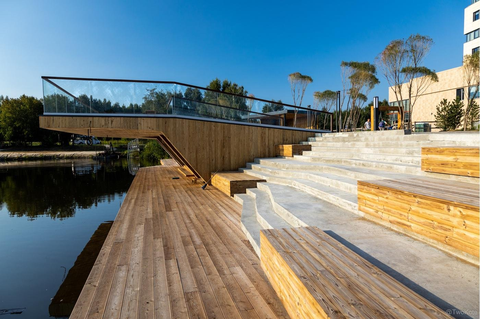
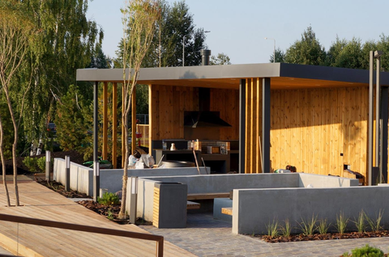
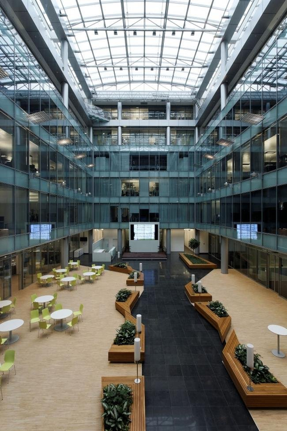

Пол Грем в своих статьях [Cities and Ambition](http://paulgraham.com/cities.html) и [Great Hackers](http://www.paulgraham.com/gh.html) (легко ищутся на русском) развёрнуто рассказывает о том, что города определяют образ мышления людей. Города посылают , можно научиться слушать их и расшифровывать.

Сообщения эти выражаются в качестве разговоров, которые слышишь вокруг, в потоке поступающей информации. Разговоры за соседними столами в кафе, бизнес-ланч с коллегами, подсмотренная история вечером в окне чьей-то квартиры, ссора соседей за стеной, сцена в электричке, радио в такси, билборд на улице, баннер на сайте или рекомендуемая новость в соцсети (которые тоже зависят от твоей геолокации). Это не что-то, что нужно специально искать, а скорее информация, от которой невозможно уклониться -- город говорит тебе, что хочет, чтобы ты делал. Какие-то города тихо нашептывают тебе свои идеи, какие-то кричат так, что становится страшно. Важно понять, что эти сообщения воспринимаются как собственные мысли (ведь если у тебя в голове чужие голоса и мысли -- то ты не совсем нормальный, так?).

Город -- не какая-то мистическая сущность, а `"масса людей + среда их обитания"`. В современном мире "городом" может быть и более маленькая или большая структура. Кембридж -- часть города, Кремниевая Долина -- не город совсем, какой-нибудь специфический офис крупной компании вполне может быть отдельным пространством, формирующим мышление сотрудников.

Некоторые игровые студии умеют работать с пространством офиса. Valve использует столы на колесиках -- можно переместиться в другой кабинет, и внутренний сайт, который отображает местонахождение сотрудника, за счет чего возможны различные конфигурации потоков информации между сотрудниками необходимыми для эффективной работы в текущий момент. Джесси Шелл рассказывает о том, что структура игровой студии зависит от того, каким образом распространяется информация, а это зависит в том числе от структуры офиса, ссылаясь на "Язык шаблонов" Кристофера Александера.



Вот [таймкод](https://youtu.be/-zRaFJHK0S4?t=1355) из второго его доклада (лучше смотреть весь). Если объединить эту информацию и [Закон Конвея](https://ru.wikipedia.org/wiki/%D0%97%D0%B0%D0%BA%D0%BE%D0%BD_%D0%9A%D0%BE%D0%BD%D0%B2%D0%B5%D1%8F), можно сказать, что структура пространства определяет не только структуру компании, но и продукты, которые она производит.

В снг-шном обществе программистов (не знаю, как в других), как-то принято считать, что профессиональное развитие зависит в первую очередь от самого специалиста, а не от его окружения (офиса+коллег, города+граждан вокруг).

С начала года ощутил для себя нехватку *чего-то*, что было при работе в офисе, но потерялось при работе из дома. Собрал немного [фоток и историй](https://vas3k.club/post/11435/) (пост закрытый, чтобы людям проще было откровенничать с историями -- это намного важнее картинок) про особенности офисов айтишников -- что именно ценят люди в офисах, что им запоминается, влияет на их настроение, работоспособность. И самое главное -- отделить мух от котлет, а точнее печеньки и плюшки для заманивания работников, от того, что реально помогает работать.
 

Я вижу необходимость наличия офиса как пространства для разработки игр в том, чтобы существовала среда общения и среда отдыха.

## Среда общения

Разработка игр -- творческий процесс. Игры как медиа передают что-то игроку. Гейм-дизайнер через эстетику хочет вызвать какие-то чувства. К примеру, последняя игра, которую я проходил, `Divinity: Original Sin 2`,  по жанру вроде как тактическая рпг и про передвижение "пешек" по полю и механику. Но при этом я иногда удивлялся, что некоторые локации вызывают желание рассматривать их под разными углами и любоваться -- видовая лавочка рядом с кладбищем с плакучей ивой, на которой хочется посидеть и подумать, или лежанка, на которую можно взобраться по лестнице в подземной таверна в Дрифтвуда с курящим друдену ящером, заставляющая задуматься о том, что ему там находиться должно быть очень уютно. Чтобы передать это ощущение, нужно взаимодействие нескольких человек, пробы и попытки. Нельзя просто описать задачу и ждать результата, живое взаимодействие и общение может привести к нахождению способа задать нужное "настроение" игры.

Это один из элементов магии игр -- возможность разработчику или дизайнеру передать в игре что-то, что он пережил и прочувствовал сам. А между желанием передать какое-то чувство и ощущение, и геймплеем, который вызовет это ощущение у игрока, лежит общение между людьми, которые делают игру. Чем сложнее и глубже ощущение, которое хочет создать команда разработчиков, тем более выразительным должно быть общение в команде. Удаленное взаимодействие здесь сильно проигрывает живому. Инженеры также сталкиваются с задачами, требующими творческого подхода -- задачи с серьёзными техническими ограничениями, или такие, которые до них не решал никто, просто описывать такие задачи не так красочно, как задачи артистов/геймдизайнеров.

С этой точки зрения игра создаёт для игрока целый мир, в котором он может испытать что-то новое, пережить фантастическую историю, задуматься о чём-то, возможно в исключительных случаях даже решиться жить так, как хочется на самом деле.

Если стараться делать игры так, то кроме взаимодействия команды, необходимо еще и постоянное стремление к развитию себя и команды, желание делать последующие игры круче предыдущих ("Ведьмак 3" был бы невозможен без "Ведьмака 2" и "Ведьмака 1"), общаться, чтобы 1) находить ядро команды, которое способно делать следующую игру масштабнее и сложнее предыдущих, и находить идеи таких игр 2) создавать инструменты такого качества, чтобы их можно было реюзать в следующих проектах 3) делать текущие игры такого качества, чтобы получить ресурсы для разработки более продвинутых следующих игр. "Найти коннект" намного проще в живом общении, чем в удаленном, как и обмениваться идеями и информацией.

Если не стараться -- уровень формулирования задач будет на уровне "делаем как у конкурентов, у них то как-то работает". Либо же вообще без формулирования задач внутри команды -- слепой набор исполнителей поставленных извне задач.

Высококлассным специалистам больше хочется работать над интересными и сложными задачами в группе таких же высококлассных специалистов. Во-первых, можно обмениваться опытом, во-вторых, легче получить признание своих заслуг от коллег, в-третьих, суммарный результат за единицу времени будет выше, если все в группе приносят больше условной пользы продукту. А узнать, что специалист высококлассный, при живом общении намного быстрее -- легче отделить "сигнал" от "шума" (этот пункт актуальнее в больших или растущих командах, когда ядро формируется в существующей команде, а не на этапе найма новых сотрудников).

## Среда отдыха

Для продуктивной работы необходимо переключать состояния сосредоточения и расслабления. Сосредоточенно работать удобно из дома, а вот организовать периоды отдыха сложнее (отвлекают бытовые дела, семья - требуется смена места, которую в доме или квартире организовать сложнее, плюс надо приложить усилия, чтобы вытолкнуть себя из работы в эту зону). В офисе организовать режим и распорядок проще, а главное, проще вернуть смещенный или сбитый режим обратно -- дома отсутствует ритм-ориентир, под который можно подстроиться.

Профессиональное общение с коллегами -- тоже важная часть отдыха.

Ключевые моменты комфортной творческой работы для меня -- свобода общения и исследования, и полноценный отдых. Там, где есть тревога, страх, запреты -- не будет творчества. Там, где постоянно нужно думать о том, чтобы не нарушить какой-нибудь запрет, не остаётся времени думать о чём-то другом. Все равно, что пытаться ехать, не сняв машину с ручного тормоза. В 2020 многие остались из-за пандемии без комфортного офиса, в 2022 -- из-за войны и связанных с ней рисков переместились из своих городов в другие. Сложно угадать, где будут "комфортные для геймдева города" теперь, но точно вне России. Сейчас там города говорят совсем о другом.Очень сложно переучиться в выборе с оценки ситуации "что есть сейчас" на оценку "что будет через несколько месяцев/лет".

Кроме внешнего распорядка, для решения по настоящему сложных задач необходима возможность отдохнуть и отвлечься -- интересная прогулка по окрестностям, место где можно спокойно посидеть или полежать, или какая-нибудь физическая активность, прогулка к водоему, возможность поиграть с собакой, повисеть на турнике, послушать живую музыку, заняться чем-то максимально отвлеченным ([xkcd](https://xkcd.ru/230/) на тему важности переключения).

 Творческая часть работы -- это где-то процентов 10 от общего времени, остальные 90% -- это попытки понять, почему что-то работает не так, как задумано, и исправление ошибок. Такая работа даже сильнее требует возможности отдохнуть и отвлечься.

## Источники вдохновения

Грег Костикян в статье ["Don't be a vidiot"](http://www.costik.com/vidiot.html) ([перевод](http://aushestov.ru/%D0%BD%D0%B5-%D0%B1%D1%83%D0%B4%D1%8C-%D0%B2%D0%B8%D0%B4%D0%B8%D0%BE%D1%82%D0%BE%D0%BC-%D0%B8%D0%BB%D0%B8-%D1%87%D0%B5%D0%BC%D1%83-%D0%B4%D0%B8%D0%B7%D0%B0%D0%B9%D0%BD%D0%B5%D1%80-%D0%BA%D0%BE%D0%BC/)) в качестве поиска источников вдохновения рекомендует не останавливаться на видеоиграх, а исследовать другие области развлечений -- настольные игры, варгеймы, ролевые и коллекционнык карточные игры, а также LARP-ы. Я бы добавил еще тематические развлекательные фестивали, комиконы, технологические фестивали, геймдев конференции, подобные бёрнинг-мэну мероприятия, парки развлечений, квест-румы, городские квесты, спортивные и киберспортивные шоу, внедорожное ориентирование (трофи-рейд). Часть из них можно найти локально, чтобы поучаствовать в других -- нужно путешествовать. В этом плане главное -- предолеть границы стран и языковые барьеры. Т.е. удобство путешествий и доступность таких развлечений вокруг может быть фактором для комфортной работы в городе.

## Рациональные и нерациональные мотивы выбора места работы

Все перечисленные мотивы выбора места для работы и жизни -- от людей, ориентирующихся на профессиональный рост и возможности реализации своего потенциала, для таких же, как и они. Часто выбор проще и прагматичнее -- где больше платят и заманчивее бонусы-печеньки, где больше востребованность специалиста, и где больше шансы, что бизнес останется прибыльным. Еще один тип гирек на весах выбора, это банальная привязанность к месту -- дом, семья, иногда страх нового, или просто невозможность свободно выбирать, и иногда такие гирьки перевешивают всё остальное. Но если кажется, что никаких весов и выбора нет -- значит, возможно, что кто-то спрятал от вас саму возможность, обманул, напугал, и сделал выбор за вас.

