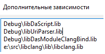

Ещё один "подход" к языку daScript от Gaijin. В последней заметке про использование  в daScript, я упоминал про наличие скрипта [dasClangBind](https://github.com/GaijinEntertainment/daScript/issues/231), позволяюшего генерировать байндинги к библиотекам на C и C++. Так как из документации к скрипту только совет автора `Use it, abuse it`, то неплохо попробовать его в деле, чтобы разобраться, что он умеет/не умеет.

С помощью этого генератора байндингов сделаны обёртки над: [dasRequests](https://github.com/VasiliyRyabtsev/dasRequests), [dasPhys2d](https://github.com/VasiliyRyabtsev/dasPhys2d), а также добавленные в основной репозиторий **`dasGLFW, dasBGFX, dasImgui, dasOpenGL, dasClangBind`** (привязки для генератора байндингов тоже сгенерированы им самим).

`dasClangBind` не собирается с дефолтными настройками cmake, поэтому сначала необходимо включить его сборку. В файле [CMakeLists.txt](https://github.com/GaijinEntertainment/daScript/blob/master/modules/dasClangBind/CMakeLists.txt) видим настройку пути с `libclang`:
```
SET(PATH_TO_LIBCLANG ${PROJECT_SOURCE_DIR}/../libclang)
```

Можно скачать скомпилированные библиотеки [LLVM](https://github.com/llvm/llvm-project/releases/tag/llvmorg-14.0.0) (yay, даже для windows!), и указать путь к скачанной библиотеке с cmake-файле. Дальше перегенерируем решение с помощью команды `generate_msvc_XXX.bat` и компилируем проект `libDasModuleClangBind`.

Получаем библиотеку `libDasModuleClangBind.lib`, которую можно подключить для статической линковки из проекта, который будет использовать этот модуль (командой `TARGET_LINK_LIBRARIES`). В сгенерированном решении убеждаемся в том, что линкер подключает библиотеки `libDasModuleClangBind.lib` и `libclang.lib`:


Далее в коде подключаем заголовочный файл и макрос добавления модуля в daScript:
```cpp
#include "../modules/dasClangBind/src/dasClangBind.h"
...
int main( int, char * [] ) {
    NEED_ALL_DEFAULT_MODULES;
    NEED_MODULE(Module_dasClangBind); //<---
}
```

Теперь в das-скрипте можно импортировать модуль `cbind`, который предоставляет функции-обёртки над библиотекой `clang`, а главное -- `cbind_boost`, классы, с помощью которых можно настроить поведение генераторы, без низкоуровневого обращения к c-апи clang-а:
```fsharp
require cbind
require cbind_boost
```

## libclang

Для начала лучше бегло ознакомиться с тем, что умеет `libclang`:
[Using libclang to Parse C++](https://shaharmike.com/cpp/libclang/)
[Пример разбора C++ кода с помощью libclang на Python](https://habr.com/ru/post/439270/)
[Choosing the Right Interface for Your Application](https://clang.llvm.org/docs/Tooling.html)

## DasGenBind
У генератор привязок `dasClangBind`, есть 2 режима: генерация обёрток над функциями в виде daScript (с помощью ffi-интерфейса `dasbind`) -- `DasGenBind`, и более мощная генерация "обвязочного" c++-кода библиотеки -- `CppGenBind`. С помощью `DasGenBind` [сгенерированы](https://github.com/GaijinEntertainment/daScript/blob/master/modules/dasClangBind/bind/bind_opengl.das) байндинги к [OpenGL](https://github.com/GaijinEntertainment/daScript/blob/master/modules/dasOpenGL/opengl/opengl_func.das), так как сама библиотека language-agnostic, и её обвязки тривиальны -- используются только функции и примитивные типы.

## CppGenBind

Более интересно посмотреть на байндинги к [glfw](https://github.com/GaijinEntertainment/daScript/blob/master/modules/dasClangBind/bind/bind_glfw.das), по которым можно приблизительно понять, что генерируется автоматически, а что необходимо добавлять в исключения и дописывать руками. `dasClangBind` в ходе своей работы пишет, какие объявляния функций он пропускает ([код](https://github.com/GaijinEntertainment/daScript/blob/master/modules/dasClangBind/cbind/cbind_boost.das) - поиск по ключевому слову `skip`):
- шаблоны
- функции с аргументами-указателями на функции (к примеру, колбеки)
- чисто виртуальные функции
- глобальные операторы
Также генерируются, но вызывают последующие ошибки компиляции, функции (в лучших традициях текстов ошибок шаблонов C++), получающие аргументы POD-типов по значению.

Для таких функций предполагается добавление их в список пропускаемых при автоматической генерации и последующее написания обработчика вручную:
```fsharp
//переопределение метода AnyGenBind
 def override skip_anyFunction ( var c : CXCursor; isMethod : bool )
        if AnyGenBind`skip_anyFunction(self, c, isMethod)
            return true
        //свои проверки, нужно или нет генерировать обёртку для функции
```

Для дописывания несгенерированных автоматически функций предусмотрен файл `MODULENAME.main.cpp`. На выходе генератор байндингов выдаёт [пачку](https://github.com/borisbat/dasGlfw/tree/48f2715f0fe4cb8076866365a4bf0a29b7104765/src) и кусок cmake-файла в stdout, с помощью которого можно собрать их в модуль. На практике почему-то у меня не создавались файлы `MODULE.func.reg.inc` и `MODULE.func.decl.,inc`, их для теста заполнил руками.

## CmakeList.txt

В качестве шаблона cmake-файла можно взять готовый из других модулей, основная логика:
- собрать модуль из сгенерированных файлов (это за нас выводит сам `dasClangBind`)
- подключить lib-файл самой C++ библиотеки, для которой делается обвязка
- определить переменные сборки daScript, позволяющие отключить модуль по желанию пользователя

## Генерация байндингов для библиотеке MessagePack

Исходя из ограничений генератора, для учебного примера проще всего выбрать для примера максимально простую библиотеку, имеющую C, а не С++-интерфейс. Например - [MessagePack](https://github.com/msgpack/msgpack-c/tree/c_master).

Стартовый код генератора:

```fsharp
require cbind/cbind_boost
require daslib/safe_addr
require daslib/strings
require daslib/defer
require daslib/fio


class MsgpackGen : CppGenBind
    override func_to_stdout = false
    unique_functions : table<string; bool>

    def MsgpackGen
        bind_root = "{get_das_root()}/modules/dasMsgpack/src"
        bind_module = "msgpack"
        bind_das_module = "msgpack"
        let pfn = "msgpack.h"
        let pfp = "{get_das_root()}/modules/dasMsgpack/msgpack-c/include/"

        let args <- [{string
            "-xc++-header";
            "-std=c++1z";
            "-I{get_full_file_name(pfp)}"
        }]

        func_per_chunk = 20
        init_args(pfn,pfp,args)
        setDefaultFiles()
        //init_skip_func()
        openAllFiles()


    def override namespace_name(name:string; dash:string="::") : string
        return AnyGenBind`namespace_name(self, name, dash)

    def override skip_struct(name : string)
        return false
        //return AnyGenBind`skip_struct(name)

    def override skip_anyFunction(var c : CXCursor; isMethod:bool) : bool
        let funcname = string(clang_getCursorSpelling(c))
        //не генерировать обвязку для повторно встречаемой функции (не совсем понимаю, почему встречаются повторы)
        if unique_functions |> find(funcname) != null
            return true
        else
            unique_functions[funcname] = true
            return AnyGenBind`skip_anyFunction(self, c, isMethod)


    //генерируем код для файлов, подходящих по шаблону msgpack/*.h
    def override skip_file(fname:string) : bool
        if fname |> find("msgpack/") != -1
            return false
        return ! fname |> ends_with(PARSE_FILE_NAME)


    def override generateModuleHPrefix
        module_h_file |> fwrite("#include \"need_msgpack.h\"\n")


[export]
def main
    var cgb = new MsgpackGen()
    defer <|
        unsafe
            delete cgb
    cgb->generate()
    cgb->genCMakeDecl("DAS_MSGPACK_BIND")
```

Такой скрипт генерирует привязки к библиотеке, однако при её компиляции возникают несколько ошибок вида:
```
использование неопределенного типа "das::cast<TT>" libDasModuleMsgpack \daScript\include\daScript\simulate\simulate.h
```

Необходимо добавить эти функции в список исключаемых из генерации:
```
//передача в качестве аргумента POD-объекта по значению
msgpack_object_print
msgpack_object_print_buffer
msgpack_object_equal

//какие-то непонятки с передачей некоторых из базовых типов из C++ в daScript?
msgpack_pack_char
msgpack_pack_long
msgpack_pack_unsigned_long
```

Убрав их из генерации, получаем компилирующийся модуль daScript `dasMsgpack`.

## Тестовый скрипт

Попытаемся портировать тестовый [пример](https://github.com/msgpack/msgpack-c/blob/c_master/example/simple_c.c) библиотеки с `MessagePack` с языка C на daScript:

```fsharp
require msgpack

[export]
def main
    var sbuf : msgpack_sbuffer
    var pk : msgpack_packer
    var mempool: msgpack_zone
    var deserialized: msgpack_object

    unsafe
        var ptrBuf = addr(sbuf)
        var ptrPk = addr(pk)
        var ptrMempool = addr(mempool)
        var ptrDeserialized = addr(deserialized)

        /* msgpack::sbuffer is a simple buffer implementation. */
        msgpack_sbuffer_init(ptrBuf)
        /* serialize values into the buffer using msgpack_sbuffer_write callback function. */
        msgpack_packer_init(ptrPk, ptrBuf)

        msgpack_pack_array(ptrPk, 4ul)
        msgpack_pack_int(ptrPk, 1)
        msgpack_pack_true(ptrPk)
        msgpack_pack_float(ptrPk, 3.0)
        msgpack_pack_str(ptrPk, 7ul)
        msgpack_pack_str_body(ptrPk, "example", 7ul);

        //print("{sbuf.data}, {sbuf.size}")

        msgpack_zone_init(ptrMempool, 2048ul)

        var data = 0ul;
        var ptrData = addr(data)
        msgpack_unpack(sbuf.data, sbuf.size, ptrData, ptrMempool, ptrDeserialized);
        msgpack_object_print(ptrDeserialized);

        msgpack_zone_destroy(ptrMempool);
        msgpack_sbuffer_destroy(ptrBuf)
```

Некоторые функции из примеры не попали в автоматическую обвязку, поэтому необходимо дописать обвязку для них вручную в файле `msgpack.main.cpp`:
```cpp
//передаём 3-й параметр по умолчанию
void das_msgpack_packer_init(msgpack_packer* pk, void* data) {
	msgpack_packer_init(pk, data, msgpack_sbuffer_write);
}

//передаём параметр по указателю, не по значению
void das_msgpack_object_print(msgpack_object* o) {
	msgpack_object_print(stdout, *o);
}

//меняем тип второго указателя на const char* вместо неизвестного генератору void *
void das_msgpack_pack_str_body(msgpack_packer* pk, const char* b, size_t l) {
	msgpack_pack_str_body(pk, b, l);
}

void Module_msgpack::initMain() {
    //добавляем функции в модуль
	addExtern<DAS_BIND_FUN(das_msgpack_packer_init)>(*this,lib,"msgpack_packer_init",
            SideEffects::worstDefault,"das_msgpack_packer_init");
	addExtern<DAS_BIND_FUN(das_msgpack_object_print)>(*this, lib, "msgpack_object_print",
		SideEffects::worstDefault, "das_msgpack_object_print");
	addExtern<DAS_BIND_FUN(das_msgpack_pack_str_body)>(*this, lib, "msgpack_pack_str_body",
		SideEffects::worstDefault, "das_msgpack_pack_str_body");
}
```

Теперь скрипт работает и выдаёт корректный результат десериализации объекта:
```
[1, true, 3.000000, "example"]
```

Дальнейшая работа над модулем может предполагать:
- возможность устанавливать daScript колбеки ([пример из dasGlfw](https://github.com/borisbat/dasGlfw/blob/48f2715f0fe4cb8076866365a4bf0a29b7104765/src/cb_dasGLFW.h))
- daScript-обвязка над POD-структурой msgpack_object и корректная передача исключенных типов(?)
- написание "daScript-ивизирующей" обёртки msgpack_boost, для перехода от с-апи к более удобной работы с библиотекой

[Репозиторий с примерами кода](https://github.com/spiiin/dasClangBind_modules)

