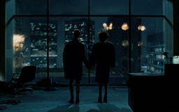

##Давным-давно, в далёкой-далёкой галактике...

Давным-давно, в 2007 году, рынок разработки пк-игр в россии и снг внезапно накрылся (крякнул, сыграл в ящик, мы его потеряли). Состояние индустрии на тот момент описал в статье на dtf и в своём блоге в жж Петр "Amicus" Прохоренко. На сайте статьи уже нет, но [интернет всё помнит](https://web.archive.org/web/20071219121354/http://www.dtf.ru/blog/read.php?id=49254) ([всё-всё](https://web.archive.org/web/20071220173806/http://amicus-hg.livejournal.com/85101.html)).

Основные причины, по мнению автора:
- Неготовность индустрии к изменениям. Нет культуры разработки.
Компании клепали игры, и не задумывались о том, что происходит вокруг.

>Опыт разработки игр не особенно передавался не то, что по индустрии, но и внутри компаний. Условия существования стали "вдруг" намного более жёсткими, а разработчики оказались к этому не готовы. При этом – повсеместно фантастическая безответственность в плане принятия решений и полное отсутствие гибкости и желания взглянуть в будущее.  Если судить цинично, то большинство «компаний одной игры», где нет своей развитой технологической базы и идущих внахлест друг за другом двух-трех проектов, были обречены изначально – любое изменение рынка убило бы их в первую очередь. Вопрос, почему значительная часть российских компаний, существующих не первый год, так и осталась сидеть на одном проекте, возвращает нас к началу этого абзаца.

- Издатели не научились продюссировать и не умеют в маркетинг
В 2008 появился iPhone с магазином Appstore и появился инструментарий Steamworks в Steam, а пиратские игры на дисках продавались по цене диска.

>Так у нас еще и не сформировались нормальные институты продюсирования, маркетинга и продвижения проектов. С продюсированием вообще швах полный – никакой системности, у каждого свои методы работы, и что самое главное такой уровень перегруженности самих продюсеров, что их присутствие «в проекте» в принципе сведено к минимуму. Маркетинг традиционно тыкает пальцем в небо и строит воздушные замки, хотя в этом направлении у некоторых издателей есть определенные позитивные подвижки.

Итоги:
>Кризис – это что-то преходящее, после него должна наступить ремиссия и пережившим его участникам рынка станет лучше, а некоторым так и вообще сильно хорошо. У нас не кризис, у нас просто заканчивается целая эпоха, и развитие отечественной индустрии направляется в другую сторону.

В комментариях -- тонны ангста и отрицания, нет никакой "вомглы".

Также виноваты по разным версиям:
[Вомгла](http://neolurk.org/wiki/%D0%92%D0%BE%D0%BC%D0%B3%D0%BB%D0%B0)
- Геймдизайнеры

> В России много хороших программистов. Нередки даже талантливые. Есть художники, композиторы. А вот число Геймдизайнеров и креативных лидеров — константа, равная 3.5 Анонимусам.

- Менталитет

>Но тут вмешивается менталитет. Русскому разработчику необходимо, чтобы над ним кто-то постоянно нависал грозной тенью и тыкал носом в четко поставленную задачу, требуя отдачи. Совместные мозговые штурмы, энтузиазм, проявление инициативы, рассмотрение нескольких вариантов, трезвая оценка собственных сил — все это чуждо большинству из них.

[ЖЖ](https://boris-batkin.livejournal.com/11324.html) (хех, только заметил, что это автор `daScript`)
- Тотальный непрофессионализм

>с точки зрения регистрации на ДТФ есть 367 работающих компаний разработчиков игр. есть мнение, что после того, как уляжется пыль, 367 профессионально-пригодных разработчиков можно и не найти.

##Попытки рефлексии

Какие-то компании различными способами пережили мглу, потому что смогли делать научиться делать казуалки, портировать их на мобильные платформы, или же умели делать игры для консолей. Появлялись новые компании, приходили новые люди. Где-то в этот период попал в индустрию и я (угу, к "Гайдзинам", которые умели в консоли, и начали учиться в iPhone). Кто-то пытается отрефлексировать то, что происходило тогда, до сих пор.

[Заметки из 2018](https://web.archive.org/web/20180501041548/https://arcticengine.com/posts/vomgla_article/), с несколькими интересными картинками.
[Статья](https://vk.com/@theworldissaved-russkie-igry-vo-mgle), собранная из пачки [твиттов](https://twitter.com/YarKravtsov/status/1357395078583566337)Ярослава Кравцова, рожденная срачем между какими-то [обзорщиками](https://youtu.be/50d6rqNjptM) с ютуба и [подкастерами](https://youtu.be/zfAKuReIjF0)
Еще забавный [доклад](https://youtu.be/Rvc5uiURLH0) явно неотрефлексировшего ситуацию чувака.

>до 2007 типа российские компании делали по его мнению крутые и душевные игры, на которых мы все выросли, но "почему-то" в один момент развалилось всё (из крупных компаний, образованных до 2007 года, которые немобилками занимались, ща остались только гайдзины и wargaming - первые потому что под нексген консоли игры делали для sony и microsoft, вторые танки в 2009 выпустили), отчасти потому что в таком режиме делали фигню разную не задумываясь, и издатели в один момент забили на финансирование местных полностью и стали выпускать и локализовать иностранные игры, отчасти потому, что пропустили 2 новых аудитории - соц игры фейсбука и мобильные игры. Теперь говорит "а давайте как раньше делать, как будто ничего не изменилось, а мобилки эти ваши новомодные скоро умрут", и реклама своей компании напоследок. В западной индустрии и инди-сцене году так в 2010 уже приняли, что есть кор игры и социальные (там против зинги вначале тоже выступали кор-разработчики), а в российской ещё местами есть люди, которые считают, что кроме кор-игр других нет, и должно быть стыдно тем, кто делает не игры "для души" (если точнее, то игры основных тем для аудитории мужчины 15-30, первые "большие продающиеся идеи" - sports, dragons, robots, guns, jumping & climbing, and car) https://www.raphkoster.com/2010/03/18/what-core-gamers-should-know-about-social-games/

Зачем я собрал все эти срачи, обсуждения, тревоги и мнения в одну кучу? Хотел найти список компаний, перечисленных Ярославом, как спонсоров Девгамма по годам их открытия, чтобы посмотреть, какие выживут через несколько месяцев/лет.

## No future

В 2022 году рынок разработки мобильных игр в россии внезапно накрылся (крякнул, сыграл в ящик, мы его потеряли). И вновь:

>У нас не кризис, у нас просто заканчивается целая эпоха, и развитие отечественной индустрии направляется в другую сторону.



```
ZeptoLab - 2009
Pixonic - 2009
MyTona - 2012
Game Insight - 2009 - 2022 https://app2top.ru/industry/game-insight-ushla-na-samolikvidatsiyu-raboty-lishilis-do-600-spetsialistov-199488.html
Playgendary - 2016 - https://www.forbes.ru/tekhnologii/469235-deneg-net-delajte-cto-hotite-kak-gejmstudii-uhodat-iz-rossii-i-sokrasaut-personal
KamaGames - 2010
CrazyPanda - 2010
Easybrain - 2016
Owl Studio - 2015
Social Quantum - 2010
Playkot - 2009
Belka Games - 2010
Vizor Games - 2007
Rocket Jump (RJ Games) - 2012

Playrix - 2004 - казуальные игры
G5 - 2001 - мобильные и казуальные игры
Nekki - 2002 - браузерки
Gaijin Entertainment - 2002 - релизы на консолях
Wargaming - 1998 - выход World of Tanks в 2009
```