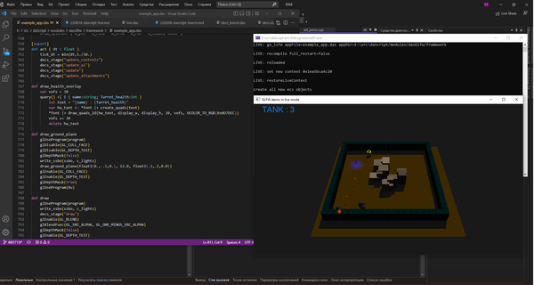

Попробую описать live-режим работы с приложением в `daScript` (aka **`Hot Reloading`**). Это режим работы программы, в котором можно обновлять данные и код без её перезапуска.

Интерпретируемые языки часто позволяют, с небольшими усилиями, настроить приложение так, чтобы можно было отследить изменения в каком-либо файле, и выполнить изменённую версию. При соблюдении определенных правил работы с данными также возможно обновить и уже созданные структуры данных -- это требует немного больше усилий. С некоторыми заморочками и ограничениями подобное можно проделать и в компилируемых языках, к примеру, обновляя динамическую библиотеку и перезагружая её из основного приложения.

Обзоры подходов к организации hot reload на C++:
[cr.h: A Simple C Hot Reload Header-only Library](https://fungos.github.io/cr-simple-c-hot-reload/)
[DLL Hot Reloading in Theory and Practice](https://ourmachinery.com/post/dll-hot-reloading-in-theory-and-practice/)

Интерпретируемые языки требуют намного меньше "магии" для реализации и позволяют избавиться от этих ограничений, присутствующих при реализации через перезагружаемую библиотеку.

Пример того, что можно реализовать с помощью горячей перезагрузки:



Сочетание горячей перезагрузки кода, с data-oriented design и легкой сериализацией данных (для запоминания и восстанавления пачки состояний), с возможностью "докинуть" imgui-дебажное окно в приложение, позволяет получить близкий функционал к тому, что показано на видео, в реальной игре. Но даже возможность сократить промежуток между внесением изменений в код и проверкой его в игре, всё ещё кажется чудесной возможностью для большинства команд в геймдеве.

[Live Stream Coding on daScript - Breakoid](https://youtu.be/inGb9R1NowY) - стрим с примером реализации арканоида, можно посмотреть на синтаксис системы ECS, реализованной с помощью макросов

В репозитории модуля `dasGlfw` есть [пример](https://github.com/borisbat/dasGlfw/blob/master/framework/main.das), позволяющий работать с приложением в live-режиме.

# Сборка

Выкачиваем [сабмодуль](https://github.com/GaijinEntertainment/daScript/tree/master/modules) `dasGlfw`. В папке с выкачанным daScript выполняем команду:
```
git submodule update --init --recursive
```
Перегенерируем солюшн, чтобы добавить в него проект `daGlfw`:
```
./generate_msvc_2019.bat
```
(ну или аналогичная команда для вашей любомый иде и платформы)

В тестовый пример приложения добавляем инклюды и модули daScript. Для модификации используем [первый пример](https://github.com/GaijinEntertainment/daScript/blob/master/examples/tutorial/tutorial01.cpp) на daScript:
```c++
#include "daScript/daScript.h"
#include "../modules/dasGlfw/src/dasGLFW.h"

//dasGLFW тянет за собой зависимости от этих модулей:
#include "../modules/dasStbImage/src/dasStbImage.h"
#include "../modules/dasStbTrueType/src/dasStbTrueType.h"

...
//так как либы STB описаны в заголовочных файлах, в одну из единиц компиляции необходимо поместить код реализации этих библиотек
#define STB_IMAGE_IMPLEMENTATION
#define STB_IMAGE_WRITE_IMPLEMENTATION
#include "../modules/dasStbImage/src/stb_image.h"
#include "../modules/dasStbImage/src/stb_image_write.h"
...

#define TUTORIAL_NAME   "/modules/dasGlfw/framework/main.das" //основа live-приложения
...

int main( int, char * [] ) {
    NEED_ALL_DEFAULT_MODULES;
    NEED_MODULE(Module_dasGLFW);
    NEED_MODULE(Module_StbImage);
    NEED_MODULE(Module_StbTrueType);
    //NEED_MODULE(Module_TestProfile); //отключаем, если не нужны
    //NEED_MODULE(Module_UnitTest);
    Module::Initialize();
    tutorial(); //выполняем daScript
    Module::Shutdown();
    return 0;
}
```

Также в команду линковки добавляем подключение собранных статических библиотек (в Visual Studio в свойствах проекта на вкладке свойств линкера):
```
Debug\libDaScript.lib
Debug\libDasModuleStbImage.lib
Debug\libDasModuleStbTrueType.lib
Debug\libDasModuleGlfw.lib
..\..\modules\dasGlfw\libglfw\build\src\Debug\glfw3.lib
```
(конечно, правильнее добавить зависимости в cmake-файл, чтобы не потерять настройки после перегенерации решения)

Получаем приложение, которое отслеживает изменения в файле [example_app.das](https://github.com/borisbat/dasGlfw/blob/master/framework/example_app.das) на лету:



*с [мааленьким](https://github.com/borisbat/dasGlfw/issues/2) фиксом ассерта*

# Архитектура приложения

За счёт чего это работает? Нужно рассмотреть несколько концепций, чтобы разобраться.

##Контекст

Контекст выполнения скрипта ([Context](https://github.com/GaijinEntertainment/daScript/blob/master/include/daScript/simulate/simulate.h#L246)) -- окружение, в котором выполняется скрипт, стек и выделенные в куче переменные, а также некоторая дополнительная информация, описывающая то, как именно интерпретируется код. Контекст можно также воспринимать как экземпляр выполняющейся программы, или как результат её исполнения. В [документации](https://dascript.org/doc/reference/embedding/vm.html#execution-context) также указано, что контекст спроектирован для того, чтобы быть максимально легковесным, для того, чтобы сброс контекста можно было использовать как очень быстрый способ освободить всю память, которую использовал скрипт.

Хост-приложение может использовать один контекст для того, чтобы выполнять в нём различные скрипты, или же создать несколько контекстов, настроенных для различных целей. Например, можно разделить скрипты на те, которые имеют глобальное сохраняемое состояние (которые могут испольовать сборщик мусора), и скрипты без состояния, которые можно быстро освобождать после использования (например, каждый кадр), и использовать различные контексты для них.

daScript не предполагает работы с одним контекстом из различных потоков (модель многопоточности без разделяемой памяти) -- в многопоточном приложении каждый поток может создать свой контекст выполнения, и использовать [каналы](https://github.com/GaijinEntertainment/daScript/blob/master/include/daScript/simulate/aot_builtin_jobque.h#L21) или другие самописные примитивы C++ для передачи данных/общения между потоками.

Для того, что можно было определить, безопасно ли освобождать контекст, можно заставить интерпретатор daScript проверять, что скрипт не использует глобальных переменных, которые обращающихся к хип-памяти. Один из способом сделать это -- использовать настройки `Code of Policies`

##Code of Policies
[Code of Policies](https://dascript.org/doc/stdlib/rtti.html?highlight=code%20policies#CodeOfPolicies) -- настройки виртуальной машины daScript, позволяющие установить определенные правила интерпретации кода. Можно посмотреть на настройки для модуля [live](https://github.com/GaijinEntertainment/daScript/blob/master/daslib/live.das), в котором определён базовый каркас для построения live-приложения.
```
options no_unused_block_arguments = false    //подсказка не считать неиспользуемые аргументы ошибками компиляции
options no_unused_function_arguments = false 
options indenting = 4                        //настройки отступов
//!
options multiple_contexts                    //подсказка, что приложение будет иметь несколько контекстов выполнения (по коду вроде бы -- более часто вызываются колбеки `reportAstChanged`)
```

##Debug agents
Отладочные агенты -- это объекты, которые задуманы для отладки и профилирования выполнения контекстов, но также используются для того, чтобы клонировать контексты, с возможностью настраиваить поведение склонированного контекста.
Примеры использования можно найти в репозитории -- [fork_debug_agent_context](https://github.com/GaijinEntertainment/daScript/search?q=fork_debug_agent_context).

```c++
    void forkDebugAgentContext ( Func exFn, Context * context, LineInfoArg * lineinfo ) {
        g_isInDebugAgentCreation = true;
        shared_ptr<Context> forkContext;
        bool realPersistent = context->persistent;
        context->persistent = true;  //временно делаем контекст неудаляемым
        forkContext.reset(get_clone_context(context, uint32_t(ContextCategory::debug_context))); //клонируем контекст
        context->persistent = realPersistent;
        g_isInDebugAgentCreation = false;
        vec4f args[1];
        args[0] = cast<Context *>::from(context);
        SimFunction * fun = exFn.PTR;
        forkContext->callOrFastcall(fun, args, lineinfo); //выполняем функцию установки в склонированном контексте
    }
```

Примеры для изучения и понимания работы c клонированными контекстами:
```
agent_fork_sample.das
apply_in_context_example.das
insturment_function.das
шnstrument.das
logger_and_logger_agent.das
context_state_example.das
```

##Получение информации из другого контекста
Нет каких-либо особенных сложностей в том, чтобы получить в одном контексте информацию из другого, как из С++, так и из daScript -- можно как выполнить функцию в другом контексте (как в примерах выше), так и проверить её существование. Именно это и реализовано в модуле [live](https://github.com/GaijinEntertainment/daScript/blob/master/daslib/live.das):

```fsharp
var private appPtr : smart_ptr<Context> //указатель на пересоздаваемый живой контекст

def private live_lookup(fn)
    if appPtr==null
        return false
    if !liveFunctionLookup |> key_exists(fn)                 
        liveFunctionLookup[fn] = *appPtr |> has_function(fn) //если в обновляемом контексте существует функция, запоминаем указатель на неё
    return liveFunctionLookup[fn]                            

def public invoke_live ( fn:string )
    if live_lookup(fn)  //если нашли указатель на функцию в live-контексте
        try
            unsafe
                invoke_in_context(appPtr, fn) //вызываем функцию в live-контексте
        recover
            to_log(LOG_ERROR, "exception during '{fn}'\n{appPtr.last_exception}\n{describe(appPtr.exceptionAt)}\n")
            appPtr := null
```

Также можно посмотреть на небольшую оптимизацию создания ресурсов в модуле [opengl_cache](https://github.com/GaijinEntertainment/daScript/blob/ecada8d34485fe32ae6e3c87b12033a00f7fe118/modules/dasOpenGL/opengl/opengl_cache.das) -- ресурсы сохраняют в кеше, специальном контексте "opengl_cache", за счёт чего отпадает необходимость загружать их каждый раз, когда пересоздаётся live-контекст.

##Восстановление данных
Организация перезагрузки функций должна стать примерно понятной, теперь надо разобраться, как пересоздаются данные, созданные в live контексте?

Приложение использует модуль [decs](https://github.com/GaijinEntertainment/daScript/blob/73b51defa5a0c66446d041743d60101fbd3e74e4/daslib/decs.das), Entity-Component-System фреймворк.

Мои заметки-введение в ECS:



Одна из фишек ECS -- всё состояние игры описывается совокупностью из сущностей (Entity) и компонентов (Components) на них. Достаточно сохранить все сущности и компоненты, при их загрузке состояние будет полностью восстановлено.

Типы компонентов в decs задаются с помощью обычных структур, с применённым к ним атрибутом `[decs_template]`, который является макросом, регистрирующим функции `apply_decs_template` и `remove_decs_template`. Эти функции позволяют добавлять/удалять компнонент на сущностях.

```fsharp
//компонент "пушка"
[decs_template]
struct Turret
    base        : EntityId
    last_target : float3
    dir         : float
    dir_vel     : float
    rot_speed   : float
    reload      : float
    reload_time : float
    health      : int

def make_tank ( pos:float3 )
    //создаём другие компоненты и сущности танка
    ..
    // создаём сущность "башня танка" и добавляем на неё компонент "пушка"
    create_entity <| @ ( eid, cmp )
        cmp |> set ( "eid", eid )
        cmp |> set ( "pos", float3(0.) )
        cmp |> set ( "color", float3(.5,.5,0.1))
        cmp |> set ( "name", "TANK" )
        apply_decs_template(cmp, [[Turret
            base=tank_id,
            reload_time=TANK_TURRET_RELOAD_TIME,
            health=TANK_HEALTH]])
```

Компоненты в системе `decs` прозрачно для пользователя добавляются в "мир" ("пул", "состояние") -- базу данных, описывающих состояние игровой сцены.
```fsharp
var public decsState : DecsState    //! Full state of the ESC system.
```

Переключающий контекст получает эту переменную из предыдущего контекста и сериализует в память, а затем вызывает функцию десериализации в новом контексте:
```fsharp
var private appPtr : smart_ptr<Context> //указатель на пересоздаваемый живой контекст

 //сохранение ecs-состояния
 var pvar = get_context_global_variable(appPtr, "decsState")
 var pstate : array<uint8> ? = get_context_global_variable(appPtr, "decsLiveData")
 var css <- @ <|                   //синтаксис лямбда-функции
      saveLiveContext()
 invoke_in_context(appPtr, css)

 //смена контекста
 appPtr := ptr

 //восстановление ecs-состояния в новом контексте
var pvar = get_context_global_variable(appPtr, "decsState")
var css <- @ <| [[&decsState,&decsLiveData]] ( data : array<uint8># )
    decsLiveData := data
    restoreLiveContext()
invoke_in_context(appPtr, css, decsLiveData)
```

Функции `saveLiveContext` и `restoreLiveContext` выглядят тривиально, вызывают generic-функции сериализации из модуля [archive](https://github.com/GaijinEntertainment/daScript/blob/e7992b384dad13c1a201f9eee1c6a6ae1e0cf8b8/daslib/archive.das):
```fsharp
def saveLiveContext
    to_log(LOG_TRACE, "LIVE: saveLiveContext\n");
    decsLiveData <- mem_archive_save(decsState)

def restoreLiveContext
    to_log(LOG_TRACE, "LIVE: restoreLiveContext\n");
        decsLiveData |> mem_archive_load(decsState)
```

При этом -- если изменения не затрагивали названия полей в ECS-компонентах, то приложение может продолжить работать без переинициализации (можно, например, увеличить скорость снарядов танка прямо во время игры -- уже выпущенные снаряды продолжат двигаться с той же скоростью, а новые станут быстрее).

Если же изменить название поля ECS-компонента (к примеру, автозаменой названия поля `reload_time` на `reload_time_11111`), десериализовать текущее состояние игры не выйдет , но приложение всё равно не нужно перезапускать, и оно не крешит, для продолжения работы можно просто нажать кнопку переинициализации уровня:
```fsharp
def public live_keypressed ( keycode, scancode, action, mods : int )
    invoke_live("keypressed", keycode, scancode, action, mods )
    if is_live()
        if scancode==19 && action==1 && mods==2 //нажать комбинацию клавиш "control + break"
            recompile(true)
```

При желании можно реализовать и десериализацию с возможностью переименования полей компонентов -- для этого необходимо в ходе перезапуска контекста сохранить список названий всех полей компонентов в старом и новом контексте (его можно получить с помощью `rtti`) и передавать между контекстами таблицу переименований.

##Цикл переключения контекстов

Последний шаг, для связывания живого приложения с обновляемым контекстом -- цикл переключения контекстов, который также тривиален ([glfw_live](https://github.com/borisbat/dasGlfw/blob/master/dasglfw/glfw_live.das#L41)):

```fsharp
def public glfw_live(title,appf,appd:string)
    .. //различная инициализация и настройка glfw
    go_live(appf, appd)
    while glfwWindowShouldClose(glfw_live_window)==0
        glfwPollEvents()
        live_update(glfwGetTime())                                      //обновление live-контекста
        invoke_live("display", display_w, display_h)                    //вызов функции рисования экрана в live-контексте
        glfwMakeContextCurrent(glfw_live_window)
        glfwSwapBuffers(glfw_live_window)                               //отрисовка экрана
        if watch_files()                                                //если файл с исходником live-контекста изменился
            recompile()                                                 //пересоздать live-контекст
```

#Идеи
- Live Creative & Prototype Coding -- всё из видео в начале заметки
- Автозапись ECS-состояний для воспроизведения того, что делали с игрой тестировщики, с проигрыванием на любой скорости и обратной перемоткой
- Hot-reload кода и данных на удалённом клиенте (мобильном телефоне, консоли)
- Совместная работа над сценой на удалённом клиенте (или реализация AI Battles в песочнице)
- Сериализация не только сущностей и компонентов, но и систем -- песочница механик
