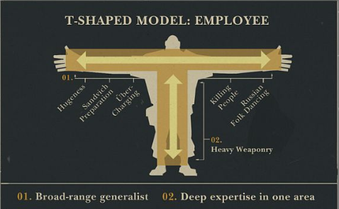
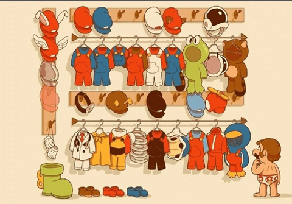
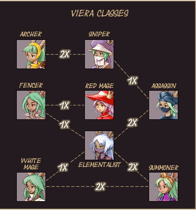
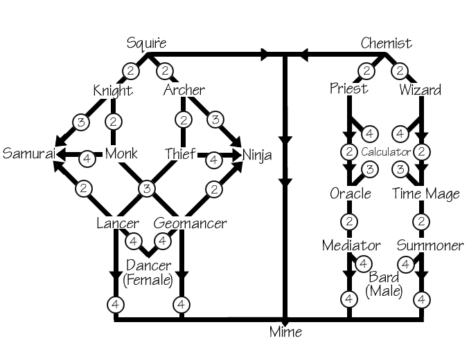
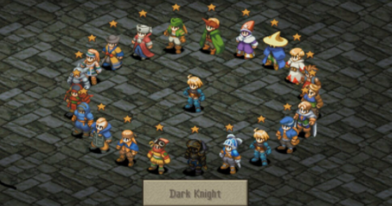

Модели развития сотрудника в геймдеве.

## Т-модель от Valve

Из [руководства новых сотрудников Valve](http://media.steampowered.com/apps/valve/hbook-RU.pdf)
Программист растёт не линейно, а в нескольких областях, и чтобы отразить это, в `Valve` придумали T-модель развития сотрудников:

На картинке Heavy - класс из Team Fortress 2. Он широко расставил руки, что показывает его атрибуты -- Хэви понемногу разбирается в:
- Приготовлении бутербродов,
- Убийстве людей
- Русских народных танцах
- Уберзарядах.
Он прокачивает широкий спектр навыков, чтобы уметь всего понемногу, но основная его компетенция - это Тяжёлое оружие (высокий скилл -> рост персонажа)

## Модель костюмов Марио от Betheda

[Отсюда](https://www.slideshare.net/JoelBurgess/3-10gdc2014-iterativeleveldesignprocess)
`Betheda` практически не расширяет команды в ходе разработки проекта, поэтому  незанятые на текущем этапе отделы могут заняться чем-либо другим (переодеваются в другой костюм-профессию). В примере из доклада, на ранних стадиях левел-дизайнеры могут помогать в написании сюжета, геймдизайне механик (Layout, Gameplay, Markup, Scripting, Performance, Writing, Systems, Prototyping, Tools, more...), попутно прокачиваясь в том, что может быть полезно команде. Цель -- создание небольших команд, состоящих из широкопрофильных специалистов.

## Модель профессий из Final Fantasy Tactics

Если выбирать аналогии из игр, на мой взгляд профессии в геймдеве напоминают систему профессий из `Final Fintasy Tactics`.

Изначально специалисту доступны "примитивные" профессии, совершенствуясь в которых он осваивает некоторые навыки. После полноценного освоения нескольких навыков специалист может как оставаться в рамках этой же профессии и продолжать качаться в ней. Более продвинутые профессии имеют требования к наличию навыков в более низких.

(ветка профессий для одной из рас в FFTA)

Профессии 2го уровня требует всего нескольких очков навыков в простых профессиях (к примеру, чтобы стать `Sniper` достаточно набрать 2х очков в профессии `Archer`), но продвинутые профессии могут иметь намного более сложные требования (чтобы стать `Assasin`, нужно получить как минимум по 2 очка способностей из профессий `Archer`, `Elementalist` и 1 очку в `White Mage`, `Fencer` и `Sniper`).

(все профессии fft)

Возможна линейная прокачка профессий, без отхода от основной ветки (`Squire`->`Knight`->`Monk` в ветке воина). Например, рост программиста в направлении:
`Джуниор программист`->`Мидл`->`Сениор`->`Суперсеньор 100500 ранга`.

Другой вариант -- прокачка в целом дереве одной ветки, которая может дать более продвинутую профессию (`Knight+Monk+Lancer`->`Samurai`). 
Пример:
`Engine Programmer + Team Lead + Build pipeline tools programmer` -> `CTO/VP of programming`
Ну или, допустим
`Джуниор + Математика + Понимание API и железок -> Render программист`

Это один за самых частых вариантов -- в геймдеве встречаются очень разные задачи, от создания бекэнда и серверов для мультиплейерных игр до программирования графики, обычные гуи приложения (тулзы), скрипты автоматизации, оптимизации, архитектура движков. Так что несмотря на то, что есть специализации, за длительное время работы скорее всего окажется, что позанимаешься почти всем. Это и плюс - расширяет кругозор, и не возникнет ощущения, что постоянно занимаешься чем-то одним, и минус - нельзя просто выучить что-то одно и бездумно пользоваться этим много лет.

Возможны также "уходы от основной ветки" (был воином, ушёл в маги). Что-нибудь типа:
`Джуниор программист -> Графический программист -> (бам) -> техартист`
`Сениор -> Тим Лид->(бам) -> Проджект менеджер/Продюссер/Руководитель отдела`
`Технический геймдизайнер -> (бам) -> программист блюпринтов -> (бам) -> инди-одиночка, который и кодит, и дизайнит, и рисует`
В таких случаях важно не забыть своевременно подкачать необходимые скиллы из ранних профессий другой ветки (программист, артист, геймдизайнер, менеджер команды)

Ну, или аналоги `Dark Knight`, которые кроме 1-2 сильных веток умеют делать по чуть-чуть практически что угодно (`Гейм-дизайнер/Артист/Программист + CEO`), и ухитряются понемногу заниматься обоими основными профессиями.