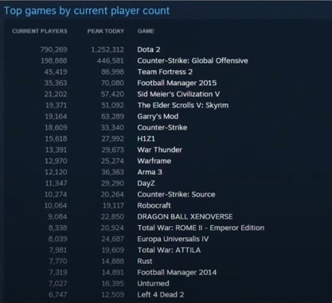

В эссе [Treasure Hunting Systems Found in the History of Video Games
](https://probablydance.com/2019/06/08/treasure-hunting-systems-found-in-the-history-of-video-games/) Malte Skarupke рассуждает о том, что в истории игр было несколько примеров случаев, когда появлялась платформа, в итоге порождающая сразу несколько новых успешных жанров. Он пытается выделить характеристики и свойства, общие для таких платформ, которые он называет "Системы поиска сокровищ". Я не согласен со всеми наблюдениями автора, но попробую немного расширить его эссе. Это не перевод, а дополнение к оригинальной статье.

<!-- more -->

## Неравномерность распределения неизвестных нам величин

Почему вообще на мой взгляд могут возникать такие системы?

Для начала два факта. Первый -- в **`геймдеве очень много ОЧЕНЬ неравномерно распределённых величин`**. Главная из этих величин -- количество фана от игры. Несколько примеров других:

* Большинство игр скучные, но есть очень небольшое количество очень весёлых и увлекательных. Они настолько лучше для нас, что затягивают невероятно сильнее -- мы можем забывать про сон или важные дела, и возвращаемся к таким играм годами. У нас нет численной оценки удовольствия от игры, но вероятно, что эта разница этой нашей субъективной оценки между любимыми играми и просто хорошими была бы колоссально больше, чем между хорошими и плохими. Условно, все игры получили бы от нас от 1 до 9 баллов, а любимая, не 10, а скажем 1000000.

* Как возможноое следствие, разница между доходами от игры от среднего игрока и от фаната -- колоссальная. Это одна из причин существования модели условно-бесплатных игр. Несколько человек-фанатов могут принести дохода больше чем 1000000 человек, которым игра не понравилась.  

Моя заметка про очень известное явление в геймдеве:  -- не называйте их китами!


Отсюда следует одно важное правила гейм-дизайна: не ограничивайте сверху возможности потратить деньги в вашей игре, вы не знаете, как много игроки будут готовы вам заплатить, не надо запрещать им платить много


* Но в то же время разница между хорошей игрой и средней по количеству потраченного труда небольшая. То есть, чтобы сделать игру, которая увлечёт в 1000000 раз сильнее (или в 1000000 раз больше игроков), не нужно в 1000000 раз больше усилий. Не нужно даже в 2 раза больше усилий. Возможно, достаточно всего несколько процентов. Важнее не количество усилий, а что-то другое -- какие-то отдельные фичи или небольшие кусочки работы стоят в 1000000 раз больше других, именно от них может зависеть.

Тайнан Сильвестр в статье [Email dredging: Cutting polish and nonlinear results
](https://tynansylvester.com/2013/12/email-dredging-cutting-polish-and-nonlinear-results/) развёрнуто расписывает эту нелинейность между временем, потраченным на такие "золотые" фичи и тем, что они приносят в результате. Дальше я ещё буду ссылаться на эту статью и методы из неё.

* Суммарная разница в доходах между лучшими играми и хорошими тоже колоссально отличается -- как от мультипликативности перечисленных выше факторов (лучшие игры притягивают в 1000 раз больше игроков И ОДНОВРЕМЕННО лучшие ещё и больше игроков конвертируют в суперфанатов), так и от положительной обратной связи -- лучшие игры получают больше ресурсов для привлечения новых игроков, все хотят поиграть в лучшую игру.

Я использовал разницу в 1000000 раз в примерах, но разница здесь может быть даже намного существеннее, причём настолько сильнее, что **мы постоянно ошибаемся пытаясь её оценить**. Главное -- нельзя недооценивать её. Книга `Черный лебедь` Насима Талеба практически полностью о том, что мы плохо справляемся с прогнозами такого типа величин, из-за чего прогнозы часто бывают ошибочными. В совокупности с тем, насколько значима правильная оценка величины для нас, ошибки могут приводить к катастрофам (в узком смысле -- будет ли наша компания продолжать делать игры или закроется).

Некоторые примеры разница нашего восприятия из книги приведены в статье [Игровое заблуждение
](https://ru.wikipedia.org/wiki/%D0%98%D0%B3%D1%80%D0%BE%D0%B2%D0%BE%D0%B5_%D0%B7%D0%B0%D0%B1%D0%BB%D1%83%D0%B6%D0%B4%D0%B5%D0%BD%D0%B8%D0%B5).

Второй факт -- **`мы всё ещё мало знаем о том, как именно сделать игру увлекательной, но знаем, что в процессе экспериментов можем обнаружить сверх-увлекательные идеи, которые мы затем сможем использовать в игре`**.

Случайная находка такого самородка в процессе экспериментов называется `серендипным открытием`. Самое известное такое открытие -- случайное обнаружение механики `Тетриса`. Менее известные -- небольшое изменение, превратившее прототип `Diablo` и пошаговой игры в ту, которую мы знаем. В статье  я приводил ещё несколько известных примеров таких серьёзных трансформаций жанров игр (раздел `Путь от прототипа к результату`).

Несколько примеров занятий из мира компьютеров и разработки, связанных с исследованием неизвестного, которые требуют исключительной внимательности к каждой обнаруженной "необычной" мелочи:
- Тестирование и отладка програм. На этапе поиска причин возникновения очень редких ошибок. Часто первая зацепка, позволяющая обнаружить всю цепочку действий, приводящую к крешу, это случайное незапланированное наблюдение необычного поведения.
- Реверс инжиниринг. Сама цель процесса -- понять внутреннее устройство программы или данных, которые она интерпретирует, изначально не зная о нём ничего. Необходимо большое количество предположений и проверок, причём необходимо уметь отбрасывать варианты, которые "почти объясняют поведение", но некоторые мелочи портят всё объяснение или меняют его смысл.
- Аналитика. Наблюдение за поведением пользователей -- процесс работы с очень "грязными" данными. Тенденции, видимые на графиках, сложно интерпретировать, и требуется умение не только придумать гипотезу и проверить её, но и достаточно быстро изменить и уточнить интерпретацию в случае расхождений с реальностью.
- Плейтесты. Люди [рационализируют](https://ru.wikipedia.org/wiki/%D0%A0%D0%B0%D1%86%D0%B8%D0%BE%D0%BD%D0%B0%D0%BB%D0%B8%D0%B7%D0%B0%D1%86%D0%B8%D1%8F_(%D0%BF%D1%81%D0%B8%D1%85%D0%BE%D0%BB%D0%BE%D0%B3%D0%B8%D1%8F) своё поведение, поэтому они не могут даже сказать вам, почему им понравилась или не понравилась игра -- они будут неосознанно врать вам. Невозможно составить точный опросник, по которому игрок что-то расскажет вам, нужно отслеживать влияния изменений в игре на реальное, а не декларируемое поведение игроков.

Однако, не смотря на возможности, экспериментирование не очень распространёно в реальных компаниях -- зачем лезть в неизвестное (с неизвестными результатами!), если можно повторять "формулу успеха"? Делать игры дорого, и для инвесторов надёжнее вкладываться в то, что с большей вероятностью будет хорошо продаваться -- проверенные жанры и франшизы.

Про элементы подхода с исследованиями в геймдеве я писал в статье -- . Одна из основных идей -- как можно раньше и дешевле собрать `Minimum Awesome Product`, игру, которая уже будет интересна игрокам, и начинать изучать свою аудиторию, выстроив процесс разработки так, чтобы данные экспериментов позволяли изменять дальнейшие планы разработки насколько это потребуется.

## Залежи артефактов

Объединим эти два факта вместе -- перед нами бесконечное поле неизвестных интересных механик для наших игр, **`"зарытые в землю артефакты"`**. Они очень сильно отличаются по характеристикам. Мы копаем наугад и рано или поздно откапываем часть артефакта -- делаем прототип игры. Выкапывать весь артефакт дорого, поэтому для нас очень важно прикинуть стоимость как полную стоимость раскопок, так и то, за сколько мы сможем его продать. И всё это -- только по торчащей из-под земли верхушке!

Часто хорошим решением является не копание артефакта сразу вглубь (фиксированное решение делать игру по плану несколько лет), а неглубокое копание окрестностей в **разные** стороны -- создание ещё нескольких прототипов, проверяющих **различные** гипотезы. Потому что мы кое-что знаем про наше поле.

Например, артефакт может оказаться больше, чем кажется, и мы можем понять, в какую сторону лучше копать, чтобы быстрее его вытащить -- обнаруженная нами неплохая механика для шутера может хорошо или плохо работать в паре с другими задуманными механиками. Или наоборот, артефакт мельче чем кажется, и развивать идею бесполезно, хотя они и выглядела интересно. Лучше не тратить время, и попробовать что-то другое.

Или же, редко, но бывает, что в окрестностях от того, что мы начали раскапывать, обнаруживается ещё множество артефактов. Мы просто не сможем выкопать и продать их все сами. К примеру мы обнаружили, что нашли механику для шутера, которая отлично работает с множеством различных других механик, и мы просто не можем взять их все в свою игру. Но мы можем поделиться находкой с игроками -- пускай копают вместе с нами! Это и есть в терминологии автора -- **`системы поиска сокровищ`**.


Системы поиска сокровищ хорошо продаются


Скрин из [доклада](https://youtu.be/GxthbWfSak8?t=1275) How Modding Made Bethesda Better, топовые игры в Steam по числу пользователей 2015 года, большинство игр в нём попадают в определение системы поиска сокровищ или даже просто сделаны в этих системах!

## Примеры систем поиска сокровищ

Malte приводит три примера таких систем -- моды к Warcraft 3, чехословацкое сообщество разработчиков игр 80х и Flash-игры, и сосредотачивается на общих характеристиках таких систем. Это интересный пример обобщения -- рассматривать систему `игра + платформа + сообщество`, в которой границы между игрой и платформой сильно размыты (платформа может быть интегрирована в игру, быть "встроенным магазином" или внешним сайтом, а сама "игра" отсутствовать вообще, или быть условной, как например в RPG Maker), а сообщество геймеров иногда перерастает в субкультуру, представители которой не только играют в игру или занимаются её модификацией, но и воспринимает это как часть своего образа жизни (ролевики, проводящие LARP-ы по Fallout, или конвенты косплейеров -- продолжение игры в реальной жизни).

**`Сообщество-центричные системы`**

Примеры сверхактивных сообществ моддеров различных периодов -- пиратская сцена, в период, когда никто особо не заморачивался защитой игр, и копирование с изменениями часто были "фишками" команд, модифицирующих софт и игры.

Насколько я понял после пролистывания книжки про разработчивов Чехословакии, что-то подобное происходило и там. ZX-спектрум и кассеты в 80х, дискеты в 90х и CD в 2000х являлись платформой, новым способом передачи информации, вокруг которой объединялись геймеры, хакеры (переводчики, дизайнеры "оболочек", читеры), коллекцинеры, продавцы, журналисты. Возможности для "креатива" здесь -- открытые ресурсы для модификации и простота копирования, а также то, что в ходе распространения открывались возможность заработать немного денег и "очков престижа" -- релиз группы соревновались и просто ради известности своей группировки внутри сообщества. Пример деятельности такого пиратского сообщества можно почитать и на русском в художественной форме -- "Дневник тестировщика"/"Хроники тестировщика", или посмотреть на английском -- сериал "Сцена".

Чехословацкая сцена выделилась тем, что в диком количестве насоздавала текстовых квестов. Похожий "взрыв" жанра игр произошёл с клонами `MUD`, его эволюция описана в книге Бартла `Designing Virtual Worlds`, средой распространения стал ранний интернет.

Нескольких "невзрывных" примеров хакерских сообществ (в СНГ было много модификаций игр/игры, но недостаточно для "критической массы" интересных модификаций, созданием занималось очень ограниченное количество людей) -- `китайские клоны NES-картриджей`, в которых модифицировалась графика и отдельные элементы сюжета (видимо, было относительно просто хакать, но сложно тиражировать), и бесчисленные `модификации GTA 3/Vice City`, которые продавалась на отдельных компактах (к моменту пика популярности было относительно просто тиражировать CD-RW дома, но создание требовало как минимум навыков в 3D-моделировании, а как максимум -- полноценного инструментария).

Своеобразным примером "взрыва" в прото-жанре игр песочниц может послужить [Infiminer](https://www.youtube.com/watch?v=oKYiWb2W97k), исходники которого "утекли" в сеть. Модификаций было много, но из-за перекоса системы "игра-платформа-сообщество" в сторону хакерского сообщества, без общей игры и платформы оригинал умер, а мы все знаем одну из них на базе этих исходников, `Minecraft`, который уже и сам может служить примером системы поиска сокровищ с помощью внутриигровых модов.

**`Игро-центричные системы`**

Среди перечисленных автором примеров отсуствует возможно самый большой, который можно не заметить, так же как не можно не заметить изменения, которые принесли в геймдев социальные сети -- мы просто живём в мире, где последствия этого "кембрийского взрыва", повсюду и не задумываемся о том, что могло быть по другому. Это семейство игр и движков `Quake` от id software. Кроме крутости самих игр в техническом плане, авторы ещё и специально уделяли внимание ещё и тому, чтобы игры стали системой поиска сокровищ.

* Распространение. У id и до выхода Doom был опыт распространения игр по системе shareware, которая в тот момент была средством инди-разработчиков не зависеть от издателя. Можно было получить бесплатную демо-версию на дискетах, или скачать по сети.

* Легкость в модификации. Кармак сознательно отделил ресурсы игры от приложения так, чтобы можно легче хакать игру. В дальнейшем, он принял революционное для того времени решение выложить в открытый доступ инструменты для модификации игры. Некоторые мультиплейерные режимы из современных шутеров родились из модов и тотальных коверсий Дума и Квейка. Один из примеров из книги "Властелины DOOM" -- режимы "freeze tag" (салки) и "царь горы" из какого-то мода doom 2 по фильму "Aliens".

* Сама концепция движка как отделяемой от игры системы. Во-первых, возможность его лицензирования для сторонних разработчиков (Hexen и Eretic на движке Doom), и позже, взрыв игр и движков [на базе Quake 3](https://ru.wikipedia.org/wiki/Id_Tech_3). Кроме игр, движок также прямо или косвенно повлиял на другие коммерческие движки -- например, в книге "Архитектура игрового движка" есть схема происхождения движка `Medal of Honor` от этой "ветки эволюции".

* Отдельно от возможности лицензировать движок стоит выделить то, что исходники движков со временем традиционно выкладываются для свободного изучения и использования. Код Doom считают качественным ([1](https://fabiensanglard.net/doom3/index.php), [2](https://habr.com/ru/post/166113/), [3](https://news.ycombinator.com/item?id=24921161)). Часто он может служить не только историческим, но и образовательным целям.

* Мультиплейер. Id уделили много внимания возможности и способам играть совместно, в разные периоды распространения сетевых технологий: по локально соединённым компьютерам, отдельным сереверам для клубов, игре через интернет. С их игр начался киберспорт и большие соревнования по играм.

Другая система генерации сокровщ -- движок и редактор `Warcraft` + матчи по Battle.net. Malte в своей статье рассуждает о том, чем Warcraft выделяется на основе других игр с мощными редакторами уровней. Основа здесь -- гибкая базовая механика и возможность быстро попробовать и улучшить созданные карты. Можно выбросить/изменить/добавить некоторые механики (и редактор позволяет это делать!) и может получиться, что играть будет только интереснее. Дота -- результат такого эксперимента, и постоянного тюнинга на основе тестов на игроках (описание [327 патчей](https://dota2.fandom.com/ru/wiki/%D0%92%D0%B5%D1%80%D1%81%D0%B8%D0%B8_%D0%B8%D0%B3%D1%80%D1%8B) карты).

Может быть, важным в случае Варкрафта является также хороший набор базовых элементов в песочнице редактора -- можно посмотреть на реализацию карт из самой игры, и взять их них примеры расстановки "солдатиков" и "историй" про них.

Механики жанра стратегий позволяют много экспериментировать -- `Civilization` также допускает создание карт-тотальных конверсий изначальной механики (некоторые из добавленных цивилизаций в последней части игры сами являются такими серьёзными экспериментами с переделками механик, ломающих правила).

Также хорошей платформой для экспериментов являются шутеры -- `Counter-Strike`, `DayZ`, `PUBG` как примеры игр на движках шутеров с другими механиками, `Unreal Engine` как пример движка для шутера, выросшего в целую платформу.

На удивление, хуже работают модификации RPG, `Neverwinter Nights`, `The Elder Scrolls` предоставляют отличные редакторы, но они не породили новых жанров или серьёзно отличающихся механик. Автор связывает это с тем, что новые механики сложнее вписываются в существующие механики (и легче ломают баланс основной игры, если не являются изолированными модификациями), и часто требуют большего времени на плейтесты и получение обратной связи от игроков. Возможно, жанр ждёт своего взрыва.


Если в редакторе уровней можно сделать только новые уровни для игры (неважно сколько) -- это ещё не система генерации сокровищ. Сокровища появляются, когда редактор позволяет воплощать новые идеи


Отдельное направление поиска -- попытка создать игру, в которой сокровища будут генерировать пользователи внутри самой игры или встраивая контент прямо в игру (user-generated content). Примеры -- творческие песочницы типа `Minecraft` или `Terraria`, в которых можно воссоздать известное здание или даже город, а также с помощью каких-нибудь простых логических триггеров выстроить несложную механику в рамках позволенного игрой (фабрики, механизмы, двигатели). Серьёзное ограничение при это -- базовая механика и сеттинг игры.

Чем абстрактнее мир, тем проще воображению дорисовать что-то (хорошее объяснение эффекта можно найти в книге "Понимание комиксов"), и чем абстрактнее сеттинг, тем шире возможности того, что туда можно добавить, чтобы игроки посчитали это приемлемым в этом мире (виртуальный концерт рэпера в Fortnite будет нормально смотреться, но в World of Tanks будет неуместен, как и многое другое).

*Свободное творчество игроков в виде возможности "построить что угодно", часто требует цензуры со стороны разработчиков. Джесси Шел в книге по геймдизайну приводит пример "Disney Infinity", в которой команда была вынуждена содержать отдел по борьбе с созданием в игре членов.*

Самый удачный из существующих пример попыток создать такую систему -- `Roblox`. Абстрактный мир, и "конструктор механик", выданный игрокам в виде объектной модели, к которой можно получить доступ с помощью языка Lua. Наверное, где-то в этих серых горах тоже есть золото в виде новых механик и жанров. User-generated content системы не очень хорошо ложаться на экономику реального мира, поэтому вокруг вознаграждения за созданный контент витают идеи вроде NFT в блокчейнах.

Попытки создания мета-вселенных -- это желание создать еще большую универсальную систему, в которую можно засунуть что угодно, однако часто разработчики не принимают во внимание идеи статьи. Они копают, но забывают, что поле мета-вселенных еще неизведано, и сколько там сокровищ еще предстоит узнать.
 
**`Жанро-центричные системы`**

По сути, это те же игроцентричные системы, только без самой игры. Есть платформы, направленные на создание игр строго определенного жанра. Кажется парадоксальным, что при таких ограничениях эти платформы также могут является системами генерации сокровищ в случаях, когда на них делают игры другого жанра, существующего или нового. Примеры таких платформ: `RpgMaker` для 2d-jrpg-style игр (самая известная игра на нём -- To The Moon, в которой выброшены бои и оставлена только история). `Mugen` (2d-файтинги), `OpenBOR` (2d beat-them-up), `RenPy` (визуальные новеллы). Из-за серьёзных ограничений платформы, могут служить базой для экспериментов с механиками в самом жанре, но требуют out of the box мышления, чтобы делать с ними что-то отличное от задуманного, но сама лёгкость старта иногда позволяет проверить какую-нибудь небольшую идею быстрее, чем используя полноценную более универсальную платформу (особенно если доступны качественные строительные "кирпичики", также как редакторе Warcraft доступны "солдатики" и "истории").

Интересен пример с `Mario Maker`, как жанро-центричная система, оторванная от серии игр.

**`Платформо-центричные системы`**

Пример из оригинальной статьи -- игры на `Flash`. Легко и быстро делать, просто выкладывать. Квинтэссенция подобных платформ, для которых главное, что "можно сделать игру быстро и с минимальными навыками программирования" (и бесплатно) -- `Unity`. Unity хотела и стала системой, которую выбирают "по умолчанию", когда ещё не знают, какие игры хотят делать и зачем. Кроме того, в Asset store можно дешево или бесплатно собрать пачку ассетов, эффектов или даже кусков кода, чтобы еще ускорить процесс, а также посмотреть, что сделали другие и показать, что сделал сам -- это важные элементы для возможного "взрыва" творчества.

Контр-пример, когда для взрыва потенциально есть и платформа и жанры (навскидку -- andry birds, cut the rope), но не хватает активного сообщества -- `мобильные игры` в целом. Казуальные игроки менее склонны к исследованию и изменению игр (хотя, все любят кастомизацию), а владельцы апп-сторов блокируют возможность изучения и распостранения изменённых версий (нет своего аналога грин-лайта в steam для пк, или специальной поддержки начинающих разработчиков, строгая политика борьбы с нарушениями правил, высокий порог входа для запуска своей игры на телефоне). 


С этой точки зрения война за права распространять приложения и товары в приложениях через свои сторы и победа в ней, ДОЛЖНА БЫТЬ очень полезной в плане возможностй для разработчиков игр, в том числе и для создания систем поиска сокровищ


## Свойства систем поиска сокровищ

Что нужно, чтобы искать сокровища в таких системах, и какие у них отличия от менее удачных и популярных конкурентов?

- Легко начать и сделать что-то законченное:
  - бесплатность
  - "батарейки" в комплекте (экосистема -- набор библиотек, тулзов, и ассетов)
  - запуск одной кнопкой
  - возможность использования готовых компонентов
  - кросс-дисциплинарные возможности (если я программист -- где взять ассеты? если я артист -- как я буду писать код?).
  *(в презентации [How Modding Made Bethesda Better](https://youtu.be/GxthbWfSak8?t=199) Joel Burgess называет это эпифанией)*
- Легко изменять сделанное:
  - быстрый запуск
  - быстрое превью сделанного
  - как можно более быстрое внесение изменений, лучше всего вообще без перезапуска игры! -- стимуляция к исследованию (тинкерингу)
*(хех, про быстрые изменения, одна из причин, почему я слежу за [daScript](https://spiiin.github.io/tags/dascript/) -- это ключевая идея языка)*
- Легко распространять сделанное:
 - наличие среды распространения (игровые сервера, соцсети, спец. магазины, активное использование новых только появившихся медиа)
 - социальное доказательство в этой среде (система оценок игроками, простота выкладывания, наличие удобных фильтров для поиска, небольшой контроль за соблюдением правил -- запреты на абьюз системы)
 - стимуляция возможностью заработать или стать популярным
 - доступность (не нужно регистрироваться или покупать что-то)
 - обратная совместимость (однажды сделанное должно продолжать работать всегда, без переделок)
- Легко получить обратную свзять:
 - возможность эффективно получить оценки, критику и отзывы от игроков или других разработчиков
- Легко изучать и развиваться:
 - наличие большого количества примеров
 - наличие ХОРОШИХ примеров
 - неограниченные возможности реализации сложных идей

 ## Ещё несколько около-игровых систем

 **`Креативы маркетинга`**

 Если отбросить лгбт-фанфики и прочий треш, то среди рекламных креативов от маркетологов, которые завлекают игроков в очередную казуалку, бывают и интересные идеи. По сложности реализации -- примерно как флеш-игры, с требованием показать что-то игроку, быстрее чем за несколько десятков секунд, пока он пролистывает свои ленты новостей. Стимулирует к творчеству и необычным идеям здесь то, что ставки очень высоки -- реклама стоит дорого, и если игроки не заинтересуются, то в рекламируемую игру просто никто не будет играть. 

 **`Хакатоны`**
 
 Искуственные ограничения, и необходимость слепить игру за ограниченное время стимулирует разработчиков искать необычные идеи там, где они не попробовали бы в обычных условиях. Изредка (очень изредка!) игры или идеи из хакатонов эволюционируют в полноценные игры.

**`Генерация картинок`**

Malte рассматривает уже мёртвый сайт picbreeder, позволяющий генерировать картинки эволюционным алгоритмом, как систему генерации сокровищ (в этом случае, интересных картинок, которые "вывели" пользователи). В [докладе](https://youtu.be/dKazBM3b74I), выделена пара свойств этой системы:
- Лучший результат получается внезапно, а  не в результате итераций. Вывести случайными изменениями красивую картинку целенаправленно сложно (условный чайник получается не последовательным выведением носика или крышки, а из чего-то, похожего на яйцо в шляпе).
- Картинки, полученные в результате голосований, хуже, чем в ходе индивидуального исследования системы (тинкеринга).

Неизвестно, насколько выводы применимы к другим системам генерации сокровищ. Новая итерация "разведения картинок" -- нейросеть `Dall-E`. Она умеет рисовать картинки по текстовому описанию, и также позволяет итеративные эксперименты -- уточнение текста описания, перерисовка понравившейся пользователю картинки, с возможностью оставить нетронутой какую-то часть изображения. Где-то в её недрах определенно есть сокровища, которыми ещё предстоит научиться пользоваться.



*сны нейросети о коммунизме, автора оригинала не смог найти*

