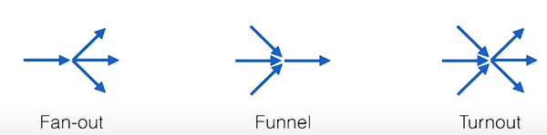

 -- первая часть статьи про итераторы и асинхронное программирование. В ней были перечислены особенности абстракций обхода коллекций в нескольких языках, а также описана связь между ними и возобновляемыми функциями. В конце статьи рассмотрено представление возобновляемых функций в различных языках и различная терминология для их обозначений. Дальше можно постепенно перейти к способам управления этими функциями.

<!-- more -->

## Ссылки
(также см. ссылки из первой статьи)
[1] Иван Чукич - Функциональное программирование на C++ -- глава 7 Диапазоны
[2] Alex Davies - Async in C# 5.0
[3] [Don Syme - F Asynchronous Programming Model](https://www.researchgate.net/publication/220802950_The_F_Asynchronous_Programming_Model)
[4] [The C10K problem](http://www.kegel.com/c10k.html)
[5] [Async await in Nim A demonstration of the flexibility metaprogramming can bring to a language](https://www.youtube.com/watch?v=i0RB7UqxERE). Еще несколько ссылок про async в Nim - [1](https://nim-lang.org/blog/2014/04/21/version-094-released.html), [2](https://nim-lang.org/docs/asyncdispatch.html), [3](https://peterme.net/asynchronous-programming-in-nim.html)
[6] [C# async tips and tricks](https://cpratt.co/async-tips-tricks/) -  sequence tasks vs parallel. Tasks return "hot"
[7] [Python asyncio-task](https://docs.python.org/3/library/asyncio-task.html)
[8] [Павел Новиков — Учимся готовить C++ корутины на практике](https://www.youtube.com/watch?v=OE45F3iKtv4)
[9] [Meet async/await in Swift](https://developer.apple.com/videos/play/wwdc2021/10132/)
[10] [Nemerle macro async/await](https://marek-g.github.io/posts/projects/archive/nemerle_async_await/), еще одна реализация через [монады](https://habr.com/ru/post/108184/)
[11] ["Clojure core.async" by Rich Hickey (2013)](https://www.youtube.com/watch?v=yJxFPoxqzWE)
[12] [The State Machines of core.async](http://hueypetersen.com/posts/2013/08/02/the-state-machines-of-core-async/)
[13] [Core Async Go Macro Internals - Part I](https://www.youtube.com/watch?v=R3PZMIwXN_g) - реализация goroutine-макроса в closure
[14] [Scylla DB Tutorial](https://github.com/scylladb/seastar/blob/master/doc/tutorial.md) - туториал по библиотеке c++, интенсивно использующий корутины. Еще больше статей - [1](https://www.scylladb.com/2020/03/26/avi-kivity-at-core-c-2019/), [2](https://www.scylladb.com/2020/05/05/how-io_uring-and-ebpf-will-revolutionize-programming-in-linux/)

## Асинхронность

Если рассматривать итераторы как абстракцию способов обхода коллекции, то в первую очередь они напоминают "умный" индекс в коллекции, который может пропускать какие-либо элементы, менять направление, или даже управляться элементами самой коллекции (например, можно описать вектором цепь Маркова, и сделать итератор, который реализует переключение состояний в этой цепи).

Есть ещё одно важное свойство отделения итерации от вызывающего её кода -- на момент запроса следующего элемента коллекции сама коллекция не обязана существовать целиком. Процесс создания следующих элементов коллекции может быть описан в виде функции -- коллекция всех натуральных чисел, передача запроса на получение элемента из файла/от внешнего устройства/по сети (само чтение данных может происходит в других потоках, которые каким-либо образом вернут данные итератору).

## Описание коллекции в виде функции

Простейший пример на `daScript` -- бесконечная коллекция натуральных чисел, заданная в виде генератора:
```cpp
var natural <- generator<int>() <| $()
  var i = 1
  while true
    yield i
    i++
```

Мы не можем использовать её в цикле foreach напрямую, потому что этот цикл пытается пройти по всем элементам коллекции. Но можно сделать другой генератор, который возьмёт несколько элементов из бесконечной коллекции и остановится.

```cpp
def take(var src:iterator<auto(TT)>; count:int)
  unsafe
    var gen <- generator<TT>() <| $()
      var aValue : TT-&
      for i in range(count)
        if next(src, aValue)
          yield aValue
        else
          return false
      return false
    return <-gen
for num in natural |> take(3)
  print("{num} ")
//Output: "1 2 3"
```

## Композиция функций и ленивые вычисления
Попробуем "просеять" натуральные числа, оставив только простые. Пример реализации функции [prime](https://github.com/spiiin/dascript_trivial_examples/tree/main/primes/primes_mix_compile_runtime.das) (самая быстрая реализация, без учёта потребляемой памяти -- просто посчитать первые n чисел заранее в compile-time :) ).

```cpp
for num in natural |> filter(@@is_prime) |> take(10)
  print("{num} ")
//Output: 2, 3, 5, 7, 11, 13, 17, 19, 23, 29
```
Можно заметить, что не существует вычисленной промежуточной коллекции `natural |> filter(@@is_prime)`, которая представляла бы собой бесконечный список всех простых чисел). Вычисление следующего элемента коллекции, описанного композицией этих функций, вычисляется только по запросу этого элемента или **лениво** (lazy) -- `take` запрашивает следующий элемент из `filter`, которая может запросить и вычислить один или несколько элементов из коллекции `natural`.

Если попробовать реализовать такую композицию на C++ с помощью итераторов и алгоритмов STL, окажется, что они не годятся для этого, функция [std::copy_if](https://en.cppreference.com/w/cpp/algorithm/copy), с помощью которой можно было бы провести фильтр элементов, ожидает на вход итераторы **существующей** коллекции, что требует создания временной копии и её заполнения элементами. Но вместо итераторов можно воспользоваться библиотекой `ranges` - [стандарт C++20](https://en.cppreference.com/w/cpp/algorithm/ranges/copy), [range-v3](https://github.com/ericniebler/range-v3), она позволяет строить ленивые итераторы (`std::views`) или инплейсно изменять коллекции (`std::actions`).

```cpp
using namespace std::views;
for (int i : iota(1) | filter(is_prime) | take(10)) {
  std::cout << i << " ";
}
//2 3 5 7 11 13 17 19 23 29
```

## Коллекция как данные из внешнего источника
В отличие от всех предыдущих случаев, при получении данных от внешнего источника мы не всегда знаем когда именно данные будут получены, что приводит к следующей проблеме -- что делать, если все данные готовые данные обработаны, а новых ещё нет? Как и с итераторами, возможны два основных подхода -- либо вызывающий код регулярно опрашивает источник данных, есть ли новые данные для обработки, либо же источнику данных передаётся колбек, который будет вызван, когда появятся новые данные для обработки.

## Опрос источника данных
Игрушечная симуляция длительно выполняющейся задачи -- счётчик до 100, который позволяет информировать внешний код о прогрессе каждые 10 итераций
```cpp
typedef 
  ValueOrReady = variant<value:int; ready:bool>
[export]
def main()
  //создаём генератор, который может возвращать значение или флаг "значение не готово"
  var gen <- generator<ValueOrReady>() <| $()
    var i = 1
    var answer: ValueOrReady
    while i < 100
      unsafe
        //каждый 10 шагов выдаём значение
        if i % 10 == 0
          answer = [[ValueOrReady value = i]]
        //иначе выдаём флаг "работа в процессе", данных пока нет
        else
          answer = [[ValueOrReady ready = false]]
      yield answer
      i++
    //задача выполнена
    return false

  for num in gen
    unsafe
      if num is value
        print("{num.value} ")
      else
        print("x ")
  print("\ndone")
//Output: x x x x x x x x x 10 x x x x x x x x x 20 x x x x x x x x x 30 x x x x x x x x x 40 x x x x x x x x x 50 x x x x x x x x x 60 x x x x x x x x x 70 x x x x x x x x x 80 x x x x x x x x x 90 x x x x x x x x x
//done
```

Видно, что опрос генератор требует двух специальных флагов -- выполнена ли задача полностью, и готовы ли данные. Для возврата признака, готовы ли данные, использован тип `variant<value:int; ready:bool>` (задача возвращает либо данные, либо флаг неготовности, но не их одновременно).

Вместо такой искусственной задержки генератор может совершать реальную работу -- например опрос сокетов операционной системы, и предоставлять не результат, а интерфейс для чтения данных, когда они будут готовы (один из подходов к решению проблемы 10000 соединений к серверу [2])

Такое примитивное описание асинхронной выполняемой задачи оставляет сразу серию вопросов и возможных улучшений:
- пока что наш "опрос" источника внешних данных заключался в том, чтобы проверить какой-то флаг, выставляемый этим источником, в основном потоке. Реальное получение данных после того, как был получен сигнал о готовности, требует синхронизации при чтении данных из источника, что можно выразить в виде паттерна с использованием примитивов синхронизации.
- в программе может существовать несколько выполняемых задач, ожидающих данных. Где-то может существовать диспетчер, опрашивающий все ожидающие задачи, чтобы не писать цикл их опроса вручную. Диспетчер может даже раскидывать выполнение задач на несколько потоков выполнения.
- различные ожидающие задачи могут требовать результатов других ожидающих задач. Какие-то результаты могут потребоваться раньше, какие-то позже. Есть различные способы выражения того, что в конкретном месте выполнения программа должна дождаться данных от одной или нескольких подзадач.
- если задача полностью зависит от внешнего источника, недоступного для управления из программы, логично предусмотреть возможность её завершения не дожидаясь окончания

## Ожидание колбеков

Можно переписать задачу вычисления чисел так, чтобы она информировала вызывающий код о прогрессе сама (аналог внутреннего итератора):
```cpp
def makeLongCalculation(blk)
  var i = 1
  while i < 100
    unsafe
      if i % 10 == 0
        invoke(blk, [[ValueOrReady value = i]], false)
      else
        invoke(blk, [[ValueOrReady ready = false]], false)
    i++
  invoke(blk, [[ValueOrReady ready = false]], true)

//использование функции
makeLongCalculation <| $(num: ValueOrReady; done: bool)
  if !done
    unsafe
      if num is value
        print("{num.value} ")
      else
        print("x ")
  else
    print("\ndone")
//Output: x x x x x x x x x 10 x x x x x x x x x 20 x x x x x x x x x 30 x x x x x x x x x 40 x x x x x x x x x 50 x x x x x x x x x 60 x x x x x x x x x 70 x x x x x x x x x 80 x x x x x x x x x 90 x x x x x x x x x
//done
```

Таким способом часто выглядят функции запроса данных по сети -- в колбек приходит информация о массиве частично-скачанных данных, и флаги -- ожидать ли ещё данных, и были ли ошибки.

Рассмотрим эволюцию паттернов работы с колбеками на примере .Net, в дань тому, что в F# и затем в C# впервые ушли от них к более свежим подходам. Microsoft в C# называет паттерны асинхронного вызова с использованием колбеков умными аббревиатурами `EAP` и `APM`. Примеры кода:

```csharp
//.NET 1, APM (Asynchronous Programming Model)
file.BeginCall(buffer, 0, maxLength, asyncResult => {
  //вызовется через какое-то время
  int numBytesRead = file.EndRead(asyncResult);
}, null)
```

В некоторых вызовах неочевидно, в каком контексте будет вызван колбек (из какого потока, нужно ли синхронизироваться и передавать результат обратно в поток, в котором будет обработан результат)
Если же нужно из колбека вызвать еще несколько вложенных операций, получается колбек-хелл, с жутким синтаксисом и смутным представлением контекста выполнения каждого из колбеков.

```csharp
//.NET 2, APM (Asynchronous Programming Model)
webClient.DownloadStringCompleted += (sender, args) => {
  string html = args.Result;
}
webClient.DownloadStringAsync(new Uri("http://example.com"));
```
Примерно то же самое, но с необходимостью явно оторвать колбек от вызова (и возможностью навесить несколько обработчиков) -- чуть меньше "лесенок" в коде

## Future, async/await
Future (или Task в C#) -- обёртка для результата, которая запускает задачу, и возвращает управление вызывающему коду. Код сам может решить что ему делать с объектом задачи, когда остановиться, чтобы дождаться результата, или как скомбинировать полученный объект с другими задачами.

```csharp
//.NET 4
Task<string> htmlTask = webClient.DownloadStringTaskAsync(url);
//тот можно выполнить код, которому не требуется результат hmtlTask
//...
string html = htmlTask.Result; //тут блокировка до ожидания результата
//или прикрепить к задаче продолжение
htmlTask.ContinueWith(task=> {
  string html = task.Result;
})
```

Следующий шаг, сделанный в F# и перенятый в других языках -- продвинутый синтаксический сахар, который позволяет записать `ContinueWith` не в виде лямбда-функции, а кодом, который выглядит, ка
```csharp
//.NET 5
Task<string> htmlTask = webClient.DownloadStringTaskAsync(url);
string html = await htmlTask; //то же что и в прошлом примере с ContinueWith
doSomething(html)             //строки ниже await также "переписываются" внутрь ContinueWith
```

Другие языки с async/await в похожем виде адаптируют эти идеи из C#
- [5] - вкручивание их в Nim синтаксическими макросами.
- [8] приводится пример разбора устройства Task в стандарте C++
- [9] Swift. Достаточно подробное объяснение, тайминги
  22:14 -- трансформация кода на колбеках в async код
  22:53 -- про "цвета" функций
  30:38 -- continuation pattern cc/resume
  32:19 -- сохранение continuation %)
- [10] Nemerle
- [11] Closure, [12]
   8:24 C# async, linear code -> callbacks + state machine, обзор подходов async и channel

Проще говоря, `co_await` в C++ позволяет записать:
```cpp
task<> tcp_echo_server() {
  char data[1024];
  while (true) {
    size_t n = co_await socket.async_read_some(buffer(data));
    co_await async_write(socket, buffer(data, n));
    std::cout << "resended\n"
  }
}
```
вместо чего-то типа:
```cpp
socket.async_read_some(buffer(data)).continueWith([&](auto task){
  n = task.result();
  async_write(socket, buffer(data, n)).continueWith([&](auto task){
    std::cout << "resended\n"
  });
});
```
(специально не хочу вникать в особенности именно С++ реализации переписывания из-за её вырвиглазности, при желании можно покопаться в этом в [8]).

Можно рассматривать оператор `co_await` как возможность приостановить выполнение и "подписаться" на уведомление о завершении или приостановке выражения-аргумента.

Разбор некоторых проблем сочетания синхронных функций с асинхронными в статье [What Color is Your Function?](http://journal.stuffwithstuff.com/2015/02/01/what-color-is-your-function/). Библиотечные функции для синхронной и асинхронной работы "разных цветов", и необходимо иметь 2 версии функций для того, чтобы вызывающий код мог выбирать из них (к примеру, синхронный [redispy](https://github.com/redis/redis-py) и его асихронный двойник [aioredis](https://github.com/aio-libs/aioredis-py), или асинхронная копия [tkinter](https://pypi.org/project/asynctkinter/), [десятки их](https://github.com/aio-libs)). Язык `Zig` кажется, один из немногих, в котором реализована поддержка универсальных бесцветных функций, которые могут работать синхронно или асинхронно, решение переносится на вызывающий кода (см ссылки [26], [27] в первой части статьи).

Интересно, насколько просто добавляются подобные операторы в языки с поддержкой синтаксических макросов. Например, модуль [coroutine](https://github.com/GaijinEntertainment/daScript/blob/138f625c7f95943341a5e96cca114ae7d0772ba6/daslib/coroutines.das) в `daScript`, реализующий макрос `co_await`, и примеры его использования [1](https://github.com/GaijinEntertainment/daScript/blob/138f625c7f95943341a5e96cca114ae7d0772ba6/examples/test/misc/coroutines_example_2.das) и [2](https://github.com/GaijinEntertainment/daScript/blob/110bb4313fa479d7b837413700ed7f6c68601e24/examples/test/misc/coroutines_example.das).


Первый пример -- последовательная передача управления между двумя функциями:
```cpp
[coroutine]
def subcr(name:string)
  print("{name} sub 1\n")
  co_continue()
  print("{name} sub 2\n")
  co_continue()
  print("{name} sub 3\n")

[coroutine]
def coroutine_example(name:string;count:int)
  print("{name} step 1\n")
  co_continue()
  print("{name} step 2\n")
  co_continue()
  co_await <| subcr(name)
  co_continue()
  print("{name} step 3\n")
  co_continue()
  for i in range(4,4+count)
    print("{name} step {i}\n")
    co_continue()

[export]
def main
    var crs <- [{auto
        coroutine_example("co1",1);
        coroutine_example("co2",2)
    }]
    cr_run_all(crs)

//Output:
//co2 step 1
//co1 step 1
//co2 step 2
//co1 step 2
//co2 sub 1
//co1 sub 1
//co2 sub 2
//co1 sub 2
//co2 sub 3
//co1 sub 3
//co2 step 3
//co1 step 3
//co2 step 4
//co1 step 4
//co2 step 5
```

Второй пример -- это внутренний итератор по дереву из первой части статьи (раздел **`Файберы`**), оформленный в виде корутины:
```cpp
[coroutine]
def each_async(tree : Tree?) : int
  if tree.left != null
    co_await <| each_async(tree.left)
  yield tree.data
  if tree.right != null
    co_await <| each_async(tree.right)

for t in each_async(tree)
  print("{t}\n")
```

Макрос corountine превращает функцию в генератор, который может быть приостановлен и возобновлён. Как показывает пример, асинхронные значения могут возвращаться в том числе и из рекурсивной функции. Теперь можно как в `ruby`, возвращать управление из вложенных функций!

## Каналы
Отойдём ненадолго от асинхронных функций, и посмотрим на работу с потоками. В `daScript` функции для работы с ними собраны в модуле [jobque_boost](https://github.com/GaijinEntertainment/daScript/blob/d60f0a310086458d28bf4726e93aa0e6c1e06abe/daslib/jobque_boost.das). Примеры использования - [test_job_que](https://github.com/GaijinEntertainment/daScript/blob/fdc48d4d4cfc46f08f0ca2fd8938a05896b973a6/examples/test/unit_tests/test_job_que.das) и [produser-consumer](https://github.com/GaijinEntertainment/daScript/blob/master/examples/test/misc/producer-consumer.das).

Новый поток создаётся функцией `new_thread`, а передача данных осуществляется через каналы (`channel`), которые объединяют примитив синхронизации (мьютекс) и результат, который может быть отправлен в канал из одного потока и принят из другого.

```cpp
struct Answer
    text:string

def work_in_thread(var channel)
//создаём потока (в реальном коде нужно обернуть в job, чтобы иметь возможность дождаться завершения)
new_thread <| @
    print("in thread\n")
    for i in range(3)
      channel |> push_clone([[Answer text="work in progress {i}"]])  //передаём данные в канал
      sleep(1000u)
    channel |> notify_and_release                                    //закрываем канал
    //completion |> notify_and_release
    print("done thread\n")
  print("work_in_thread done\n")

[export]
def main
  with_channel(1) <| $(channel)
    work_in_thread(channel)
    print("thread created\n")
    for_each(channel) <| $(ans:Answer#)              //принимаем данные из канала
        print("result from thread: {ans.text}\n")
    print("done")
//Output
//work_in_thread done
//thread created
//in thread
//result from thread: work in progress 0
//result from thread: work in progress 1
//result from thread: work in progress 2
//done thread
//done
```

Каналы по интерфейсу похожи на итераторы, однако в `dascript` не встроены в язык, поэтому работают не с встроенной функцией `for`, а с функцией из модуля joque_boost `for_each`, которая на очередной итерации достаёт из канала очередное значение или блокирует поток до тех пор, пока канал пуст. Итерация заканчивается после того, как канал будет закрыт (`release/notify_and_release`).

Но можно попробовать переписать код так, чтобы работа выполнялась в потоке, но была спрятана внутри асинхронной функции-корутине, которая предоставляет интерфейс в виде стандартного итератора. Используем предыдущий игрушечный пример с асинхронным счётчиком.
```cpp
require daslib/coroutines
require daslib/jobque_boost
require fio

typedef 
    ValueOrReady = variant<value:int; ready:bool>
struct Answer
    value:int

def work_in_thread(var channel: Channel?)
    new_thread <| @
        for i in range(100)
            if i % 10 == 0
                channel |> push_clone([[Answer value=i]])
            sleep(10u)
        channel |> append(1) //create buffer to inform that channel finish send data increase size to satisfy assert inside channel::release 
        channel |> release   //we need to call release satisfy the condition of the ChannelAndStatusCapture macro 

        //completion |> notify_and_release //for thread completion logic

[coroutine]
def makeLongCalculationInThread(work) : ValueOrReady
    var channel : Channel?
    unsafe { channel = channel_create(); }
    invoke(work, channel)
    while channel.size == 0 // channel.size==1 is a signal to stop receiving
        sleep(10u)
        var answer: ValueOrReady
        if !channel.isEmpty
            let void_data = _builtin_channel_pop(channel)
            unsafe
                let typed_data = reinterpret<Answer?#> void_data
                answer = [[ValueOrReady value = typed_data.value]]
        else
            answer = [[ValueOrReady ready = false]]
        yield answer
    unsafe { channel_remove(channel); }
        

[export]
def main
    for num in makeLongCalculationInThread(@@work_in_thread)
        if num is value
            print("{num as value} ")
//Output (async):
//0 10 20 30 40 50 60 70 80 90
```

*channel_create и channel_remove тут - функции, добавленные в библиотеку работы с каналами, потому что стандартное и безопасное api каналов daScript (with_channel) предоставляет доступ к созданному каналу только внутри блока, а из блока нельзя возвращать значение с помощью yield*

Теперь внешний интерфейс -- это асинхронная функция,  которая запускает вычисление в потоке и возвращает управление, но сохранит результат вычислений из потока в канале, как только он будет готов. Основной поток при этом не блокируется и может продолжать выполнение, до тех пор пока этот результат не потребуется. Когда результат потребуется -- функция main либо приостановится, чтобы его дождаться, либо сразу прочитает его из канала, если он уже готов.

## Communicating sequential processes
Каналы повсеместно используются в `Go`, примитивы и паттерны работы с ними рассмотрены в [22] и [23] по ссылкам в первой части статьи (теорию по работе с каналами можно гуглить по аббревиатуре [CSP](https://en.wikipedia.org/wiki/Communicating_sequential_processes)). Поиграться с примерами в браузере в можно [тут](https://go.dev/tour/concurrency/1). Go позволяет создавать буферизированные и небуферизированные каналы. Отличие в том, что при попытке отправить второе сообщение в канал, пока не прочитано первое, тред блокируется до тех пор, пока сообщение не будет прочитано. Каналы в `daScript` буферизированы, так что можно отправить сразу несколько сообщений без блокировки отправителя, даже если читатель ещё не принял эти сообщения.

В `Go` есть удобные примитивы для соединения выходов нескольких каналов:

```go
func Funnel_receiveOrTimeout(c <- chan int, duration time.Duration) (data int, more, ok bool) {
  select {
    case data, more = <- c :       //канал с данными
      return data, more, true
    case <- time.After(duration):  //канал таймаута, выдаёт сообщение после указанного времени
      return 0, true, false
  }
}

func Fanout(in <- chan int, out1, out2 chan int) {
  for data := range in { //получает новые данные
    select {             //отправляет в первый попавшийся незаблокированный канал
      case out1 <- data
      case out2 <- data
    }
  }
}
```

`select` в первом случае позволяет либо получить сообщение с данными из канала, либо сообщение из канала таймаута, если данных не поступило в течение определенного времени. Во втором -- отправить данные в первый свободный канал из списка.

`Go` также отличается тем, что имеет встроенный диспетчер горутин, который распределяет выполнений по нескольким потокам. Таким образом горутины в го -- это корутины, которые могут быть выполнены или перенесены в другой поток. Выполнение горутины приостанавливается при ожидании при ожиданнии данных из канала.