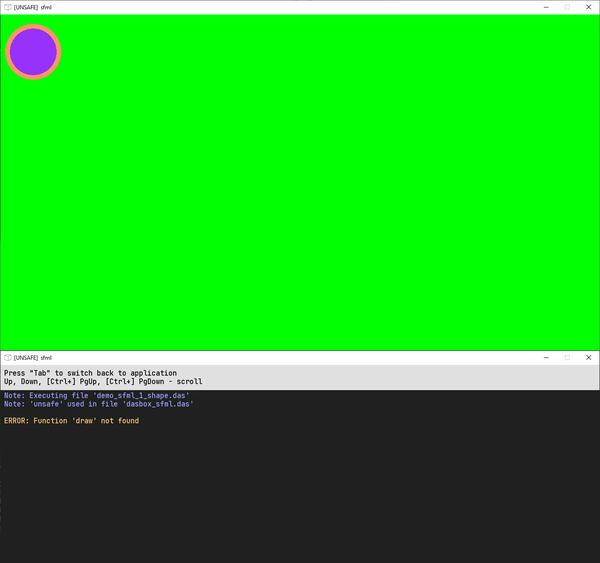
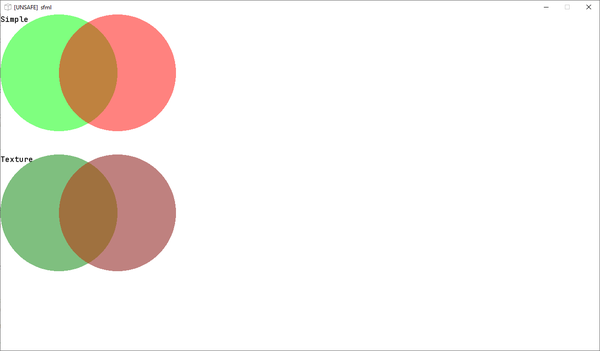
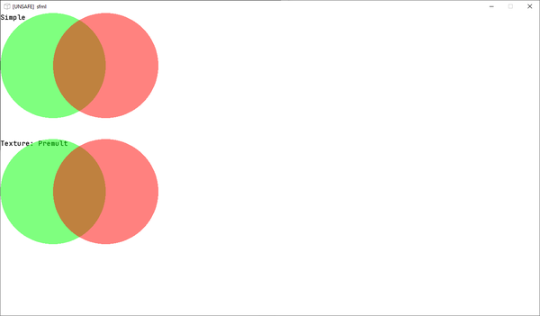

Пример работы с SFML в dasBox -- рендер полупрозрачных объектов в рендер-таргет. Тривиальная задача для графического программиста, но почему-то многие разработчики игр не знают, как это корректно сделать.

## Intro

Изначальная задумка поста -- собрать небольшой пример, показывающий алгоритм рендеринга полупрозрачных объектов в текстуру, с последующим корректным отображением этой текстуры, как если бы объекты рендерились на экран напрямую, без использования этой текстуры. Но попутно оказалось, что можно запилить фреймворк для таких демок, с возможноостью в live-режиме поиграться с параметрами и посмотреть результат.

## dasSFML

Примеры на `Opengl+GLFW`:



В отличие от GLFW, `SFML` представляет простые объекты-обёртки над функциями OpenGL для работы с текстурами, шейдерами, рендер-таргетами, и прочими примитивами библиотеки рендера, в то же время представляя для кастомизации практически все параметры рендера (во всяком случае необходимые для задуманного примера), для того, чтобы можно было писать небольшие примеры алгоритмов рендера на OpenGL.

Для начала, можно "завести" простейший [пример](https://github.com/borisbat/dasSFML/blob/main/examples/graphics.das) из комплекта привязки `SFML` к `daScript`.

Для его сборки выкачиваем сабмодули `daScript`:
```
git submodule update --init --recursive
```

Затем включаем сборку этого модуля в CmakeLists.txt и добавляем линковку статической библиотеки с модулем libDasSFML и самих библиотек SFML:
```
option(DAS_SFML_DISABLED "Disable dasSFML (SFML multimedia library)" OFF)
...
target_link_libraries(sfmlApp
  libDasModuleSFML
  sfml-graphics
  sfml-network
  sfml-system
  sfml-window
  #для windows также:
  legacy_stdio_definitions
  winmm
  Opengl32
  sfml-main
)
```

и перегененируем проект
```
./generate_msvc_2019.bat
```

Затем в хост-приложении на C++:
```cpp
//подключение заголовка с определением модуля
#include <dasSFML/src/dasSFML.h>
...
  int main( int, char * [] ) {
    NEED_ALL_DEFAULT_MODULES;
    NEED_MODULE(Module_dasSFML); //<---создаём модуль sfml
    Module::Initialize();
    run_script();
    Module::Shutdown();
    return 0;
}
```

`run_script` вызывает метод `main` из примера, который создаёт SFML-окно и запускает цикл обработки сообщений в нём.

```cpp
[export]
def main
    using(VideoMode(640u,480u), "SFML window", uint(WindowStyle Default), ContextSettings()) <| $ ( var window : RenderWindow# )
        while window |> isOpen()
            var event : Event
            while window |> pollEvent(event)
                if event._type == EventType Closed
                    window |> close()
            interface(window) <| $ ( var rt : RenderTarget )
                rt |> clear( Color(64u,0u,0u,255u) )
                using(50.0f,0x1eul) <| $ ( var shape : CircleShape# )
                    interface(shape) <| $ ( var tr : Transformable )
                        tr |> move(20.,30.)
                    shape |> setFillColor(Color(150u,50u,250u,255u))
                    shape |> setOutlineThickness(10.f)
                    shape |> setOutlineColor(Color(250u,150u,100u,255u))
                    rt |> draw(shape, RenderStates_Default())
            window |> display()
```

В качестве фреймворка для создания окна используется имеющийся в SFML класс `Window`. Однако проще воспользоваться другим фреймворком, в который уже внедрены возможности daScript-а по перезагрузке кода.

## dasbox

[dasbox](https://github.com/imp5imp5/dasbox) -- примитивный движок для 2d-игр, который Gaijin-ы использовали для проведения конкурса [Gaijin Jam](https://gaijinjam.net/ru) ([игра-победитель](https://github.com/AlexLemminG/TheFarmers)). Движок имеет простую [апишку](https://github.com/imp5imp5/dasbox/blob/main/doc/api.txt), на которой можно потренироваться использованию языка на уровне "как будто типизированная lua", а также настроен для подключения отладчика языка, веб-инспектора для отображения состояния ecs-модуля и горячей перезагрузке кода.

Но для меня интереснее другое -- `dasbox` использует в качестве бекэнда `SFML`. И хотя это осознанно скрыто от пользователей для того, чтобы можно было сменить бекэнд, можно немного "поломать инкапсуляцию", для того, чтобы воспользоваться в нём модулем `dasSFML`, и получить доступ к более богатому API, получив от самого dasbox-а фичи и инструменты по работе с кодом.

[dasbox_sfml](https://github.com/spiiin/dasbox_sfml) -- порт дасбокса с включенным модулем dasSFML.

Базовый пример на нём выглядит так:
```cpp
require daslib/media
require sfml
require dasbox_sfml

[export]
def initialize
    set_window_title("sfml")

[export]
def act(dt: float)
    if get_key(VK_ESCAPE)
        schedule_quit_game()

[export]
def draw
    withRenderTarget <| $(var rt: RenderTarget&)
        rt |> clear(Color(0u,255u,0u,255u))
        using(50.0f,0x1eul) <| $(var shape: CircleShape#)
            interface(shape) <| $(var tr: Transformable)
                tr |> move(20.,30.)
            shape |> setFillColor(Color(150u,50u,250u,255u))
            shape |> setOutlineThickness(10.f)
            shape |> setOutlineColor(Color(250u,150u,100u,255u))
            rt |> draw(shape, RenderStates_Default())
```


`dasBox_sfml` подхватывает изменения в файле с кодом, а также отображает в своей консоли ошибки в этом файле.

Идиомы `daScript` в примере:

- `using()` - создание переменной [временного типа](https://dascript.org/doc/reference/language/temporary.html), который существует только в пределах блока using

```cpp
using() <| $(var fs: das_string#)
    fs := "hello world"
    //тут можно использовать переменную, в том числе передавать в другие функции
    some_func(fs)
    //но нельзя как-либо сохранить указатель на эту переменную
    //var s = fs //ошибка, нельзя копировать временный тип
```

- `interface` - приведение к базовому типу

Генератор привязок на C++ позволяет передать отношение наследования двух C++ типов в daScript так:
```cpp
addExtern< decltype(&with_interface<sf::Sprite,sf::Transformable>), with_interface<sf::Sprite,sf::Transformable> >(*this,lib,"interface",SideEffects::invoke,"with_interface<sf::Sprite,sf::Transformable>");
```

`daScript` заставляет думать о типах и их времени жизни немного больше, чем C++, но и позволяет выразить больше таких утверждений, которые сможет проверить компилятор, чтобы уберечься от ошибок.

## RenderTarget

Следующий пример -- рендер в текстуру и отображение её на экране. В SFML для этого можно использовать класс [RenderTexture](https://www.sfml-dev.org/documentation/2.5.1/classsf_1_1RenderTexture.php)

```cpp
def draw
    withRenderTarget <| $(var rt: RenderTarget&)
        clear(rt, Color(0u,255u,0u,255u))
        using() <| $(var rtTex: RenderTexture#)
            rtTex |> create(300u, 300u, false)
            using(50.0f,0x1eul) <| $(var shape: CircleShape#)
                interface(shape) <| $(var tr: Transformable)
                    tr |> move(20.,30.)
                shape |> setFillColor(Color(150u,50u,250u,255u))
                shape |> setOutlineThickness(10.f)
                shape |> setOutlineColor(Color(250u,150u,100u,255u))
                rtTex |> draw(shape, RenderStates_Default())
            using(rtTex |> getTexture()) <| $(var sprite: Sprite#)
                rt |> draw(sprite, RenderStates_Default())
```

Пока всё хорошо, и круг отрендеренный в текстуру выглядит также, как если бы был выведен на экран напрямую

## Полупрозрачные объекты в RenderTarget

```cpp
//рендер двух полупрозрачных кругов
def drawCircles(var rt: RenderTarget&)
    using(125.0f, 128ul) <| $(var shape: CircleShape#)
        shape |> setFillColor(Color(0u,255u,0u,128u))
        rt |> draw(shape, RenderStates_Default())
    using(125.0f, 128ul) <| $(var shape: CircleShape#)
        interface(shape) <| $(var tr: Transformable) { tr |> move(125.0f, 0.0f); }
        shape |> setFillColor(Color(255u,05u,0u,128u))
        rt |> draw(shape, RenderStates_Default())

[export]
def draw
    withRenderTarget <| $(var rt: RenderTarget&)
        rt |> clear(Color(255u,255u,255u,255u))

        //простой рендер
        text_out(0, 0, "Simple", 0xFF000000)
        drawCircles(rt)

        //рендер в текстуру
        text_out(0, 300, "Texture", 0xFF000000)
        using() <| $(var rtTex: RenderTexture#)
            rtTex |> create(250u + 125u, 250u, false)
            rtTex |> clear(Color(0u, 0u, 0u, 0u))
            drawCircles(rtTex)
            using(rtTex |> getTexture()) <| $(var sprite: Sprite#)
                interface(sprite) <| $(var tr: Transformable)
                    tr |> move(0.0f, 300.0f)
                rt |> draw(sprite, RenderStates_Default())
```


Полупрозрачные круги, отрендеренные в текстуру, выглядят темнее, чем отрисованные на экране напрямую. С реальными текстурами (или отрендеренными в текстуру шрифтами), проблема обычно выглядит как темная рамка на краях объекта (там где края ради сглаживания плавно "уходят" в прозрачность).

Из-за чего это возникает?

Цвет пиксела отрисованного объекта смешивается в пикселем, уже находящимся в буфере цвете по настраиваемым формулам. При прямой отрисовке порядок рендера получается таким:
```
рисуется пиксел красного круга -> смешивается с цветом dst1 фона (белое изображение) = получаем цвет dst2
рисуется пиксел зеленого круга -> смешивается с цветом dst2 (фон + красный круг)
```

Тогда как в случае рендера в текстуру происходит:
```
рисуется пиксел красного круга -> смешивается с фоновым цветом рендер таргет текстуры dst_rt1 ("пустой" rgba цвет, rgb каналы по умолчанию чёрные) = получаем dst_rt2
рисуется пиксел зелёного круга -> смешивается с цветом dst_rt2 (пустой цвет текстуры + красный круг)
текстура выводится на экран -> смешивается цвет фона dst1 с цветом рендер таргет текстуры (пустой цвет текстуры + красный круг + зелёный круг)
```

Видно, что в итоговом цвете на экрана присутствует влияние цвета render-target текстуры -- прозрачного по альфа каналу, но в итоговой формуле кроме альфа канала влияение оказывают также и RGB каналы цвета (чёрного или любого другого -- неважно, но избавиться от влияния этого фонового цвета без изменения формулы смешивания невозможно, "невидимый" цвет начинает быть видимым).

## Настройка режимов смешивания

`OpenGL` (и `SFML` над ней) дают возможность переключать формулы режимов смешивания. Важно отойти от представления "определенная формула магическим образом включает полупрозрачность" к тому, что графический API просто даёт возможность изменить уравнение смешивание, а вывод конкретных формул ложится на плечи программиста.

Стандартное уравнение смешивания для полупрозрачности смешивает цвета в пропорции:
```
glBlendFunc(GL_SRC_ALPHA, GL_ONE_MINUS_SRC_ALPHA); 
GL_SRC_ALPHA - коэффициент смешивания рисуемого цвета - чем прозрачнее рисуемая фигура, тем меньше видно её цвет
GL_ONE_MINUS_SRC_ALPHA - коэффициент смешивания фонового цвета - обратный, чем прозрачнее рисуемая фигура, тем больше видно цвет за ней

r1 - цвет фона
r2 - цвет 1-го круга
r3 - цвет 2-го круга
после отрисовки фона m1 = (a1 * r1)
смешанный цвет после отрисовки первого круга m2 = (a2 * r2 + (1.0 - a2) * a1 * r1)
смешанный цвет после отрисовки второго круга m3 = (a3 * r3 + (1.0 - a3) * (a2 * r2 + (1.0 - a2) * a1 * r1)) = 
 = (a3 * r3 + (1.0 - a3) * a2 * r2 + (1.0 - a3) * (1.0 - a2) * a1 * r1)
```

При рендере в текстуру по умолчанию используется другая формула, которая разделяет рассчёты для RGB-каналов цвета и для A-канала.

```
glBlendFuncSeparate(GL_SRC_ALPHA, GL_ONE_MINUS_SRC_ALPHA, GL_ONE, GL_ONE_MINUS_SRC_ALPHA);
для RGB-каналов - аналогично предыдущей формуле
для A-канала:
  Asrc + Adst * (1-Asrc) - альфа значение рисуемого цвета берётся "как есть" и складывается с уменьшенным фоновым значением 

Цвет и альфа для рендер-таргет текстуры - glBlendFuncSeparate(GL_SRC_ALPHA, GL_ONE_MINUS_SRC_ALPHA, GL_ONE, GL_ONE_MINUS_SRC_ALPHA);
цвет в рендер-таргет текстуре rt1 = r1 * a1 (берём черный прозрачный цвет r1=(0,0,0), a1=0 - четвёртый компонент важен)
цвет после добавления круга rt2 = (a2 * r2 + (1.0 - a2) * a1 * r1) = a2 * r2     //premultiply alpha
альфа после добавления круга rta2 = a2 + a1 * (1-a2) = a2
цвет после добавления второго круга rt3 = (a3 * r3 + (1.0 - a3) * a2 * r2)
альфа после добавления второго круга rta3 = a3 + a2 * (1 - a3)
```

Эта формула годится только для рендера полностью непрозрачных объектов. Если какие-то части объекта прозрачные, необходимо использовать другую пару формул (для рендера в текстуру + для рендера полученной текстуры на экране). Для рендера в текстуру при этом можно даже получать "неправильные" цвета, которые можно потом смешать с изображением на экране так, чтобы смешанный итоговый цвет стал корректным.

Хороший разбор проблемы на [stackoverflow](https://stackoverflow.com/questions/24346585/opengl-render-to-texture-with-partial-transparancy-translucency-and-then-rende)
Формулы смешивания также разжеваны в статье [Как работает альфа-композитинг](https://habr.com/ru/post/468067/)

## Source-Over

Одно из возможных решений -- смешать цвет полученной render target текстуры в режиме `Source-Over` (термин из статьи выше, из списка операторов смешивания Портера-Даффа):
```
glBlendFunc(GL_ONE, GL_ONE_MINUS_SRC_ALPHA)
итоговый цвет m3 = rt3 + m1 * (1.0 - rta3)

подставим сюда значения значения из предудыщей формулы для рендерт-таргет цвета и текстуры:
m3 = (a3 * r3 + (1.0 - a3) * a2 * r2) + (a1 * r1) * (1.0 - a3 - a2 * (1 - a3))

Теперь можно сравнить полученные значения итогового цвета m3 из формулы прямого рендера и этой формулы:
m3_direct == m3_sourceover
(a3 * r3 + (1.0 - a3) * a2 * r2 + (1.0 - a3) * (1.0 - a2) * a1 * r1) == (a3 * r3 + (1.0 - a3) * a2 * r2) + (a1 * r1) * (1.0 - a3 - a2 * (1 - a3))
(1.0 - a3) * (1.0 - a2) == (1.0 - a3 - a2 * (1 - a3)
1.0 - a3 - a2 + a2*a3 == 1.0 - a3 - a2 + a2*a3

Тада! убедились в равенстве
```

Код смешивания в режиме `Source-Over`, правильный результат:
```cpp
def draw
    withRenderTarget <| $(var rt: RenderTarget&)
        rt |> clear(Color(255u,255u,255u,255u))

        //simple draw
        text_out(0, 0, "Simple", 0xFF000000)
        drawCircles(rt)

        //render texture draw
        text_out(0, 300, "Texture: Satsub", 0xFF000000)
        using() <| $(var rtTex: RenderTexture#)
            rtTex |> create(250u + 125u, 250u, false)
            rtTex |> clear(Color(0u, 0u, 0u, 0u))
            drawCircles(rtTex)
            using(rtTex |> getTexture()) <| $(var sprite: Sprite#)
                interface(sprite) <| $(var tr: Transformable)
                    tr |> move(0.0f, 300.0f)
                using(Factor One, Factor OneMinusSrcAlpha, Equation Add) <| $(var blendMode: BlendMode#)
                    using(blendMode) <| $(var renderState: RenderStates#)
                        rt |> draw(sprite, renderState)
```


## Premultiply alpha

Если посмотреть на коэффициенты смешивания в "неправильном" блендинге, и в `Sourse-Over`, можно прийти к более правильному интуитивному пониманию лишнего влияния цвета в неправильной версии. В неё не "вмешан" лишний чёрный цвет, а добавлено лишнее умножение цвета на альфа канал, которое "гасит" этот цвет больше, чем необходимо при корректном смешивании.

Можно пойти другим путём -- убрать умножение цвета на альфу при смешивании совсем, но производить его 1 раз в шейдере -- тогда не нужно переключать режим прозрачности, но нужно переключать шейдер, с которым отрисован объект. Преимуществом такого способами может быть то, что исходное изображение часто можно домножить на альфа-канал еще до запуска приложения (в демо-примере изображение генерится динамически, поэтому умножение сделано в шейдере).

```cpp
var fragmentShaderTex = (
"uniform sampler2D texture;
void main()
\{
    gl_FragColor = texture2D(texture, gl_TexCoord[0].st);
\}")

var fragmentShaderPremultiply = (
"void main()
\{
    //gl_FragColor = gl_Color;  //for testing no premultiply
    gl_FragColor = vec4(gl_Color.rgb * gl_Color.a, gl_Color.a);
\}")

var rsPremultiplySatSub, rsSatSub : RenderStates?

[export]
def initialize
    set_window_title("sfml") 

    var shaderPremult = new Shader()
    shaderPremult |> load_fragment_shader_from_string(fragmentShaderPremultiply)

    var shaderTex = new Shader()
    shaderTex |> load_fragment_shader_from_string(fragmentShaderTex)    
    shaderTex |> bind_current_texture_to_uniform("texture")
    
    var blendModeSatSubSeparate = new BlendMode(Factor One, Factor OneMinusSrcAlpha, Equation Add, Factor OneMinusDstAlpha, Factor One, Equation Add)

    rsPremultiplySatSub = makeRenderTarget(shaderPremult, blendModeSatSubSeparate)
    rsSatSub = makeRenderTarget(shaderTex, blendModeSatSubSeparate)

def drawCircles(var rt: RenderTarget&; rs: RenderStates& implicit)
    using(125.0f, 128ul) <| $(var shape: CircleShape#)
        shape |> setFillColor(Color(0u,255u,0u,128u))
        rt |> draw(shape, rs)
    using(125.0f, 128ul) <| $(var shape: CircleShape#)
        interface(shape) <| $(var tr: Transformable) { tr |> move(125.0f, 0.0f); }
        shape |> setFillColor(Color(255u,05u,0u,128u))
        rt |> draw(shape, rs)

def render_with_blend_and_premultiply(var rt: RenderTarget&)
    drawCircles(rt, *rsPremultiplySatSub)

def render_sprite_with_blend(var rt: RenderTarget&; var sprite: Sprite& implicit)
    rt |> draw(sprite, *rsSatSub)

[export]
def draw
    withRenderTarget <| $(var rt: RenderTarget&)
        rt |> clear(Color(255u,255u,255u,255u))

        //simple draw
        text_out(0, 0, "Simple", 0xFF000000)
        drawCircles(rt, RenderStates_Default())

        //render texture draw
        text_out(0, 300, "Texture: Premult", 0xFF000000)

        using() <| $(var rtTex: RenderTexture#)
            rtTex |> create(250u + 125u, 250u, false)
            rtTex |> clear(Color(0u, 0u, 0u, 0u))
            render_with_blend_and_premultiply(rtTex)
            using(rtTex |> getTexture()) <| $(var sprite: Sprite#)
                interface(sprite) <| $(var tr: Transformable)
                    tr |> move(0.0f, 300.0f)
                render_sprite_with_blend(rt, sprite)
```



Универсальный режим смешивания для premultiply изображений:
```
glBlendFuncSeparate(GL_ONE, GL_ONE_MINUS_SRC_ALPHA, GL_ONE_MINUS_DST_ALPHA, GL_ONE);

Порядок рендера:
1. Вывод в изображения в рендер-таргет текстуру с premultiply-шейдером (или же вывод подготовленного заранее изображения с обычным шейдером)
2. Вывод рендер-таргет текстуры на экран с обычным шейдером (чтобы избежать лишнего умножения)

математика (скопипащена с stackoverflow ответа):
after layer 2: (a2 * r2, a2)
after layer 3: (a3 * r3 + (1.0 - a3) * a2 * r2, (1.0 - a2) * a3 + a2)

srcR = a3 * r3 + (1.0 - a3) * a2 * r2
srcA = (1.0 - a2) * a3 + a2
dstR = a1 * r1
ONE * srcR + ONE_MINUS_SRC_ALPHA * dstR
    = srcR + (1.0 - srcA) * dstR
    = a3 * r3 + (1.0 - a3) * a2 * r2 + (1.0 - ((1.0 - a2) * a3 + a2)) * a1 * r1
    = a3 * r3 + (1.0 - a3) * a2 * r2 + (1.0 - a3 + a2 * a3 - a2) * a1 * r1
    = a3 * r3 + (1.0 - a3) * a2 * r2 + (1.0 - a3) * (1.0 - a2) * a1 * r1
```

Заметки по daScript:
- Вывод объекта с изменённым режимом блендинга и шейдером в `SFML` инкапуслирован в объекте `RenderStates`
- Вместо создания временных типов в этом примере используются "обычные" для `daScript` указатели:

```cpp
var shaderPremult : Shader? = new Shader()
```
Такие [указатели](https://dascript.org/doc/reference/language/datatypes.html#pointers) хранят объект в куче и владеют им, по семантике близко к `std::unique_ptr`. При желании можно освободить объект вручную, присвоив указателю `nullptr`.

- ключевое слово implicit после имени типа в аргументах функции позволяет функции работать с обычными типами, так и с временными.

Код примеров - https://github.com/spiiin/dasbox_sfml/tree/main/samples/sfml_blending