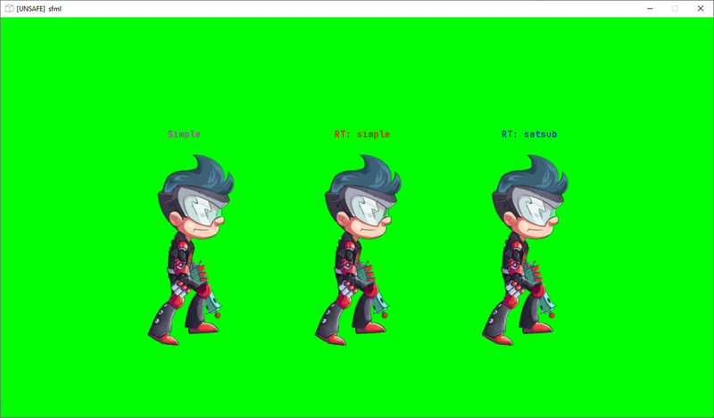
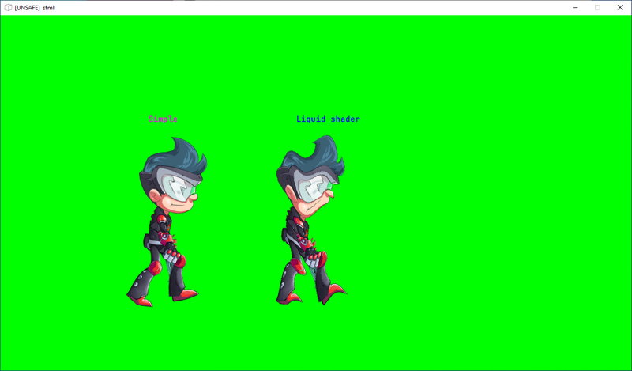
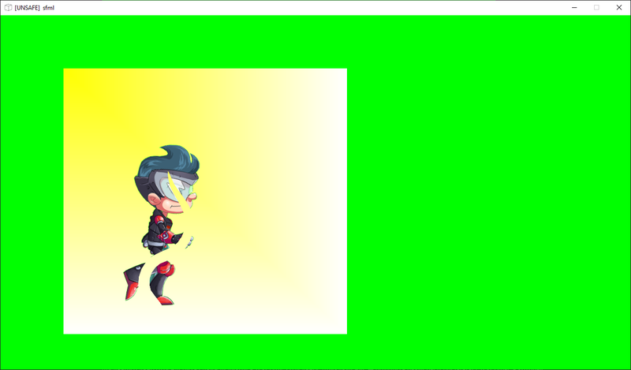

Вкрутил в [dasbox_sfml](https://github.com/spiiin/dasbox_sfml) поддержку [spine-runtime](http://ru.esotericsoftware.com/).

Добавлена минимальная поддержка -- [модуль](https://github.com/spiiin/dasbox_sfml/blob/main/src/sfmlSpine.cpp) с кастомной обёрткой над типом и несколькими функциями настройки.

Сделан для того, чтобы детальнее разобраться с байндингом (проверить, как работает вручную, в отличие от автоматической генерации)

И чтобы улучшить визуал примеров


Примеры:

## Рендер спайна в текстуру


https://github.com/spiiin/dasbox_sfml/blob/main/samples/sfml_spines/demo_spines_2_rt.das

Способ отрендерить полупрозрачный объект в рендер-таргет текстуру детально описан в первой части статьи (`source-over` и `premultiply alpha`). Также для сравнения выведена текстура с обычным режимом блендинга (посередине) -- полупрозрачный шлем излишне чёрный.

## Shader

https://github.com/spiiin/dasbox_sfml/blob/main/samples/sfml_spines/demo_spines_3_shader.das

Спайны чаще всего состоят из большого количества аттачментов (чаще всего 2d-меши), которые рендерятся послойно, так что для наложения некоторых эффектов, влияющих на изображение целиком (outline, различные виды distortion, motion-эффекты, glow), необходимо также предварительно отрендерить спайн целиком в текстуру. Отдельное приключение -- получить размеры render-target текстуры, в которые поместиться спайн во время анимации. Чаще всего эти сведения можно получить только от артиста, либо просчитать в real-time/compile-time (анимации могут накладываться друг на друга различными способами).

В live-режиме удобно, что нет особой необходимости писать gui для настройки параметров шейдера, можно играться с ними, мгновенно получая фидбек на экране.

## Реверс-блендинг


https://github.com/spiiin/dasbox_sfml/blob/main/samples/sfml_spines/demo_spines_4_reverse_blending.das

Напоследок -- интересный и сложный в реализации через sfml и spine-runtime эффект, описанный в статье [Отложенный Alpha blending](https://habr.com/ru/company/playrix/blog/487250/). Способ позволяет отрендерить "дырки" в спайнах любой формы за один проход, без использования предзаготовленных масок и рендер-таргет текстур. На скриншоте -- анимированный спайн лианы, через которую сквозь основной спайн видно фоновый спрайт.

Реализация требует обратного порядка отрисовки и специальных формул блендинга. Порядок отрисовки:
- экран очищается цветом [0,255,0,0] - в альфа-компоненте должен быть 0, а не 255!
- передний спайн с обычным режимом блендинга
- спайн-"дырка", с режимом блендинга "вычитание" - glBlendFunc(GL_ZERO, GL_ONE_MINUS_SRC_ALPHA)
- фон, который "просвечивает" через основной спрайт только там, где была нарисована дырка - glBlendFuncSeparate(GL_SRC_ALPHA_SATURATE, GL_ONEU, GL_ONEU, GL_ONE_MINUS_SRC_ALPHA)

```cpp
def initialize
    ...
    spine = new SpineWrapper("spineboy-pro.skel",  "spineboy-pma.atlas")
    spine |> set_position(320.0, 590.0)
    spine |> set_animation(0, "walk", true)

    spineHole = new SpineWrapper("vine-pro.skel",  "vine-pma.atlas")
    spineHole |> set_premultiply_alpha(false) //отключаем режим premultiply
    spineHole |> set_position(320.0, 640.0)
    spineHole |> set_animation(0, "grow", true)

def draw
    withRenderTarget <| $(var rt: RenderTarget&)
        rt |> clear(Color(0u,255u,0u,0u))
        //draw base spine
        rt |> draw(spine, RenderStates_Default())

        //draw hole spine
        using(Factor Zero, Factor OneMinusSrcAlpha, Equation Add) <| $(var blendMode: BlendMode#)
            using(blendMode) <| $(var renderState: RenderStates#)
                rt |> draw(spineHole, renderState)

        //draw triangle, special render mode
        //raw opengl
        glBlendFuncSeparate(GL_SRC_ALPHA_SATURATE, GL_ONEU, GL_ONEU, GL_ONE_MINUS_SRC_ALPHA)
        glUseProgram(program)
        vs_main_bind_uniform(program)
        fs_main_bind_uniform(program)
        glBindVertexArray(vao)
        glDrawArrays(GL_TRIANGLES, 0, 6)
        glBindVertexArray(0u)
        glUseProgram(0u)
```

- spine-runtime позволяет аниматорам выставлять и переключать режимы блендинга самостоятельно, поэтому чтобы спайн был отрисован с кастомным режимом блендинга, необходимо использовать не "нормальный" блендинг, а [тот](https://github.com/spiiin/spine_cpp_sfml/blob/main/spine-sfml/spine-sfml.cpp#L171), который был выставлен в sfml. Также спайн-"дырка" не должен использовать каких-либо дополнительный режимов блендинга в ходе анимации.
- режим блендинга GL_SRC_ALPHA_SATURATE почему-то вообще не прокинут в [SFML](https://www.sfml-dev.org/documentation/2.5.1/structsf_1_1BlendMode.php), поэтому фон отрисован с помощью функций opengl ([sfml+opengl](https://www.sfml-dev.org/tutorials/2.5/window-opengl.php) без проблем уживаются вместе).