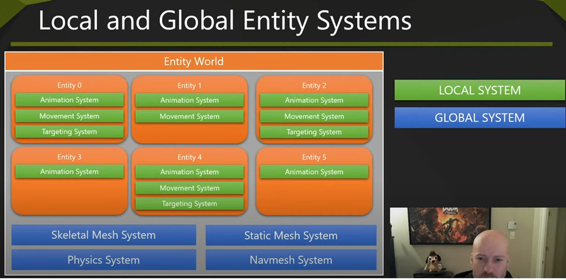

## Where is my components

Одна из идей `ecs` -- держать компоненты рядом в памяти и обходить в порядке хранения в памяти. По способу организации хранения [ECS FAQ](https://github.com/SanderMertens/ecs-faq#what-are-the-different-ways-to-implement-an-ecs) выделяет такие группы:

- Реактивные ECS

[Entitas](https://github.com/sschmid/Entitas/blob/main/src/Entitas/src/Entity/Entity.cs#L96) - компоненты валяются где-то на хипе, entity хранит указатели на компоненты. Добавление и удаление компонентов с помощью событий уведомляет системы, чтобы они обновили свои списки. О хранении рядом речи не идёт. На самом деле, по типу хранения тут скорее "Entity based". Идея с тем, чтобы уведомлять системы при изменении списка компонента на сущности реализована и в других типах ECS

- Bitset based

[EntityX](hhttps://github.com/alecthomas/entityx/blob/82ab2d304ef5e6933cf6622721f086a1f4731e80/entityx/Entity.h#L641) - компоненты хранятcя в отдельных пулах, entity хранит битовую маску, присутствует ли компонент в конкретной entity. Быстро, но очень расточительно в плане количества потребляемой памяти.

- Sparse set

[EnTT](https://github.com/skypjack/entt) - компоненты хранятся в системах, в структурах под названием [sparse_set](https://github.com/skypjack/entt/blob/master/src/entt/entity/sparse_set.hpp#L151). Бывают структуры, владеющие компонентами, и хранящие индексы компонентов (дополнительный уровень индирекции), а также совмещенные варианты (владеет частью компонентов, но обращается к другим по индексам). Способ хранения компонент задаёт пользователь библиотеки, что позволяет выбирать наиболее быстрые способы, но взамен требуется хорошее понимание того, как правильно его выбрать.

[Managing Decoupling Part 4 -- The ID Lookup Table](http://bitsquid.blogspot.com/2011/09/managing-decoupling-part-4-id-lookup.html) - простое объяснение.
[ECS back and forth Part 2 - Where are my entities?](https://skypjack.github.io/2019-03-07-ecs-baf-part-2/) - объяснение использования в EnTT.
[Groups](https://github.com/skypjack/entt/wiki/Crash-Course:-entity-component-system#groups) - более детальное объяснения того, как ускорить доступ к паре компонентов, которыми владеет одна система. Совсем кратко -- если система владеет компонентами A и B, то она может хранить их так, чтобы при обращении за сущностями с обоими компонентами компоненты этих сущностей всегда лежали в начале массивов.
[Part 2, insights - Sparse sets and grouping functionalities](https://skypjack.github.io/2019-03-21-ecs-baf-part-2-insights/) - еще раз подробно о способе сортировки групп.

- Archetypes (aka "Dense ECS" or "Table based ECS")
[flecs](https://github.com/SanderMertens/flecs) - компоненты хранятся в архетипах. Архетип -- сочетание уникального множества компонентов. Для каждого архетипа существует отдельный массив. Компонент хранит список архетипов, которые его включают. Сущность хранит указатель на массив архетипов, и индекс внутри этого массива (по которому получает сразу все свои компоненты).

Таким образом, легко получить сразу все компоненты сущности, но при удалении/добавлении компонента необходимо "перекладывание" всей пачки компонентов из одного массива архетипов в другой. Также, если существует множество различных архетипов (сочетаний компонентов), и существует несколько систем, выбирающих одиночные компоненты, то расстояние в памяти между различными архетипами будет большим (как и если архетип достаточно большой - шаг между отдельными компонентами может быть большим)

[Building an ECS #1: Where are my Entities and Components](https://ajmmertens.medium.com/building-an-ecs-1-where-are-my-entities-and-components-63d07c7da742) и
[Building an ECS #2: Archetypes and Vectorization](https://ajmmertens.medium.com/building-an-ecs-2-archetypes-and-vectorization-fe21690805f9) - идея расскладыванием на архетипы

[decs](https://github.com/GaijinEntertainment/daScript/blob/master/daslib/decs.das#L323) - библиотека ecs в `daScript` на архетипах
[decs_boost](https://github.com/GaijinEntertainment/daScript/blob/master/daslib/decs_boost.das) - набор макросов, с помощью которых обращение с архетипами синтаксически похоже на обычный императивный код

Идеальным сочетанием для скорости выглядит использование `архетипов` в тех системах, где 1) не происходит постоянного добавления/удаления компонентов и 2) компонент используются только небольшим количеством систем (в примеры приводят низкоуровневые физические и графические подсистемы) + использование `sparse sets` там где существует большое количество типов компонент, которые постоянно добавляются/удаляются и систем, использующих разные сочетания компонентов (игровая логика).

## Проблемы с ECS

На чистом ECS сложно выразить некоторые распространённые в геймдеве задачи:

- Иерархии
- Конечные автоматы
- Декларативный GUI
- Порядок работы систем (и повторный запуск)
- Расширение/наследование компонентов
- Контракты компонентов (взаимоисключающие сочетания, неудаляемые и т.п.)
- Отображение объекта из нескольких сущностей как целого

И более редкие
- Общее использование компонента сущностями
- Несколько компонентов одного типа на сущности

[ECS: From Tool to Paradigm](https://ajmmertens.medium.com/ecs-from-tool-to-paradigm-350587cdf216) - список проблем
[ECS Questions](https://takinginitiative.wordpress.com/2019/09/30/ecs-questions/) + [More ECS Questions](https://takinginitiative.wordpress.com/2019/11/09/more-ecs-questions/) - еще пара разборов ситуаций в игровом коде и способов их решения -- порядок вызова систем в иерархических структурах, применительно к подсистеме анимации.

## Kruger Engine Entity Model



`Game Engine Entity/Object Models` -- большой обзор ECS подхода от Bobby Anguelov, с предложением гибридного подхода.
[Kruger Engine Entity Model](https://takinginitiative.files.wordpress.com/2019/11/krgentitymodel.pdf) -- презентация про демо-движок с подходом из видео-доклада.
[Esoterica](https://github.com/BobbyAnguelov/Esoterica) - более позднее название демо-движка

Системы делятся на глобальные и локальные.

- Глобальные

Чтобы передавать информацию между сущностями, и обновлять состояние мира

- Локальные
Чтобы передавать информацию между компонентами одной сущности (сущность не может получить доступ к компонентам напрямую, не через локальную систему, компоненты не могут ссылаться друг на друга или обновляться сами)
Чтобы гарантированно обновлять все компоненты родителя раньше дочерних, для систем, которым необходим порядок обновления

Разрешено добавление нескольких компонентов одного типа на сущность, чтобы упростить построение иерархий (меш + сабмеши).
Разрешено явное задание пространственной иерархии между сущностями (с помощью `Spatial Component`, который имеет список дочерних Spatial Component и хранит пространственные матрицы)

