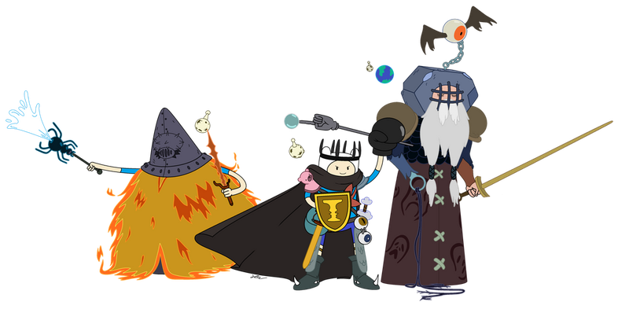
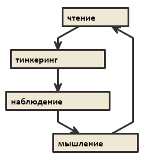

Предыдущая пачка:





Качается всё то же, что и на предыдущем "уровне" -- накопление критической массы знаний, и попытки их систематизировать.

## Миф


start: 981,

Misha Nestor - Антропологический менеджмент и лидерство

Миф -- не о поиске магии или мистике, а о совпадении ценностей и поиске смыслов.


#fill: #eee8d5;
[миф о себе] -> [окружении]
[окружении]-> [компании]
[компании] -> [обществе] 
[обществе]-> [мире]


 -- мои поиски профессионального личного мифа.

Основная идея -- современное общество вокруг дисциплинарное, и "миф по умолчанию" для компаний -- фабрика, серийное производство, в котором люди становятся похожи на механизмы. В таких условиях многим становится некомфортно, что не способствует ни творческой работе, ни выкладыванию на творческий максимум (в понятиях фабрики более ценится "средняя", но предсказуемая работа). Один из способов работать в таких условиях -- осознанное слежение за уровнем комфорта вокруг рабочих процессов.

 -- миф о компании и обществе.
На нас сильно влияет среда вокруг -- пространство и информационный фон. Люди с общей идеей собираются в определенных местах, и в таких местах возможна передача знаний и идей. Чтобы "загореться" разумом, необходимо чтобы кто-то из других людей вокруг уже горел. Ребёнок, воспитанный животными, после определенного возраста, не сможет интегрироваться в общество людей. Также и с более продвинутыми знаниями -- не получив культурный импринт, невозможно рассуждать о сложных вещах, хотя возможно пытаться повторить их с помощью карго-ритуалов.

При повышении роли в компании часто отсутствует схема ритуала/инициации/личного кризиса, сопутствующего "переходу". Из-за этого человек либо проходит это сам, либо за ним тянется "шлейф" предыдущих обязанностей/форм работы.

*Материалы -- Джесси Шелл, Кристофер Александер, Джозеф Кэмпбелл, Алан Кэй, Рич Хики, Пол Грем*

## Карты знаний

Прежде чем накапливать и систематизировать знания, можно "осмотреться", как рассуждают о знаниях/скиллах другие.

**Примеры матрицы/графа/списка материалов и компетенций**
[A study path for game programmer](https://github.com/miloyip/game-programmer) -- материалы из нескольких областей для геймдев-программиста, разделены на основные и дополнительные.
[Teamlead Roadmap](https://tlroadmap.io/guide.html) -- роадпам тимлида. Сумма компетенций тимлида по опросам российских IT-компаний. Обязанностей где-то на 2-3 людей, упор на скиллы лида, менеджера, cto (как "директора программистов"), а не технические скиллы
[Programmer Competency Matrix](https://sijinjoseph.netlify.app/programmer-competency-matrix/) -- схема оценки навыков программиста. Очень странный выбор примеров знаний, но иллюстрирует экпоненциальный рост знаний с переходом на каждый новый уровень

**Списки книг**
[Список книг от Алана Кея](https://30minbooks.livejournal.com/11011.html) -- список рекомандаций для студентов CS. Часто, если смотреть выступления Кея, можно понять, что он рекомендует не книгу, а какую-то конкретную идею в ней.
Другие варианты -- разобрать список интересной рекомендуемой литературы в любой серьёзной книге (одной-двух) -- в качестве примеров: **`"Книга линз" Джесси Шелла`** и **`"Архитектура Игрового движка" Джейсона Грегори`**.
 -- мой граф по Джесси Шеллу.

**Примеры вопросов на собеседованиях в геймдев-компании**
[Интервью глазами пострадавшего](https://web.archive.org/web/20191006063124/http://blog.gamedeff.com/?p=64) -- образец интервью из 2007, Midway Home Entertaiment
[Interviewing for Game Programming](Interviewing for Game Programming) -- более свежий образец, примерно такого же уровня

**Варианты того, что можно и нужно изучать**
(список направлений для геймдева, навскидку)
- render
- железо, особенности архитектуры, проц/память/видео
- популярные движки unity/unreal/godot
- dod/ecs
- llvm/libclang и инфраструктура
- multithreading/async программирование
- unreal blueprints, визуальное программирование
- скриптовые языки daScript/lua-jit
- идеи в языках go/rust/closure/scala/nim/zig/racket
- внутренности библиотек stl/boost, структуры данных
- gamedev-specific математика и алгоритмы
- тулзы git/серверы сборки/системы задач/cd-ci и прочее
- пайплайны работы, устройство организаций, agile/lean/scrum
- способы генерации арта
- сеть, звук, системы анимаций, ии в играх, компрессия, форматы данных etc etc etc

**Примеры видения сотрудников от компаний**
[Valve](http://media.steampowered.com/apps/valve/hbook-RU.pdf), [Roblox](https://www.dropbox.com/s/0z2p0qokdmm6eaw/Roblox%20Rendering%20-%20Career%20Guide%20v1.1public.pdf?dl=0), [Naughty Dog](https://www.gameenginebook.com/resources/SINFO.pdf), [Unity](https://aras-p.info/texts/files/201410-TUM-HobbyEngineToGameEngine.pdf), разделение программистов в [IO Inreractive/Square Enix](https://youtu.be/9nB_8LDaEVE?t=705) от Bobby Anguelov.

Можно использовать для обнаружения пробелов в знаниях для того, чтобы их заполнять в свободное время, карьерного планирования, а также для обнаружения интересных "зацепок" в культуре других компаний.

## Как и зачем заниматься самообразованием

 - про свой способ чтения книг, а также развернуто зачем заниматься самообразованием.

Соберу и дополню список возможных ответов "зачем":
- несмотря на то, что на работе знания могут не понадобится сейчас или в ближайшем будущем, они попадут в список скиллов ("тебя не будут просить делать то, что ты умеешь плохо")
- над тобой всегда есть несколько уровней развития, которых ты не видишь с текущего (парадокс блаба)
- шанс найти инсайты в соседних областях, которые не изучены в твоей области (либо получить синергию знаний от двух направлений)
- возможность оценить компетенции коллег и руководства (или кандидатов при подборе команды), а также улучшить возможности профессионального взаимодействия
- возможность делать новые для себя или более крутые вещи, которые не умел делать раньше
- знание и понимание rocket-science решений
- обнаружение готовых решений, умение их оценить, видеть весь спектр возможных решений (антибиблиотека Умберто Эко)
- возможность учиться идеям у лучших ("поджечь свой факел разума от уже горящих")
- обойти грабли, на которые уже наступили десятки людей, понимание открытых проблем
- обновление знаний и подходов (иначе когда случится очередная , работу сложно будет найти)
- систематизация, даже неуклюжая, неплохо прокачивает понимание
- шанс понять свои сильные и слабые стороны (а также, возможно,  в другую геймдев-профессию)

**`"Как заниматься"`**.

"Традиционный путь в программисты" -- это прочитать пару книг по языку и перейти от теории к практике (попутно нафаршировав голову в универе всяким computer scienсe, engeneering, math или еще чем-нибудь). Дальше обычно с некоторой периодичностью изучаются мануалы или best practices, но чаще всего ведущим способом изучения является практика. В такой схеме сильно страдают еще два способа набора знаний:

**Наблюдение**
 Что делают другие и с какими целями:
 - изучение докладов с профильных конференций
 - профессиональное общение
 - изучение open-source кода
 - использование различных middleware-инструментов
 - играть в игры конкурентов
 Примеры задачек на наблюдение:
 - найти 10 субъективно наиболее интересных библиотек из boost (abseil/folly/eastl или еще какой-нибудь base library) и разобраться, с какой целью они сделаны и как устроены
 - найти 10 устаревших [идиом](https://en.wikibooks.org/wiki/More_C%2B%2B_Idioms) C++ и посмотреть, почему они устарели, и что предлагает язык сейчас
 - изучить  асинхронного программирования в 5-10 языках программирования (варианты -- реализации хеш-таблиц/сборщиков мусора/конкретные оптимизации компилятора)
 - выбрать какую-нибудь популярную open-source библиотеку (например, [bgfx](https://github.com/bkaradzic/bgfx#who-is-using-it-madewithbgfx)) и пройтись по 5-10 примерам сделанным с её помощью проектам, изучить их фичи, а также изучить все 3rdParty библиотеки, которые используют эти проекты (или пройтись по уже собранным коллекциям, [пример](https://github.com/floooh/bookmarks))
 - выбрать какую-нибудь фичу популярного движка, которую можно отделить, и попробовать реализовать её самому from scratch быстрее/удобнее/лучше чем то, что уже существует (например, реализация [системы анимаций](https://github.com/BobbyAnguelov/Esoterica) "как в трипл-эй движках" от Bobby Anguelov)
 *тут у него скорее наблюдение + тинкеринг + мышление*
 - попробовать откопать максимум информации про устройство какой-нибудь фичи, которая понравилась в игре (к примеру, кастомизация персонажей в Sims)

**Мышление**
- систематизация
- придумывание
- выводы
- улучшение лучших решений

Кажется, именно из-за пробелов в этих направлениях и возникает необходимость периодического заныривания в тонны материалов (в дальнейшем, систематизация позволяет значительно сократить время, просеивая эти объёмы). Так что, логично было бы более равномерно заниматься каждым из 4х способов прокачки:

    
*тинкеринг -- то же, что и практика, свободные эксперименты с кодом*

## Общение

От управления командой развитие общения идёт по пути расширения круга профессиональных знакомств, чтобы начинала работать "магия нетворкинга", что в теории, иногда позволяет эффективно решать задачи типа таких:
- Нужен классный профильный специалист, разобраться с пачкой проблем, которые мы толком не понимаем как решить - затюнить андроид-порт движка, или выловить пачку мутных крешей где-то на границе мутных 3rdParty сдк и NDK (андроидщики в геймдеве, впрочем, кажется, всем нужны)
Или возможно, и в обратную сторону:
- Фанатею от игр компании XXX и горю желанием там работать (или же "мечтаю сделать более крутую версию игры YYY, ищу единомышленников")

Примеры способов заявлять о себе
- совместная работа в прошлом
- тематические онлайн или оффлайн тусовки (как участие, так и организация)
- случайные знакомства (хех, в "правильных" городах шанс такого больше)
- курсы/стажировки/лекции/конкурсы как платформа для общения и знакомств
- медиа - подкасты, блоги

Нетворкинг и взаимодействие с людьми разных скиллов также позволяет оценить важность diversity -- группа людей с разным бекграундом и навыками может эффективнее решать сложные задачи.

Также, с какого-то момента приходит понимание, какие типы людей не могут нормально работать в командах --  

Отдельная, скорее субкультурная, тема -- выстраивание "моста между поколениями", изучение истории игр, а также эволюции компаний и методов разработки ([пример подборки](https://app2top.ru/industry/10-knig-ob-istorii-igrovoj-industrii-126776.html)). Не могу утверждать о конкретной пользе, но, кажется, это имеет и элементы медиа, и элементы объединяющего индустрию мифа.

Еще один способ взаимодействовать с командой -- пропускать всё общение и код коллег через призму, "а возможно ли было бы переиспользовать решение в других местах/хотел бы я работать с этим человеком, если бы было нужно начинать новый проект и было необходимо собрать команду из тех, кто есть сейчас".

Развитие себя при работе в команде -- не личная, а общекомандная задача, можно вырасти выше команды на одну голову, но невозможно на три. Необходимо или тянуть команду вверх, или менять, или работать отдельно от группы.

## Жизненный план

Обозначить цели и сроки, что хочется сделать и когда. Точно стоит обратить внимание на то, чтобы не терять здоровье и близких людей, а также на изучение языков. Полезно (и невероятно сложно!) попробовать обозначить собственные личные/профессиональные недостатки, и попробовать исправить один из них -- хороший повод задуматься о себе.

