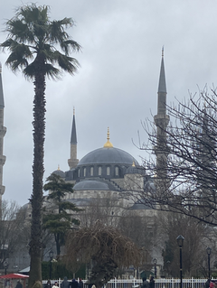

Сумбурная попытка собрать в кучу события в жизни за 2 года. В конце 2021 не успел, в начале 2022 уже как-то не до того было. Допишу понемногу как раз к новому году.

<!-- more -->

Предыдущая - 

**`Дисклеймер`**

Очень не хочется писать про войну, слишком сложно и больно написать что-то коротко. Поэтому, в основном, просто списки из нескольких запомнившихся книг/игр/посещенных стран etc с небольшими заметками

**`Личное/путешествия`**

В начале 2021 года накрыло выгоранием от работы, одновременно с ощущением, "надо развиваться, иначе пиздец" и питерской простудой (это которая потом может привести к больному зубу и гаймариту). Ушёл в длинный отпуск, лечиться, читать книжки и медитировать над тем, где пропустил важный поворот. Попутно женился (снова с поездкой в Крым и отдыхом в Многоречье, Евпатории и Балаклаве), наконец продал старый дом в Бахчисарае, доставшийся в наследство много лет назад, и слетал отдохнуть в Калинград с коллегами.

Охта-парк в последние выходные в Питере

2022-й год -- внезапный "развесёлый" трип (безвозвратная релокация) Самарканд-Стамбул-Ереван.

Армения очень гостеприимная страна, с множеством как официальных достопримечательностей, так и [маленьких](https://www.wirade.ru/cgi-bin/wirade/YaBB.pl?board=stories;action=display;num=1086946148) мест и историй. Особенно порадовал Дилижан и окрестности. Успел слетать в Анталию в отпуск и в Дубаи и Пхукет в командировку. Так что год выдался богатым на поездки и ощущения.

В конце года оказался в Израиле. Если Армения почти не отличалась по флоре и фауне от Украины и России, то тут на деревьях можно увидеть попугаев, ночью -- больших летающих мышей (точнее, даже летающих лисиц), и кабанов, разгуливающих по городу. Бросаются в глаза и отличия в ценах и порядках. Другой мир со своими правилами.

**`Работа`**

За пару лет побыл тим-лидом, разработчиком движка и техническим продюсером. Кроме плюсов в виде большого количества контактов и понимания процессов работы компании, существуют и минусы такого движения -- "шлейф" переходов излишне расширяет зоны ответственности, необходимо явно "отвязываться" от прошлых обязанностей.

Снова запустили софт-ланч матч-3 игры - [Tasty Makeover](https://mytona.com/game/15)

Получил на память серебрянный значок

**`Музыка`**
`Piazzolla - Libertango`


Пьяццолла удивительным образом стимулирует творческое настроение, подсмотрел у авторов "Worlds of Goo"

`Dave Stewart, Boris Grebenshikov & Serhii Babkin - Face to Face (feat. Stevie Nicks)`


Сергей Бабкин -- это гитарно-дворовое регги из детства, а у Бориса Гребенщикова, кроме музыки, попадалась еще хорошая инструкция по медитации.

`The Death Set - They Come to Get Us`


Немного драйва десятилетней давности.

`DakhaBrakha - Carpathian rap`


Видеоряд и мистика.

`Selena Gomez, Rauw Alejandro - Baila Conmigo`



**`Игры`**

`- Divinity Original Sin 2 (Switch)`
Красивая и интересная тактика, в которой можно позалипать в дизайн локаций. Очень много часов геймплея, хорошая адаптация управления под консоль. Рассчитана явно на пару прохождений (физическая и магическая партия). Много подготовки -- обновление ассортимента оружия на каждый уровень партии, необходимость "пылесосить" локации, с возможностью полной зачистки лагерей или даже деревень.
`- Monster Hunter: Rise (Switch)`
Необычная смесь RPG с элементами файтинга (различные комбо для различного оружия), крутое взаимодействие с окружением (набор бустов перед боем, изучение фишек локаций). Не очень понравился переход из сингл-плейера в мульти-плейер -- одиночный сюжет просто обрывается, без возможности посмотреть и победить самых сильных боссов.
`- Civilization 6 (Switch/PC)`
Эмерджентные механики, которые расширяют возможности геймплея в дополнительных правилах и нациях. Геймплей с дополнениями и без сильно отличается. Хорошая кривая обучения игре -- интересно играть как в первый раз, так и в сотый, обучаясь нюансам механик.
`- C&C Rivals (iOS/Android)`
Игра в жанре Clash Royale, тактическая RTS с элементами карточной игры. Юниты более-менее сбалансированы, большинство из них требует микроконтроля для полноценной реализации их в бою. Вызвала хейт фанатов серии из-за забивания на лор, но тем не менее, необычный и самобытный проект.
`- Risen 3 (PC)`
Моё первое знакомство с играми Pyranha Bytes и их подходу к разработке игр. Ну и пиратский сеттинг всегда приятно увидеть.
`- Axie Infinity (PC/Android/iOS)`
NFT-игра, притом не pay-to-win, скорее похожая по стратегии игры на покер (а вообще -- безумная смесь тактики, кки и покемонов). Заодно и понятны опасности экономик подобного типа игр -- баловство разработчиков с балансом, от нерфа карт в середине сезона, до выпуска новых типов предметов, или вообще выпуска альтернативной игры со сменой всех механик; взломы кошельков с хранилищем крипты, возможность общего обрушения игры; часть экономики, зависимая от привлечения новых игроков в игру. Тем не менее, в предыдущей версии -- могла затянуть на несколько ночей в построение идеальных команд с тетрадкой, ручкой и экселем. Заслуживает отдельной статьи.

`- Valheim`
Хардкорная выживалка-песочница про викингов, с необычной графикой. Простые и низкодетализированные текстуры (если верить книге "Понимание комиксов" -- менее детализированное окружение = меньшая враждебность в восприятии игрока) и прикольные эффекты и звук создают интересное восприятия локаций.
`-TMNT: Shredder’s Revenge (PC/Switch)`
Идеальный beat-them-up для игры на двоих и более черепашек.
`- Candy Crush/Homescapes/Royal Match (iOS/Android)`
Профессиональное изучение жанра
`- Disco Elisium (PC)`
Классный русский перевод и одна из лучших РПГ, в которых можно действительно отыграть поведение
`- Hades (PC)`
Отличный пример дизайна -- встраивание механики развития и сюжета в рогалик, эмерджентные механики комбинаций оружия и бонусов, нарративная связь кор-геймплея и меты, сюжетный путь героя
`- Witcher 1-2 (PC)`
По прежнему крутые для фанатов, особенно в сочетании с книгами и третьей частью. В том числе и основной линией сюжета, которая продолжает историю из книг и дает возможность повлиять на судьбу персонажей.

[Больше моих скриншотов](https://www.dropbox.com/sh/kwgasmi89f4su3q/AABinxk2WKfun6rNulXrX6Tka?dl=0) из всех трёх "ведьмаков".

Традиционно заканчиваю год просмотром треда со скриншотами из игр на neogaf, [2022 год](https://www.neogaf.com/threads/2022-pc-screenshot-thread-of-no-compromises.1626951/) (и ). Лучше всего характеризует этот год:

**`Книги`**

Из нетехнического:

`- Никулин Н., "Воспоминания о войне"`
Реальность и ужасы войны.
`- Нил Шубин, "Внутренняя рыба"`
Про то, как млекопитающие выходили на сушу. И про то, что человек -- перестроенная рыба, что до сих пор прослеживается в особенностях строения, и иногда в болезнях.
`- Уилсон Э., "Планета муравьев"`
Особенности муравьиного общества
`- Даррелл Дж., "Гончие Бафута", "Под пологом пьяного леса"`
[Даррелл](https://vas3k.club/post/9639/) -- человек, который занимался своим делом, несмотря на происходящие в мире события -- войны, революции. Что бы ни происходило вокруг, он собирал животных во всех уголках земли.
`- Кристофер Александер, "Язык шаблонов", "Timeless way to building"`
Интересно было изучить как минимум потому, что на книги Александера часто ссылается в книге и докладах Джесси Шелл. Ну и как сам способ выделения паттернов из общего, что можно использовать не только в архитектуре, но в и программировании.

Из технического:

 -- много всякого. Старые книги о программировании, новых языках программирования, книги и доклады за последние годы по геймдеву, всё до чего удалось дотянуться по геймдизайну, немного о продюссировании игр и психологии.

**`Фильмы`**

`- Эдди "Орёл"`
Рассказ про отбитого прыгуна с трамплина на лыжах, который нашёл баг в правилах, и выступил на олимпиаде, не заморачиваясь общественным мнением. [Эдди Эдвардс](https://ru.wikipedia.org/wiki/%D0%AD%D0%B4%D0%B2%D0%B0%D1%80%D0%B4%D1%81,_%D0%AD%D0%B4%D0%B4%D0%B8), много интересных фактов из биографии.
`- Серьёзный человек`
Черная комедия, нарушаюшая закон кино о том, что у совпадений должно быть какое-нибудь объяснение
`- Душа`
Мультик о поиске смысла и цели в жизни
`- Терминал`
Искренне сочувствуешь персонажу только в случае, когда понимаешь, что оказаться в подобной ситуации вполне реально
`- Курс лекций Tymoty Snider по истории Украины`
Бесплатные [лекции](https://www.youtube.com/playlist?list=PLh9mgdi4rNewfxO7LhBoz_1Mx1MaO6sw_) Йельского университета 2022 года. Интересно сравнить с российским и украинским видением истории страны.

**`Приобретения`**
iPad чтобы смотреть фильмы и читать комиксы и пачка low-end телефонов на андроиде для исследований багов и оптимизаций игр. Но в основном вспоминаются потери оставленного при переезде =\

**`Развитие`**
Изучил `историю C++` и `подхода ООП (в smalltalk)`, немного глубже вник в `STL` и библиотек `boost`, наконец посмотрел на относительно новые языки (`nim`, `go`, `racket`, `daScript`). Особенно заинтересовал [daScript](https://spiiin.github.io/tags/dascript/) огромным потенциалом и заложенными в него идеями.

Прокачал немножко экспертизу в геймдеве в общем, занялся английским (с мотивацией делать это сильно проще, чем просто ради изучения), и прочитал несколько книг по истории.

Немного практиковался в жонглировании на скорость, получилось придумать, как прокачать каскад до [402 бросков в минуту](https://youtu.be/VoyR2o0W5T8) -- не [мировой рекорд](https://youtu.be/MDnMhMTekI0?t=128), но уже [быстрее всех](https://www.youtube.com/watch?v=Hd6Du2bYcRo) в России. Обнаружил у себя [афантазию](https://vas3k.club/post/1412/) (на самом деле, правильнее называть это "а-визуализацией", с фантазией всё в порядке) -- невозможность видеть образы с закрытыми глазами. Очень необычно осознать себя ощущающим мир не так, как большинство людей.

*Нейронные сети изображают играющих лис*