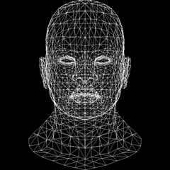
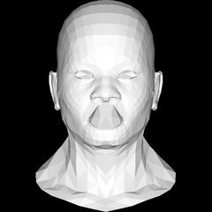
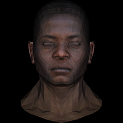
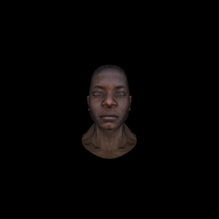
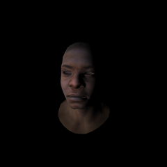
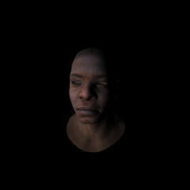

Портировал первые несколько примеров [Tiny renderer or how OpenGL works: software rendering in 500 lines of code](https://github.com/ssloy/tinyrenderer/wiki) софт-рендера с C++ на daScript. Механически и неоптимально, но близко к коду оригинального туториала, для желающих потренироваться в базовых алгоритмах растеризации на daScript.
https://github.com/spiiin/dascript_soft_render

Растеризация отрезков, wireframe

Растеризация треугольников line sweeping, flat shading, отсечение задних граней

Z-буфер, наложение текстурных координат

Перспективная проекция

Камера, Gouraud shading

Коррекция перспективных искажений текстурных координат, растеризация треугольника проверкой барицентрических координат точки, пиксельный и вершинный шейдеры

В оригинале есть ещё детальный разбор матриц (model, view, projection), наложение карты нормалей, тени и ambient occlusion. Но, мне кажется где-то с этого уровня можно продолжать разбираться с графикой уже с помощью графического API.

