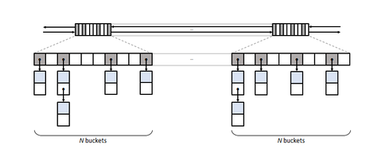
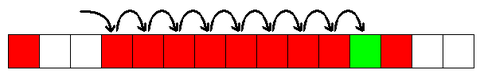

Небольшой обзор типов хеш-таблиц, которые чаще всего встречаются в языках программирования.

<!-- more -->

Материалы:
[1] - [Matt Kulukundis “Designing a Fast, Efficient, Cache-friendly Hash Table, Step by Step”](https://youtu.be/ncHmEUmJZf4)
[2] - [Advancing the state of the art for std::unordered_map implementations](http://bannalia.blogspot.com/2022/06/advancing-state-of-art-for.html)
[3] - [Crafting Interpreters](http://craftinginterpreters.com/hash-tables.html). Глава "Hash tables"
[4] - [Robin Hood Hashing should be your default Hash Table implementation](https://www.sebastiansylvan.com/post/robin-hood-hashing-should-be-your-default-hash-table-implementation/)
[5] - [You Can Do Better than std::unordered_map: New Improvements to Hash Table Performance](https://www.youtube.com/watch?v=M2fKMP47slQ) - доклад автора ska::flat_hash_map
[6] - [Development Plan for Boost.Unordered](https://pdimov.github.io/articles/unordered_dev_plan.html)

Хеш-таблицы (наряду с массивами) -- одна из основных структур данных стандартной библиотеки практически каждого языка программирования. Базовые понятия можно изучить из любой книги по алгоритмам и структурам данных, например, `Седжвик - Фундаментальные алгоритмы на C++`.

Теоретически, хеш-таблица (ассоциативный массив) -- это контейнер, который хранит пары [ключ, значение] с быстрым доступом (амортизированно, O(1)). Практически, есть много интересных нюансов организации хранения.
Хеш-таблица логически организована как несколько корзин (bucket/slot), которые хранят данные (пары, значения, указатели на них). Место хранения (конкретная корзина) определяется с помощью хеш-функции, которая отображает ключ на номер корзины.

## Размер таблицы

Память компьютера не бесконечна, так что количество корзин очевидно должно быть меньше, чем все количество всех возможных значений ключей. Так как хеш-таблицы -- очень общая структура данных, то баланс между размером таблицы и скоростью доступа является сложной задачей. Разные типы хеш-таблиц начинают просаживаться по скорости начиная с различной степени заполненности, так что оптимальный размер таблицы зависит от её внутреннего устройства. Бывают типы таблиц, которые "расширяются" начиная от 50%, 75% или даже 90-95%

## Хеш-функции

Идеальный случай -- если каждый ключ отображается на уникальную корзину. Но когда хеш-функция для двух ключей возвращает одно и то же значение, происходит коллизия. Одно из фундаментальных различий организации хеш-таблиц -- способ работы с коллизиями. От него же зависит от отклонение между теоретическим и практическим временем поиска элемента в таблице.

Тем не менее, перед рассмотрением способов работы с коллизиями, стоит сказать пару слов о хеш-функциях. Чем более равномерно будут "размазаны" входные значения по корзинам хеш-таблицы, тем лучше. Если входные данные неизвестны заранее, то хорошим способом будет максимально рандомизировать хеш-функцию. Огромная часть производительности хеш-таблиц зависит от того, насколько равномерно входные данные попадают в различные корзины, так что первый шаг в проверке производительности -- проверить используемую функцию ([1], [тайминг](https://youtu.be/ncHmEUmJZf4?t=170))

## Идеальное хеширование

В случае, если входные данные известны заранее и можно построить по ним таблицу до начала её использования, можно попробовать перебором подобрать такую хеш-функцию, которая вообще не вызовет коллизий на входных данных (`идеальное хеширование`). Отчасти расширением этого подхода можно назвать [хеширование кукушки](https://www.geeksforgeeks.org/cuckoo-hashing/). В этом случае есть две отдельных хеш таблицы с разными хеш-функциями, и элемент может храниться в любой из двух таблиц. Если слот в одной из корзин занят, можно попробовать положить один из элементов в другую таблицу, и циклически переместить другие занятые в одной из таблиц слоты с другую. Если же найден цикл -- можно попробовать или сменить пару хеш-функций и переложить все элементы в другую таблицу, или добавить третью таблицу с еще одной хеш-функцией.

## Separate chaining

Один из простых случаев разрешения коллизий -- хранить в корзинах не значения, а односвязный список, в который добавляются значения с одинаковым ключом. Такой подход могут называть раздельное хеширование или закрытая адресация (closed addressing, в значении "возможность положить значение не в свою корзину закрыта"). Минусы такого способа, как и самого связанного списка -- необходимость динамического выделения памяти и дополнительный прыжок в памяти по указателю на элемент.

Тем не менее, практически в чистом виде встречается в C++ (`stl::unordered_map`), в [C#](https://github.com/mono/mono/blob/mono-3.0.3/mcs/class/corlib/System.Collections.Generic/Dictionary.cs#L66), Java, [Go](https://medium.com/kalamsilicon/hash-tables-implementation-in-go-48c165c54553).

Для C++, вдобавок, в стандарте прописана необходимость реализации API в виде связанного списка ([N1456](https://www.open-std.org/jtc1/sc22/wg21/docs/papers/2003/n1456.html), комментарий в [1], [тайминг](https://youtu.be/ncHmEUmJZf4?t=549) -- *when stl is starting to make sense, and that is never a good sign*).

`boost::unordered_map`
В [2] приводятся примеры нескольких реализаций такого API и возможных оптимизаций по производительности (*Time and memory performance of Boost 1.80 boost::unordered_map*).

- bucket groups - бит-маска занятых элементов вместо указателей из одного слота в другой (на скрине выше), за счет экономии памяти лучше влезает в кеш
- количество корзин при максимально допустимой загруженности таблицы растет не в 2 раза, а как последовательность простых чисел -- способствует более равномерному распределению при плохом (non-uniform) выборе хеш-функции
([бенчмарк](https://www.boost.org/doc/libs/develop/libs/unordered/doc/html/unordered.html#compliance))
[6] - обзор альтернативных типов таблиц

Одна из нераспространенных на практике идей из классических книг -- сохранять упорядоченность списков для небольшого ускорения проверки наличия элемента в списке (*скорее всего, из-за потери возможности хранить указатели на элементы корзины*)

## Open addressing

Варианты названия:
`Open addressing` (открытая адресация, в смысле, что возможность попадания элемента не свою корзину отрыта)
`Closed hashing` ([3](http://craftinginterpreters.com/hash-tables.html#open-addressing), закрытое хеширование в смысле что возможность элемента оказаться вне корзин закрыта)
`Probing table`([1](https://youtu.be/ncHmEUmJZf4?t=943), для случая, если в корзинах хранятся не указатели, а значения)
`Scatter tables`([Data Structures and Algorithms with Object-Oriented Design Patterns in Java](https://book.huihoo.com/data-structures-and-algorithms-with-object-oriented-design-patterns-in-java/html/page231.html), аналогично)
`Flat map` (аналогично)

Зачем хранить элементы с повторяющимся хешем ключа в связанном списке, если можно положить их в другие корзины? Это сложнее в организации, возникает серия вопросов -- как именно выбрать альтернативную корзину, как узнать, что в корзине находится "не родное" значение, как удалять элементы? Дальнейшую таксономию таблиц с открытой адресацией можно выстроить в зависимости от ответов на эти вопросы.

Варианты ответов:

**`Как выбрать альтернативную корзину`**
- Попробовать следующую (после последней заново проверить первую) -- линейное пробирование.
Распространенный метод из-за того, что дружественный к кешу, элементы хранятся в памяти близко друг к другу.
Может вызывать проблемы при большой загруженности таблицы, но это можно решать различными способами -- пересортировать элементы хранящиеся рядом, позаботиться о более качественном "размазывании", см. раздел "Хеш-функции"), уменьшить коэффициент заполненности, при котором будет увеличено количество корзин. Эти решения проблем будут более детально рассмотрено далее
- Увеличивать шаг не на 1, а по более сложным правилам -- квадрат от номера попытки, другая хеш-функция от значения элемента, etc. Требует хорошего понимания вероятности, насколько выбор шага может действительно улучшить распределение ключей по корзинам (может зависеть от размера таблицы и хеш-функции).

Встречаются экзотические комбинации стратегий - [emhash](https://github.com/ktprime/emhash) в режиме 3-way combined сначала делает несколько линейных проб, затем квадратичные, и дальше пробует втиснуть элемент поочередно в начало/конец таблицы.

**`Удаление значений`**
- Вместо удаления значений, заменить реальное значение в корзине на "надгробие" (tombstone), чтобы при поиске элемента по списку рассматривать его "за этим значением есть другие для проверки", а при вставке нового элемента рассматривать надгробие как пустую корзину для вставки
- В случае линейной вставки элементов в первую попавшуюся пустую корзину можно переместить последний элемент списка на освободившееся пустое место. Несмотря на кажущуюся тривиальность алгоритма, требует аккуратности в реализации (как пример, в книге Кнута алгоритм содержал ошибки)

**`Как отличить неродное значение`**
- В случае линейного пробирования, проверять все соседние занятые элементы до нахождения пустого значения
В случае сильно заполненной корзины, даже без наличия коллизий, может оказаться для что вставки нового значения потребуется проверить по порядку множество уже занятых значений (кластеры из занятых корзин). Аналогичная проблема при поиске несуществующего элемента.

Тривиальный подход слежения за тем, чтобы не образовывались кластеры -- хорошая хеш-функция и низкие значение коеффициенты заполненности (~0.5-0.6) для того, чтобы таблица разрослась раньше, чем в ней образовались большие кластеры из заполненных корзин. Более сложный -- переставлять элементы внутри кластеров так, чтобы уменьшить количество необходимых поисков (алгориты `Брента`, `Робин Гуда`, детальнее ниже)

## Линейное пробирование без перестановок

Почти чистый вариант линейного пробирования без дополнительных хитростей с перестановками элементов приведен в [3].

Вариант из `daScript`:
- Рост таблицы при кластеризации в 2 раза. Чем больше таблица, тем меньше [коеффициент заполненности](https://github.com/GaijinEntertainment/daScript/blob/a0fcdfdbf134d3dfb8055c9218c6e57ff4ae925b/include/daScript/simulate/runtime_table.h#L61) (при увеличение таблицы в 2 раза разрешаем в 6 раз больше промахов)
- Раздельное хранение хешей, хеширование [fnv](https://github.com/GaijinEntertainment/daScript/blob/master/include/daScript/misc/fnv.h)
- Tombstone при удалении

[absl::flat_hash_map](https://abseil.io/docs/cpp/guides/container) + [Swiss Tables Design Notes](https://abseil.io/about/design/swisstables)
[1] - доклад с пошаговым описанием идей дизайна flat_hash_map + [дополнение](https://www.youtube.com/watch?v=JZE3_0qvrMg)
- Раздельное хранение метаинформации + simd инструкции для ускорения проверок

Пример возможной проблемы с кластеризацией значений:

Даже если все элементы отмеченные красным, стояли на своих местах, может получиться, что новый элемент (зеленый), будет вставлен далеко от своего потенциального места (первая стрелка).

Одна из неочевидных проблем линейного пробирования -- про последовательном обходе элементов из хеш-таблицы (неявно отсортированы по возрастанию хешей) и перекладывании их в другую таблицу они попадут туда в очень плохом порядке (при добавлении второй половины таблицы до роста хеши элементов по модулю будут совпадать с хешами из первой половины, которая будет уже плотно заполнена -- зона заполненности "от 0.5 до коэффициент роста" будет содержать большое количество коллизий) -- пример багов в [Delphi](https://habr.com/ru/post/282902/), [Swift](http://lemire.me/blog/2017/01/30/maps-and-sets-can-have-quadratic-time-performance/), [Rust](https://accidentallyquadratic.tumblr.com/post/153545455987/rust-hash-iteration-reinsertion). Возможное решение -- использовать хеш-функцию с возможностью задать стартовый сид и менять его для каждой новой таблицы. Или попробовать предсказать размер заполняемой таблицы заранее.

## Линейное хеширование с перестановкой Брента

На скриншоте выше все элементы представленные красным стоят на своих местах, и могут быть найдены за 1 запрос к таблице. Но при поиске красного элемента нужно будет проверить 9 элементов. При этом, если все красные элементы кластера сдвинуть на 1 вправо, то для поиска каждого из них потребовалось бы всего 2 запроса -- среднее время поиска осталось бы таким же, но максимальное время поиска уменьшилось бы с 9 до 2, в 4.5 раза. Метод Брента -- перед вставкой проверить сколько запросов будет при такой перестановке и выбрать самый оптимальный вариант ([описание и пример](https://www.cs.umd.edu/class/fall2018/cmsc420-0301/lecnotes/Hashing-spring17.pdf), а также какое-то расширение метода в поиск по дереву Gonnet-Munro, [другое описание](https://github.com/ncilengir/brent-hashing) и [другой пример](http://www.minkhollow.ca/Courses/461/Notes/Hashing/HashBrentex1.html)).

Реализация метода Брента в таблицах [lua](https://www.lua.org/source/5.4/ltable.c.html) и [описание](https://poga.github.io/lua53-notes/table.html)

## Линейное хеширование с перестановкой Робин Гуда

[Пейпер](https://cs.uwaterloo.ca/research/tr/1986/CS-86-14.pdf) с описанием метода, там же есть сравнение с методом Брента (стр 51-53) -- чуть более быстрая вставка, за счет немного медленного среднего времени поиска, но более быстрая проверка несуществующего элемента. Позволяет заполнять таблицы на 90% перед тем, как увеличивать объём.

Логика вставки -- если для уже сохраненного в слоте элемента расстояние до его идеальной позиции меньше, чем для нового, то "выселяем" элемент из слота, и проверяем дальше, с кем можно переставить его ("забираем позицию у богатого элемента и отдаём бедному"). [Пример вставки](http://web.stanford.edu/class/archive/cs/cs166/cs166.1196/lectures/13/Slides13.pdf)

Описание в [Rust](https://cglab.ca/~abeinges/blah/robinhood-part-1/):
- Линейное хеширование с перестановкой Робин Гуда
- Рост таблицы после заполненности 0.9 в 2 раза
- Хеш-функция с уникальным сидом для каждой таблицы для защиты от неудачной вставки ключей в порядке увеличения хеш-значений

[ska::flat_hash_map](https://github.com/skarupke/flat_hash_map):
- Линейное хеширование с перестановкой Робин Гуда
- Рост таблицы при первом длинном неудачном пробировании, до следующего prime number

[I Wrote The Fastest Hashtable](https://probablydance.com/2017/02/26/i-wrote-the-fastest-hashtable/) - описание
Используются для внутренних структур данных в [daScript](https://github.com/GaijinEntertainment/daScript/blob/dcecc6f126843fc0914b0be314542caa658fc8d6/include/daScript/das_config.h#L34)
[5] - доклад автора о влиянии отдельных приёмов оптимизации (крутое объяснение форм графиков, можно прикинуть свои паттерны и размеры таблиц), сравнение с различными реализациями хеш карт и хинты реализации

## Бенчмарки
Несколько бенчмарков различных C++ реализаций, с описанием типов таблиц:
https://martin.ankerl.com/2016/09/15/very-fast-hashmap-in-c-part-1/
https://martin.ankerl.com/2019/04/01/hashmap-benchmarks-01-overview/
https://martin.ankerl.com/2022/08/27/hashmap-bench-01/

