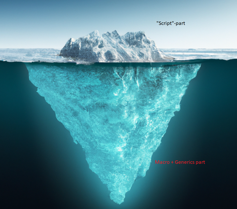
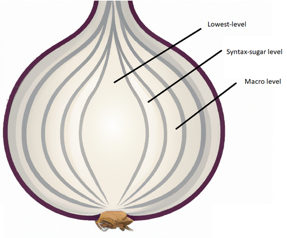

Год назад в первых же заметках про `daScript`:


я отметил для себя такой парадокс - **`Гайдзины делают не замену Lua, они делают замену C++!`**, т.е. дизайн языка -- это совсем не про скрипты, это generic язык, удобный, чтобы делать с его помощью игры.

<!-- more -->

Сам Борис, видимо, устал отвечать на вопросы новичков в стиле "это такая альтернатива lua?" и написал [заметку](https://borisbat.github.io/dascf-blog/2022/12/31/its-not-a-script/) про то, что название сильно сбивает с толку.

## Слои языка

**`Разделение по уровню понимания языка`**

`daScript` -- это айсберг, в котором новичкам видно его верхушку -- скриптовый слой, на котором можно описывать логику и дёргать API движка, например, [dasbox api](https://github.com/imp5imp5/dasbox/blob/main/doc/api.txt). Это первый слой -- glue-язык, на котором можно писать семантически сжатый компактный код как на каком-нибудь python/lua/javascript.
Но при синтаксической похожести уже явно будут видны отличия:

- язык типизированный -- при изучении приходится потратить некоторое время на то, чтобы научиться правильно работать с его типами. В этом он местами сложнее не только луа, но и на C, скорее похож на языки из ml-семейства. Это сделано by-design, ради того, чтобы компилятор ловил больше ошибок, и легче было рефакторить код.
*Некоторые простые для lua паттерны мета-программирования, в котором rtti-информация о типе -- это просто таблица, к которой можно получить доступ, необходимо переделывать с помощью магических макросов, что требует намного более глубокого понимания языка*
- язык позволяет работать на низком уровне -- на котором можно делать практически то же, что и C. Местами про lifetime объектов нужно думать больше, а не меньше, чем в C++, и уж точно не на уровне "включил GC и выключил голову".
- язык быстрый -- наивный код получается +/- таким же производительным, как и наивный С++, а gamedev-specific код (много работы с векторами/матрицами) -- часто и сильно быстрее. Сам код возможно оптимизировать на самом daScript, без подхода "перепишем то, что тормозит на C".
- виртуальную машину языка можно рассматривать не как абстрактную машину, а как AoT-компилятор в C++, который используется как [платформа](https://www.youtube.com/watch?v=8SoJR3sCaR4).

Т.е. уже на этом уровне свойства языка существенно отличаются от того, что обычно понимают под скриптовым языком в геймдеве. Что представляет проблему, так как с позиции изучающего язык новичка "с высоты птичьего полёта" язык кажется не тем, чем он есть на самом деле.


При этом сам айсберг -- это генерики и макросы, с помощью которых можно создавать edsl, изменять синтаксис: от добавления привычных для ООП вещей, которых нет в ядре языка, вроде [интерфейсов](https://raw.githubusercontent.com/GaijinEntertainment/daScript/master/daslib/interfaces.das), или привычных для асинхронного программирования [корутин](https://github.com/GaijinEntertainment/daScript/blob/138f625c7f95943341a5e96cca114ae7d0772ba6/daslib/coroutines.das), до dsl: языки-обёртки над [шейдерными языками](https://github.com/GaijinEntertainment/daScript/blob/master/modules/dasOpenGL/glsl/glsl_opengl.das), и чёрной магии reader macro, позволяющей встраивать альтернативные синтаксисы вроде [регулярных выражений](https://github.com/GaijinEntertainment/daScript/blob/master/daslib/regex_boost.das), а также модифицировать AST-языка.

Парсинг и модификация/генерация AST также упрощает создание инструментов для работы с кодом:
- [daScript language support for vs code](https://marketplace.visualstudio.com/items?itemName=profelis.dascript-plugin) -- отладчик, подсветка кода и вывод типов, помощь с выводом выражений
- [профайлер](https://borisbat.github.io/dascf-blog/2022/12/11/instruments/)
- генерация [привязок](https://github.com/GaijinEntertainment/daScript/tree/master/modules/dasClangBind/bind) к C/C++ библиотекам (можно смотреть, к примеру, `bind_opengl` -- генерится daScript код, для других может генериться и c++-код привязки)
- [описание выражений](https://github.com/GaijinEntertainment/daScript/blob/073bc29145207b39180069ae60f00ed43fad6ea7/examples/test/misc/ast_print.das) в runtime
- [линтеры](https://github.com/GaijinEntertainment/daScript/blob/9e217204864177cf6886c7d8ecc86be1d47dbfca/daslib/lint.das)
- hot code reload -- 
и многое другое.

Такое разделения по испольуемым фичам похоже на то, чем отличается код приложения от кода библиотек на C++ -- прикладной уровень требует знания только основ языка, тогда как написание библиотеки может требовать умений использовать наиболее мощные фичи.

**`Разделение по архитектуре языка`**

В заметке Борис выделяет такие уровни языка (явного название уровней у него нет, поэтому придумал я):
- Lowest level. Низкоуровневое ядро языка, на этом уровне язык можно представить себе как альтернативу C, с фичами вроде арифметики указателей, копирования областей памяти, pod-структур с возможностью настройки размещения в памяти.
- Syntax-sugar level. Уровень синтаксического сахара, абстракции уровня языков Ruby или Python -- блоки, замыкания, таблицы, классы, генераторы и итераторы. Чаще всего реализованы в виде библиотек на самом daScript.
- Macro level. Фичи работы с AST языка, похожие на то, что можно делать в Lisp или Haxe -- "bring your own language", пишем код, который говорит компилятору, как именно интерпретировать другой код.



Ни один из уровней не предназначен для решения проблем, которыми обычно занимаются скриптовые языки -- `daScript` не для написания игровой логики, а для написания *всего* для игры, от логики, до движка -- рендера, шейдеров и физики, и до тулзов - редактора игры, компилятора данных, сервера, скриптов сборки и прочей инфраструктуры вокруг, и соединения всего этого вместе.

## Проблема названия

Вывод заметки -- если *script* в названии не соответствует тому, что представляет собой язык, и только отвлекает от того, на что он потенциально способен (да и *da* - в названии, отсылка к названию движка Gaijin -- **Da**gor Engine, язык начинался как попытка сделать замену предыдущим скриптовым языкам для движка, но уже может использовать и без него), то этого достаточно для того, чтобы переименовать язык во что-то типа **`dasLang`**, так как **das**-часть уже закрепилась в качестве расширения файлов для языка.

Как по мне -- прикольный ход, новое название сохраняет узнаваемость для знакомых со старым, и перестаёт исправляться "умным" поиском на что-то другое и выдавать нерелевантные результаты, хотя и читается по немецки как "так долго".

Побалуюсь немного на тему того, сокращением от чего могло бы быть это название, по аналогии, как `Nimrod`, сократилось до [nim-lang](https://nim-lang.org/) для nim. Случайные свойства и идеи языка, которые первыми пришли мне на ум после изучения `daScript`:

```
- скорость цикла разработки
- выразительность
- экономность ресурсов
- создание абстракций
- чистота (stateless)
- контроль ошибок
- встраиваемость (комбинируемость с другими)
- типизация
- быстрая интерпретация
- дружественность к особенностям железа (hardware-friendly)
- открытость
- бесплатность
- быстрые контексты (fast context reset)
```

Если попробовать аппроксимировать слова вместе, максимально абстрактно склеивая их друг с другом, можно получить что-то такое:

```
скорость (4) <- скорость разработки + быстрая интерпретация + hardware friendly + fast context reset
низкоуровневость (2) <- экономность + hardware friendly
защита (3) <- контроль + типизация + чистота
свобода (4) <- выразительность + комбинируемость + бесплатность + открытость
виртуальность (2) <- выразительность + создание абстракций
```

И еще разок:

```
производительность/performance (6) <- низкоуровневость + скорость
свобода/freedom (4)
безопасность/safety (5) <- защита + виртуальность
```

Уже похоже на motto:


"Performance & creative freedom in safety environment"


Производительный код и свобода творчества в безопасном скриптовом окружении? Кажется безумной, но заманчивой затеей? -- но отчаянный **`dAsperado language (dasLang)`** позволяет именно это.

start: 26
