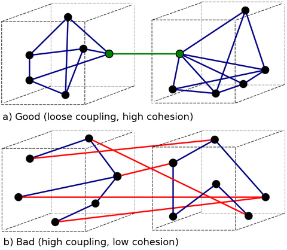
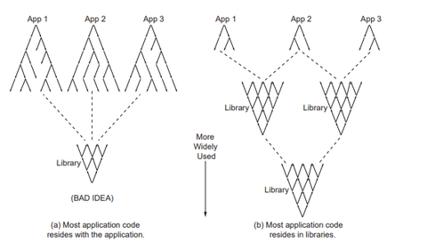
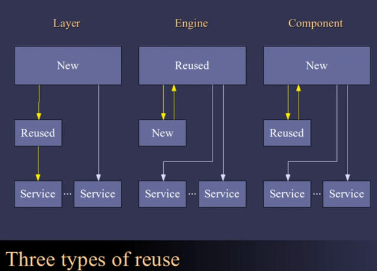

Дамп мыслей про проектирование систем, как обычно, с уклоном в геймдев.
<!-- more -->

## Cohesion and Coupling

[Cohesion](https://en.wikipedia.org/wiki/Cohesion_(computer_science%29) -- степень смысловой связи между сгруппированными элементами (функциями в классе или модуле).
[Coupling](https://en.wikipedia.org/wiki/Coupling_(computer_programming%29) -- степень запутанности связи между модулями.


Хороший вариант дизайна -- высокая cohesion и низкая coupling.

Примеры модулей, в которых скорее всего окажется `низкий cohesion`:
- Utils - сгруппировано все небольшие функции
- GameObject - в котором при ООП дизайне рано или поздно собирается весь функционал, который может потребоваться потомкам (анти-паттерны GodObject/Blob)

Примеры модулей, которые скорее всего могут быть связаны с другими (`высокий coupling`) - системы логгирования, профилирования.
Подсистемы также связываются на уровне реализации игровой логики -- звук шагов задействует подсистемы анимации, звука, физики. Сильно лучше, если подсистемы связаны не между собой, а на отдельном слое связывания.

## Компоненты

Для подсистем с высокой cohesion и низкой coupling встречается название **`компоненты`**, за счет того, что они изолированы друг от друга и могут переиспользоваться.
Один из приемов проектирования -- строить программу из компонентов.

Между слоем компонентов и логики приложения могут лежать и промежуточные слои библиотек:


*(картинка из книги John Lacos - Large-Scale C++ )*

Однако при этом часто на среднем уровне библиотека не оформлена в виде компонентов или даже компоненты на спроектированы так, чтобы использоваться вне библиотеки очень высокого уровня.

Примеры библиотек:
В которых сложно "оторвать компоненты" для использования вне библиотеки (в плане coupling, иногда заниматься отрыванием может мешать и лицензия библиотеки): `Qt`
Средний уровень сложности: `boost` (зависит от конкретной библиотеки, некоторые отрываются неплохо, некоторые тянут за собой в зависимостях половину библиотеки), `entt` (для примера -- оторвать basic_sparse_set/basic_storage можно, но требует усилий)
Легко отделить компоненты: [libnest2d](https://github.com/tamasmeszaros/libnest2d) - надстроена над `clipper/nlopt/boost.geometry`, вполне позволяет подменить любую из этих библиотек

## Software Capital

[CppCon 2016: David Sankel “Building Software Capital: How to write the highest quality code and why"](https://youtu.be/ta3S8CRN2TM?t=572) -- software capital как противоположность техническому долгу.

Необходимые условия для создания software capital:

`Code review`
  - позволяет получить не только собственную оценку качества кода
  - поиск багов
  - проверка соотвествия стандартам компании (взаимодействие позволяет создать стандарты!)
  - социализация -> распространение знаний
  - отчётность качества кода - проверка наличия документации, юнит тестов, отвественность за код на двух людях

О ревью кода часто говорят, но мало кто делает полноценно. У автора есть ещё несколько докладов на тему того, как бороться с менеджерами, которые запрещают не пропускать плохой код. Основной аргумент для менеджеров -- "мы знаем, что данные правила позволяют уменьшить time to market в перспективе". Не пропускать плохой код в мастер, иначе он там и останется (технический долг -- антипод sofware capital). Каждый коммит должен проходить ревью.

*Интересно проверить на практике, насколько эта идея работает*

`Стандарты`
(форматирование, идиомы, организация компонентов, лучшие практики, требования к документации)
  - уменьшение вариативности даёт увеличение продуктивности
  - профессионализм
  - чем более похожа структура, тем проще навигация
  - и обработки кода тулзами (clang-format, refactor, codegen)
  
`Unit testing`
  - безопасный рефакторинг
  - ранее вычищение некоторых багов
  - хинты: для gui -- modularized gui, для io - dependency injections, против "i need ship" - код должен иметь тесты, чтобы пройти код-ревью!, против "я знаю что код работает" -- нам нужно уметь поймать момент, когда из-за изменений в ходе добавления других фич он сломается. Требует CI.
  
`Контракты`
  - Спецификация ожидаемого поведения (in/out), не деталей реализации
  - Позволяет абстрагироваться от реализации, экономит время
  - Плохие интерфейсы видны по их контрактам
  - Подсказка для того, как написать unit-тесты

*Я не встречал, чтобы это применяли на практике*
  
`Хорошие интерфейсы`
  - форма искусства
  - простые контракты
  - управляемые части
  - организация кода: разделение на уровни "компонент/пакет/группа пакетов". Функции класса, не требующие доступа к приватным членам отделяются в ClassUtil
  - не должно быть взаимных зависимостей между двумя компонентами
	 
`Инновации`
  - инновации имеют стоимость - code rot (существующий код становится устравшим), добавление сложности
  - плата - освоение книг, курсов, конференции
	
`Инфраструктура`
  - vcs, ci, build system, core libraries, standards
  - кто-то должен отвечает за всю картину, эта задача требует высокой квалификации

*неочевидное свойство software capital -- новые разработчики обязаны отказываться от своих привычек программирования и используемых инструментов, и переходить/изучать то, что использует и создала компания*

## Зависимости от компонентов и свойства API

По субъективному опыту -- для open-source библиотек можно найти качественные компоненты более "низкого" уровня (то, что можно забросить в 3rdPartyLibs), библиотеки среднего уровня чаще всего (если не считать движения свободного кода) -- проприетарная собственность компаний (1stPartyLibs), так как требуют серьёзного уровня поддержки, который сложно поддерживать небольшой группе разработчиков, а также могут быть заточены под нужды конкретной компании. В Large-Scale C++ такие компоненты, накопленные компаниями, упоминаются, как `software capital`. Большие open-source библиотеки компонентов часто появляются как открытие накопленного корпорацией software capital (`abseil`, `folly`).

Еще одно интересное свойство компонент, которое влияет на простоту их использования -- компактность их API. Так как библиотеки "среднего" уровня могут быть достаточно объёмными, Эрик Реймонд в книге "Искусство программирования для UNIX" вводит термин `полукомпактность` для систем, которые позволяет решать с их помощью большинство задач, используя только небольшую и наиболее используемую компактную часть их API. В качестве примеров полукомпактных систем он приводит `html` или язык `c` (не c++).

[Designing and Evaluating Reusable Components - 2004](https://www.youtube.com/watch?v=ZQ5_u8Lgvyk) -- доклад Casey Muratori (соавтор библиотек [Granny 3D](http://www.radgametools.com/granny.html), которая изолирует нижний уровень компонет - "лист" на графе), про дизайн компонентов и виды зависимостей, которые они могут добавлять на уровне, который их использует. На скриншоте с графом уровней компонент выше рёбра -- это абстрактное "использование" компонент, доклад разбирает виды и характеристики этих соединений.



Свойства API:

`Разделяемость (Granularity)`
Возможность установить/изменить параметры за несколько вызовов -- вставить действие между между ними.
Гибкость VS простота

```cpp
Orientation = GetOrientation(Object)
Change = GetOrientationChange(Object)
Change += 3.14f                //
RunSomeOtherUnrelatedTthing()  // возможность поменять отложенно
SetOrientation(Object, Orientation + Change)
```

`Избыточность (Redundancy)`
Возможность выполнить действия несколькими способами
Удобство VS ортогональность

```cpp
//установка направления с помощью матрицы
SetOrientation3x3(Object, Matrix)
//то же самое с помощью кватерниона
SetOrientationQ(Object, Quat)
//то же самое с помощью заготовленных разработчиками методов/констант
IdentityOrientation(Object)
FaceForward(Object)
```

`Cвязанность (Coupling)`
Зависимости между частями системы (почти всегда плохо, не часто неизбежно)
Несвязанность VS запутанность (["Simple Made Easy" - Rich Hickey (2011)](https://www.youtube.com/watch?v=SxdOUGdseq4 -- более детально))

```cpp
//неразделяемый апдейт всего (к примеру, физики)
UpdateEverything(World)

//нужно установить состояние, прежде чем сделать что-то,
//  возможно скрыто
SetTime(GlobalTime) 
UpdateObject(Object)

//возможность настройки только внутри пары вызовов
// часто подразумевает "не должно быть вложенности"
BeginObjectSpecification()
SetObjectState(Param1, Value1)
Object = EndObjectSpecification()

//Использование скрытого общего буфера
// на который могут указывать String1 и String2
String1 = GetMungedName(Name1)
String2 = GetMungedName(Name2)

//Нельзя сказать "у меня уже есть выделенная память, на которой нужно построить объект"
// или "выдели объект, но я инициализирую его, у меня кастомные инициализаторы из архивов"
Object = AllocateAndInitialize()

//нужно обязательно создавать кастомный тип, хотя клиент может иметь тип для представления
// пример - QString для апи QT
Matrix = MakeMatrixFrom(FloatPointer)
SetOrientation(Object, Matrix)

//связь с форматом файла, нельзя создать самому,
//  зависимость от формата и I/O функций
Object = ReadObject(filename)
```

`Запоминание (Retention)`
Сохранение переданной ранее информации
Ведет к дублирование описания мира "внутри" библиотеки и в пользовательском коде
Сложность синхронизации состояний (комбинаторный рост от количества параметров) VS автоматизация работы после настройки

Immediate mode API ([imgui](https://github.com/ocornut/imgui) как пример) -- одна из идея отказа от запоминания

```cpp
//Настройка значений, которые повлияют на последующие вычисления
SetTime(GlobalTime)
SetPi(3.14f)

//изменение положение потомка также зависит от родителя
SetParent(ChildObject, ParentObject)
UpdateOrientation(ChildObject)
```

Возможно, к "запоминанию" состояния можно отнести также некоторые идеи, которые предлагаются паттернами и парадигмами программирования:
- Асинхронное программирование с запоминанием точек продолжения программы (async/await)
- Реактивное программирование, с запоминаем настроенных потоков данных
- Декларативное программирование, с выполнением кода на какой-либо настроенной или заполненной ранее модели/системе

В системах, в которых настройка может осуществляться гибко, императивное описание может быть лучше декларативного -- явно указываем последовательность операций вместо того, чтобы извращаться с тем, чтобы оставалась возможность точно настроить декларативное описание.

Примеры:
- Декларативные системы сборки в Java Ant и Maven проиграли императивному способу gradle.
- [CadEditor](https://github.com/spiiin/CadEditor/tree/master/CadEditor/settings_nes) -- мой редактор уровней для NES игр. "Стандартный" путь для редакторов уровней -- декларативные конфигурационные файлы. Императивный -- скриптовый язык, позволяющий описать, как загружать уровни, за счёт чего можно добавлять в редактор сотни игр, несильно отличающихся между собой, но всё же отличающихся настолько, что сложно предугадать в декларативной системе заранее.

`Порядок вызовов (Flow Control)`
Вызывает ли библиотека колбеки приложения или приложение функции библиотеки (и зовут ли функции библиотеки колбеки из приложения). Чем чаще необходимо осуществлять передачу управления, тем сложнее отслеживать это пользователю библиотеки.
Контроль на стороне приложения (почти всегда лучше) VS на стороне библиотеки

```cpp
//Для открытия файла будет вызван колбек Open
SetFileCallbacks(Open, Read, Close)
File = OpenFile(Filemame)

//То же самое, но спрятано за ООП,
// где-то скрыто сохранён указатель на функцию открытия
class MyHandler: public LibraryHandler {
  virtual void Open(char* Filename)
}
```

Ещё про свойства библиотек -- 


## Копирование лучших

Вместо написания чего-то с нуля нужно использовать или копировать лучших (смысл не пользоваться накоплненным software capital?).

- Черновая реализация на несколько оптимизаций отстает от оптимальной
- Часто оптимальная может так сильно отличаться от наивной, что переделать станет сложно/невозможно
- Для понимания оптимальной версии может потребоваться больше времени, и знаний для сравнения, чем для написания наивной

Кроме оптимизаций, готовый код содержит фиксы множества ошибок, найденные за время его использования. Джоэл Спольски в эссе [Things You Should Never Do](https://www.joelonsoftware.com/2000/04/06/things-you-should-never-do-part-i/) расписывает печально известную проектировщикам истину -- простой код, написанный с чистого листа, сильно отстаёт от давно написанного сложного, но отлаженного.

При этом копирование плохо работает в чём-то, отличном от кода. [Книжки не заменяют опыта](https://vadzimv.dev/2020/03/07/childs-illusions.html), но обещают успех в случае повторения внешних признаков (чтобы понять границы применимости общих техник, необходимо колоссальное количество опыта).

`Создание инструментов`

Использование и создание лучших инструментов даёт [мультипликативный эффект](https://borisbat.github.io/dascf-blog/2023/03/20/a-matter-of-multipliction/).

Раздел "Инструменты" -- 

*Примеры инструментов для профилирования программ на C++*

Изучение memory layout для C++-структур -- 
Отображение информации от профайлера xcode (cpu и memory) и xperf в виде флеймграфа -- 

Новый инструмент для создания кода (и не только) сейчас -- нейронные сети.

## Performance

**`Data oriented`**
- сначала кажется непривычным
- так как (в случае, если мы думаем о локальности данных в памяти) подстраивается под данные, иногда требует дублирования кода под новые данные
(редко встречается достаточно генерик код, который может работать с кастомными структурами)
- когда подстроишься под то, чтобы думать о расположении данных в памяти, становится сильно проще


Архитектура - это искусство проектировать и конструировать структуры


В геймдеве часто производительность имеет значение:
- там где ограниченные ресурсы - [Spine](http://ru.esotericsoftware.com/)-анимации для мобильных игр начинают тормозить уже на тех телефонах, но которых запускается Fortnite, при этом разработчиков не особо волнует эта проблема. [Ответ](https://youtu.be/rX0ItVEVjHc?t=4645) Mike Acton на позицию "We want not care about this stuff" - "из-за вас я должен ждать 2 минуты, пока открывается word".
- там где конкуренция, кто может выдать круче результат (точнее рассчёт физики, освещения, анимаций, ии)
- там где платишь за сервера. [Ответ](https://youtu.be/KxQpDIKwGUw?t=2399) Максима Барышникова про то, зачем WoT сохраняется поддержка распределенных между серверами арен -- на одном сервере помещается 3 арены, но за счёт того, что движок поддерживает разбиение, можно разместить 7 арен на 2х серверах (по 3.5 на сервер), а не на 3х, плюс можно динамически балансировать рассчёты, если все 4 арены одновременно становятся максимально нагруженными.

**`Performance if a feature`**
- там где количество может переходить в качество, давать новые фичи. Например, без оптимизаций можем сделать RTS, в которых у игрока будет только 100 юнитов, а оптимизациями - как 100, так и 10000 - геймдизайнеры могут сделать фичей огромные армии, или более быстрая обработка позволяет "запихнуть" в освободившееся время ещё что-нибудь интересное.

Кроме производительности конечной программы, немаловажно **`время сборки/пересборки и производительность дебажного билда`** (отлаживать не небажный билд добровольно -- не очень весело).

["Modern" C++ Lamentations](https://aras-p.info/blog/2018/12/28/Modern-C-Lamentations/) -- важная и большая статья о состоянии этого в современном C++ с большим количеством ссылок и сравнениями (*серьёзно, тот случай, когда стоит изучить каждую ссылку из статьи*). Кто-то пишет на ограниченном С++ (`Orthodox C++`), переучивая коллег и новичков, кто-то выбирает и создаёт альтернативные библиотеки (`EASTL`), кто-то переходит на другие языки (`Rust, Jai, Burst C#, daScript`).

-  -- мой обзор применения C++ для разработки игр

[Practical Optimizations](https://www.youtube.com/watch?v=NAVbI1HIzCE) -- доклад Jason Booth c измерениями производительности DoD кода. Важный тезис -- **`optimization is a DESIGN time problem`**. Если не организовать данные в памяти сразу, переделать будет сложно. В докладе есть нестандартные примеры оптимизаций.


