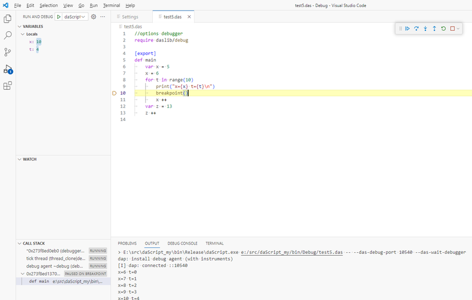

В заметке про  для opengl-приложений в daScript я кратко описывал контексты (раздел `Архитектура приложения`). Здесь разберу их немного более подробно.

<!-- more -->

## Контекст

Программы daScript выполняются в [контексте](https://github.com/GaijinEntertainment/daScript/blob/master/include/daScript/simulate/simulate.h#L252), структуре, которая хранит окружение программы -- выделенную память, в которой хранятся код и данные программы, загруженные модули, настройки виртуальной машины.

[tutorual06](https://github.com/GaijinEntertainment/daScript/blob/master/examples/tutorial/tutorial06.cpp) показывает работу с контекстом в daScript:

```cpp
//загружаем das-файл и компилируем его
auto program = compileDaScript("dummy.das", fAccess, tout, dummyLibGroup);
//создаём контекст, в котором будет выполняться программа
ContextPtr ctx = make_shared<Context>(program->getContextStackSize());
//симулируем выполнение программу (строит дерево симуляции для выполнения в виртуальной машине)
program->simulate(*ctx, tout);
//находим в контексте скомпилированную функцию
SimFunction *fni = ctx->findFunction("test");
//тут могут быть опциональные стадии проверки сигнатуры функции
verifyCall<float>(fni->debugInfo, dummyLibGroup);
//выполняем функцию в контексте, тип результата -- 128-бит
vec4f res = ctx->evalWithCatch(fni, nullptr);
//приводим результат к C++-типу
float result = cast<float>::to(res);
```
( -- немного более детально про симуляцию программы)

Создание и удаление контекстов в daScript дешёво, один из паттернов организации C++-приложения, использующего daScript -- выделение нового контекста, выполнение в нём работы и уничтожение.

Контекст можно воспринимать как экземпляр выполняющейся программы. Программа на С++ может иметь несколько контекстов, каждый из которых может выполнять программу на daScript (как скомпилированную из различных das-файлов, так и из одного и того же).

## Создание контекста из daScript

API для создания контекстов также доступно в самом daScript, так что скрипт сам может создавать новые контексты и выполнять в них программы.

Пример [eval_in_context](https://github.com/GaijinEntertainment/daScript/blob/master/examples/test/misc/eval_in_context.das):

```dascript
//создание текста программы
let text = build_string <| $(st)
    st |> write("[export]\n")
    st |> write("def eval(var res:int?)\n")
    st |> write("\tunsafe\n")
    st |> write("\t\t*res = 42\n")
    st |> write("\n")
//def eval(var res:int?)
//  unsafe
//      *res = 42

access |> set_file_source("__dummy_file_name", text)
  using <| $(var mg:ModuleGroup)
    using <| $(var cop:CodeOfPolicies)
      //компилируем строку с текстом программы
      compile_file("__dummy_file_name",access,unsafe(addr(mg)), cop) <| $(ok,program,errors)
        //строим дерево симуляции
        simulate(program) <| $ (sok; context; serrors )
          unsafe
            var res:int
            //выполняем функцию eval в контексте скомпилированной программы
            context |> invoke_in_context("eval", addr(res))
            print("{res}\n")
```

В примере выше в скомплированные программу передаётся адрес из другого контекста. Это небезопасно, так как один контекст ничего не знает про время жизни переменных другом, поэтому операция отмечена как `unsafe`.

## Форк контекста

Кроме возможности иметь раздельные контексты, daScript позволяет склонировать существующий контекст -- [fork_debug_agent_context](https://github.com/GaijinEntertainment/daScript/blob/cd448fdbd4c6aa81897d2a8543943af112e2cbeb/src/simulate/simulate.cpp#L1659). Функция создаёт клон контекста, и выставляет флаг контекста `persistent`, а затем в этом клонированном контексте выполняет функцию инициализации, переданную аргументом. Обычно в этой функции регистрируется новый `DebugAgent` -- обёртка над контекстом, которая позволяет найти указатель на склонированный контекст по имени (и опционально, изменить поведение с помощью хуков). Склонированный контекст имеет доступ к тому же окружению, что и основной (модули, функции, копии переменных).

**Склонированный контекст не копирует состояние из основного!**

Пример [agent_fork_sample.das](https://github.com/GaijinEntertainment/daScript/blob/726d440be7618fb431815b18e6f785c37a335d5d/examples/test/misc/agent_fork_sample.das)

```dascript
require debugapi

var test_value = "default"

[export] def debug_context_set()
    print("{this_context().name}:{test_value}\n")
    test_value = "debug_context" //изменить значение переменной в контексте debug_context
    print("{this_context().name}:{test_value}\n")

[export]
def main
    this_context().name := "my_context"
    fork_debug_agent_context <| @@(var new_context : Context)
        //вызывается в новом контексте, устанавливаем DebugAgent, который сохранит ссылку на новый контекст
        install_new_debug_agent(new DapiDebugAgent(), "debug_context")

    print("{this_context().name}:{test_value}\n")
    //меняем значение глобальной переменной
    test_value = "my_context"

    print("{this_context().name}:{test_value}\n")
    //ждём создания контекста агента
    while !has_debug_agent_context("debug_context")
        pass
    unsafe
        //изменяем значение переменной в контексте debug_context
        get_debug_agent_context("debug_context") |> invoke_in_context("debug_context_set")
    
    print("{this_context().name}:{test_value}\n")
```

Выведет:
```
my_context:default                            // в основном контексте test_value имеет значение по умолчанию
my_context:my_context                         // изменили значение в основном контексте
debug agent debug_context:default             // <--в склонированном контексте test_value имеет значение по умолчанию
debug agent debug_context:debug_context       // изменили значение в склонированном контексте
my_context:my_context                         // в основном контексте значение test_value не изменилось
```

Аннотация для функций [apply_in_context](https://github.com/GaijinEntertainment/daScript/blob/726d440be7618fb431815b18e6f785c37a335d5d/examples/test/misc/apply_in_context_example.das) позволяет вызывать функцию в другом контексте прозрачно для вызывающего кода. Пример выше можно переписать так:

```dascript
require daslib/apply_in_context

[apply_in_context(debug_context)]
def debug_context_set()
    print("{this_context().name}:{test_value}\n")
    test_value = "debug_context" //изменить значение переменной в контексте debug_context
    print("{this_context().name}:{test_value}\n")

...//тот же код создания агента

while !has_debug_agent_context("debug_context")
    pass
debug_context_set() //функция будет вызвана в контексте debug_context
```


Пример создания отдельного контекста -- модуль [live](https://github.com/GaijinEntertainment/daScript/blob/master/daslib/live.das#L189), пример клонирования -- [opengl_cache](https://github.com/GaijinEntertainment/daScript/blob/5649b32e8b779ceb90b7eabd73f58b7d2077cff6/modules/dasOpenGL/opengl/opengl_cache.das#L56).

## Переопределение поведения debug-агентов

Можно вызвать функции, определённые в классе-наследнике debug-агента ([invoke_debug_agent_function](https://github.com/GaijinEntertainment/daScript/blob/37b86881a8f4890913e2f80537708575c3441a3f/examples/test/misc/invoke_debug_agent_function.das)), но намного более интересной возможностью является переопределения методов. Виртуальная машина daScript отслеживает наличие зарегистрированных отладочных агентов и передаёт им информацию в ходе выполнения программы -- интерфейс [DapiDebugAgent](https://github.com/GaijinEntertainment/daScript/blob/62f8b1b2ff4c873c9fc1b7ada61ed332fb349e4c/src/builtin/debugger.das#L10).

Простые примеры определения кастомных debug-агентов:
[logger_agent](https://github.com/GaijinEntertainment/daScript/blob/685f0415fc1cb2d52ae6c875f702eb7c09862e38/examples/test/misc/logger_and_logger_agent.das) -- добавление кастомного префикса при логгировании
[insturment_function](https://github.com/GaijinEntertainment/daScript/blob/eaa99142af33e7499137c4c7351d02075223cd5b/examples/test/misc/insturment_function.das) -- профилирование вызовов функций. 
[instrument](https://github.com/GaijinEntertainment/daScript/blob/726d440be7618fb431815b18e6f785c37a335d5d/examples/test/misc/instrument.das) -- программный брейкпоинт и пошаговая трассировка

```dascript
options debugger = true    //настройка контекста для работы с хуками debug-агентов
require debugapi           //интерфейсы для кастомных debug-агентов
require rtti               //получение информации о контексте выполнения (доступные модули/функции/переменные/etc)

//программный брейкпоинт, вызывает хук onBreakpoint в debug-агенте
breakpoint
//устанавливает номер строчки, для которой будет вызван хук onInstrument
instrument_node 
//устанавливает режим трассирования, хук onSingleStep будет вызван для каждой строчки выполнения до отключения
set_single_step
//устанавливает фильтр на функции, для которых будет вызван хук onInstrumentFunction 
instrument_all_functions
//вызывает хук onLog
to_log
//вызывает хук onCollect
collect_debug_agent_state
//вызывает хук onVariable у установленного DapiStackWalker
report_context_state
```

Более сложные примеры:
[stackwalk](https://github.com/GaijinEntertainment/daScript/blob/726d440be7618fb431815b18e6f785c37a335d5d/examples/test/misc/stackwalk.das) -- более продвинутая версия `instrument`, устанавливает кастомный `DapiStackWalker` и `DapiDataWalker`, печатает значение локальных переменных на каждом шаге
[context_state_example](https://github.com/GaijinEntertainment/daScript/blob/66e627465d8aca7934c4b6a92f2fc0d16347c9f7/examples/test/misc/context_state_example.das) -- еще немного более полная версия информации о переменных, уже более похожая на информацию для отладчика
[opengl_state](https://github.com/GaijinEntertainment/daScript/blob/767ebf69143244c544dacdc2efed5a7410940ed5/modules/dasOpenGL/opengl/opengl_state.das) -- в хуке onCollect печатает информацию о состояниях OpenGL
[decs_state](https://github.com/GaijinEntertainment/daScript/blob/62f8b1b2ff4c873c9fc1b7ada61ed332fb349e4c/daslib/decs_state.das) -- собирает информацию из модуля `decs` (entity-component-system)
[ast_debug](https://github.com/GaijinEntertainment/daScript/blob/62f8b1b2ff4c873c9fc1b7ada61ed332fb349e4c/daslib/ast_debug.das) -- информация о состоянии expression tree, для отладки макросов

## Инструмнты  основе debug-агентов

Полноценный **`отладчик`** -- [debug](https://github.com/GaijinEntertainment/daScript/blob/2695f756b17bc184016ea97973ef143a669a937e/daslib/debug.das) (debug-агент + сервер для связи с IDE) ([плагин для vscode](https://marketplace.visualstudio.com/items?itemName=profelis.dascript-plugin)):
(необходимо определить `#define DAS_DEBUGGER 1` если это по каким-то причинам не определилось в das_config.h автоматически)


Более продвинутый [пример](https://borisbat.github.io/dascf-blog/2022/12/11/instruments/) **`instrument_function`** -- обёртка, сохраняющая результат в файл, который можно посмотреть в виде флеймграфа.


