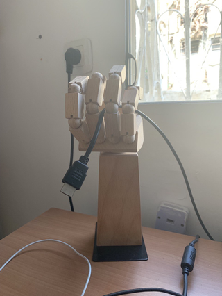

Предыдущие



**`Работа`**

С начала года вернулся работать в "Gaijin", теперь пишу на [daScript](https://spiiin.github.io/tags/dascript/). Нашёл несколько своих коммитов девятилетней давности со старого аккаунта, а также фотографии с корпоративных мероприятий.

Днем отмечаешь релиз и катаешься на квадроциклах по дюнам Шарм-Эль-Шейха, а вечером узнаешь о "зеленых человечках", и о том, что возвращаться придётся в совсем другой Крым. Опционально -- не возвращаться совсем. Необычный опыт погружения в воспоминания из прошлого. Пора уже окончательно попрощаться с этими воспоминаниями.

Начало новой работы -- сложное, за годы кодовая база и тулзы сильно меняются, предыдущее знания устаревают. Побочный эффект накопленного компанией software capital -- необходимость в нём осваиваться. В геймдеве так или иначе, почти постоянно учишься, и обновляешь знания. Не успел закончить на прыдущем месте работы изучение геймдизайнерских/продюссерских материалов, как на новом снова вникать в новые темы. Заодно - привет нейронкам, они с нами всерьёз и надолго, и хорошо бы уметь ими пользоваться. Наверное, необходимость изучения -- это логичная цена за то, чтобы оставаться на фронтире.

Хочется скорее выйти в режим своей нормальной производительности.

*(из книги Ричарда Бира "Мозг фирмы") Как-то так, всегда в зоне критического решения и поиска/изучения технологии B*

Ещё в этом году двое бывших коллег старше 30 ушли из программистов игр, один - в монетизационные менеджеры, другой в вайт-хакеры. Оба частично из-за того, что стало сложно учиться новому. Хех, мне пока наоборот, в кайф изучать что-то новое, было б еще времени побольше. В этом смысле сильно лучше, когда в окружении есть много крутых ребят. Хотелось бы когда-нибудь отметить свое 25-летие в геймдеве, возможно, тоже на каком-нибудь корпоративе у моря.

**`Личное/путешествия`**

Чё-то накрыло с головой от количества событий с начала года. Перебрался из Еревана в Хайфу. Много времени ушло на оформление различных бумажек, много сил на адаптацию в новой среде -- Армения намного ближе по культуре к России или Украине, Израиль сильно другой, во всём.

*Фонтаны ночного Еревана*

*Хайфовские бинарные деревья*

В какой-то момент, сидишь на холме, смотришь на порт и понимаешь, что всё, нет пути обратно, и уже давно. Представляешь себя где-то на барже в океане




Новости слушаешь только по радио, они важны, но далеко, временно важнее то, что происходит рядом. Такая вот чистка информационного фона.

Иногда ныряешь, чтобы что-то вспомнить.

Например, детство. Когда попал в "переход между поколениями", братья и сестры старше на 10 лет, и на чердаке можно найти их старые игрушки. Забытые и отличающиеся от того, что рекламируется и во что играют все. Когда-то дядя и тетя ездили за границу, и привозили оттуда диковинки, которых не было у нас (я не верил в деда мороза, но верил, что их курица несет шоколадные яйца, откуда ж было знать, что существуют киндер-сюрпризы). Игры в комнате с этими игрушками, попытки генерировать сюжеты, вроде книги правил для построения города для игрушек из киндеров, или перестрелки между замками. Дальше - тамагочи, "ну погоди", чэпсы, альбомы с наклейками, и прочие атрибуты 90х. Денди и сега, и желание делать игры. Кажется, что компьютерных играх есть что-то от дворовых развлечений, игрушек и математических формул.

Или позднее, универ и студенческие развлечения, вылазки на природу. Караби и турбаза "точка" на Чатыр Даге (там иногда проводили лан-пати по "контр-страйку", "героям" и "варкрафту"), около-ролевые движухи, Джанк Пати (такой крымский Burning Man), Генуэзская крепость, фестивали в Коктебеле и под Щёлкино, ночёвки с палатками на Инжире (идешь туда по тропинкам на скале над морем, как будто из второй "готики", и где ночью летом светится вода, как будто запускаешь фаербол в "мортал комбате"),  деревни на ЮБК.

Или какой-то момент на работе, когда пытался понять гейм-дизайнеров. Раньше, кажется, многие начинали с редакторов карт. Следующее поколение приходило больше из сценаристов, или игроков/авторов настольных игр. Следующее, вероятно, будет уже начинать с книг по гейм-дизайну или профессионального образования.

Потом выныриваешь, и возвращаешься.

*в общем, путешествия за эти полгода в основном, такие*

Необходимо учиться планировать не на короткий срок, когда чаще всего правильной стратегией будет двигаться туда, куда все, и когда завтра будет то же самое, что и сегодня, с небольшими изменениями (которые можно понять, если сравнить вчера и сегодня), а на длинный. Когда необходимо хотя бы попытаться собрать какую-то информацию, относящуюся к решению, и сделать вывод на основе этой информации, даже если он будет противоречить тому, что было вчера и тому, что есть сегодня. `Вообще говоря, так наверное надо планировать всегда`, а не только когда кажется, что ничего не понятно.

**`Музыка`**

`- Balkan Beat Box + AWA`



`- Balkan Beat Box + Hadag Nahash`



`- Q2A`



**`Фильмы`**
`- Банши Инеширина`
Нелепый сюжет, но классная игра актёров, природа, и просто атмосфера. Также "играет" акцент, если смотреть в оригинале.

`- The Super Mario Bros Movie`
Шикарно. Особенно круто смотреть в 3d с раскачивающимися креслами, весь фильм по сути - экшен над пропастями.

`- Дети СССР`
Израильский фильм о эмигрантах 90х. Несколько раз обманывает с сюжетом, сначала ожидаешь рассказа об упавших на дно подростках, затем спортивного фильм, а на самом деле хорошая социальная драма.

`- Горячая жевательная резинка`
Еще один израильский фильм по формуле, по которой сделан Американский Пирог, но 1978 года.

**`Приобретения`**

`- Steam deck`
После покупки Ninntendo Switch понял, насколько удобнее играть с портативной платформы. Попробовал эмуляторы ([Emu Deck](https://www.emudeck.com/) - отличная сборка, чтобы не возиться с настройкой слишком много), много инди-игр, и пару экшенов. Безумно крутая вещь.

Собрал уже коллекцию портативных приставок, Switch Lite

И рука из Ikea, которая держит провода

**`Игры`**
Протыкал на свитче и стимдеке по несколько часов кучу игр.

`- Fire Emblem Fates/Awakening/Three Houses/Engage (3ds/switch)`
Достаточно простая, по тактике, но завлекательная, игра. Three Houses прикольна тем, что отношения вынесены из дополнительной механики в основную, большой кусок геймплея завязан на построение отношений с учениками, а не только бои.

`- Symfony of War (pc)`
Крутецкая по возможностям тактика.

`- Legend of Zelda: Tears of the Kingdoom (switch)`
Новая Зельда - как обычно нестандартная, с кучей новых механик и загадок на применение на механики, игра

`- It takes Two (switch)`
Отличная игра для прохождения с напарником

Еще разные по чуть-чуть
`- Persona 5, Monster Hunter Stories, Kirby Forgotten Land, Fantasy Strike, Elden Ring, Ori and Blind Forest, Age of Calamity, Oxygen not included`

Интересные инди (раньше мало играл совсем)
`- Journey, Don't Starve, Slay the Spire, Subnautica, Oxygen not Included`

**`Книги`**

`Зубек. Элементы гейм-дизайна` - хорошее описание множества приёмов и техник.
`Галенкин. Маркетинг игр` - основные приемы и возможности для инди и небольших команд, в большинстве устаревшие цифры.
`Гилберт. Спотыкаясь о счастье` - описание множества экспериментов о том, как мы оцениваем будущее, и какие механизмы психики при этом действуют. Наравне с книгами по поведенческой психологии, необходимая книга для понимания действий людей.
`Дневник художника-натуралиста` - как зарисовывать животных и растения.
`Больше не мастерю и другое вранье` - книга по организации LARP, интересные главы про "модели" -- выбор механик и правил. Когда-то ездил на пару ролёвок, но сейчас заинтересовался именно организацией, в рамках расширения знаний по геймдизайну.
`Game feel` - устройство управления в играх. О том, как ощущение контроля персонажа помогает созданию погружения в мир игры.
`Designing emergency + Advanced game mechanics` - по большей части, описание фреймворка для того, чтобы проектировать игровые механики в виде интерактивных схем.
`Карта культурных различий` - в общем вместо книги хватило бы и статьи. О том, что разные команды отличаются в подходах, от количества необходимого общения, до взаимодействий с начальством.

**`Развитие`**

Допишу наверное когда-нибудь во второй половине года.

*Граф заметок в Obsidian*

