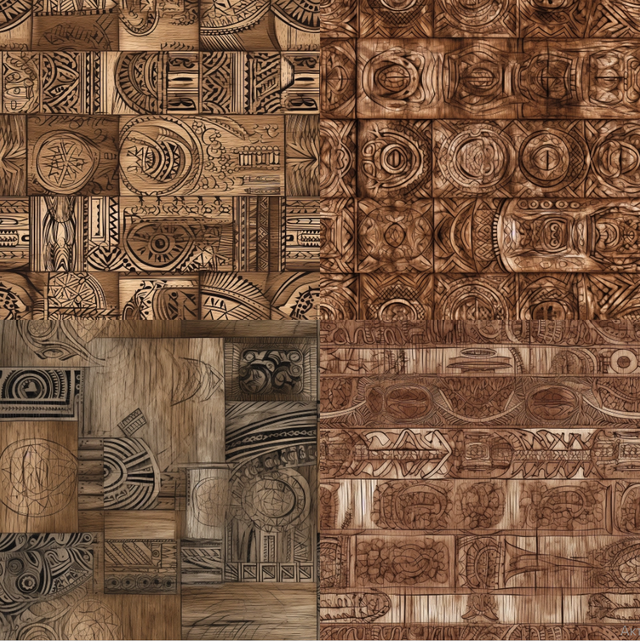
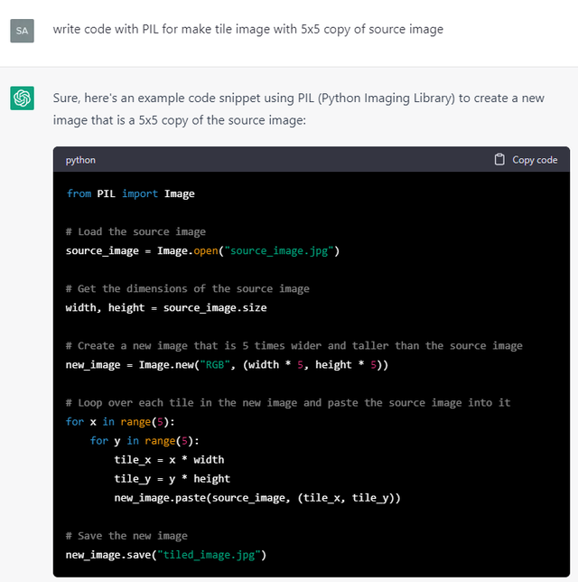
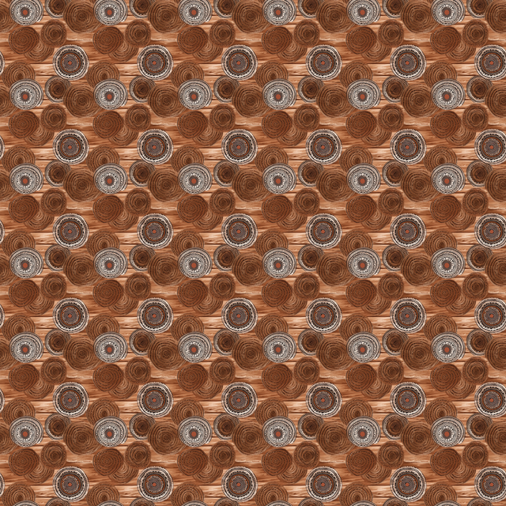
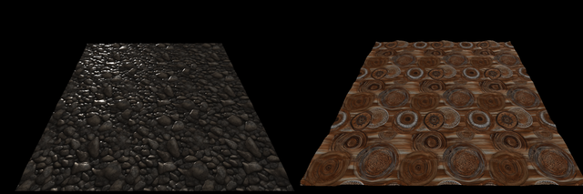
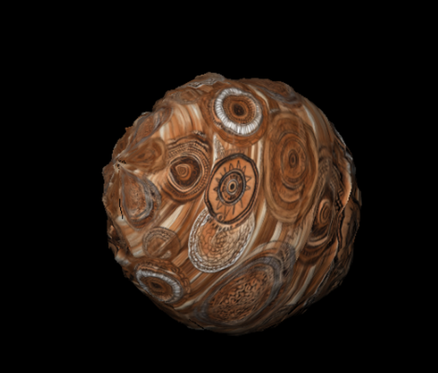
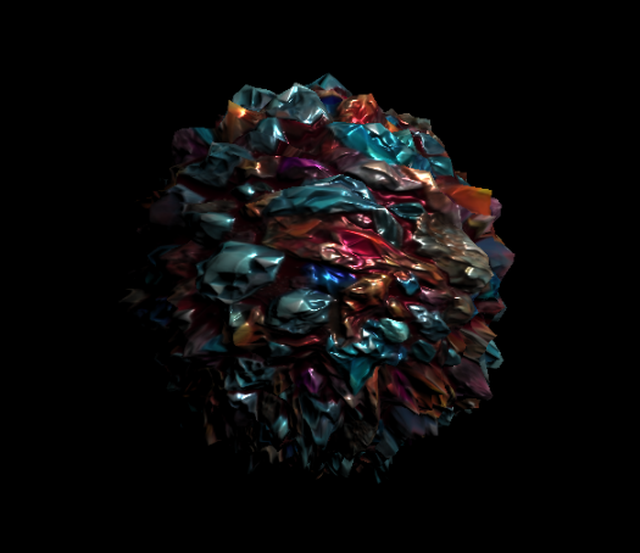

Потестил немного, что умеют нейронки.

[Awesome ChatGPT Prompts](https://github.com/f/awesome-chatgpt-prompts) - примеры запросов к `ChatGPT`
[100+ AI Prompts & Resources](https://trello.com/b/4BPkSY1w/100-ai-prompts-resources-prompt-lovers) - еще один список чит-кодов

Можно попросить ChatGPT сгенерировать развёрнутое описание личности по простому описанию, которое которое можно применить к другому диалогу с ней же. `"Act as English translator"` -- для корректирования своих же запросов на английском, `"Act as photographer"` -- для более красивого описания сцены для генератора изображений. Можно попросить действовать в стиле "Акинатора" -- задавать наводящие вопросы по тому, как должна выглядеть описываемая сцена.

Трюки для `Midjourney`:
[The Ultimate MidJourney Prompting Guide](https://www.youtube.com/watch?v=NBT7hJEZw4k) -- гайд по фичам midjourney
[An advanced guide to writing prompts for Midjourney](https://medium.com/mlearning-ai/an-advanced-guide-to-writing-prompts-for-midjourney-text-to-image-aa12a1e33b6) - список стилей
[Explore Prompting](https://docs.midjourney.com/docs/explore-prompting) -- дока, тоже список стилей
[GPT-4 + Midjourney V5 = A New Era of Photography?](https://www.youtube.com/watch?v=Asg1e_IYzR8) -- chat-gpt4 для генерации запросов (act as photograph)
[Midjourney AI Tutorial | Get AMAZING Midjourney Prompts](https://www.youtube.com/watch?v=N90yjO0bm_w) -- генератор в виде опросника (free trial)
[I Found the Ultimate CHEAT CODE in Midjourney!](https://www.youtube.com/watch?v=_7eH8ugjQtg) -- чит с подготовкой фона, на котором будет нарисован следующий промт

Трюки -- детальное описание сцены, подсказки по стилю, "улучшающие" слова вроде hires, best quality, попытки сохранения стиля с повторением сида, дорисовки по исходной картинке, смешивание картинок.

Одна из фич -- позволяет получить несколько детальных описаний из загруженной картинки, чтобы поэкспериментировать с перегенерацией картинки по этому описанию.

Midjourney рисует лучше Dall-E и StableDiffussion, но платный. Лучше знает названия мест, животных и растений. Для примера сгенерил запросы по местам в Крыму, знает форму дворца Ласточкино Гнездо:


`StableDiffusion` -- бесплатный, рисует хуже, обучен на открытых базах, существуют различные модели, заточенные под различные стили или задачи, а также множество инструментов под различные задачи. Можно поставить локально (нужна видеокарта с 6-8 гб памяти). Можно использовать как библиотеку, либо поставить webgui:
[Artroom](https://github.com/artmamedov/artroom-stable-diffusion/releases)
[Stable Diffustion web UI](https://github.com/AUTOMATIC1111/stable-diffusion-webui)
[Модели](https://huggingface.co/models?other=stable-diffusion)

Примеры работы:
[Гравировка за 10 минут в Stable Diffusion для любой 3D МОДЕЛИ](https://www.youtube.com/watch?v=PUFlt4JVlvI) - генерация по маске
[Stable Diffusion Consistent Character Animation Technique - Tutorial](https://www.youtube.com/watch?v=Ffl8b_GfJ-M) - дорисовка по маске позы
[Ultra fast ControlNet with Diffusers](https://huggingface.co/blog/controlnet) - генерация по драфту, определение позы, [ещё пример](https://huggingface.co/docs/diffusers/main/en/api/pipelines/stable_diffusion/controlnet)
[Interactive Map Generation using Stable Diffusion](https://www.youtube.com/watch?v=FLaics4IT-w) - итеративная дорисовка (если использовать как библиотеку, а не webui, можно было бы вызывать повторения одной функцией)

Модели плагина [ControlNet](https://www.youtube.com/watch?v=vFZgPyCJflE&list=PLXS4AwfYDUi7zeEgJRM-PfB6KKhXt1faY) для StableDiffusion:
    `canny` - дорисовка по силуэту
    `depth` - дорисовка по карте глубины, эту модель использует также расширение Blender Dream Texture, для проекции текстуры на 3d модель. метод depth-leres позволяет настраивать освещение
    `openpose` - захват позы в виде скелета, openpose editor - редактирование скелета
    `scribble` - по грубому черновику картинки


Попробовал скормить midjourney скриншот из Botw-ы с узором на дереве, сгенерировал похожие текстуры:


Так как и Midjourney и Stable Diffusion позволяют сгенерировать тайлящиеся текстуры, то можно пойти дальше и попросить CharGPT написать скрипт, разрезающий результат на части, и отобразить результат сшитой текстуры:




(вместо общения через чат проще использовать [openai](https://github.com/openai/openai-python))

Из полученной текстуры можно с помощью ещё одной модели нейронки [DeepBump](https://github.com/HugoTini/DeepBump) получить карту нормалей и высот. `DeepBump` можно использовать как плагин для Blender или из командной строки:

```
cli.py color.jpg normals.jpg color_to_normals
cli.py normals.png height.png normals_to_height
```

Чтобы посмотреть результат, можно снова попросить ChatGpt написать программу для отображения результата (проще всего выбрать [three.js](https://threejs.org/)):

*"Provide code to show plane with diffuse texture and normal map"* +
*"provide minimal html page to show this example"* +
*"how to run server in python to show this html page?"* +
*"change example to rotate not a plane, but light source"* +
*"change rotating light from timer to rotating by user with mouse"* =
Код примера, и напутствие:
And that's it! With this code, you can display a plane with a diffuse texture and normal map. Keep in mind that this is just a simple example and there are many ways to improve and extend it.





Код нагенерированных примеров, 0 строк ручного кода (кроме тыкания параметров материала для бампа -- roughness/metalness)
https://github.com/spiiin/openai_threejs_bump

Местами уже может сильно упростить жизнь -- собрать несколько простых примеров вместе, напрототипить, выполнить рутинную задачу (иногда с захватом корнер кейсов), получить саммари знаний по теме. С риском галлюцинаций и обмана, но быстрее, чем делать руками.


