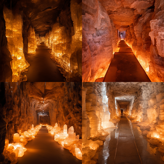
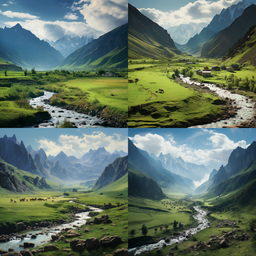
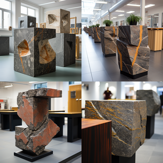
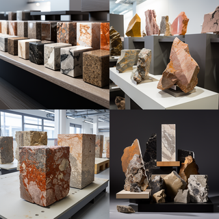
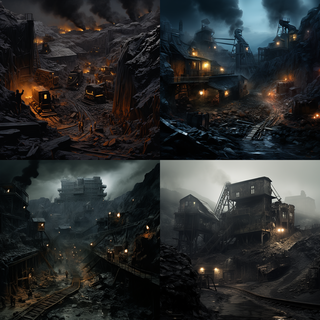
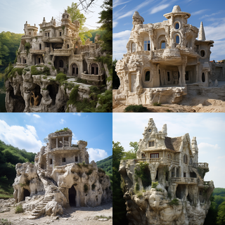
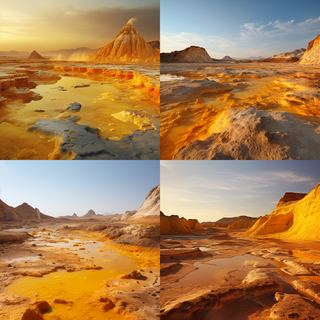
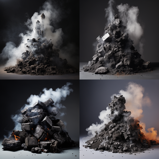
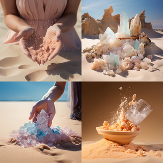

Пока изучал природные материалы, пролистал советский учебник по природоведению для 4-го класса. Простенький список материалов -- песок с серой, гранит (полевой шпат, слюда, кварц), соль, торф, известняк (мел, мрамор, обыкновенный), каменный уголь, антрацит, нефть, чугун, сталь, железо, аллюминий, растворы порошков в воде. Кроме рисования текстур, фантазиями и галлюцинациями нейронок весело и просто проиллюстрировать текст (а google earth - с прогулками по описанным местам) =)

