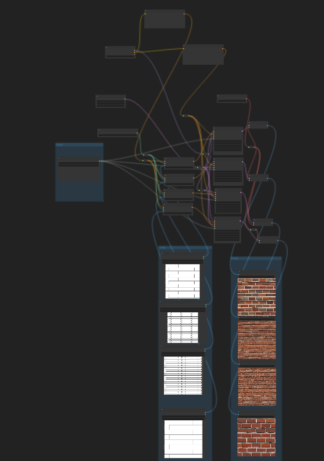
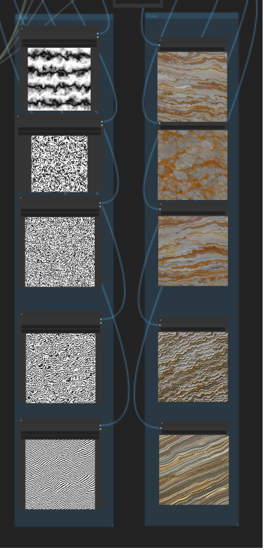

## Stable Diffusion



Известные ИИ модели для рисования -- `Dall-E`, `Midjourney` и `Stable Diffusion`. Stable Diffusion хороша тем, что код открыт, и доступно большое количество плагинов и моделей.

Первый способ "обращаться" к модели за картинкой -- запросом из кода.

[SD – это Linux, а Midjourney – Mac: краткое полное руководство по Stable Diffusion](https://habr.com/ru/companies/selectel/articles/712316/) - терминология
[Шерудим под капотом Stable Diffusion - python код для теста частей модели](https://habr.com/ru/articles/688204/) - еще, вникнуть в термины vae/clip/unet
[Как работает Stable Diffusion: объяснение в картинках](https://habr.com/ru/articles/693298/)
[Как оптимизировать работу Stable Diffusion при помощи текстовой инверсии](https://habr.com/ru/companies/ruvds/articles/706406/)

Второй способ -- генерация с помощью GUI: [ArtRoom](https://github.com/artmamedov/artroom-stable-diffusion/releases), [Automatic1111 webui](https://github.com/AUTOMATIC1111/stable-diffusion-webui), [InvokeAI](https://github.com/invoke-ai/InvokeAI).

Третий, кажется, наиболее интересный, составление пайплайна вызовов с помощью нодового редактора - [ComfyUI](https://github.com/comfyanonymous/ComfyUI). (Нодовый редактор также есть в InvokeAI)

[ComfyUI examples](https://comfyanonymous.github.io/ComfyUI_examples/) - примеры построения пайплайнов. `Inpaint` и `img2img` -- два базовых способа доработки изображения.

[ControlNet](https://comfyanonymous.github.io/ComfyUI_examples/controlnet/) - группа моделей для "снятия" с изображения параметров и использования их -- `поза`, [освещение](https://www.youtube.com/watch?v=_xHC3bT5GBU), `карта глубины`, [форма лица](https://www.youtube.com/watch?v=GF2vIgyn4Qo), `силуэт`, [стиль](https://github.com/comfyanonymous/ComfyUI/issues/65) и т.п.
[Area Composition](https://comfyanonymous.github.io/ComfyUI_examples/area_composition/) - работа с изображением в виде группы текстовых запросов и шагов для различных областей.
[LoRA vs Dreambooth vs Textual Inversion vs Hypernetworks](https://www.youtube.com/watch?v=dVjMiJsuR5o) - разбор нескольких способов применения "дообучения" моделей.
[LATENT Tricks - Amazing ways to use ComfyUI](https://www.youtube.com/watch?v=OdMtJMzjNLg) - различные способы генерации вариаций изображений, интересно само по себе, и как объяснение внедрения в различные шаги пайплайна
[SD dynamic promts](https://github.com/adieyal/sd-dynamic-prompts/blob/main/docs/tutorial.md) - промт-хакинг, генерация вариаций за счет изменений текста запроса
[ControlNet 1.1 Tiles Tutorial](https://youtu.be/EmA0RwWv-os) - один из способов апскейла изображений (существует много других моделей и методов для апскейла)
[ClipSeg](https://github.com/biegert/ComfyUI-CLIPSeg) - кастомный плагин для comfyui для текстового запроса выделения объекта с картинки
[360 degree](https://www.reddit.com/r/StableDiffusion/comments/zgfbj1/i_used_stable_diffusion_to_create_360_degree/) - генерация панорамных изображений в несколько шагов - генерация панорамы сферической карты (бесшовной по одной из осей, и с нужными пропорциями, и правильным текстов запросом), затем разворачивание в cube-map, для того, чтобы с помощью inpaint дорисовать бесшовность у полюсов.

Базовые модели для рисования с помощью StableDiffusion - `sd1.4, sd2.0, sdxl`. Вторая не лучше первой, а альтернативная, [sdxl](https://huggingface.co/stabilityai/stable-diffusion-xl-base-1.0) - лучше обеих. Плагины постепенно апдейтятся для использования с ней.

## Процедурная генерация текстур

Книга по программной генерации текстур -- `Texture and modeling: procedural approach`.

Софт для программной генерации:
[Dark tree](http://www.darksim.com/html/download_darktree2.shtml) - древний, но хороший как референс
[Adobe substance designer 3d](https://kayv.artstation.com/projects/ww3ow) - пример графа генерации царапин
[Blender nodes](https://www.youtube.com/playlist?list=PLsGl9GczcgBs6TtApKKK-L_0Nm6fovNPk) - плейлист на ютубе генерации материалов в Blender
[Shadertoy](https://www.shadertoy.com/view/4sXXW2) - пример шейдера генерации фрактального шума [Масгрейва](https://www.kenmusgrave.com/vision.html)

[Semi-Procedural Textures](https://github.com/ASTex-ICube/semiproctex/) - реализация сразу нескольких интересных идей.
- Point Process Texture Basis Functions - rule-them-all шум, позволяющий сгенерировать множество форм для природных материалов
- "снятие" параметров для этого шума с входного изображения
- выделение понятия "структуры" материала (контуров) и "текстуры" (расцветки)
- генерация по структуре и входной текстуре изображения

Последняя стадия у авторов делается с помощью патентованного алгоритма `Parallel controllable texture synthesis`.
Можно попробовать подменить её на то, чтобы скормить "структуру" как controlnet контур для Stable Diffusion вместе с текстовым описанием материала (*пусть нейронка разукрашивает мультифракталы!*), получается что-то типа `Semi-procedural stable diffusion`, материал часто сохраняет визуальные свойства и бесшовность:

 
*(процедурные кирпичи)*

*(и мрамор)*

