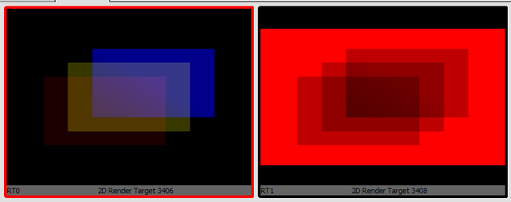
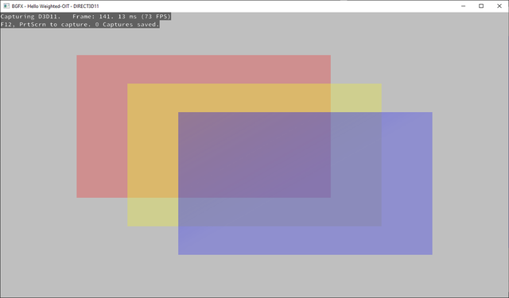

[bgfx](https://github.com/bkaradzic/bgfx) - обёртка над низкоуровневыми графическими api (все основные под desktop, телефоны и web).
[dasBGFX](https://github.com/borisbat/dasBGFX) - байндинги библиотеки к daScript.

`bgfx` умеет использовать `glfw` или `sdl` для создания окна, `dasBGFX` использует `dasGlfw`. Также модуль содержит DSL для трансляции шейдеров с daScript-like языка на BGFX (glsl-like)

В качестве инструкции по сборке можно использовать заметки:
 - сборка с glfw
 - сборка байндингов для sfml

По аналогии:
- выкачиваем сабмодули из git
- включаем дефайны в cmake
- добавляем зависимости от модулей dasGlfw и dasBGFX в какой-нибудь из тестовых проектов
- перегенерируем решение
- проверяем, что настройках проекта добавились пути к include и lib от модулей
- запускаем простые [примеры](https://github.com/borisbat/dasBGFX/blob/main/examples/01_hello_triangle.das)

## Независимая от порядка рендера полупрозрачность

Попробуем портировать чуть более сложный пример - `Weighted Blended Order-Independent Transparency` с `bgfx` (иначе вообще зачем он нужен?)

Очень кратко об идее:
"Традиционный" рендер полупрозрачных полигонов чувствителен и порядку рендера, для корректного смешивания необходимо выводить объекты от дальнего к ближнему по отношению к наблюдателю. Это не всегда удобно, так как:
- объекты могут быть "сплетены", из-за чего их невозможно отсортировать
- трата времени на сортировку
*непрозрачные объекты могут при определенных условиях требовать рендеринга как полупрозрачные - забор с дырками на большом отдалении может содержать прозрачный и непрозрачный полигон, и начать "просвечивать"*

Способы избавиться от необходимости сортировки:
- порезать объекты на части (требует сложной подготовки)
- хранить не только цвет/альфу ближайшего к наблюдателю пикселя, а список из нескольких (требует расхода памяти)
- переопределить оператор смешивания на коммутативный

К третьей группе относится метод `Weighted Blended Order-Independent Transparency`

[пост](https://casual-effects.blogspot.com/2014/03/weighted-blended-order-independent.html) от автора, [дополнение](https://casual-effects.blogspot.com/2015/03/implemented-weighted-blended-order.html) и [пейпер](https://jcgt.org/published/0002/02/09/). Также - [движок] с реализацией, и описание в книге `Computer graphics. Principles and practice` (всё - от него же).
Пара других примеров - имплементация в движке [cesium](https://bagnell.github.io/cesium/Apps/Sandcastle/gallery/OIT.html) (webgl) и пример на [bgfx](https://bkaradzic.github.io/bgfx/examples.html#oit)

Собственно, спортить пример напрямую не получилось, поэтому реализация скорее не перевод примера, а из поста, "в лоб", возможно некорректная, но вроде похожая не референсный скриншот из оригинала.

Других прямых референсов откопать не удалось, а сравнить с "традиционной" прозрачность нельзя, так как независимые от порядка методы содержат погрешности, конкретно `weighted blended`, как следует из названия, содержит "веса" объектов, в зависимости от их прозрачности и удаленности от камеры, так что для корректного использования необходимо представлять себе диапазоны возможных значений. Так что тут скорее "**`проба API`**", а не нормальная реализация.

## Инициализация

После создания окна

**`Создание двух view`**
Один - для рендера в 2 текстуры, второй - для смешивания текстур с восстановлением альфы на экране
```dascript
var display_w, display_h : int
glfwGetWindowSize(window, safe_addr(display_w), safe_addr(display_h))
bgfx_reset(uint(display_w), uint(display_h), BGFX_RESET_VSYNC, bgfx_texture_format COUNT)
bgfx_set_view_rect(0u, 0u, 0u, uint(display_w), uint(display_h))
bgfx_set_view_rect(1u, 0u, 0u, uint(display_w), uint(display_h))
```

**`Создание 2х RT-текстур, в сумме 5 каналов 16-битных float-каналов - RGBA + модификатор`**
```dascript
var fb_textures = [[auto 
    bgfx_create_texture_2d(1280u, 720u, false, 1u, bgfx_texture_format RGBA16F, BGFX_TEXTURE_RT, null);
    bgfx_create_texture_2d(1280u, 720u, false, 1u, bgfx_texture_format R16F, BGFX_TEXTURE_RT, null)
]]

//создаём фреймбуффер, к которому прикрепляем обе текстуры, и привязываем его к первому view
var fbh = bgfx_create_frame_buffer_from_handles(2u, safe_addr(fb_textures),true)
bgfx_set_view_frame_buffer(0u, fbh)
```

**`Заливка текстур начальным значением`**
```dascript
let pal0 = [[float 0.0; 0.0; 0.0; 0.0]] //для RGBA каналов
let pal1 = [[float 1.0; 1.0; 1.0; 1.0]] //для канала с весами
bgfx_set_view_frame_buffer(0u, fbh)
bgfx_set_palette_color(0u, safe_addr(pal0))
bgfx_set_palette_color(1u, safe_addr(pal1))
bgfx_set_view_clear_mrt(0u , BGFX_CLEAR_COLOR|BGFX_CLEAR_DEPTH, 1.0f, 0u, 0u, 1u, 0u, 0u, 0u, 0u, 0u, 0u)
```

## Проход 1 - рендер полупрозрачных объектов
*(алгоритм позволяет использовать уже накопленный буфер глубины и совмещается с другими техниками рендера, но тут - наиболее простая референсная сцена с тремя полупрозрачными квадами)*

**`Шейдер`**

```dascript
var [[in]] a_position : float3
var [[in]] a_color0 : float4
var [[inout, semantics=POSITION1]] v_pos : float4
var [[inout]] v_color0 : float4
var [[uniform]] v_ortho : float4x4

[bgfx_vertex_buffer]
struct Vertex
    position : float3
    color0 : float4

[bgfx_vertex_program]
def vs_main
    v_color0 = a_color0
    gl_Position = v_ortho * float4(a_position, 1.0)
    v_pos = gl_Position

[bgfx_fragment_program]
def fs_main
    var color = v_color0
    //не важно для 2d референсной сцены
    let depth = v_pos.z/v_pos.w
    //не забыть alpha-premultiply
    color.xyz *= color.w
    //настройка веса
    let weight = color.w * clamp(0.03 / (1e-5 + pow(depth, 5.0) ), 0.01, 3000.0)
    //запись в 1-ю rt текстуру RGBA, умноженного на вес
    gl_FragData[0] = color * weight
    //отдельное сохранение веса
    gl_FragData[1] = color.wwww
```

Небольшое необходимое дополнение к [DSL-шейдеров](https://github.com/GaijinEntertainment/daScript/blob/master/modules/dasGlsl/glsl/glsl_common.das#L121):
```dascript
//объявление переменной для записи нескольких output-цветов (в несколько RT-текстур) в пиксельном шейдере
var gl_FragData = [[float4[4] float4(); float4(); float4(); float4()]]
```

**`Настройка смешивания и отрисовка`**

```dascript
vs_main_bind_uniform()
fs_main_bind_uniform()
var stateNoDepth = ( uint64(0)
    | BGFX_STATE_CULL_CW
    | BGFX_STATE_WRITE_RGB
    | BGFX_STATE_WRITE_A
    | BGFX_STATE_DEPTH_TEST_ALWAYS
    | BGFX_STATE_MSAA
)

//флажки для задания режима прозрачности (ONE, ONE) для первой RT1 и (ZERO, SRC_COLOR) для RT2
//separate blendState for RT2
let rt2_blendState =uint(
    BGFX_STATE_BLEND_ZERO >> uint64(BGFX_STATE_BLEND_SHIFT) |
    BGFX_STATE_BLEND_SRC_COLOR >> uint64(BGFX_STATE_BLEND_SHIFT) << uint64(4)
)
bgfx_set_state(
    stateNoDepth | BGFX_STATE_BLEND_FUNC(BGFX_STATE_BLEND_ONE, BGFX_STATE_BLEND_ONE) | BGFX_STATE_BLEND_INDEPENDENT,
    rt2_blendState
)
bgfx_submit(0u, program, 1u, BGFX_DISCARD_NONE)
```

*В пейпере автора рассматривается этот подход и альтернативный, для gpu без поддержки задания раздельных режимов смешивания для различных render target. Они немного отличаются в коде шейдера и смешивании, важно не перепутать сочетание*

Задание раздельных функций смешивания для render-target выглядят в BGFX страшно - в первый параметр передаётся флаг `BGFX_STATE_BLEND_INDEPENDENT`, а во второй (который 32-битный и называется _rgba) - битовая маска для описания режима смешивания второй RT. В c-api это спрятано за макросом для немного менее страшной записи.

На этой стадии можно попробовать отрисовать сцену и подключиться к приложению через графический отладчик, чтобы проверить состояние RT-текстур (например, **`RenderDoc`**):

*текстура развёрнута по y*

## Проход 2 - восстановление альфа канала по текстуре с весами

**`Шейдер`**

```dascript
[bgfx_vertex_buffer]
struct VertexTex
    position : float3
    color0 : float4
    [[type=FLOAT, size=2, semantics=TEXCOORD0, normalized=false, as_int=false]] uv : float2

var [[uniform, stage=0]] s_texColor0 : sampler2D
var [[uniform, stage=1]] s_texColor1 : sampler2D

[bgfx_vertex_program]
def vs_quad
    v_texcoord0 = a_texcoord0
    gl_Position = v_ortho * float4(a_position, 1.0)

[bgfx_fragment_program]
def fs_quad
    let accum   = texture2D(s_texColor0, v_texcoord0)
    let opacity = texture2D(s_texColor1, v_texcoord0).x
    //восстановление и ограничение диапазона
    gl_FragColor  = float4(accum.xyz / clamp(accum.w, 1e-4, 5e4), opacity)
```

**`Настройка смешивания и отрисовка`**

```dascript
//привязка текстур к сэмплерам
s_texColor0 := fb_textures[0]
s_texColor1 := fb_textures[1]

//цвет фона и настройка смешивания
bgfx_set_view_clear(1u, BGFX_CLEAR_COLOR | BGFX_CLEAR_DEPTH, RGBA_TO_BGFX_UCOLOR(0.75, 0.75, 0.75, 1.0), 1.0f, 0u)
bgfx_set_state(BGFX_STATE_WRITE_RGB | BGFX_STATE_BLEND_FUNC(BGFX_STATE_BLEND_INV_SRC_ALPHA, BGFX_STATE_BLEND_SRC_ALPHA), 0u)

//вывод fullscreen квада
vs_quad_bind_uniform()
fs_quad_bind_uniform()
bgfx_submit(1u, program_quad, 1u, BGFX_DISCARD_NONE)
```

**`Результат`**


[Код](https://github.com/spiiin/dascript_trivial_examples/blob/main/das_bgfx_hello_wboit/das_bgfx_hello_wboit.das)