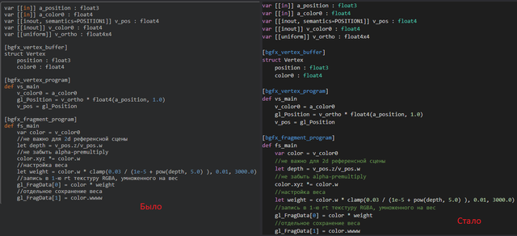

daScript в `vscode` для подсветки может использовать файл с описанием [синтаксиса](https://github.com/GaijinEntertainment/vscode-dascript/blob/master/syntaxes/dascript.tmLanguage.yaml), или [language server](https://github.com/profelis/daScript-plugin) (само хост приложение знает больше о своих данных и коде, чтобы подсказывать редактору).

Формат описания синтаксиса языков подсветки для `hexo` отличается, поэтому всё время до этого я использовал для подсветки похожие на `daScript` языки -- `c++, python, ml`. Я немного повозился с попытками перевода, но решил попробовать взять результаты от самой `vscode`. Она не предназначена для того, чтобы работать со сторонними скриптами в двустороннем режиме (принимать данные и отдавать обратно), но и не запрещает сделать это.

[Наколенный плагин](https://github.com/spiiin/hexo_vscode_dascript_highlight/tree/main/highlight-server) - добавляет команду **`Start highlight server`**, которая стартует http-сервер и слушает порт, по которому можно передать текст для подсветки.
Для работы плагина необходимы:
- один из указанных выше [плагинов для подсветки в vscode](https://marketplace.visualstudio.com/items?itemName=eguskov.dascript)
- плагин [Paste special](https://github.com/d3v-one/vscode-paste-special), который позволяет заменить подсвеченный код на его html эквивалент

[Клиент на python](https://github.com/spiiin/hexo_vscode_dascript_highlight/blob/main/highlight-client/hexo_search_all_post_snippets.py) - тоже наколенный скрипт, который проходит по всем постам моего блога, и заменяет сниппеты кода на их html эквивалент в сгенерированной статической версии (чтобы не потерять исходник). Криво и косо, но выполняет задачу, теперь код постом про [daScript](https://spiiin.github.io/tags/dascript/) подсвечен красивее.

