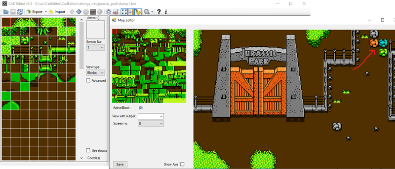
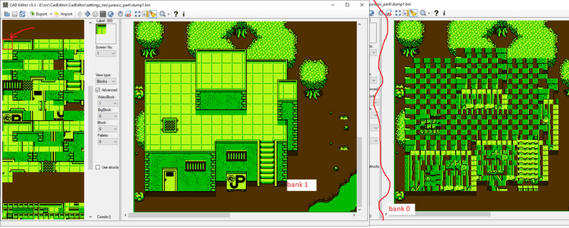
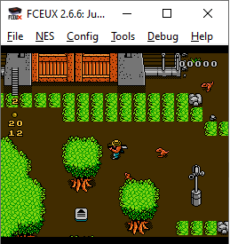
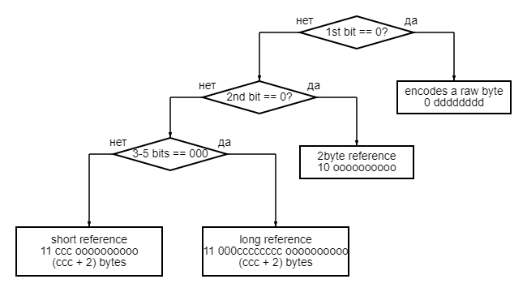

Давно не затрагивал тему реверс-инжиниринга NES игр. После разбора блочного формата описания [уровней]((https://spiiin.github.io/CadEditor/cadeditor-supported-games.html)), остались несколько игр, отмеченных как *comp* (уровень в ROM сжат). Сжатие уровней редко используется в играх NES, чаще сжимается текст или данные описания графики. Да и сам блочный формат уровня уже является формой экономии информации.

Тем не менее некоторые игры используют сжатие [RLE](https://en.wikipedia.org/wiki/Run-length_encoding). В простых формах, как в `Contra`, или в более сложных, как в  , где применяется гибрид RLE и словарного метода. Другие применяют формы **`"описания на холсте"`**, когда команды отрисовки задаются в виде "нарисуй что-то в координатах X,Y" (описание карты мира в играх `Capcom` или уровней в `Super Mario Bros`).

Это относительно простые алгоритмы. Но отдельные игры идут дальше и применяют более совершенные формы сжатия:

[Kirby](https://romhack.github.io/doc/halCompression/) и другие игры `HAL` - гибрид LZ алгоритмов и RLE, с несколькими командами вроде "следующие биты развернуть".
[Dizzy](https://github.com/romhack/codemastersMarkov) и другие игры `Codemasters` - сжатие графики цепями Маркова.

Формат уровней этих игр описан. Однако, в моём списке игр, добавленных в [CadEditor](https://github.com/spiiin/CadEditor/blob/master/CadEditor/cad_editor_supported_games.txt) были ещё две -- `Jurassic Park` и `James Bond Jr`. Я выбрал для разбора `Jurassic Park`, потому что знал, что в нём используется разновидность [LZ](https://en.wikipedia.org/wiki/LZ77_and_LZ78), потому что хотел заодно прочитать про сам алгоритм и его разновидности.

<!-- more-->

## Вступление

(оно же отступление)

При исследовании нового ты оказываешься перед уникальной задачей **один на один**. В CadEditor-е есть пара кусков кода, связанных с LZ-сжатием ( [LZKN](https://spiiin.github.io/CadEditor/cadeditor-using-lzkn.html), написанный `DrMephisto`, и  авторства `DarcyMiles`), но я не касался этого алгоритма на NES.

Я не реверсил NES-игры на протяжении пяти лет, и успел забыть, что это скорее не навык, а состояние. 


"Глядя на мерцающие экраны и на безбрежный поток данных, поднятый моими алгоритмами и мчащийся в никуда по виртуальному пространству цифрового мира, я часто думаю: где я в этом потоке битов и байтов?"


Когда результат УЖЕ найден, алгоритм кажется тривиальным. Но до этого смотришь на матрицу байт, и бесконечный ассемблерный листинг, вообще без понятия, что перед тобой. Потом, когда нашёл свой Диснейленд ([Бодрийаровский](https://exsistencia.livejournal.com/3261.html)) в пещере, забываешь о состоянии, в котором был, пока смотрел в темноту. Поэтому я ценю описание состояния, а не откомментированный результат.

## Блоки

Первое, что можно сделать -- закинуть в темноту  (`autocorrupter + blockfinder`), который покажет "общую форму пещеры".

Он отлично работает и на сжатых картах, единственное, что запускать его нужно не на область ROM, а на область RAM, в которой находятся расжатые данные. Он показывает, что:

- описание карты уровня расположено по адресам 0x60C8-0x72CB, индексами блоков, по 2 байта на блок. 3 нибла кодируют номер блока, 4-й - физические свойства блока
(является ли блок выходом из уровня, препятствием, передним или задним фоном)

- размер блока 2x2, описание которых асположено по адресам 0x76CC, блоков 352 штуки

- слой бит палитры блоков описан отдельно от описания блоков. Т.е. любой блок можно окрасить в любую из 4х палитр


Также обнаруживается интересная особенность -- игра переключает активный банк видеопамяти блоков, когда игрок выходит из нижней или верхней трети экрана в центральную часть. Так что блоки с индексами >0x80 могут распологаться только в нижней трети уровня (ими в первом уровне отрисованы здания).


([Конфиг для CadEditor-а](https://github.com/spiiin/CadEditor/blob/master/CadEditor/settings_nes/jurassic_park/Settings_JurassicPark_1.cs))

Область 0x1000-0x7FFF - это 6-кб CHR-RAM, память доступная для записи, располагается на картридже, в дополнение к 2кб памяти NES (это один из самых больших [картриджей](https://nescartdb.com/profile/view/1038/jurassic-park))

##Декомпрессия

Если поставить брейкпоинт на запись в 0x60C8 (это значение прописано в игре хардкодом как область распаковки), можно выйти на адрес архива в ROM - 0x9D94 (адрес записан в ячейки памяти 95-96).

Также, изучай трейслог между чтением байта из ROM и записью в RAM, стоит запомнить все ячейки, которые изменяются походу -- 6F, 70, 73, 74, 75.
(*меня восхищает, что трейслог команд на ассемблере 6502 может разобрать chatgpt, очень интересно было бы узнать, на каких входных данных он обучился*)

Первые байты архива в ROM и соответствующие им байты распакованных данных:
```
0x9D94: 18 00 20 04 0C 84 00 64
0x60C8: 30 00 30 00 06 84 00 84
```

Пока что связь между сжатыми данными и расжатыми неочевидна. Просто изменять наугад байты архива в ROM (например 0x648C) бесполезно, меняется большая группа распакованных данных, на стенках нашей тёмной пещеры из байт оказывается калейдоскоп из зеркал, отражающих лучи по непредсказуемым траекториям


Более изящный способ -- написать lua-скрипт для эмулятора, который будет трассировать в файл все чтения из архива и записи распакованных данных, а также состояние управляющих распаковкой ячеек.

```lua
local logFile = io.open("jp_unpack1.txt", "w")

local function readMemoryValues()
    return {
        memory.readbyte(0x73),
        memory.readbyte(0x74),
        memory.readbyte(0x75),
        memory.readbyte(0x6F),
        memory.readbyte(0x70)
    }
end

local function logMemoryOperation(operation, address, value)
    local values = readMemoryValues()
    logFile:write(string.format("%s %04X %s %02X --- 73: %02X, 74: %02X, 75: %02X, 6F: %02X, 70: %02X\n",
                                operation, address, operation == "WRITE" and "->" or "<-", value,
                                table.unpack(values)))
end

local function onRead(address, size, value)
    logMemoryOperation("READ ", address, value)
end

local function onWrite(address, size, value)
    logMemoryOperation("WRITE", address, value)
end

local function onWriteExt(address, size, value)
    logMemoryOperation("     ", address, value)
end

local function registerMemoryCallbacks()
    local readRangeStart, readRangeEnd = 0x9D94, 0xA4B1
    local writeRangeStart, writeRangeEnd = 0x60C8, 0x72CB
    local extendedWriteAddresses = {0x6F, 0x70, 0x73, 0x74, 0x75}

    memory.registerread(readRangeStart, readRangeEnd - readRangeStart + 1, onRead)
    memory.registerwrite(writeRangeStart, writeRangeEnd - writeRangeStart + 1, onWrite)

    for _, address in ipairs(extendedWriteAddresses) do
        memory.registerwrite(address, 1, onWriteExt)
    end
end

registerMemoryCallbacks()

emu.registerexit(function()
    if logFile then
        logFile:close()
    end
end)
```

Получается такой лог (большая часть незначащей информации вырезана)

```
READ  9D94 <- 18    --- 73: 00, 74: 00, 75: 00, 6F: 00, 70: 00
READ  9D95 <- 00    --- 73: 00, 74: 02, 75: 00, 6F: 18, 70: 00
   WRITE 60C8 -> 30 --- 73: 00, 74: 00, 75: 00, 6F: 30, 70: 00
READ  9D96 <- 20    --- 73: 00, 74: 03, 75: 00, 6F: 00, 70: 00
   WRITE 60C9 -> 00 --- 73: 80, 74: 00, 75: 00, 6F: 00, 70: 00
                 75 --- 73: 00, 74: 00, 75: 02, 6F: 02, 70: 00
                 74 --- 73: 00, 74: 0A, 75: 02, 6F: 02, 70: 00
                 73 --- 73: 00, 74: 0A, 75: 02, 6F: 02, 70: 00
                 6F --- 73: 00, 74: 0A, 75: 02, 6F: 04, 70: 00
                 70 --- 73: 00, 74: 0A, 75: 02, 6F: 04, 70: 00
                 74 --- 73: 00, 74: 09, 75: 02, 6F: 04, 70: 00
                 73 --- 73: 00, 74: 09, 75: 02, 6F: 04, 70: 00
                 6F --- 73: 00, 74: 09, 75: 02, 6F: 08, 70: 00
                 70 --- 73: 00, 74: 09, 75: 02, 6F: 08, 70: 00
                 74 --- 73: 00, 74: 08, 75: 02, 6F: 08, 70: 00
                 73 --- 73: 00, 74: 08, 75: 02, 6F: 08, 70: 00
                 6F --- 73: 00, 74: 08, 75: 02, 6F: 10, 70: 00
                 70 --- 73: 00, 74: 08, 75: 02, 6F: 10, 70: 00
                 74 --- 73: 00, 74: 07, 75: 02, 6F: 10, 70: 00
                 73 --- 73: 00, 74: 07, 75: 02, 6F: 10, 70: 00
                 6F --- 73: 00, 74: 07, 75: 02, 6F: 20, 70: 00
                 70 --- 73: 00, 74: 07, 75: 02, 6F: 20, 70: 00
READ  9D97 <- 04    --- 73: 00, 74: 07, 75: 02, 6F: 20, 70: 00
   WRITE 60CA -> 30 --- 73: 00, 74: 00, 75: 02, 6F: 01, 70: 00
   WRITE 60CB -> 00 --- 73: 00, 74: 00, 75: 01, 6F: 01, 70: 00
READ  9D98 <- 0C    --- 73: 00, 74: 08, 75: 00, 6F: 04, 70: 00
   WRITE 60CC -> 06 --- 73: 00, 74: 00, 75: 00, 6F: 06, 70: 00
READ  9D99 <- 84    --- 73: 00, 74: 01, 75: 00, 6F: 0C, 70: 00
READ  9D9A <- 00    --- 73: 00, 74: 01, 75: 00, 6F: 84, 70: 00
   WRITE 60CD -> 84 --- 73: 00, 74: 00, 75: 00, 6F: 84, 70: 00
READ  9D9B <- 64    --- 73: 00, 74: 02, 75: 00, 6F: 00, 70: 00
   WRITE 60CE -> 00 --- 73: C8, 74: 00, 75: 00, 6F: 00, 70: 00
READ  9D9C <- 01    --- 73: 00, 74: 09, 75: 03, 6F: 64, 70: 00
READ  9D9D <- 00    --- 73: 00, 74: 01, 75: 03, 6F: 01, 70: 64
   WRITE 60CF -> 84 --- 73: 00, 74: 00, 75: 03, 6F: 01, 70: 00
   WRITE 60D0 -> 00 --- 73: 00, 74: 00, 75: 02, 6F: 01, 70: 00
   WRITE 60D1 -> 84 --- 73: 00, 74: 00, 75: 01, 6F: 01, 70: 00
READ  9D9E <- A1    --- 73: 00, 74: 02, 75: 00, 6F: 00, 70: 00
```

Из этого лога уже можно извлечь почти всё, что нужно для понимания распаковки.

Это очень важный момент! Можно реверс-инжинирить алгоритм в IDA, или долго играться с отладчиком. А можно и не делать этого и перечитать раздел "вступление" ещё раз. **РЕВЕРС НЕ НАВЫК, А СОСТОЯНИЕ**. Т.е. можно обнаружить, что ты уже знаешь решение, просто глядя на трейс-лог, или гуляя по улице -- это не фигура речи. Для проверки правильности решения придётся, конечно, использовать листик и ручку, или отладчик, и скорее всего первичная идея будет содержать ошибки, на само понимание находится где-то до использования инструментов. Всё, что дальше -- уже просто проверка, тривиальная часть.


- Байты на выход выдаются не сразу после команды чтения, а с задержкой на какие-то операции, т.е. скорее всего команды кодируются некратным 8 числом бит

- в ячейке 75 хранится число байт, который будут скопированы из самого выходного потока. Так как это значение не зависит от других управляющих ячеек, вероятно, существуют специальные команды, в которых количество повторов кодируется самой командой. Это важный вывод, который можно и нужно перепроверить

```asm
07:D4B0: A9 02     LDA #$02 //immediate set
07:D4B2: 85 75     STA $75 repeats = #$02
```

- в ячейке 74 -- количество оставшихся для считывания бит для текущей команды. Если при этом "заканчиваются" биты в очередном байте из входной последовательности, считывается следующий

Осталось разобрать, как именно работают команды, выдающие в выходой поток значения, которые уже находились в нём ранее.
Можно поставить точки остановки на область записи распакованных данных и внимательно посмотреть на байты на выходе в тех случаях, когда они не читаются из входного архива.

```
WRITE 60C8 -> 30  <-----------\
WRITE 60C9 -> 00              |
WRITE 60CA -> 30 00 (2 байта) |
WRITE 60CC -> 06
WRITE 60CD -> 84  <--------------\
WRITE 60CE -> 00                 |
WRITE 60CF -> 84 00 84 (3 байта) |
...
```

Это и есть основной принцип работы алгоритма `LZSS` -- он умеет ссылаться на уже существующие в выходной последовательности цепочки байт.

Можно заодно обратить внимание на интересную особенность -- цепочка байт 60CF-60D1 использует ссылку на 60CD-60CF - конец этой цепочки еще не существует в выходной последовательности к моменту использования ссылки на неё (`overlapping-lookingahead`).

`LZSS` можно считать обобщением `RLE` -- `RLE` умеет ссылаться лишь 1 последний символ в выходной последовательности, а `LZSS` -- на любую уже встреченную цепочку символов. Различные разновидности `LZSS`, в зависимости от выделенных на кодирование бит, ограничены в том, насколько далеко назад они могут заглянуть (**`размер скользящего окна`**) и на длину цепочки повторяющихся байт.

Раз входной поток работает на уровне бит, а не байт, то удобно было бы представить его в трейслоге в виде бит. Можно или вписать дополнительную информацию в скрипт трейса (чаще всего работа с битами осуществляется через сдвиги + проверку флага, в который попадаёт сдвинутый бит). Ну или просто набросать скрипт, который парсит уже имеющийся лог, но следит при этом за накопленными битами:

```python
def extract_byte_from_read_line(line):
    hex_value = line.split('<-')[1].strip()[:2]
    return format(int(hex_value, 16), '08b')

def extract_argument_from_74_line(line):
    hex_argument = line.split('74:')[1].split(',')[0].strip()
    return int(hex_argument, 16)

def process_write_command(accumulated_bits):
    bit_string = ''.join(accumulated_bits)
    print(f"{bit_string} ({len(accumulated_bits)} bits)")

def parse_and_print_bits(lines):
    current_byte = None
    bit_index = 0
    accumulated_bits = []
    command_lengths = set()

    for line in lines:
        line = line.strip()

        if line.startswith('READ'):
            current_byte = extract_byte_from_read_line(line)

        elif line.startswith('74 ---'):
            argument = extract_argument_from_74_line(line)
            if argument != 0 and current_byte is not None:
                accumulated_bits.append(current_byte[bit_index])
                bit_index = (bit_index + 1) % 8

        elif line.startswith('WRITE'):
            if accumulated_bits:
                command_lengths.add(len(accumulated_bits))
                process_write_command(accumulated_bits)
                print("  " + line.split("---")[0])
            accumulated_bits = []
            
    print(f"Commands lengths: {command_lengths}")

with open("jp_unpack_60C8_72CB.txt", "rt") as file:
    lines = file.readlines()
parse_and_print_bits(lines)
```
(тривиальная логика, следим за состоянием 74 - ячейки которая контроллирует, сколько бит осталось прочитать в текущей команде)

Обнаруживаем, что есть всего 4 типа команд - из 9, 13, 15 и 23 бит:

```
000110000 (9 bits)
  WRITE 60C8 -> 30
100000000001 (12 bits)
  WRITE 60CA -> 30 
  WRITE 60CB -> 00
110010000000001 (15 bits)
  WRITE 60CF -> 84 
  WRITE 60D0 -> 00 
  WRITE 60D1 -> 84
11000000001100001011101 (23 bits)
  WRITE 729F -> 84 
  WRITE 72A0 -> 3A 
  WRITE 72A1 -> 84 
  WRITE 72A2 -> 3A 
  WRITE 72A3 -> 84 
  WRITE 72A4 -> 3A 
  WRITE 72A5 -> 84 
  WRITE 72A6 -> 3A 
  WRITE 72A7 -> 84 
  WRITE 72A8 -> 3A 
  WRITE 72A9 -> 84 
  WRITE 72AA -> 3A 
  WRITE 72AB -> 84 
  WRITE 72AC -> 34 
  WRITE 72AD -> 84 
```

Такого лога достаточно для расшифровки формата команд (в полном логе их сотни)
```
0 00110000
команда выдачи несжатого байта из входного потока, 0 - код команды

10 0000000001
команда копирования 2х байт (2 - константа, не закодировано в команде)
Биты 10 - код команды
Байты считываются по 10-битному смещению назад от текушей позиции выходного потока

11000 00000110 0001011101
команда копирования 9+X байт из выходного потока
Биты 11000 - код команды
Количество закодировано 8 битами (9+0b00000110 = 15 байт)
Смещение закодировано 10 битами

11 001 0000000001
команда копирования 2+X байт из выходного потока
Количество закодировано 3 битами - (2+0b001 = 3 байта)
Смещение закодировано 10 битами
```

Или в виде блок-схемы:


4612 байт карты сжимаются этим алгоритмом в 1822 байт архива.

## Семейство LZSS

В отличие от классического [LZSS](https://ru.wikipedia.org/wiki/LZSS), здесь использованы 3 типа команд копирования фразы разной длины, чтобы сэкономить немного места на более коротких повторяющихся последовательностях.

Алгоритм активно использовался еще как минимум 2 поколения консолей, так что похожие трюки и вариации можно найти в большинстве компрессоров для Sega Mega Drive или SNES:
[lzkn](https://github.com/lab313ru/lzkn) -- 3 варианта сжатия `Konami`
[mdcomp](https://github.com/flamewing/mdcomp) -- компрессоры из `Sonic` (Kosinski, Nemesis, Saxman и другие). Generic код, с поддержкой нескольких вариантов алгоритма.

Отличия в вариациях алгоритмов:
- Часто биты команд сгруппированаы в отдельные байты (description fields), а не перемешаны с битами данных. Связано это с тем, что считывать и работать с целыми байтами быстрее -- можно передать 8 несжатых байт выравненными блоками
- С этим же связана подстройка размера команд и сжатых данных под выравнивание
- Биты/байты команд могут вообще храниться в отдельном потоке, независимом от потока аргументов этих команд (смещений и длин цепочек). Опционально -- в little или big-endian.
- Некоторые вариации умеют брать данные не только из окна выходного буфера, а откуда-нибудь ещё (захардкоженные словари или просто нули)
- Небольшие отличия в порядке хранения байт данных и байт команд из сжатого потока:
  - пишется ли следующий байт команд сразу, как заканчиваются биты предыдущего, или только когда потребуются новые биты 
  - необходим ли финальный байт команд (например, если в нём могут содержаться биты окончания потока)

В **`mdcomp`** эти настройки вынесены в шаблонный класс-адаптор [LZSSAdaptor](https://github.com/flamewing/mdcomp/blob/26bfc205b96afe04e0941d3092865eaf6c972f81/include/mdcomp/lzss.hh#L223)

Кроме различий в кодировании команд могут отличаться также и алгоритмы компрессии. Большинство компрессоров реализуют примитивный алгоритм поиска подстроки в скользящем окне. Возможные оптимизации:
- использование структур для более быстрого поиска подстроки ([сравнение](https://github.com/flamewing/mdcomp/blob/26bfc205b96afe04e0941d3092865eaf6c972f81/include/mdcomp/lzss.hh#L223)).
- проверка не только самой длинной подстроки, не и более коротких -- с набором укороченных команд это может дать лучший результат ([пример](https://sonicresearch.org/community/index.php?threads/konami-compression-tools.5937/#post-84424) для Kosinki)
- учёт самопересечения цепочки -- байт начала цепочки, выданные в выходной буфер, могут служить концом этой же цепочки ([overlapping-lookahead](https://stackoverflow.com/questions/31347593/matches-overlapping-lookahead-on-lz77-lzss-with-suffix-trees))

Репо со скриптами и логами
https://github.com/spiiin/nes_compression/tree/main/jurassic_park


