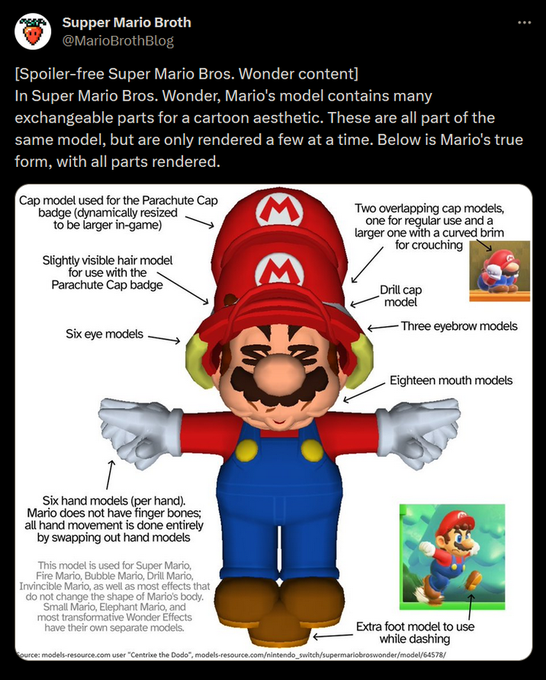

## Дизайн
[Into the Depth: Super Mario World](https://eggplant.show/into-the-depths-super-mario-world-part-1) -- разбор механик Super Mario World в 6 частях, от авторов инди-платформеров `Spelunky` и `Celeste`.
- Геймдизайн "Марио" (и "Зельды") вплетён в днк современных геймдизайнеров (даже если кто-то больше играл в Соника)
- Изначально была идея чтобы игра воспринималась как атлетическая - https://purenintendo.com/miyamoto-talks-about-the-original-super-mario-bros/
- Миямото описывает игру как challenge, чтобы всегда была "коробка с челленджами"
- Туториал по механикам - https://www.youtube.com/watch?v=QpgPLsNv9uE, для тренировки в kaizo-хаках
- Цвета йоши и домиков соответствуют 4м кнопкам джойпада snes https://www.youtube.com/watch?v=zgtYV41yXbU
- Две кнопки для бега позволяют не переставая бежать выполнять действия, которые требуют нажать кнопку для бега (выпустить снаряд или ударить хвостом)

[Reverse game design SMW](https://thegamedesignforum.com/features/RD_SMW_1.html)
[Дополнение](https://habr.com/ru/companies/plarium/articles/307428/)
[An Intro to Videogame Design History. Part2. The Composite Era](https://thegamedesignforum.com/features/GDH_2.html) - Super Mario открыл эру игр с композитным дизайном (прыжки от аркады, выстрелы и борьба с врагами из экшенов)

## Tech-art
- Super Mario 64 - первая игра со скелетной анимацией
- Модель Марио из Super Mario Wonder содержит множество мешей, которые включаются и отключаются динамически для создания мультяшных эффектов ([link](https://twitter.com/DMeville/status/1740873118099661013)) - 3 ноги, 18 мешей рта, 6 пар рук и 3 пары бровей.

## Звук
[Как устроен звук в Марио. Гармонизация. Секрет звукодизайна Nintendo](https://www.youtube.com/watch?v=KuyA12ezwS4)
[Как устроена музыка в играх Нинтендо](https://www.youtube.com/watch?v=9H7B0n-Gk1A)
- В серии Марио звук встроен в мелодию, синхронизирован с ритмом, и иногда меняется вместе с музыкой. Анимации также могут быть подстроены под ритм музыки
- Заимствования. Музыка из 1-2 - https://youtu.be/ZX5ef_KAZlY?si=WSnDh-Iw0hy-FrPF

## Бонус
[If you look hard enough...](https://shedevr.org.ru/cgi-bin/parse.cgi?id=super_mario_bros_tas_review) -- TAS игры
[Super Mario World "Arbitrary Code Execution"](https://www.youtube.com/watch?v=OPcV9uIY5i4) -- произвольное испольнение кода
[Statically Recompiling NES Games](https://andrewkelley.me/post/jamulator.html)
- Из-за оптимизаций игры применяются приёмы вроде jmp на середину инструкции

