Навеяно статьёй [Вы точно хотите пойти программистом в gamedev?](https://habr.com/ru/articles/774972/) dalerank-a и лекцией [Лекция #14. Паттерны revisited](https://gamedev.ru/community/gamedev_lecture/articles/?id=571) aruslan-а 2006 года. Иногда и просто пересказ мыслей оттуда, а также много истории.

Кажется (судя по linkedin + иногда из личного общения), что осмысленно рассуждать и обобщать в геймдеве, можно _начать_ только где-то после 8-10 лет работы в индустрии. Может быть, если есть хороший учитель, то раза в 2 быстрее.

>Мудрость не всегда приходит с возрастом, иногда возраст приходит один

Естественно, нужно не только время. Прокачка хард-скиллов важна, но для понимания динамики процессов развития геймдев-компаний необходимо ещё как минимум:
- выборка нескольких компаний и наблюдение за ними, и процессы перехода между стадиями (с поправкой на меняющие условия рынка)
- пронаблюдать и проанализировать долгосрочные последствия принятых решений
- понимание уровня абстракции, на котором можно об этом рассуждать, терминология (системное мышление? язык паттернов? свой язык?). Слишком общая мешает описывать явления, специфичные для геймдева, слишком частная уводит в необходимость пояснять каждый свой термин
- время на то, чтобы поковыряться с тем, что уже надумали другие. Врубиться в чужие рассуждения 15-летней давности и терминологию, как и в чужой код, непросто.

Но если хочется залезть на плечи гигантов, то стоит попробовать


История в этом посте не для ностальгии, и не для того, чтобы оспорить аргументы дискуссий 10-20 летней давности, а для дела:
- Эволюция движков и используемые практики связаны не только с какими-то "абсолютными" характеристиками кода, а с внешними условиями (чаще всего -- у кого сколько денег, и кто сколько денег может заработать с игроков). Чтобы продать движок нужна команда продажников, которые будут его продавать. По ссылкам при желании можно восстановить контекст. Часть продуктов, вроде Unreal, на слуху и сейчас, часть того, что казалось большим и серьёзным, уже не существует (XNA, Renderware).
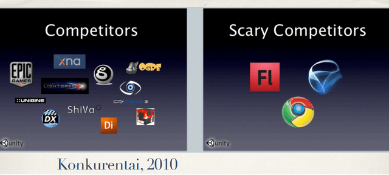
Конкуренты Unity 2010, попробуйте разгадать все логотипы. [Random Stories About Unity](https://aras-p.info/texts/files/2017-VVK-Unity.pdf)


- Если для окупаемости игры достаточно нескольких программистов, пишущих приложение, и соответствующего качества кода/арта, то они такие и будут. Примеры: ранние состояния appstore, [hyper casual](https://vas3k.club/post/20571/), windows, появление домашних пк.
- В интернете информация живёт не вечно, что особенно заметно при археологических раскопках блогов 2000х (особенно если походить ещё там по ссылкам), пересказ помогает сохранить информацию, которая и сейчас не потеряла актуальности.
- Мониторить устройство даже нескольких движков непросто. Движки отличаются не только дизайном/архитектурой, но и количеством и качеством фич. Кроме оценки используемых паттернов с высоты птичьего полёта, существует еще и качество реализации. Aruslan в лекции говорит в том, что сравнивает только "правильные" реализации паттернов. Это необходимое допущение для его уровня рассуждений, но в реальных достигших зрелости движках и библиотеках всё равно существует много грязи, или кривых реализаций. Из-за объёма кода, трудоёмкости и наличия легаси-кода. Публичная информация о движках поступает от маркетинга, а не программистов, её же можно увидеть и на ресурсах типа википедии. Старые записи -- чуть ли не единственное место с субъективными оценками от программистов.

Шутейки и афоризмы про музыку и дзен захвачены и пересказаны вместе с идеями.

Стартовые моменты:

## Архитектура и проектирование (design), это не одно и тоже. Архитектор и проектировщик -- разные должности

Архитектура - про процессы и результаты, дизайн -- про решения (иногда в терминах паттернов и идиом).  Основной смысл деятельности дизайнера -- в выборе решения. Именно в выборе, поиске компромисса. Дизайн не про выбор хорошего вместо плохого, в этом случае просто: если можешь сделать хорошо -- сделай.

Но бывает необходим выбор точки на шкале, в которой обе крайние положения "хорошие", и при этом присутствуют различные глобальные силы, которые тянут в разные стороны, и у решения будут различные далекоидущие последствия. Глобальные силы -- не про программирование, а про распределение обязанностей.

-  - по моим архетипам программистов, дизайнер там же, где и архитектор, разве что наверное чуток сдвинут в сторону продюссера

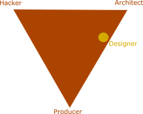

## Работа дизайнера -- сделать так, чтобы попасть в желаемую точку на каждой шкале

К примеру, тут -- . 
`Зависимости от компонентов и свойства API` выбор по шкалам:
- Разделяемость (Granularity) -> шкала "Гибкость vs простота"
- Избыточность (Redundancy) -> Удобство vs ортогональность
- Cвязанность (Coupling) -> Несвязанность vs запутанность (не надо выбирать запутанность, "дзен-даунизм" в терминах aruslan-а)
- Запоминание (Retention) -> Сложность синхронизации состояний vs автоматизация работы после настройки
- Порядок вызовов (Flow Control) -> Контроль на стороне приложения vs на стороне библиотеки

И немного тут --  (но большая часть критериев на луче "хорошо/плохо")
- покупать vs брать готовое
- framework vs library
- простота vs гибкость

Тут не шкала -- , а просто необходимый дзен-майндсет для начала перехода компании с фазы 1 на фазу 2 (про фазы дальше, простыми словами это "начать разгребать авгиевы конюшни").

Один из инструментов дизайнера -- паттерны.

## Паттерны не обязательно связаны с языками программирования

*Насчёт перевода "паттерн", в русском встречается ещё "шаблон". На курсах английского (в котором тоже бывают "грамматические паттерны") преподаватель предложил вариант "узор", который мне кажется более красивым и подходящим словом для описания того, про что писал Кристофер Александер изначально. "Шаблон" - это жёсткая форма, не допускающая вариативности, а "узор" -- название для подобных друг другу, но отличающихся структур, замеченных в хаосе вселенной. Но менять что-то, кажется, уже поздно*

Паттерны проектирования иногда ошибочно сводят к идеям GoF, но почти все идеи оттуда -- **`design for change`**, организация борьбы с изменениями, инкапсуляция устойчивости к изменениям В КОДЕ , то есть уже в рамках картины мира "как нам это программировать".

## Паттерны нулевого порядка

Пример паттерна "нулевого порядка" -- направление дизайна. Игра не дизайнится сверху вниз или снизу вверх или из середины. Направление дизайна и есть решение, зависящее от реальных проблем, которые стоят. По изначальным данным от маркетинга ещё не понятно, что нужно делать. 10 миллионов долларов (по нынешним временам может и 100) тоже сразу никто не выделит. Найти 15 программистов тоже не мгновенно. Так что для первых 1-3 программистов в начале нужны такие задачи, которые позволят двигаться дальше.

Собственно паттерны этого уровня -- это **`способ организации компании/команды`**.
 - Кто что будет делать.
 - Какие специализации у вас возникнут, когда вы взлетите.
 - Что важнее - время, качество кода, масштабируемость процесса, средние специалисты (которых легко нанять) и т.п.


-  -- про последствия разницы в начальном организационном выборе

Шкала здесь -- `небольшая компания VS большая`.

Способы организации, как и в любом паттерне, могут отличаться. Например, для организации небольшой компании *могут* использоваться принципы , или идеи Стэффорда Бира из [кибернетики](https://ru.wikipedia.org/wiki/%D0%9C%D0%BE%D0%B7%D0%B3_%D1%84%D0%B8%D1%80%D0%BC%D1%8B). Ограничением размера будет скорее [Число Данбара](https://ru.wikipedia.org/wiki/%D0%A7%D0%B8%D1%81%D0%BB%D0%BE_%D0%94%D0%B0%D0%BD%D0%B1%D0%B0%D1%80%D0%B0). Пока оно не превышено, можно использовать различные способы организации небольших групп.

После превышения система все равно становится похожа на иерархию, т.е. можно смотреть на то, как организовываются корпорации, армии и государства. Альтернативные идеи -- в децентрализованных системах без доверия или [FOSS](https://en.wikipedia.org/wiki/Free_and_open-source_software) ([What Business Can Learn from Open Source](https://paulgraham.com/opensource.html)).

Еще одна шкала уровня организации компании/команды -- **`отношения между управляющими и подчинёнными`**. С одной стороны, целью компании является заработок денег. С другой -- если требовать от небольшого количества людей за минимальную зарплату выдавать результат в кратчайшие сроки, отношения с исполнителями будут не дружеские.

*Если дизайнер одновременно и менеджер и враждует с программистами -- это не выбор на шкале, это всегда неправильно, люди разбегутся*

**Есть только три способа сделать продукт дешевле: меньше людей, меньше зарплаты и меньше сроки. И есть только один способ сделать игру интереснее: дать возможность "двигать ползунки" тем, кто в этом понимает.** Типично это не программисты.

>Разделение на подсистемы (и соответствующая специализация персонала), выбор системы на основе микроядра и т.п. - это всё первые, архитектурные паттерны. Будет ли система распределенной, будет ли игра просто игрой или это будет здоровый тулсет для её разработки и т.п. Первые решения потребуют от вас первого простого дзена - оценка масштаба проекта. Пет-прожекты не требуют мощных сложных комплексов паттернов.  Это будет для них overkill. Реальные игровые проекты - это не только и не столько программирование.  И программирование там сильно разное.  Масштаб другой.

**`YOLO-кодинг`**

Угадать с масштабом не просто, многие начинают с [YOLO-кодинга](https://github.com/a327ex/blog/issues/31) (aka "Coding like it's 1999")
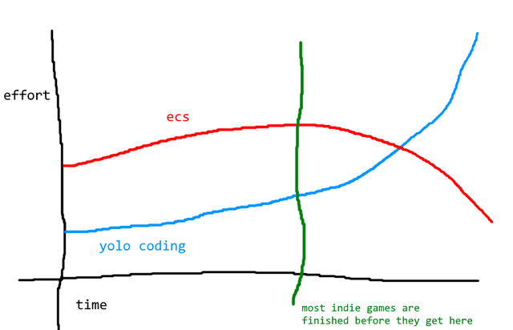
(вместо ecs тут можно подставить другие архитектурные решения)

Почему происходит именно так? Да миллион причин.
- Проверить идею в виде прототипа кинули миддла (без разницы, как его в компании называют, пусть будет "23-летний бородатый сеньор"). Все более грамотные заняты чем-то неотложным
- Компания не доросла до уровня, когда можно стартовать с чего-то серьёзного (у aruslan-а есть разделение компаний по 4-м уровням, перескажу дальше), приходиться форкаться от того, что есть в наличии
- Не угадали с масштабом (например, в потолок своего задуманного масштаба, кажется, упирается [Godot](https://godotengine.org/)). Про игровые прототипы вспоминают, что они прототипы иногда лет через 5.


-  -- тут есть про проблему масштаба и на то, как влияет на неё используемый язык.

**`Выбор языка -- паттерн нулевого уровня`**. В геймдеве редко совершают выбор основного языка, выбирают сразу "пакет" из движка и тулзов. Шкала тут `Modern C++ VS Orthodox C++`. Может еще через 5 лет расширится.
(здесь именно про выбор языка для "скелета" игры, про баланс между "системный язык VS язык логики игры" будет дальше)

Принятые решения на уровне паттернов нулевого порядка -- самые страшные и самые сильные.

Поэтому всем хочется найти тут серебряную пулю, но одновременно все консервативны относительно решений, которые "вроде уже сработали где-то".

Так, допустим дизайнер не испугался и определился с этими абстрактными и страшными "паттернами нулевого уровня". Несмотря на кажущееся огромным пространство возможностей, существует не очень много реально работающих вариантов развития. Один из типичных путей описан в другой заметке aruslan-а. Этот путь состоит из четырёх фаз развития геймдев-компаний, в некоторых местах будут ссылки на названия паттернов без объяснений, а то получится совсем длинно.

Про паттерны архитектуры софта можно почитать:
- [Pattern-Oriented Software Architecture](https://en.wikipedia.org/wiki/Pattern-Oriented_Software_Architecture)
- [c2 wiki](https://wiki.c2.com/?CategoryPattern)
- [John Curley Design Patterns](https://web.archive.org/web/20040608074336/http://www.jcurley.com/software/design-patterns/design-patterns.html)

## Journey from Object Oriented Design to Data Driven Design

[Оригинал](https://gamedev.ru/community/oo_design/forum/?id=886&page=2&m=12750#m22)

>В жизни многих игровых компаний есть фаза конструирования data-driven (table-driven, blabla-driven, Общая Шина (тм) - driven) движка. Конец этой фазы обычно совпадает с концом непрофильного инвестора глубоко в недрах компании.

Описание того, как в компаниях рождаются идеи "давайте сделаем свой конструктор".

`Фаза 1`
Есть наколбашенный код одной или больше игр, YOLO-style. Всё сделано классами. Есть GodObject aka GameObject, есть какой-нибудь GameLevel, который знаёт всё обо всех и передаётся повсюду. Всё связано со всем.

`Фаза 2`
Кто-нибудь решает "так жить нельзя". И думает, как уменьшить связность
Начинается наведение красоты. Модули/системы, более стройные классы. Больше динамики с запросами "а есть ли у объекта что-то с таким именем такого-то типа?"

```cpp
GameObject* player = Scene.findGameObject("Player");
if (!player->hasComponent("ControlComponent"))
{
    player->addComponent(new ControlComponent());
}
player->update();
```

```cpp
auto* window = createWindow(WINDOW_TYPE::BASIC_WINDOW);
if (auto buttonOk = cast<MyCoolButton*>(window->find("ButtonOk"))) {
  buttonOk->setHighlight(true);
  buttonOk->setMessageHandler(window->getMessageHandler())
}
```

GameObject немного худеет, появляются всякие менеджеры, описания данных, всё обрастает умными указателями (поскольку в коде становится невозможным отличить полную сущность от её частей). Как следствие - резкое падение связности кода, обилие приведений типов, паттерн-матчинг и поиск подобъектов руками, frameworks, layers, messaging. Самый треш всегда в итоге почему-то остаётся в системе GUI и туториалах.

`Фаза 3`
Следующая фаза:
```cpp
auto* window = createWindowFromJsonWithAllSubcomponentsAndLogic();
```

```
Почему я должен писать вот такой вот код:  
main_window   
  find_control  "ok_button"   
    cast_to_button   
        find_control  "button_text"   
          cast_to_text  
              set_text "Ok"

Я его не пишу? Как так?  
Ах да, мне его генерят, автоматически.  
То есть не мне, конечно...  
Я и языка-то этого не знаю, на котором пол-приложения написано...

И вообще - почему, блин, у меня описание моего простого окошка уехало куда-то в набор XML?  
Что это за парень возле меня, которому я выплачиваю деньги, а он пишет какие-то координаты в XML?  
Ой, а это кто?  Художник?
Всё просто: 
  ОО-модель _моего_ приложения
  была _вытеснена_ метамоделью _оконной системы_, 
  которую _настроили_, чтобы она воплотила моё приложение.
```

Появление внеязыкового метаописания игровых объектов, обширное применение фабрик стратегий. Часто - скрипты в той или иной форме. Всё выносится из кода. В движковом коде остаётся только структура метаописания.

[The GDC 2003 Game Object Structure Roundtable](https://www.gamearchitect.net/Articles/GameObjectRoundtable.html) - 20 лет, всё об одном.
Вариант 1 - Убираем coupling, привет, dungeon-siege-style компоненты. Только одинокие Naughty Dog говорят, что у них 99% кода на скриптах и почти ничего не повторяется в их Jak & Daxter (у них там не ооп, а lisp-подобная vm). Оттого, что у них программистов больше чем дизайнеров, скрипты фигачат тоже программисты. Другие же попробовали UnrealScript в Unreal 2, и он не особо зашёл, поэтому хотят data-driven, оттого что у них на 1 программиста 10 артистов/геймдизайнеров, которые хотят настраивать компоненты.

Дискуссия не то чтобы устарела. Там где в компании программерская культура -- хотят скрипты. Там где арт -- хотят компоненты.

-  - да, да, ECS и all that jazz

Здесь у нас заканчиваются возможности C++ и начинается полёт фантазии. Как сериализовать? Если данные извне, и хотим их настраивать отдельными редакторами, то как хранить информацию для визуализации этих данных. Если начинать выносить логику, то как её отлаживать, мерджить, как делать композицию данных и скриптов? Те вопросы, у которых уже были решения пока мы "жили в мире С++", нужно решать заново. Баланс между кодом на исходном языке и кодом на скриптах сам становится "ползунком", который можно менять динамически, т.е. переписывая код со скриптов обратно на C++.

Начинаются идеи -- а зачем нам собирать код вида `buttonOk = cast<MyCoolButton*>(window->find("ButtonOk")))`, если у нас уже есть описание данных (рефлексия), и можно было бы сгенерить код вида `window.buttonOk` по этим данным (быстрый и верифицируемый компилятором, ошибиться негде). Но при этом хотелось бы возможность и динамической загрузки, вдруг нам захочется сгенерировать описанием динамически, нужно уже оба представления данных (желательно, с лёгким переключением). А то и ещё навернуть вокруг опцию с ленивой загрузкой по первому обращению.

Хорошо тут то, что контент могут делать непрограммисты, которые лучше в этом производстве контента разбираются.

А плохо, что переползающая в скрипты и описание данных логика требует выполнения на виртуальной машине. А значит, отладки, профилирования, оптимизации, верификации, способов мерджа конфликтующих версий, паттернов работы с этим контентом. Геймдизайнеры и артисты начинают хотеть себе не только evaluation flow, но и execution flow -- условия, циклы, асинхронность и параллельное выполнение.

[Десятое правило Гринспена](https://ru.wikipedia.org/wiki/%D0%94%D0%B5%D1%81%D1%8F%D1%82%D0%BE%D0%B5_%D0%BF%D1%80%D0%B0%D0%B2%D0%B8%D0%BB%D0%BE_%D0%93%D1%80%D0%B8%D0%BD%D1%81%D0%BF%D0%B5%D0%BD%D0%B0)

В этой схеме нужны у игровых программистов появляется дополнительная обязанность переписывания кода за геймдизайнерами и артистами, что выглядит странным, и плохо подходит для выделения в специализацию -- переписывать чужой плохой код (а чужой код всегда плохой) утомительно.

Типичные дизайн паттерны: content/engine, table-driven design, frameworks, scripting.
Создание новых узких специальностей в команде.

`Фаза 4`
```cpp
LoadGame(argv[1])->PlayGame()
```

>Вынесение всего игрового кода вовне, круг полностью замыкается. Движок становится виртуальной машиной. Окончательно фиксируются процессы make/debug/edit-and-continue. Большинство технических проблем третьей фазы превращаются в вопросы оптимизации контента. На этой фазе начинается новый виток спирали. Если вынесенная вовне модель страдает аналогичной C++ ригидностью - всё неминуемо начнётся с начала.

Проблема со старыми скриптовыми языками в том, что они создавались для склейки частей кода, и не совсем подходили для того, чтобы быть основой игры (чтобы убрать роль программистов-"переписывальщиков"), или обладают недостатками C++.

-  - что даёт язык
-  - что умеет C++, и чего не умеет
- [daScript](https://spiiin.github.io/tags/dascript/) (естественно), 2 года первому моего посту про него

## Уроки истории

Тут стоит обратить внимание на даты. Я пересказываю компиляцию наблюдений и выводов 2006 года, обсуждение с GDC, на которое он ссылается, 2003 года. В 2005 Tim Sweeney рассуждает о The Next Mainstream Programming Language, к этому моменту где-то 2 года в разработке Unreal Engine 4, с блюпринтами. Минус пару лет на то, когда эти обсуждения из прототипов и идей перешли в публичную плоскость. 20 лет назад. Как дела сейчас?


Можно бьло бы подумать, что "сейчас уже наверное все точно пишут, как описано в фазе 4", но в реальности встречаются компании, находящиеся на любом из 4х уровней. Почему -- описано в начале в разделе `YOLO-кодинг`.

Объектный дизайн, на 1-й фазе, заключающийся в решении, что "один тип игрового объекта == один C++ класс, осталось выстроить их в дерево", позволяет быстро начать. Между моментом, когда такое отношение приведёт к торможению игры или моментом, когда начнут тормозить программисты, проходит много времени.

То есть вот эта зелёная вертикальная линия на графике про YOLO-кодинг, она достаточно далеко во времени от старта разработки. Настолько, что можно не заморачиваться достаточно долго, что накопить много легаси-кода. Можно даже попробовать прикинуть, насколько. Возьмём доклад `Playrix`:



*GameDev_Сказ о том, как Playrix свой движок делал_Федор Ефтимица_Playrix* + [Как мы делали нашу маленькую Unity с нуля](https://habr.com/ru/companies/playrix/articles/467827/)

*дисклеймер: тут не про то, что что-то плохо или неправильно, цифры из видео для того, чтобы оценивать сроки. их кейс не отличительный, а типовой. За точность цифр тут не ручаюсь, считал с доклада и википедии "на глаз"*

Интересно, что признаки фаз вот прямо из лекции Руслана, хрестоматийно.

`2007-2018` - фаза 1. Есть 5 игр (Fishdom по википедии шипнулся в 2008, скорее всего надо брать еще несколько месяцев на разработку, плюс портирование, +/- год не особо важно).
Ключевые признаки -- vfx программируются по видео от художников, рендер из набора функций thin-wrapper над opengl, ui делают программеры ("хаос и анархия"), в 2 проектах свои кастомные gui, 3 - прикручена lua.
На небольшом фреймворке можно штамповать относительно простые игры программистами. Новая казуальная аудитория, mobile+social, которая играет по чуть-чуть, но регулярно. Игры в сторах и до сих пор. 10 лет апдейтов, полёт нормальный.
`2018` - фаза 2. Попытка попробовать навести порядок. Не на 10-летней кодовой базе! На небольшом Wildscapes. Предположу, что к тому моменту форкнутом от какой-нибудь игры на продакшене, и немного зачищенной.
Характерные шаги:
- scene graph+компоненты
- создан слой, за которым спрятано прямое общение с 3rdParty библиотеками, вроде работы с xml 
- выброс тонн ручного кода заменённого на примитивный кодоген
- попытки точечно использовать в другом проекте
- первый непрограммист, vfx-художник может сделать эффекты
Итог - 8 месяцев с несколькими программистами.

Первые признаки фазы 3:
- попробовали точечно отдать другому проекту (framework)
- столкнулись с тем, что наколенным инструментам требуется инфраструктура, набросанный за 3 дня кодоген на python требует поддержки в виде отслеживания системой сборки актуальности и оптимизаций

`2019-2021 (3.5 года на момент доклада)` - фаза 3.
- система ui, вынос полностью из С++ в метаинформацию и внешние редакторы. Тадам, первая попытка помахать ручкой C++
- вложенные префабы, проблемы консистентности, настройка реакции на события в тулзах
- поддержка версионности, система миграции чисто в тулзах
- зарождаются специальности "верстальщик интерфейса"
- потребовались тесты, тестировщик и CI
- хочется попробовать "а что мы еще можем сделать на этом". Граф состояний, node editor, импорт анимаций из flash (ещё один момент прямо из лекции Руслана 2006 года)
- хочется "как бы unreal blueprint, но простой" (не просто так хочется, а есть желание писать сценарии сложной анимации управляемой логикой игры). Первый признак 4-й фазы
- появляется специализация "технический писатель", доки и видео
- пайплайн ресурсов
- сбор хотелок хотелок пользователей
- game library, ещё один слой
- 10 программистов, 5 qa, тех. писатель, продюсер-аналитик
В презентации по срокам упоминается принцип Паретто, 80% делается за 20% времени, оставшиеся 20% за 80%. Если он там не для красоты, можно прикинуть длительность фазы ~4 года.

Презентация заканчивается, но попробуйте догадаться, что будет дальше. [Движок VSO: причиняем добро сценаристам](https://habr.com/ru/companies/playrix/articles/595385/) и [Как устроена система игровых событий в проектах Playrix](https://habr.com/ru/companies/playrix/articles/589399/) -- тадам.
`2022-?` - фаза 4, проигрыватель и отладчик сценариев, сценаристы без программистов собирают логику.

Получается примерно так:
фаза 1 - ~10 лет до осознания "так дальше жить нельзя"
фаза 2 - ~1 год (может варьироваться в зависимости от уровня фарша в коде, год говорит о том, что состояние было очень неплохим) (под очень неплохим я подразумеваю "очень хорошим")
фаза 3 - ~4 года (тут есть один неуточнённый в докладе момент. Новые игры пишутся на новом сделанном фреймворке, но нет слайда, который показывал бы, какое-то относительное соотношение, насколько те самые 5 первых проектов, которые делались 10 лет, перешли на новый фреймворк и "очистились")
фаза 4 - пока не наболит иметь свой текстовый язык?

Можно попробовать предположить также динамику: следом за попыткой сделать на визуальном языке всю игру захочется производительности. Т.е. оптимизации исполнения визуальных скриптов. А также научиться лучше управлять схемой данных в игре, зная декларативное описание (тут скорее всего придётся отказываться от решения кодогенить на python вместо clang-а).

Точность совпадения анамнеза 2006 и 2021 года впечатляет (ребята из Playrix и aruslan вроде не пересекались в одних компаниях, просто держали курс в сторону Unity/Unreal). Такой вот повторившийся через 15 лет узор.
В других компаниях пост-2007 встречаются похожие трансформации. Дизайнерские решения не произвольны, а диктуются внешними силами.

Т.е. даже если компании лет 15-20, всё равно можно встретить "стадию перехода", занимающую лет 5. Вероятно, похожим путём, потому что есть флагманы и этот путь проверен. Могут, конечно, быть отличные архитектуры, в которых всё повернуто на 90 градусов или вообще сделано задом наперед, но для этого проектировщик должен был понимать, почему, как и зачем он это делает.

## Имперсонификация и поиск паттернов вокруг

Интересная цитата из доклада Playrix -- "самое сложное, изучить готовые решения и подходы в целом" насчёт сериализации. Это тоже характерно. Дизайнер постоянно находится в ситуации существования внешних сил:
- нужно поддерживать тонну легаси yolo-кода
- одновременно попытаться предугадать, как будут пользоваться твоим кодом
- предвидеть, как переезжать со старого кода на новый (если слишком сложно, но вероятно и не будут)
- готовых решений и подходов много и так, даже чтобы просто их изучить
- вдобавок нужно хотя бы попробовать представлять дальнодействующие последствия

Выглядит страшно? Так и есть, нормально мониторить существующие решения в геймдеве сложно, и делать это систематически могут позволить себе только очень крупные студии, вроде [EA](https://habr.com/ru/articles/770244/). Кроме опыта и интуиции, можно воспользоваться таким методом:

>здесь важны следующие дзен-моменты в архитекторе.
имперсонификация.
каждый ваш пук должен сопровождаться мыслями "я пукнул", "пук - это я", "я чувствую запах".
то есть любая ассоциация - это и участники, и сама ассоциация, - и вы должны почувствовать это как человек.  
"я послал сообщение рендеру", "я и есть сообщение рендеру", "меня преобразовали в", "я получил какое-то странное сообщение"  "я ошибка ДНК"  
имперсонификация - очень важный приём, который позволяет вам отождествить себя со всеми элементами системы.  
смысл - почувствовать себя в шкуре другого программиста.  в реальной жизни к вам этот другой программист потом обязательно придёт и популярно отождествит в любом случае.учитесь работать с инструментом художников, смотрите, как работает, геймдизайнер. это совсем другая область. много ошибок делается просто потому, что люди не понимают, что художник не рисует сразу правильным цветом, грубо говоря. он раз пять пройдётся разными цветами, смешивая их друг с другом.
в общем, не забывайте о людях.

-  - главный друг архитектора-дизайнера это гейм-дизайнер

Ещё одна техника
>"посмотри вокруг" - базовая техника архитектора.  Паттерны - везде. объяснять, думаю, не надо. Посмотрите, как работает бизнес. Везде одно и то же. Половина паттернов пришла из жизни. Здесь важно понимать, что архитектор, не пишущий код, не может быть архитектором. С другой стороны, основное количество кода и его поддержкой будут заниматься другие люди. Поэтому чем чётче вы выражаете мысли - тем лучше. В идеале - вы должны назубок знать паттерны, чтобы помогать человеку в реализации.

Или так:
>Необходимо чувство a'la музыкальный слух. Чтобы стукнуть камертоном по концепции - и слышать. Отзовется она нежным звонким звуком или станет надтреснуто дребезжать.

## Переход к data-driven неизбежен?

Совершенно нет. Для маленьких команд, с преобладанием программистов, он вреден, потому что смысл data-driven -- введение новых специальностей, типично не программерских. И стоимость перехода можно оценить. Программисты это data-driven долго и много будут поддерживать. Окупить это можно только ценой масштаба. Кроме того, в отличие от 2006, сейчас проще пробовать взять Unity/Unreal/Godot и использовать его хоть как data-driven, хоть в yolo-стиле, устроить кашу в них не проблема. 
[7 причин некачественного кода в Unity-проектах](https://habr.com/ru/articles/792060/) -- почему так (хех, в первом абзаце статьи, всё те же 10 лет опыта, чтобы начать замечать)

Специалисты и состав команды варьируются от того, как делались/делаются игры. Чтобы посмотреть на это, нужен ещё один нырок в историю.

## Как работает игровая студия

Всего 3 важных важных вопроса -- **где брать деньги на разработку/как делается игра/как игра приносит доход**

**`Где брать деньги`**
[Game Studio Leadership: You Can Do It](https://www.youtube.com/watch?v=O1zP6yJjc1o&t=1193s) - 4 варианта от Джесси Шелла
- Собственные деньги. Вложить в первую игру, на часть заработанных с первой сделать вторую, повторить. Если вы достаточно богаты для старта, это лучший вариант.
- Работа по найму. Команда делает игру на заказ для кого-то. Может сочетаться с другими вариантами (сделали игру на заказ, на полученные деньги делаем свою).
- Издатель. При этом чаще всего небольшая часть денег всё равно должна вкладываться самим разработчиком (сделать прототип, чтобы показать). Распределение доходов зависит от договора с издателем ("вас ждёт рестлинг-битва с издателем, чтобы определить, кто и сколько может забрать").
- Инвестор. Часть студии тоже становится не вашей, а инвесторов. Рестлинг происходит не вокруг доходов, а вокруг того, какая часть студии кому принадлежит. Инвесторы часто не из мира игр, и видят не игру, а платформу для заработка денег.

*Если вам неинтересно эти заниматься, возможно, вам не стоит делать игры. Ну или удобно иметь брата, который будет вам помогать, как у Уолта Диснея*

[Куда пойдет индустрия](https://kunaifusu.livejournal.com/376795.html) + [Индустрия во мгле (тм)](https://kunaifusu.livejournal.com/468179.html) - 2010-2012 годы. Про аналогии из кино, студии (издатели) сначала владели павильонами, а потом стали заниматься инвестициями в продакшен -- нанимать команды актёров и режиссёров.

*Если посмотреть в кредиты, то там после студии-мажора будет какой-нибудь Six Over Five или Crazy Dildo Lawyer или подобное одноразовое название, это на самом деле корпорация, которая по документам нанимала актеров, платила аренду, билы за электречиестов и все-все-все, а по завершении проекта уволила всех актеров, сдала все офисные причиндалы назад в рентовку, откуда их брала и мирно испустила дух.*

Ни один из 4х вариантов не доминирует. Сначала студия может делать маленькие игры и издавать сама (ну как сама, владельца платформы можно считать ~~незаметным слоном~~ издателем), потом делать игры для издателя, потом сама становиться издателем (забавно смотрятся в этой фазе "инди-издатели"), который потом захочет найти инвесторов. Паблишеры или владельцы платформы стремятся иметь свои команды и их контроллировать. Издатели разрастаются до гигантских размеров. Разработчики ищут новые способы делать игры без денег.

Рестлинг с издателем заключается в том, что издатель рисует себе невероятные расходы, чтобы не платить часть доходов от игры разработчику, разработчики в ответ рисуют себе невероятные расходы на производство игры, чтобы получить больше денег от издателя. Платформодержатель рисует себе расходы на то, чтобы брать от разработчика 30% с каждой продажи.

**`Как делается игра`**
- "Берётся и делается". Самый ранний этап. Программист/геймдизайнер ([иногда в одном лице](https://en.wikipedia.org/wiki/Nasir_Gebelli)) играется с игрой, как с комком глины, пока не вылепит что-то интересное.
- Каскадная модель. Когда сложность игр выросла настолько, что первый метод перестал работать, команды стали пробовать известные методы разработки ПО. Этот пришёл в начале 2000х -- сначала изучаем рынок, потом проектируем, после утверждения по этому плану делаем игру, тестируем и выпускаем. На названия этапов повлияла киноиндустрия: препродакш (пишем детальный гейм-дизайн документ)->продакшн->постпродакшн(тестирование и исправление ошибок).
- Гибкая разработка. Сидеть и делать игру по детальному плану год-полтора оказалось не самой хорошей идеей, стали пробовать методы, которые позволяют получить обратную связь от целевой аудитории. Дергаются всякие элементы lean/agile/scrum, пробуются сбор статистики от игроков на всех этапах (Rovio одни из первых суперуспешных), ранние доступы, софт-ланчи, гринлайты, краудфандинги и другие методы работы с сообществом игроков. Становится важна скорость итераций при разработке, а также после выхода игры (оперирование).  - применение в геймдеве. Период перехода -- поздние 2000-е.

**`Как игра приносит доход`**
Картинки из книги Джесси Шелла "Геймдизайн. Как создать игру, в которую будут играть все"
- Продажи на носителях
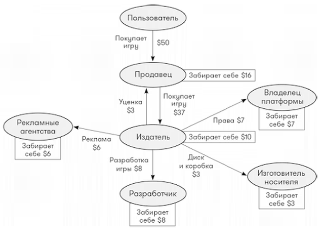
Без носителей проще. Плата за скачивание распределяется между разработчиком/издателем и владельцем маркета автоматически


- Free-to-play
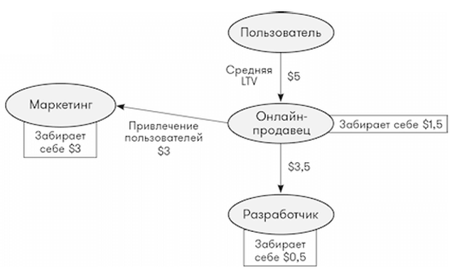
Это то, что знают, видят и "любят" игроки, особых пояснений не требуется. Средний LTV - сколько всего потратит игрок, пока не уйдёт. Ключевое слово "средняя". Можно привлекать за деньги много игроков, которые ничего не купят в игре, главное чтобы небольшое число тратящих игроков в сумме покрывали расходы. Покупатели помимо того, что "заносят денег жадным разработчикам", оплачивают возможность играть бесплатно всем (покрывают расходы разработчика на поддержку игры, аренду серверов и привлечение новых игроков). С большим количеством фанатов получается хорошо.
[Первая платная лошадь в World of Warcraft за $15 заработала больше, чем StarCraft II: Wings of Liberty](https://app2top.ru/news/pervaya-platnaya-loshad-v-world-of-warcraft-za-15-zarabotala-bol-she-chem-starcraft-ii-wings-of-liberty-212554.html)

## Переходы программистов между компаниями разных уровней

**`Downgrade case`**

Если вы работали в компании, которая находится на 3-4 стадиях, а при смене работы карма закинет встретить стадию 1-2, то есть два варианта. Либо компании переход выше особо и не нужен, и вам там будет грустно "программировать json-ки", либо получите возможность стать дизайнером и архитектором. По статье можно прикинуть стоимость этого.

**Желательно иметь лет 10 опыта, и быть готовым заниматься процессом перехода еще около 5**

Если кто-то обещает меньше, то скорее всего ошибается. Ну или вы увидите "универсальный движок" в котором будет всё настолько универально, что писать код придётся вам, а не разработчику движка. Привет тем, кто хочет "перейти с Unreal/Unity на движок XXX, потому что Unreal/Unity стал слишком сложным и запутанным, а XXX проще, классный, быстро развивается и на нём уже *почти* можно сделать то же самое".

Кроме этого, иногда возникает такой незапланированный момент, что специалистов, которые вам оказываются нужны, нет на рынке (или в природе). Например, потребовался технический артист на кастомный движок. Большинство из них не хочет работать с чем-то, отличным от Unity/Unreal. Его найти невозможно, но возможно заместить комбинацией скриптов, и part-time аниматора и программиста.

**`Upgrade case`**

Если вы наоборот, окажетесь после компании фазы 1-2 в компании фазы 3-4, то скорее всего, сначала будете переучиваться с stl на местные контейнеры/указатели/аллокаторы/алгоритмы, запоминать названия подсистем и wrapper-ов, разбираться с системами сборки, скриптов, тулзами и вообще вникать в то, как странный код на странном языке генерит что-то исполняемое виртуальной машиной, которое нужно отлаживать. Вообщем, менять майндсет и забывать большинство С++-"common-wises". Хорошо, если при этом где-то в процессе проектирования уже дошли до стадии "нам нужен технический писатель". Чаще бывает, что код сам себе документация, ну или можно найти дизайнера и спросить у него, что происходит (`настоящий дзен-архитектор заранее знает, когда вы к нему придёте, и что именно спросите`). Но неизбежно, изучать нужно будет много. С одной стороны, если знаешь внутренности одного движка, то знаешь приблизительно что увидишь и в других. С другой, всегда будут *особенности*.

-  - учиться разбираться в большой кодовой базе, это тоже скилл

>Нужно смириться с тем, что большие кодовые базы:
содежат много legacy кода
плохо документированы
содержат места, про которые никто не знает как/зачем/почему они были добавлены
(но большая часть кода всё же была добавлена с определенной целью, и выбросить/переделать - часто плохая идея)
Если что-то выглядит странно/непонятно/неправильно:
30% что есть причина (неочевидная) почему сделано так
30% что когда-то БЫЛА причина
30% что причины нет, и код просто кривой
10% что Ктулху Рльех Фтагн

(это вольно переведённая мной инструкция из доклада Unity Training Academy, от одного из ведущих разработчиков Unity, с in-house движками 40% что ситуация такая же, 40% что хуже, 20% что Ктулху Рльех Фтагн)

Если в компании налажен процесс онбоардинга, то джун/мидл учиться пользоваться всем за 3-6 месяцев, если его тупо бросают и ждут, пока поплывёт -- раза в 2 дольше.

Большой минус inhouse-движков, с ними сложно познакомиться заранее. Вы не можете прочитать книгу, поиграться дома с примерами, пройти курс или найти ответ на форумах. Достаточно быстро нужно будет начинать выполнять задачи. Собственно, задачи будут всегда. Учиться на закрытом движке достаточно сложно.

Для компании (и дизайнера) выбор между in-house движком или готовым -- это дизайнерское решение по шкале ([DIY vs Re-Use: In Search of Balance from upcoming book “Design&Development of MMOG”](http://ithare.com/chapter-iv-diy-vs-re-use-in-search-of-balance/) -- критерии выбора для MMOG-игры).

Для изучения же сильно проще готовый. Просто, случайные примеры документации для Unreal, которыми приходилось пользоваться:
- миллионы начальных курсов и обзоров разного уровня качества. Среднего качества, но доступная, хоть и запутанная, официальная документация.
- [Tom Looman Unreal Course](https://courses.tomlooman.com/courses/enrolled/1320807) -- платный продвинутый курс advanced.
- [Game Engine Architecture Lectures](https://nikoladimitroff.github.io/Game-Engine-Architecture/) -- средний уровень с английскими слайдами и лекциями на болгарском
- [Alex Forsythe Performance: Comparing Compiled C++ and BP](https://awforsythe.com/unreal/blueprints_vs_cpp/#perf_comparison) - разбор виртуальной машины blueprint
- [Unreal Engine Tutorials, tips and tricks](https://benui.ca/unreal/) - различные материалы, упор на систему gui
и т.п. -- разных уровней (от начального до мега-продвинутых) и специализации (программисту, артисту, гейм-дизайнеру), и от людей со всего мира.

## GameObject на каждой из фаз, "кто/какой/что делает"

*Говорят, японские самураи могли оценить мастерство друг друга сразу по тому, как самурай держал самурайскую саблю*

Ещё раз вернёмся к фазам. Как приблизительно выглядит игровой объект, пусть будет, например, элитный враг в RPG, гоблин-вожак (а то надоели танки и самолёты), на разных фазах, с точки зрения программиста.
Мысли могут повторяться, потому что выше был в основном пересказ описания архитектуры aruslan-а, теперь от меня.

`Фаза 1`
```cpp
class GoblinLeader : Goblin {
  //настройка параметров
  //описание уникального поведения
}
//иерархия классов может быть типа такой GoblinLeader->Goblin->Enemy->AiObject->MoveableObject->GameObject
// ну или убрали diamond problem, создали интерфейсы
class GoblinLeader : GameObject, IEnemy, IMoveable, IBoss {
  //тут всё так же
}
```

Программист знает о вожаке-гоблинов всё:
- кто (существительные, построение зашито в наследовании)
- какой (значения параметров) 
- что делает (глаголы, код поведения)

>Со свиньями, кстати, был связан еще один серьезный баг, из-за которого падала игра. В какой-то момент программисты что-то такое подкрутили, и свиньи перестали быть нейтральными — принадлежали кому-то из игроков. Управлять ими было нельзя, но формально они могли быть «наши» и «не наши». Так вот, свиньи приводили к вылету игры. А все потому, что, видя «неприятеля», патриотически настроенная поросятина немедленно хотела дать врагу отпор и лезла за оружием, которого у нее, естественно, не было. Если мне не изменяет память, программисты исправили баг, просто выдав свинье парабеллум без патронов.
["Блицкриг 2"](https://www.igromania.ru/article/14805/A_delo_bylo_tak_Kak_na_samom_dele_razrabatyvayutsya_igry.html)

"Кто" и "что делает" смешались (классы = данные + код). Вероятно, свиньи отнаследовались от Unit, в который были вшиты IsEnemy и WeaponPointer.
[CThingy->CFlingy->CDoodad->CUnit из Starcraft](https://plakhov.livejournal.com/235446.html)

`Фаза 2`
```cpp
class GoblinLeader : GameObject {
  //создание компонентов EnemyComponent, MoveableComponent, BossComponent
  //(динамически или статически - пришито темплейтными параметрами)

  // + настройка, возможно чтением из файла
}
...

class GameObject { TArray<Component> components; ... }
```

Из такого описания по сравнению с первым программист теряет часть знаний:
- чуть сложнее узнать "кто". Компоненты могут быть добавлены динамически, в зависимости от файла настроек, но всё ещё можно посмотреть код чтения файла настроек
- зато всё еще легко понять, "что делает" (максимум геймдизайнер может отключить через настройки компонент, изменив поведение, например отключение BossComponent может изменить стратегию преследования игрока)
- непонятно "какой" (теперь гейм-дизайнер решает, 100 или 500 жизней будет у босса, может изменить ему цвет одежды или способности)

[Part 4: The Set Piece Period](http://thegamedesignforum.com/features/GDH_4.html) -- заметка про `Set Piece Game Design`, направление гейм-дизайна, возникшее в ранних там же ~2000х. Про то, что большая часть работы гейм-дизайнера в некоторых играх стала сводиться к настройке параметров. В отличие от идеи "шедевры создаются на основе глаголов" (из книги New Game Design Satoshi Tajiri, создателя покемонов), тут происходит смещение на прилагательные, гейм-дизайнер настраивает игру, выбирая "каких" и "сколько" врагов встретит игрок. Сколько свободы есть у гейм-дизайнеров, так они и будут работать. К этой идее надо вернуться в разделе "Визуальное программирование VS текстовые скриптовые языки".

`Фаза 3`
```cpp
//класса GoblinLeader нет, создание из внешнего файла
GamePtr<GameObject> goblinLeader = CreateGameObject("GoblinLeader");
...
//файл с описаниями классов
{ "GoblinLeader": {
  "EnemyComponent": {...},
  "MoveableComponent": {...},
  "BossComponent": {...}
}}
^----в файл настроек переползли не только константы, но и описание процесса сборки класса
```

- программист не знает "кто" перед ним. Гоблина-вожака нет в коде. Есть части. Для кода обработки отрисовки гоблин-вожак ничем не отличается от камня (если гейм-дизайнер добавляет им меши), для кода обработки поведения -- отличается. Про конкретные объекты на уровне теперь знает гейм-дизайнер, но может вообще не знать программист. Гейм-дизайнер может исправить подобные истории про свиней ошибки логики без программиста, и быстрее него (если для этого всё ещё нужно привлекать программиста, что-то просто не доделано в тулзах отладки или визуализации).
- программист знает только, что делают отдельные части. Гейм-дизайнер может собрать из компонентов объекты, которые не задумывал программист. Характерный признак приближения к этой фазе, когда программист знает все отдельные компоненты, но смотрит на что-то в игре и не понимает, как гейм-дизайнерам вообще удалось это собрать.
- "какой" уже описывается не просто числами, а представляется визуально. Например, визуальный редактор кривых, в котором можно задать и посмотреть изменения переменной в динамике (например, для описания сложной формулы разбега и остановки гоблина). Под капот в идеале больше не заглядывают.

На этой фазе важный момент -- `у программиста нет понимания "кто"`. Потому что больше "тип игрового объекта == C++ класс". Если нет никакого класса GoblinLeader, то что тогда в самом примитивном виде есть со стороны C++? Просто отображение пар "ключ-значение" `engine::map<engine::string, engine::anyWrapper>`? Как-то так и может выглядеть объект на lua-подобном языке с точки зрения C++. 

**`Это конец объектного дизайна и начало дизайна данных`**. Чтобы улучшать это представление дальше, нужно думать не в терминах объектов, а в терминах данных.

На каком языке и как их описывать, и как связать это описать с представлением на C++ (**`встраивать ли в C++ теги VS отдельный язык описания`**), как хранить мета-данные, нужные тулзам, но не нужные игре. Как в игре делать десериализацию из различных форматов? Если до этого вопросом дизайна было "как представить данные классами C++" (как удобно программистам), то теперь "как представить данные ЧЕМ-ТО, чтобы было удобно всем" (и гейм-дизайнерам, и программистам).

>Три категории программистов
Не умеешь играть ровно.  
Умеешь играть ровно.  
Умеешь играть неровно.

Вот тут возникает необходимость начать "играть неровно".

[Pitfalls of Object Oriented Programming, Revisited - Tony Albrecht](https://www.youtube.com/watch?v=VAT9E-M-PoE) -- переключение фокуса на то, как представлять данные даёт возможность разбиения целого на части. Это удобно не только для уменьшения coupling и увеличения свободы гейм-дизайнера, но и потому, что даёт возможность выбрать различные способы хранения в частей в памяти, что позволяет существенно улучшить производительность. Первая версия доклада -- 2009 год.

`Фаза 4`
```cpp
ScriptEngine::ExecuteScript("GoblinLeader");
//"GoblinLeader" -- файл, в котором описана сущность GoblinLeader, параметры и логика поведения
```

На предыдущем шаге программист знает только о том, как работают части (его задача делать их и отдавать гейм-дизайнерам).

Финальный шаг -- давайте дадим гейм-дизайнерам возможность создавать части самостоятельно, без программистов.
- программист знает только о существовании некоторых "частей", и что гейм-дизайнеры могут не только настраивать их, но и создавать свои.
- то же самое происходит с "что делают" части. Сложно сделать полноценную часть, только комбинируя готовые, необходимо описывать поведение. Программисты могут специально спрятать некоторые неважные геймдизайнеру вещи (навряд ли для игровой логики необходимо опускаться на уровень способов аллокации и освобождения памяти), но чем больше возможностей описания логики он отдаёт гейм-дизайнеру, тем лучше.

Вопрос, что доступно гейм-дизайнеру, а что могут делать только программисты, решает дизайнер, учитывая состав команды и жанр (**`"системный язык VS язык логики игры"`**)

Как выяснили еще 20 лет назад, типично программисты хотят скрипты, что программировать (желательно, чтобы уметь хорошо то же, что и C++, и то, чего он не умеет тоже), а гейм-дизайнеры -- окошки, ползунки и визуальное программирование.

>Программисты делают НЕправильные скриптосистемы. Они ориентируют её на программистов, в результате только программисты и могут её использовать. Скрипты делаются для упрощения и удешевления продукта и для удешевления и оптимизации процесса создания/модификации контента.

[Дзен-3, скрипт](https://plakhov.livejournal.com/101443.html) -- про то, почему такой подход лучше, чем "прикрутили lua, и посылаем на неё гейм-дизайнеров, если что-то хотят".
"Скрипт в такой системе ест памяти и процессорного времени заведомо не больше, чем O большое от времени, потраченного на его изготовление"
Это одновременно и хорошо, и плохо.

Способ, который годится, если мы уверены, что делаем "конструктор игр в жанре XXX" -- выдать гейм-дизайнерам набор строительных блоков, например "события/условия/действия".
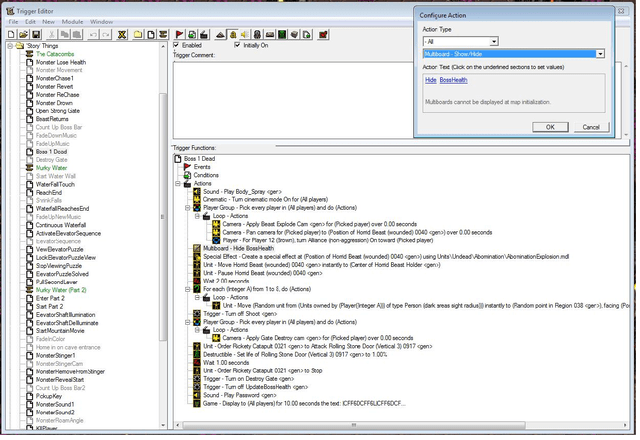
Ещё не блюпринты, но уже возможность собирать кастомные карты в Варкрафте (вообще триггеры в Blizzard вроде с первого старкратфа)
- Переделать представления из "дерево с панельками", как на скриншоте, на граф -- достаточно дешёво и просто (2-3 недели, если в дзене)
- Сшить с редактором, чтобы выбирать не комбо-боксом, а "пипеткой" -- легко
- Просимулировать выполнение триггеров различными способами -- относительно легко. Например, оценить производительность сразу из редактора, пример из доклада "Самая парадная фича: я сделал в редакторе "раскраску" скриптовых юнитов и зон в разные цвета, и выделял те триггеры, которые на них ссылались, пометками того же цвета"
- Верифицировать типичные ошибки ("герой Снайпер, упомянутый в условии триггера СекретныйЯщик, не может появиться на этой миссии") -- легко

Важно то, что гейм-дизайнеры и программисты не находятся в разных мирах. Гейм-дизайнеры постоянно хотят больше возможностей (часть из которых нужно отбрасывать, а часть нужно реализовывать, даже если они вообще не вписываются в стройную и красивую задуманную систему). Программисты должны следить за тем, что делают гейм-дизайнеры, потому что:
- У гейм-дизайнеров в организации логики будет бардак, они не читали книг про паттерны, рефакторинг и чистый код (не потому что они глупые, а потому что им в своей дисциплине и так есть что изучать, их задача не красивый код, а фан от игры). См. раздел "Дизайнеры" в [Вы точно хотите пойти программистом в gamedev?](https://habr.com/ru/articles/774972/) или в `Дзен-3`.
- Даже в примитивных системах скриптов возможны баги, с которыми гейм-дизайнеры не разберутся сами. То, как скриптовые функции работают в игре, и то, как гейм-дизайнеры это себе представляют - две большие разницы Особенно, если у вас есть что-нибудь типа "Execute parallel actions"

**Периодически неизбежно код со скриптов нужно переносить обратно на C++, если задуманное гейм-дизайнерами не решается или решается [адскими способами](https://blueprintsfromhell.tumblr.com/)**
Это то, что ненавидят делать все программисты.

## Скорость итераций

-  -- паттерны левел-дизайнеров, большая часть возникает, когда можно прототипировать уже не только геометрию уровня, но и механики
В частности:
- [Prototyping Based Design: A Better, Faster Way to Design Your Game](https://www.gdcvault.com/play/1012473/Prototyping-Based-Design-A-Better) -- Lee Perry, гейм-дизайнер Gears of War, рассказывает о том, как меняется процесс прототипирования с Unreal Engine 3 (с помощью скриптов на Kismet, можно представить эту его версию как "конструктор шутеров"), который можно отнести к фазе 4.

Было:
- Дизайн в голове
- ~~Документирование~~
- ~~Дебаты с обсуждением идеи~~
- ~~Сбор команды прототипирования~~
- ~~Наигрывание и тюнинг, пока не станет интересно~~
- Ревью перед отправкой в продакшн
Стало:
- Дизайн в голове
- **Сделать прототип**
- Ревью перед отправкой в продакшн
- **Задокументировать находки**

Применяли для разработки существ, оружия, игровых механик, level one-offs (уровней или подуровней с кастомной неповторяющейся в других местах игры логикой).
В презентации много скриншотов с результатами, ~40% прототипов доходило до продакшена (цифра плюс-минус средняя для всех игр, но из-за того, что прототипировалось быстро, негодные идеи тоже получается выбрасывать быстро).

-  - если прикрутить быстрые итерации, взаимодействие с пользователями, то редактор может превратиться в "песочницу", в которой можно прототипировать не только игры в рамках задуманного жанра, но и полностью менять механики.

## Визуальное программирование VS текстовые скриптовые языки

Движок в фазе 4 -- это **`"конструктор игр в жанре XXX"`** (в особо удачных случаях **`"система поиска сокровищ"`**).
[GDC Europe 2014: Unreal Engine 4 for Programmers - Lessons Learned & Things to Come](https://www.slideshare.net/GerkeMaxPreussner/gdc-europe-2014)
- Движок Playrix из презентации *Сказ о том, как Playrix свой движок делал* -- конструктор match-3 (может, с перспективой "конструктор казуалок")
- Unreal 3 -- конструктор шутеров
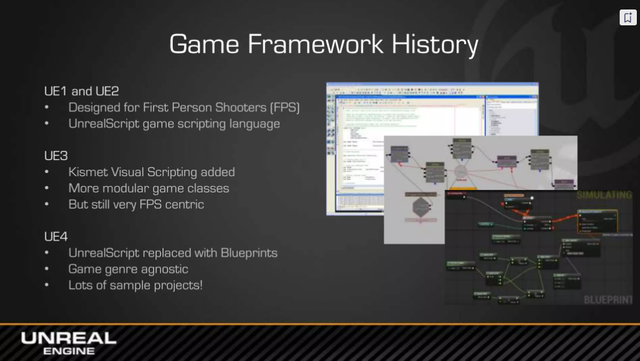

В ней можно находиться также, как и в первой фазе, долго. Десятки, в особо успешных случаях [сотни](https://ru.wikipedia.org/wiki/%D0%A1%D0%BF%D0%B8%D1%81%D0%BE%D0%BA_%D0%B8%D0%B3%D1%80_%D0%BD%D0%B0_%D0%B4%D0%B2%D0%B8%D0%B6%D0%BA%D0%B5_Unreal_Engine#Unreal_Engine_3) игр.

Но бывает, что возникает желание довести движок до состояния "конструктор игр". Условия могут различными:
- Сделали хорошую технологию, архитектура позволяет попробовать отслоить genre-specific кусок. Например, мультиплейерный шутер -> сессионный шутер
- Появился новый растущий рынок. Например, на мобилках не играют в AAA-шутеры, зато сессионные игры вполне кросс-платформенные. Ещё шире -- потенциальный метаверс (со своими дизайн-требованиями, например, verse, который не про удобство гейм-дизайнеров, а про верифицируемость и надёжность).
- Накопили денег, чтобы попробовать

Можно назвать это **`фазой 4.5`**.

[Hobby engine to game engine](https://aras-p.info/texts/files/201410-TUM-HobbyEngineToGameEngine.pdf) -- отличия между "конструктором игр в жанре XXX" и общим "конструктор игр"

Этап "конструктор игр для жанра XXX" хорош тем, что процесс разработки становится как будто предсказуемым по срокам, по составу команды, необходимой на различных стадиях, геймдев из ремесла стал индустрией.

[Винтажный publish: Когда мы были молодыми](https://sim0nsays.livejournal.com/38168.html) -- 2004 год, логи с IRC. Действующие лица -- мастодонты геймдева. Обсуждение про то, что мир геймдева переходит из фазы 4 в фазу 4.5. Пересказывать сложно, там важно настроение. Про то, что геймдев из ремесла стал индустрией. Инструменты готовы. Игры теперь делают не программисты, а продюссеры с командой гейм-дизайнеров. Программисты поддерживают инструменты или поддерживают гейм-дизайнеров. Выглядело страшно - майкрософт с XNA, Java/Idea/автоматические рефакторинги, в EA есть программисты, которые даже не знают об OpenGL/DirectX, за ними туда же очень быстро двигаются японцы и Ubisoft, магия утекает из мира.

[Депрессивное постаттестационное](https://ironpeter.livejournal.com/2068.html). Процесс -- не про отжиг. Nival, 2006 год, в индустрии темнеет ().

[Инжины](https://kunaifusu.livejournal.com/523974.html), [Продавцы инжинов](https://kunaifusu.livejournal.com/598964.html) и [Оказывается у Аутодеска тоже был свой инжин](https://kunaifusu.livejournal.com/604105.html) -- взгляд на проблему со стороны графического программиста (с сильно альтернативными взглядами на реальность, странными прогнозами, развитой фантазией, и ненавистью к геймдизайнерам, менеджерам, другим программистам и людям вообще, но с [опытом](https://www.mobygames.com/person/128123/basil-milanich/credits/) на консолях). В принципе, рациональные претензии можно свести к "отпилить бы движок 3d-рендера от этого вашего игрового движка, потому что требования, фичи и пайплайн рендера у игр разные, а неграфические программисты и гейм-дизайнеры всё равно заниматься рендером не умеют".

Программисты по прежнему нужны, как игровые, так и движковые, немного магии осталось, колесо Сансары продолжает крутиться.

Но с движками общего назначения возникает вопрос. С конструкторами игр определенного жанра было примерно понятно соотношение команд, делающих эти жанры. Инструменты движка проектируются так, чтобы соответствовать пайплайну специалистов, которые нужны для производства контента в том жанре игр, для которых предназначен движок. Если же жанр может быть любым, то неизвестен состав специалистов, которые нужны для производства. Нужен мета-язык, который будет основой для создания других языков для специалистов.

Можно представить себе способ создания такого мета-языка как процесс переноса в скриптовую часть всё более низкоуровневых слоёв движка и описание следующих слоёв на этом скриптовом языке (с использованием его идиом и техник). Тогда с точки зрения неспециалистов начинает казаться, что весь движок сделан на этом языке (*"Unity написан на C#"*). Удобный способ построения универсального языка -- виртуальная машина.

Для **выполнения** команд нужна виртуальная машина, которая умеет выполнять байт-код. Обзор вариантов дизайна того, как это происходит потянет на отдельную статью такого же размера. Возможный способы генерации байт-кода -- компилятором скриптового языка, интерпретацией команд, загрузкой сериализованного представления из бинарного файла, или генерацией через API виртуальной машины.
Очень беглые заметки:
- 
- 
- [Лекция #36. Обзор VM скриптовых языков (Lua, AngelScript). Часть 1](https://gamedev.ru/community/gamedev_lecture/articles/?id=4446) (и [вторая часть](https://gamedev.ru/community/gamedev_lecture/articles/lecture36)) - ещё один пример из прошлого, начальный обзор того, как выглядит из C++ выполнения скриптов.

**Представление** кода. Трансформации от фазы 1 к фазе 4 происходили в направлении передачи контроля над игрой геймдизайнерам. В случае с Unreal на практике (см. `The GDC 2003 Game Object Structure Roundtable` выше) произошло так, что для многих Kismet зарулил UnrealScript, что привело к появлению Blueprint как мета-языка для дизайнеров. Для геймдизайнеров это блок-схемы описания логики игры.
Для программиста -- возможность создать свои блоки, быстро собрать что-то для отладки/прототипирования, а также настраивать связь между C++ и скриптом (вызывать скрипт из C++ или C++ из скрипта).

Независимо от представления скриптов в виде текста или графа, они компилируются в байт-коды -- блюпринты транслируются в байт-код, который выполняется на той же виртуальной машине, что и текстовый UnrealScript. Байт-код также может "нативизироваться" в C++ (в мире текстовых языков -- AoT-компиляция).

[Dasflow](https://github.com/GaijinEntertainment/dasflow) -- визуальное скриптование, с трансляцией в daScript.

[Blueprints vs. C++](https://awforsythe.com/unreal/blueprints_vs_cpp/#bp_refactor) -- статья с разбором вариантов разного дизайна кода между C++ и блюпринтами.

Представление, которое будет доминировать, зависит от конфигурации команды, хотя и диктуется дизайном самого движка. На Unreal можно сделать игру, написав всю логику на C++, но это будет неудобно. Соотношение скорее должно варьироваться от 80%/20% в пользу Blueprints в начале разработки, и до 60%/40% в конце (ну пока не дойдёт до плановой производительности, может и 30%/70% в пользу C++, цифры для примера, реальных замеров не искал).

*update*
[20% Blueprints/80% C++](https://youtu.be/0YMS2wnykbc?si=8RJ_DEWidFIWmiTW&t=1276) - Blueprints In-depth - Part 2. Примерные замеры из Epic. Т.е. ~60% от общего кода будет необходимо переписать, если у вас медленный скриптовый язык.

## Неэволюционный путь
Движки не всегда вырастают из игры. Движок может делаться не для того, чтобы компания зарабатавала на играх на нём, а на продажу, ну или вообще бизнес в рекламе или платформе. В качестве примера всех вариантов подходит Unity ("делаем Flash в 3d") различных периодов. Тогда можно и сразу метить в стадию 4.5, если ресурсов хватит.
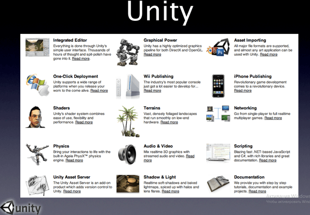
Фичи Unity, [Stories from Unity](https://aras-p.info/texts/files/StoriesFromUnityBarCamp2.pdf)

## Связь движка и игры
[Connecting the tools to the engine](https://nikoladimitroff.github.io/Game-Engine-Architecture/revealjs/presentation-iframe.html?lecture=01.intro.md#/14)

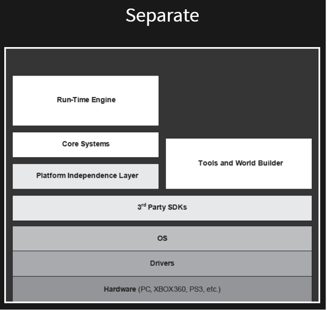
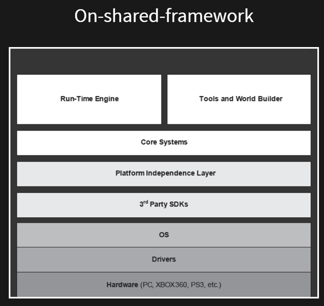
Первый тип чаще встречается, если в компании нет накопленного software capital -- проще взять за основу тулзов QT/.NET. Альтернативные варианты -- использовать другой движок только для создания на нём тулзов (Unreal/Unity/Godot), или экспериментальные вроде "делаем все тулзы в браузере".

Второй -- если хочется похожести на то, как выглядит игра и тулзы.
Данные во время разработки шарятся между игрой и движком через файлы, код может интерпретироваться из текста или пересобираться в библиотеки. Другой возможный канал связи -- rpc, игра запускает сервер и принимает команды от тулзов.

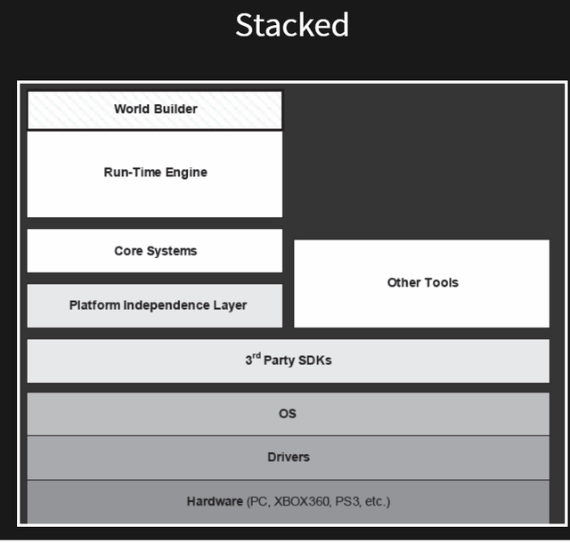
Более связанная система, либо редактор встроен в игру (cheats/debug gui), либо игра запускается из редактора.

## Про пришивание языков

Общение между движком и скриптовой системой происходит через VM, "пришить" ещё один язык можно общаясь с этой VM через её систему рефлексии, [примеры для Unreal](https://github.com/insthync/awesome-unreal?tab=readme-ov-file#scripting).

Для GUI:
[Lua](https://github.com/rdeioris/LuaMachine)
[Unreal.js](https://github.com/ncsoft/Unreal.js) ("мы зафигачим себе движок v8, react, примитивы из three.js соберём это js->cpp и сэкспортим в веб-пример", omg)

Для того, чтобы писать логику текстом вместо блюпринтов:
[SkookumScript](https://github.com/EpicSkookumScript/SkookumScript-Plugin)
[Angelscript](https://github.com/Hazelight/UnrealEngine-Angelscript) (требует форкнутого похаченного движка)
[NimForUE](https://github.com/jmgomez/NimForUE) (пока WiP)
(*если хотим универсальный движок, то нужен и язык для команд, которые пишут текстом*)

*to be continued*