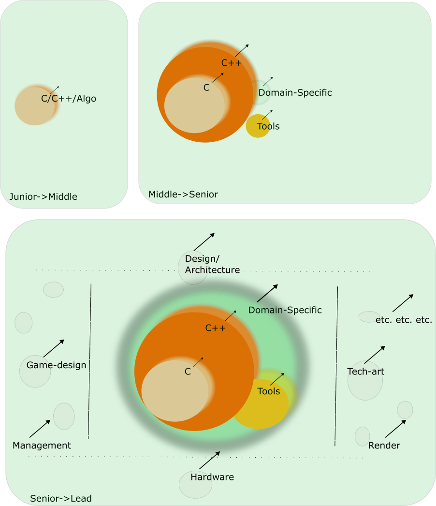

Развитие программиста в геймдеве.

Предыдущие:

- 
- 
- 
- 
- 

Развитие скиллов выглядит примерно так:

Сначала учится базовый язык и алгоритмы.

Затем постепенно накапливаются знания advanced-фич языка, скиллы создания/настройки/использования инфраструктуры работы с проектом, и специфические для разработки игр приёмы/практики/методы.

Дальше кружок с domain-specific навыками/знаниями постепенно расширяется и охватывает все остальные. Также начинают появляться и накапливаться знания в "соседних" дисциплинах (как вообще работают и чем именно занимаюотся коллеги в команде).

-  -- ещё более продвинутые архитипы программистов в геймдеве
-  -- модель развития сотрудников в стиле Final Fantasy Tactics
-  -- соседний кружок гейм-дизайнеров

Проектирование/архитектура
 - 
 - 
 - 
 - 