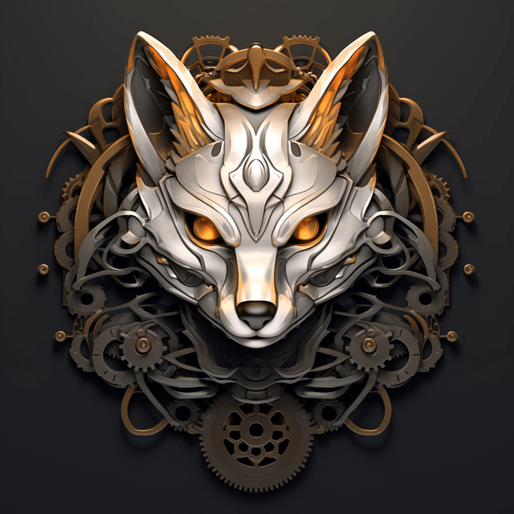

Предыдущие
- 
- 
- 

**`Личное/путешествия`**
Когда-то отмечал 2022-й год, потом 5783-й, следующий будет 2567-й

**`Музыка`**

`MNISHEK - Душко моя`



`Мельница - Дороги`



`Friendship (feat.Lee Ritenour) - Let's Not Talk About It` (Super Mario Level 1-2)



`Atlantida Project - Круги`



`Антон Птушкін - Карпати без слів`


Видео без музыки, но с атмосферой, как будто первое погружение в `Breath of the Wild`

**`Игры`**
`Baldurs Gate 3` - прошёл за лесную-гномиху друида.
`Fantasy Strike` - максимально простой файтинг, хорош для изучения проёмов гейм-дизайна в жанре.
`Super Mario Bros Wonder`- Марио как всегда отличный, но, как и все 2d части, показался слишком коротким.
`Hogwarts Legacy` - странное сочетание, гриндилка для фанатов с клёвым окружением, но стандартными open-world механиками, почти без отыгрыша школьной жизни.
`Songs of conquest` - отличная инди-тактика.

**`Книги`**
`Лекции Дыбовского про игры` на Страдающем Средневековье. Всегда интересно слушать.
`Шрайдер` - книги про гейм-дизайн и баланс.
`Крис Колер. Power Up! Как Япония вдохнула в игровую индустрию новую жизнь` - история.
`Chris Solarski. Drawing Basics and Video Game Art + Interactive stories and video game art` - язык форм в геймдизайне.
[Pattern-Oriented Software Architecture](https://en.wikipedia.org/wiki/Pattern-Oriented_Software_Architecture) - вполне себе timeless методы проектирования софта.
[List of cognitive biases](https://en.wikipedia.org/wiki/List_of_cognitive_biases) - хорошая стартовая точка для подробного изучения
[D&D of MOGs](http://ithare.com/contents-of-development-and-deployment-of-massively-multiplayer-games-from-social-games-to-mmofps-with-stock-exchanges-in-between/) - серьёзный разбор вариантов дизайнна MMO.
 - мануалы Агнера Фога по оптимизации.

**`Развитие`**
Занялся изучением `Unreal Engine`. Также немного -- процедурной генерацией и генерацией изображений с помощью нейросетей.
 -- наконец-то увлёкся английским. Минус - уходит много времени на практику.

YOLO, всё пройдёт, и это тоже.
