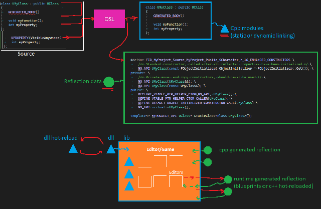
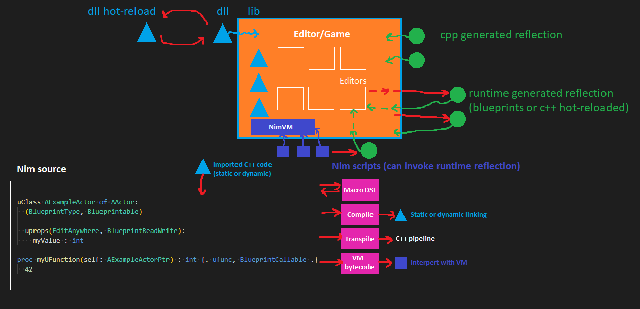
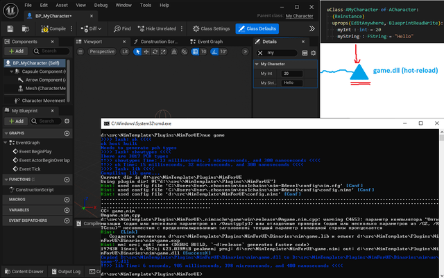

-  -- про идею разделения игрового объекта на части "для программистов" и "для гейм-дизайнеров".

Схема создания разделённых типов в Unreal Engine выглядит приблизительно так:

# C++ <--> Blueprints

## Общая схема


*[full size](240302-unreal-script/unreal1.png)*

- Исходный код обрабатывается препроцессором `Unreal Header Tool` (DSL), который генерирует метаинформацию для системы рефлексии
- Код на C++ собирается в exe-файл редактора/игры
- Код на С++ также может собираться в динамическую библиотеку, которая загружается уже после запуска редактора
- После запуска редактор загружает мета-информацию о типах (Reflection data), и может использовать для визуального отображения и редактирования типов
- Runtime geneated reflection data -- новые типы могут быть созданы в рантайме, с помощью наследования от уже существующих типов и определения/переопределения новых полей, и кода из языка Blueprints (который компилируется в байткод виртуальной машины)

Некоторые неотмеченные на схеме связи:
- Нативизация скриптов (вместо компиляции в байт-код происходит транспиляция в C++ код)
- Типы могут использоваться не в качестве базовых для настройки и расширения из скриптов Blueprint, а ради расширения редактора (макросы) или самого языка Blueprint (регистрация новых типов нод)

[Building Tools Quickly: Blueprints, Menus, Utilities, and Widgets](https://www.youtube.com/watch?v=wJqOn88cU7o) -- доклад про различные способы расширения редактора Unreal от Embark Studios

## Рефлексия

Поскольку C++ не имеет встроенных средств рефлексии, движки изобретают свои средства для описания метаинформации. Так как часто уже существует основа движка на C++, выбирается вариант с добавлением разметки в сам C++ код, и стадии препроцессинга перед компиляцией (`Unreal Header Tool` в случае с Unreal), на которой разбирается метаинформация и генерируется мета-класс и код работы с ним.

Кроме генерация мета-класса в виде C++-типа, необходим способ создания типов в ран-тайме -- генерация кода регистрации типа в системе рефлексии времени выполнения.

[Blueprints vs C++](https://awforsythe.com/unreal/blueprints_vs_cpp/) -- статья с разбором системы рефлексии, а также способов ссылок на типы C++->Blueprint и Blueprint->C++
[Unreal Engine C++ Complete Guide](https://www.tomlooman.com/unreal-engine-cpp-guide/) -- гайд по DSL для описания метаинформации, а также других макросов Unreal (`Unrealisms`)

-  -- раздел "Высокоуровневый C++", про ограничения языка в рефлексии, кодогенерации, compile-time вычислениях
-  -- возможности мета-программирования

# Привязка текстового скриптового языка

## Выбор между визуальным/текстовым программированием

- 

Выбор можно типом скриптового языка (визуальный/текстовый) зависит от конфигурации команды (кто будет пользоваться этим языком).

- По статистике от Epic -- до 80% кода в больших проектах переписывается с Blueprint на C++ ([линк](https://www.youtube.com/watch?v=0YMS2wnykbc&t=1276s)).

Т.е. с визуальным языком вместо идеи "делаем игру без программистов" получается "программисты регулярно занимаются переписыванием логики игры на нативный язык". Текстовые языки удобнее в плане того, что могут быть быстрее визуальных, и ближе к натуральному представлению программистов (переписывать с текстового скрипта на C++ проще, чем с Blueprint).

Скриптовый язык должен быть быстрым, или хотя бы иметь возможности для ускорения (транспиляция/jit/профайлер/управление памятью/быстрый интероп с C++/примитивные типы/опции оптимизаций компиляции), чтобы минимизировать необходимость переписывания.

- Дизайн некоторых игр может подразумевать наличие большого количества level one-offs (мест с кастомной логикой), что требует большого объёма кода. Объёмные Blueprint-скрипты нечитаемы.

Из старых примеров игр, в которых уровней с кастомной логикой больше, чем основной -- Earth World Jim 2, BattleToads, сборники мини-игр (Mario Party, Adventures in The Magic Kingdom, Tiny Toon 2, симуляторы олимпиад и многоборий). Из новых -- `It Takes Two`. Разработчики выбрали для этого [AngelScript](https://angelscript.hazelight.se/).

- Текстовый язык не заменяет полностью Blueprint, небольшие кусочки всё равно удобнее реализовывать в виде Blueprint-скриптов, чтобы сохранять возможность использовать уже накопленные Unreal-разработчиками приёмы. Т.е. язык должен быть интегрирован не только с C++, так и с системой рефлексии и виртуальной машиной Blueprint.

- В идеале, язык должен быть не хуже Blueprint в том, в чем силён Blueprint, и не хуже C++ в том, в чём хорош C++

## Группы скриптовых языков

`Lua/AngelScript/Wren/Squirrel`

Lightweight-языки с простой виртуальной машиной, и небольшой стандартной библиотекой, дополнительные фичи могут реализовываться дописыванием функционала на C++.
[Аддоны AngelScript](https://www.angelcode.com/angelscript/sdk/docs/manual/doc_addon_script.html), [препроцессор UnrealAngelScript](https://github.com/Hazelight/UnrealEngine-Angelscript/blob/6b9c9a776cd339ba2b44f175a3677106ef1c8dbe/Engine/Plugins/Angelscript/Source/AngelscriptCode/Private/Preprocessor/AngelscriptPreprocessor.cpp) на 4к строк.

`C#/Python/JavaScript`

Языки с тяжелой виртуальной машиной, развесистой стандартной библиотекой и большим количеством готовых 3rdParty библиотек.

`Odin/Jai/daScript/Nim/Haxe`

Языки с gamedev-related фичами. Рефлексия, настройка управления памятью, компайл-тайм eval и макросы, транспиляция в C++, выбор между исполнением байт-кода и компиляцией, jit-компиляция (полный набор не поддерживает ни один язык из списка, но все поддерживают хотя бы несколько).

Эта группа представляет наибольший интерес, потому что потенциально может заменить не только Blueprint, но и большую часть C++.

# C++ <--> Nim <--> Blueprint

[NimForUE](https://github.com/jmgomez/NimForUE) -- привязка Nim к Unreal Engine, в разработке.

## Общая схема


*[full size](240302-unreal-script/unreal2.png)*

Макросы позволяют написать на Nim DSL описания метаинформации.

Код на Nim может компилироваться в статическую библиотеку, как и код на C++. Также существует возможность собрать код в DLL для хот-релоадинга и транспилировать в C++.
Для рантайм выполнения без компиляции существует формат интерпретации байт-кода виртуальной машиной NimVM.

## Задачи NimForUE

- Привязки методов C++ для динамического добавления типов в систему рефлексии Unreal (создание модуля, типа, полей и функций в нём, информирования рантайма о новых типах)
- Привязки базовых типов Unreal, строк, указателей, контейнеров, делегатов и вспомогательных классов системы рефлексии (UObject, UClass, UFunction, TSubclassOf, TSoftObjectPtr)
- Соответствие базовых типов языки типам системы рефлексии, идиоматические для nim хелперы вокруг unreal-типов
- Обёртки вокруг конвенций Unreal - конструкторов, создания компонент, статических данных и связью с системой сборки мусора, Out-параметры для Blueprint-нод
- Базовая инфраструктура Nim -- виртуальная машина, мониторинг библиотеки для hot-reload, тесты и отладка
- DSL для создания типов, похожий на тот, который используется Unreal Header Tool, прокидка типов и флагов описания метаинформации
- Генерация привязок для всех типов системы рефлексии
- Генерация привязок для типов C++ (и допривязка свойств/функций), которые не добавлены в систему рефлексии, но необходимы для удобной работы со скриптами
- Override свойств и функций системы рефлексии (наследование от Blueprint-типов)
- Override для C++ функций (генерацией c++-типа обёртки)
- Разделение кода обёрток игры/редактора, поддержка всех платформ

## Способы связи между языками

`Nim <--> Cpp`

Nim может описать используемый метод и тип из C++ из самого языка (pragma importcpp). Аналогично код на C++ может описать прототип extern функции, которая находится в lib-файле, собранном из nim-кода.
Для динамической привязки -- стандартные для ОС методы вызова функций из библиотек (со стороны Nim -- обмазанные макросами).

`Nim <--> Blueprint`

Связь через систему рефлексии (Emit Type + Broadcast Asset -> Blueprint знает о типе).

[UFunctionCaller](https://github.com/jmgomez/NimForUE/blob/17049537e0e92f2f796dfbc18c645939b0199629/Source/NimForUEBindings/Public/UFunctionCaller.h) -- вызов зарестрированной функции по имени.

Пример сгенерённой привязки функции

```nim
proc getPingInMilliseconds*(self : APlayerStatePtr): float32 =
  var call  = UECall(self: 0, value: RuntimeField(kind: FieldKind(0),
      intVal: 0), kind: UECallKind(0), fn: UEFunc(name: "GetPingInMilliseconds",
      className: "APlayerState"))
  call.value = ().toRuntimeField()
  call.self = cast[int](self)
  let returnVal {.used, inject.} = uCall(call)
  when float32 is ptr:
    if returnVal.get.intVal == 0:
      return nil
    else:
      return cast[float32](returnVal.get.intVal)
  else:
    return returnVal.get.runtimeFieldTo(float32)
```

## Установка

[NimTemplate](https://github.com/jmgomez/NimTemplate)

```
choosenim devel # скачать nim
nimble nue      # установка nue, утилиты для работы с NimForUE
nue setup       # компиляция движка, плагина и генерация байндингов
                # .Plugins/NimForUE/NimForUE.win.json - путь к движку
...
nue starteditor # запуск редактора
nue game        # перекомпиляция game.dll, hot-reload библиотеки с nim-кодом
                # ./NimForUE/config.nims - настройки путей
                # ./NimForUE/game.nim - код примера
```

*[full size](240302-unreal-script/unreal3.png)*