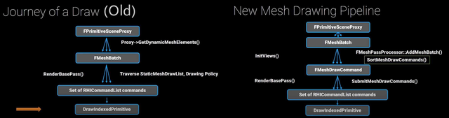
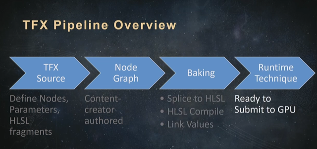
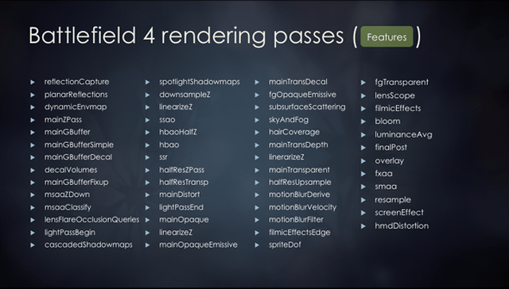

-  -- заметка о GameObject в движках

## SceneGraph (False start)

GameObject-ы на сцене часто собраны в иерархию, которую нужно как-то отрисовывать на экране. Наивная идея -- отрисовка дерева GameObject-ов в порядке обхода.

```cpp
class GameObject {
    void preRender();
    void render();
    void postRender();
    TArray<GameObject*> children;
}

GameObject::preRender() {
    //set render state
}

GameObject::render() {
    //render self
    ...

    //render children
    for (auto child : children) {
        child->preRender();
        child->render();
        child->postRender();
    }
}

GameObject::postRender() {
    //restore render state
}
```

Имеет множество проблем в реализации даже для старых render api -- различные алгоритмы требуют различных способов обхода сцены, не укладывающихся в единый граф (как для 2D сцен, так и для 3D). Возникают альтернативные Visitor-ы, списки, флаги управления порядком. Примеры задач:

- для оптимизации выполнения команд рендера данные могут не отправляться на отрисовку сразу, а группироваться (batching) -- добавляются хранимые списки данных для рендера и условия синхронизации этих списков с основным обходом объектов
- опция рендера в текстуру - ещё один проход или альтернативное состояние рендера
- трики с блендингом, для которых необходимо изменить порядок вывода на обратный ()
- другие методы отрисовки, требующие изменения порядка -- полупрозрачные объекты (до OIT), тени, зеркала
- композиция нескольких из этих приёмов. НЕ решается тем, чтобы ввести наследника GameObject, который бы переопределил preRender/postRender и втыкать его в нужные места графа. Если и решается, то прикручиваением колоссального количества хаков проверки и хранения текущего состояния.

Тем не менее, подход был достаточно живучий (и оживший на какое-то время с приходом ранних OpenGL ES и WebGL), судя по количеству обсуждений его вредности:
[Scene Graphs - just say no](https://tomforsyth1000.github.io/blog.wiki.html#%5B%5BScene%20Graphs%20-%20just%20say%20no%5D%5D)
[Handling Scene Geometry](http://diaryofagraphicsprogrammer.blogspot.com/2009/01/handling-scene-geometry.html)
[SpatialGraph, SceneTree, RenderQueue - sound familiar?](https://www.stevestreeting.com/2009/01/05/spatialgraph-scenetree-renderqueue-sound-familiar/)
[The world is not a SceneTree](https://solid-angle.blogspot.com/2009/01/animation-and-physics-sitting-in-tree.html), [The world is not a SceneTree](https://solid-angle.blogspot.com/2009/01/world-is-not-scenetree.html), [Characters are a special sort of tree but not a SceneTree](https://solid-angle.blogspot.com/2009/01/characters-are-special-sort-of-tree-but.html), [The world is... the world](https://solid-angle.blogspot.com/2009/01/world-is-world.html)

## Списки команд отрисовки

Дизайн способа передачи данных отрисовки от игровых объектов к API видеокарты эволюционировал вместе с дизайном самих API отрисовки. Вместо отдельных команд переключения состояний и создания графических ресурсов постепенно появлялись буферы с данными (вершины, индексы, команды отрисовки) и команды отрисовки использующие эти буферы ("вот указатель на блоб данных, вот описание раскладки этих данных, выведи их"). 

Соответственно, со стороны игрового движка так или иначе возникало формирование списка команд на отрисовку. Чаще отдельным слоем над графическим API (с названиями вроде Rendering Hardware Interface). Причины, по которым удобнее иметь отдельный уровень команд:

- **возможность отсортировать команды оптимальным образом перед передачей в графический API** (или же в Data-Oriented style -- заранее иметь фиксированный набор списков, в которые можно добавить объекты):
    [Order your graphics draw calls around!](https://realtimecollisiondetection.net/blog/?p=86 ) -- пример обоих вариантов
    [Stingray Renderer Walkthrough #4: Sorting](https://bitsquid.blogspot.com/2017/02/stingray-renderer-walkthrough-4-sorting.html)
- **кеширование**
    [Refactoring the Mesh Drawing Pipeline](https://www.youtube.com/watch?v=UJ6f1pm_sdU) -- пайплайн в Unreal, добавляется ещё один этап кеширования команд отрисовки, статические меши могут не создавать команды каждый кадр повторно, чтобы не тратить время не повторное формирование команд
    
- **многопоточность** -- передачу состояния можно вынести в отдельный поток (а если потоков много, то ещё и отделить процесс декодирования из RHI-команд в списки команд графического API)
    [State reflection](https://bitsquid.blogspot.com/2016/09/state-reflection.html) -- 2 класса, состояние и прокси для его передачи
    [Unreal Source Explained, Rendering](https://github.com/donaldwuid/unreal_source_explained/blob/master/main/rendering.md) -- то же в Unreal, `UPrimitiveComponent->FPrimitiveSceneProxy->FPrimitiveSceneInfo` и другие
- **разные стратегии на разных платформах** -- для различных платформ можно эмпирически настроить поведение, например, эмулировать устравшие immediate api,  подобрать оптимальный размер данных в очереди команд перед передачей на отрисовку (flush несколько раз за кадр), или настроить размер конвейера в зависимости от количества потоков (iOS - great single core/Android - many cores)
    [Unreal Source Explained, Parallel Rendering](https://github.com/donaldwuid/unreal_source_explained/blob/master/main/rendering_parallel.md) -- настройки параллельного рендера в Unreal


Получается API вроде такого:

```cpp
class GameObject {
    ResourceHandler resHandler;
    void initResources(RenderCommandList cmdList) { resHandler = cmdList.addCommand(CreateSomeResource{Parameters}); }
    void freeResourses(RenderCommandList cmdList) { cmdList.addCommand(FreeResourceAsync{ resHandler }); }
    void render(RenderCommandList cmdList) { cmdList.addCommand(DrawSomeResourceCommand { resHandler }); }
}

class RenderCommandList {
    //threading, commands optimization, and batching things
    DelayedCommandListMT delayedCommands;

    void addCommand(Command cmd) {
        if (inRenderThread() && allowImmediate()) {
            translateCommandToRenderDevice(cmd);
        }
        else {
            //maybe not just add, but also pre-process
            delayedCommands.addNew(MOVE(cmd))
        }
    }

    void processDelayedCommands(){
        ENSURE_IN_RENDER_THREAD();
        delayedCommands.preprocessCommands(); //sort/optimize/fuse/batch
        for (auto cmd: delayedCommands) {
            translateCommandToRenderDevice(cmd);
        }
    }
}
```

[Creating a Custom Mesh Component in UE4](https://medium.com/realities-io/creating-a-custom-mesh-component-in-ue4-part-1-an-in-depth-explanation-of-vertex-factories-4a6fd9fd58f2) -- серия из 4х статей, про добавление в пайплайн своего компонента, и структур для его обработки.
[Unreal Engine 4 Rendering](https://medium.com/@lordned) -- ещё одна серия, небольшой обзор структур рендера.

## Intermediate 3D API

Так как графических API много и они разные, а движки часто хотят быть мультиплатформенными, то возникают попытки выделения нижнего уровня абстракции RHI в отдельные библиотеки-прослойки между DirectX 11/12/Vulkan/Metal/Opengl desktop/web/mobile. На этом уровне библиотека на заботится ни о чём, кроме быстрого формирования картинки из команд, не вникая в то, что представляют из себя эти команды (чем-то похоже на видеоплейеры).

[A Comparison of Modern Graphics APIs](https://alain.xyz/blog/comparison-of-modern-graphics-apis)
[An Opinionated Post on Modern Rendering Abstraction Layers](https://alextardif.com/RenderingAbstractionLayers.html)
[Musings on cross-platform graphics engine architectures](http://www.gijskaerts.com/wordpress/?p=98) + [Multi-threaded command recording and submission](https://www.gijskaerts.com/wordpress/?p=112)
[Designing a Modern Cross-Platform Low-Level Graphics Library](https://www.gamedeveloper.com/programming/designing-a-modern-cross-platform-low-level-graphics-library)
[Stingray Renderer Walkthrough #5: RenderDevice](https://bitsquid.blogspot.com/2017/02/stingray-renderer-walkthrough.html)

[Comparison of C++ Low-Level Graphics, Cross-Platform Frameworks and Libraries](https://dev.to/funatsufumiya/comparison-of-c-low-level-graphics-cross-platform-frameworks-and-libraries-58e5#llgl-low-level-graphics-library) -- обзор нескольких библиотек.

`sokol`
[sokol-gfx](https://github.com/floooh/sokol) -- thin-решение на C. Графическая обёртка отделена от всего, что только можно. Часто связанные с обёрткой решения выделены в отдельные библиотеки -- [sokol-shdc](https://github.com/floooh/sokol-tools/) для кросс-платформенных шейдеров, транспилируемых в нативные языки (annotated GLSL -> platform shaders + c header) и [oryol](https://github.com/floooh/oryol) для обёртки над окнами и IO.

`bgfx`
[bgfx](https://github.com/bkaradzic/bgfx) -- кроме составления списка команд, умеет их [сортировать](https://bkaradzic.github.io/bgfx/internals.html), а также заполнять из нескольких потоков. Shaderc -- компилятор шейдеров, надстройка на GLSL-like языком, транспилируемым в нативные языки.
Настраивается на использование с различными оконными обёртками (glfw/sdl/native os), имеет отдельные base-library [bx](https://github.com/bkaradzic/bx/) (обёртки над io/threads primitives/math/memory/hash) и [bnet](https://github.com/bkaradzic/bnet) (tcp protocol wrapper).

`llgl`
[llgl](https://github.com/LukasBanana/LLGL) -- еще одна thin-прослойка для большинства платформ, без window- и shader- слоёв (из-за чего в примерах 100500 вариантов шейдеров на всех языках). Многопоточный command buffer поддерживается только для OpenGL-wrapper ([не поддерживается](https://github.com/LukasBanana/LLGL/blob/master/docu/GettingStarted/Getting%20Started%20with%20LLGL.pdf) для DX12 и Vulkan). Имеет c-api для генерации привязок к языками (как и sokol/bgfx).

`Diligent Engine`
[Diligent Engine Core](https://github.com/DiligentGraphics/DiligentCore) -- декларирует полную поддержку новых API, и ограниченную поддержку старых. Поддерживает генерацию команд из нескольких потоков, и вшитую на низком уровне систему [Reference Counting](http://diligentgraphics.com/diligent-engine/architecture/cross-platform/reference-counting/). Имеет C API для привязок к языкам (C++/C#). [DiligentFX](https://github.com/DiligentGraphics/DiligentFX) - high-level слой поверх Core. [Блог](http://diligentgraphics.com/) с обновлениями и описанием дизайна.

`The Forge`
[The Forge](https://github.com/ConfettiFX/The-Forge) -- open-source прослойка, industry-level качества, разработчики предлагают услуги по помощи в интеграции в существующие движки (примеры -- Forza Motorspirt и Starfield). Больше оптимизаций, высокий порог для старта, постепенное обрастание необходимыми для движка системами, не связанными с прослойкой для рендера (скорее всего, связанное с потребностями компаний, интегрирующих библиотеку).

## Shader abstraction

Так как языки для описания шейдеров похожие, но чуть отличающиеся, и требуют описания соотвествующих им структур и кода на C++, то библиотеки используют мета-языки -- надстройки над одним из базовых языков (GLSL/HLSL + транспиляция в другие базовые языки) и/или DSL/схемы данных, по которым генерируется код привязки параметров к шейдеру.

Также, шейдеры требуют оптимизаций, поэтому опциональные фичи рендера, которые могут присутствовать или отсутствовать в материале, генерируют различные варианты шейдеров (с включенным и выключенным вариантом фичи). Поскольку каждая новая опция вдвое увеличивает количество вариантов шейдеров, необходимо предусмотреть возможности заданий ограничений вариантов в тех частях движка, которые взаимодействуют с системой материалов (скомпилировать заранее все варианты быстро становится невозможным).
[Every Possible Scalability Limit Will Be Reached](https://aras-p.info/blog/2017/02/05/Every-Possible-Scalability-Limit-Will-Be-Reached/) - эволюция системы материалов в Unity, от 5 вариантов шейдеров, до 100 миллиардов.

Идиомы систем материалов:
- code reuse (include-based)
- uber-shader (substractive)
- additive (nodes-based)
- templates (material domain в unreal, surface shader в unity)


[Destiny' Shader Pipeline](https://www.gdcvault.com/play/1024231/-Destiny-Shader)

[Shader compilation in Unity 4.5](https://aras-p.info/blog/2014/05/05/shader-compilation-in-unity-4-dot-5/)
GPU Pro 6 - Semantic-BasedShaderGenerationUsingShaderShaker

## Frame Graph

Отрисовка кадра игры состоит из большого количества этапов.

Примеры реверс-инжинирига пайплайна отрисовки кадра из различных игр:
[DOOM (2016) - Graphics Study](http://www.adriancourreges.com/blog/2016/09/09/doom-2016-graphics-study/)
[World of Tanks: Graphical Update Technical Overview](https://80.lv/articles/world-of-tanks-graphical-update-technical-overview/)
[Reverse engineering the rendering of The Witcher 3](https://astralcode.blogspot.com/2018/11/reverse-engineering-rendering-of.html)
[Godot 3's Renderer Design Explained](https://godotengine.org/article/godot-3-renderer-design-explained)
[GTA V - Graphics Study](http://www.adriancourreges.com/blog/2015/11/02/gta-v-graphics-study/)
[How Unreal Renders a Frame](https://interplayoflight.wordpress.com/2017/10/25/how-unreal-renders-a-frame/amp/)
[Hallucinations re: the rendering of Cyberpunk 2077](https://c0de517e.blogspot.com/2020/12/hallucinations-re-rendering-of.html)
[Behind the Pretty Frames: God of War](https://mamoniem.com/behind-the-pretty-frames-god-of-war/)
[Oblivion](https://gamedev.ru/community/gamedev_lecture/articles/?id=718)
[Stalker](https://gamedev.ru/community/gamedev_lecture/articles/r_e_n_de_r)
[https://www.elopezr.com/](https://www.elopezr.com/) -- Mafia, Nanite, Jurassic World, Rise of Tomb Raider, Shadow of Mordor, Castlevania
https://users.livejournal.com/--vortex--/ -- старенькое: Diablo 3, Starcraft 2, Jericho, Dirt, Company Of Heroes, Warhammer 40K: Dawn of War, Gothic 3, NFS Carbon, Painkiller, Flatout 2

[skySample](https://github.com/GaijinEntertainment/DagorEngine/blob/main/samples/skiesSample/prog/test_app.cpp) - тестовый пример из DagorEngine, описание рендера кадра на ~2к строк.
[Aura](https://github.com/ConfettiFX/The-Forge/blob/master/Examples_3/Aura/src/Aura.cpp) - аналогично из The-Forge, ~2к строк
[FrameGraph: Extensible Rendering Architecture in Frostbite](https://www.gdcvault.com/play/1024612/FrameGraph-Extensible-Rendering-Architecture-in) - список проходов Battlefield 4


В универсальных движках возможны также настраиваемые этапы или различные пайплайны для различных платформ, а также дополнительный отладочный вывод, что делает описание еще более сложным.

[Why Talking About Render Graphs](https://logins.github.io/graphics/2021/05/31/RenderGraphs.html) -- граф для описания этапов, и compile-time/runtime вычисления зависимостей используемых ресурсов меджу этапами.
