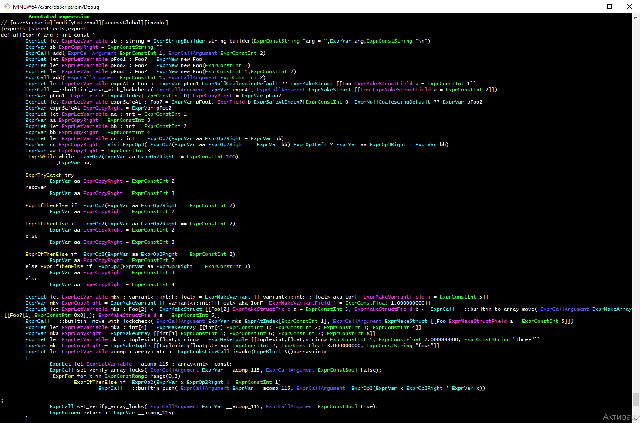

- 
- 

В большинстве языков с развитым мета-программированием существует 2 способа написания макросов -- построение синтаксического дерева из кирпичиков (`ExprXXX`-блоки в daScript), и с помощью цитирования (`quote/qmacro_xxx`). Примеры генерации каждым из способов -- в предыдущей заметке.

Второй способ более компактный, но приводит к появлению мета-языка для внедрения кусков сгенерённого кода в цитируемый код. Проблема этого языка в том, что он разрастаётся -- постепенно появляются различные макросы для деклараций блоков/функций/переменных ([qmacro macros](https://dascript.org/doc/reference/language/reification.html#quote-macros)), различные способы внедрения кусков кода -- подстановка выражений/идентификаторов/типа/списков аргументов ([escape sequences](https://dascript.org/doc/reference/language/reification.html#escape-sequences)). Этот встроенный язык (причём частично на низком уровне, в [лексический парсер](https://github.com/GaijinEntertainment/daScript/blob/master/src/parser/ds_parser.ypp#L289)) постепенно усложняется, в попытках охватить весь основной язык. 

[Ideas for a Programming Language Part 3: No Shadow Worlds](https://probablydance.com/2015/02/16/ideas-for-a-programming-language-part-3-no-shadow-worlds/) -- тут это явление названо "теневыми мирами".

Проблема менее заметна в языках с однородный синтаксисом, как в LISP, когда всё представлено в виде списков, или с динамической типизацией, в которых не жалко производительности на вызов полноценного `eval`, принимающий строку кода и возвращающий строку результата. Всякие движки подстановки ([templates_boost](https://github.com/GaijinEntertainment/daScript/blob/fd5be7b1eabaa2499e362481aa5f5409e07901fc/daslib/templates_boost.das)), которые работают на промежуточном уровне, решают проблему частично -- они дают возможность заменять одни куски синтаксического дерева на другие, но своими правилами создают новые теневые миры.

Пример шаблона, который сейчас не осиливает разобрать templates_boost:

```fsharp
//PARAMS нельзя сгенерировать кодом и подставить на это место ни одним правилом системы шаблонов
var myStruct = [[Struct PARAMS]]
```
*мета-язык ВСЕГДА требует ещё какое-нибудь мелкое расширение*

Собственно, мой поинт в том, чтобы махнуть рукой на несовершенство теневых миров, требующих расширения, и просто часть задач с макросами решать на уровне построения синтаксического дерева "вручную". Набросал макрос для daScript, который разбирает ast-функции и аннотирует каждую ноду текстом с названием Expr-блока, представляющего эту ноду, чтобы было проще "срисовывать" синтаксическое дерево (похожий на [dumpTree](https://nim-lang.org/docs/macros.html#dumpTree.m%2Cuntyped) в Nim).

Пример вывода:

```fsharp
options optimize = false //отключаем оптимизации, если хотим посмотреть все AST-ноды
require expr_print

struct SaySomethingParams
    a, b : int

def function1()
    var params <- new [[SaySomethingParams() a = 1, b = 2]]
    return params

[export]
def main()
    print_expression(@@function1)

//Output:
---------Annotated expression---------
// [nosideeffects]
def function1 : SaySomethingParams?
        ExprLet let ExprLetVariable params : SaySomethingParams? <- ExprAscend new ExprMakeStruct [[SaySomethingParams ExprMakeStructField a = ExprConstInt 1, ExprMakeStructField b = ExprConstInt 2]]
        ExprReturn return ExprVar params
--------------------------------------
```

Красивее выглядит в терминале, который понимает цветовый коды:

[full-size](240330-dascript-macro3/screen.png)

Код
https://github.com/spiiin/dascript_print_expression


