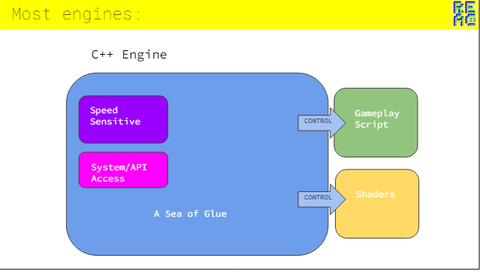
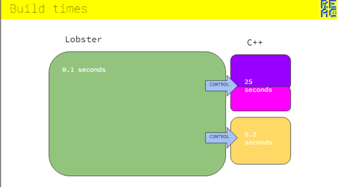

-  -- предыдущий пост на похожую тему

Несколько общих статей от разработчиков игр:
[1] - [Leaving Rust gamedev after 3 years](https://loglog.games/blog/leaving-rust-gamedev/) -- про то, что фичи Rust-а не особо помогают для геймдева, а периодически и мешают.
[2] - [Life and Death of a Graphics Programmer](https://www.elopezr.com/life-and-death-of-a-graphics-programmer/) -- взгляд на геймдев со стороны графического разработчика. Достаточно высокий, чтобы быть интересным любому разработчику игр.

Важные моменты из статей:

>Generalized systems don't lead to fun gameplay

Программирование геймплея практически невозможно уложить в обобщенную систему или библиотеку на С++/Rust (как и иерархию классов), нужны другие строительные блоки.

>Making a fun & interesting games is about rapid prototyping and iteration, Rust's values are everything but that

Строгие требования языка мешают прототипированию. Геймдев -- не про выражение строгих требований, а про простые эксперименты и быстрые итерации.

>Rust gamedev ecosystem lives on hype

Больше даже не про Rust, а про open-source библиотеки в принципе. Большая часть из них не готова к использованию в продакшене. Код в продакшене сильно сложнее за счёт того, что в нём заложено решения множества возникавших проблем.

>Упорная борьба с компилятором за то, чтобы заставить его сделать что-то конкретное, даёт чувство достижения. В одной кодовой базе была мощная функция рефлексии шейдеров с множеством метахакерских шаблонов и макросов, которая работала, если оставить ее в покое, но ее было невероятно сложно отлаживать, изменять и расширять. Оглядываясь назад, можно сказать, что такая альтернатива, как генерация кода, могла бы работать лучше.

Касается и других систем рефлексии.

>Как графический программист я добавлял бесконечное количество чекбоксов, слайдеров и кнопок для множества редакторов объектов. И намного более важно в этом, чтобы элемент был добавлен в корректную категорию, имел правильные ограничения на ввод и понятные подсказки, что то, как выглядит код, это абсолютно неинтересно и неважно артисту.

Как и с любыми тулзами. Невозмжно, что под капотом, важно что тот, как работает с программой (фактически, ДЕЛАЕТ игру) имел то, что удобно для него. Программисты типично пытаются делать тулзы для себя, а не для других. Один из симптомов такого перекоса -- желание выбрать/создать скриптовый язык, похожий на C++.

## Проектирование под команду

Проектирование (в частности, выбор языка и инфраструктуры) в геймдеве сильно зависит состава команды. В [2] есть сравнение команд, в которых шейдеры могут трогать только программисты с теми, в которых к ним есть доступ у технических артистов, и просто артистов. Если в Doom шейдеры модифицируют только программисты, то в нём и будет около 100 типов шейдеров (и не будет серьёзного инструмента для работы с ними), тогда как в Unreal вышедшие проекты могут содержать до 10к материалов, но и тулзы, в которых делаются шейдеры, будет выглядеть сильно по разному.

**Если игру делают программисты, и хотят сделать редактор, важно понимать для кого они делают редактор -- для себя или будущих гейм-дизайнеров, со старта.**

-  -- одна из больших идей этой статьи, что проектирование (не только тулзов, но и архитектуры) изначально должно учитывать конфигурацию команды.

## Геймдев проблематика

Программисты сталкиваются в первую очередь с техническими требованиями к игре -- код должен быть быстрым и надёжным (больше ошибок ловит ловит компилятор). Но кроме этих требований у гейм-дизайнеров, создающих игровые механики, есть другие.

[This Problem Changes Your Perspective On Game Dev](https://www.youtube.com/watch?v=o5K0uqhxgsE) -- обзор процесса поиска в дизайне. Критична простота экспериментов, и скорость итерации. В видео нет никаких новых идей -- это стандартные требования геймдизайнеров к инструментам, чтобы иметь возможность создавать интересный геймплей. Причём не только к инди или инновационным играм, а вообще к играм любого жанра.

[Tomorrow Corporation Tech Demo](https://www.youtube.com/watch?v=72y2EC5fkcE) -- небольшой пример хот-релоада
[Inventing on Principle](https://www.youtube.com/watch?v=PUv66718DII) -- еще пример
[NimForUE 101: uStructs](https://youtu.be/-zc8LcDwVUc?si=1RkL-OX3RNfc6gk_&t=132) -- перезагрузка в vm unreal с помощью кода на nim
[Live Stream Coding on daScript - Breakoid](https://www.youtube.com/watch?v=inGb9R1NowY) -- Arcanoid на daScript с нуля без перезапуска игры

-  -- системы поиска сокровищ в песочницах

В общем, необходимо:
`- возможность очень быстро проверить изменения` -- быстрая сборка, в том числе с возможностью хот-релоада
`- простая интроспекция` -- в том числе визуальная, через редакторы и дополнительный gui
`- возможность комбинировать объекты`. Особенность геймдева -- наличие большого числа объектов, которые могут изменять поведение динамически (ECS подход об этом)

C++ как язык местами не помогает, а скорее мешает реализации систем, которые бы имели такие свойства.

Дополнительно, так как геймдев требователен к производительности:
`- возможность оптимизации быстро написанного кода` -- Just-in-Time, Ahead-of-Time

## Про волны развития технологий

C++ находится на достаточно поздней стадии развития -- много лет использования, развитые компиляторы с оптимизациями, стандартная библиотека. Периодически предлагаются языки-наследники (Carbon, Cpp2, Val). Но при этом он плохо подходит для решения специфичный для современного геймдизайна проблем, перечисленных выше.

`- долгая компиляция`. Заменить include на модули стоило бы лет 15 назад. Тем не менее, модули все ещё не используются.
`- рефлексия в стадии "обсуждаем, как стандартизовать"`. Из-за особенностей C++ можно ждать возможности использовать то что настандартизируют ещё очень долго. Причём только рефлексию, без кодогенерации и полноценного compile-time выполнения, которые тоже нужны. Лучшее решение сейчас -- внешний инструмент.
`- менять код на лету можно очень ограниченно`. Интерпретации не планируется, hot-reload на уровне подмены динамической библиотеки (доступной не на всех платформах). Требуется внешнее решение.

*Вообще ждать появления чего-то в стандарте -- очень ненадёжно. Может быть отложено, принято криво, после принятия еще несколько лет до исправления багов во всех реализацией, и еще -- на обновление библиотек*

Как сделать разработку легче? 

**Не пытаться использовать C++ там, где это неудобно, использовать другой язык или языки для описания игровой логики**. Такой на котором проще решать проблемы гейм-дизайнеров, не программистов (этот язык даже скорее всего будет *менее* удобен программистам, во всяком случае вначале).

*старая архитектура, много c++, немного в скриптах*

*новый подход, что-то типа [такого](https://enginearchitecture.org/downloads/reac2023_scripting_language.pdf) (доклад сам по себе про похожие идеи). автор языка lobster, также flatbuffers и программист в нескольких AAA-проектах*
(в unity -- C#, в unreal -- blueprints, в dagor engine -- daScript)

[Lua in Grim Fandango](https://grimfandango.network/features/articles/lua-in-grim-fandango) -- история [первого](https://www.lua.org/doc/hopl.pdf) использования lua в качестве скриптового языка.

Телефоны/консоли также на поздней фазе развития -- запаса мощности часто хватает для того, чтобы запихнуть "дорогие" абстракции, увеличивающие как время компиляции, так и время выполнения кода. Для казуальных и прочих "простых" игр -- раз в 5-10. Т.е. в принципе можно вообще использовать в 5-10 раз более медленный язык для реализации всей логики, ради того, чтобы сделать удобнее гейм-дизайнерам.

