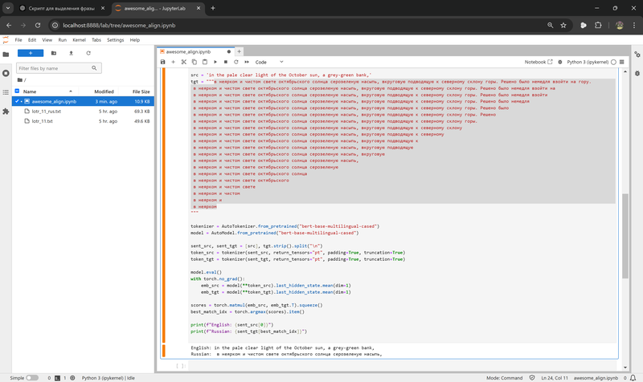
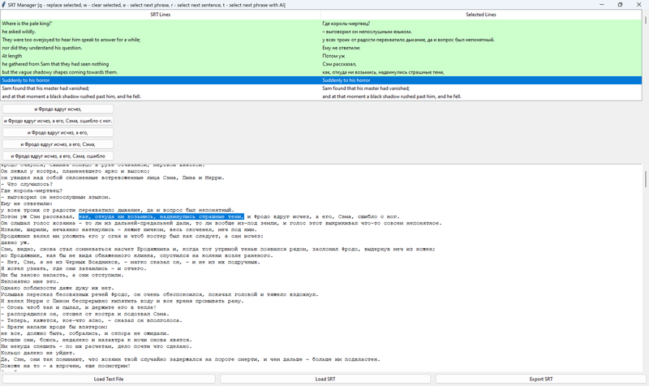
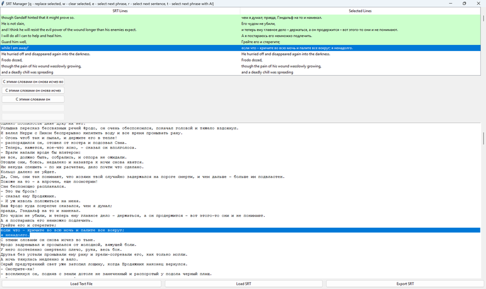

 -- первая часть

Из работающих для меня методов изучения заметил два. Первый -- `найти человека, с которым можно выстроить свой микро-язык`, изначально вообще слабо похожий на тот, который изучаешь, и постепенно развивать его, добавляя правила. Так, как происходит между ребёнком и матерью, или между мужем и женой, говорящими на разных языках (или совместно изучающих один язык). С учителем так сложно, из-за того, что ему придётся не учить, а учиться этому микро-языку самому. Возможно, хорошим партнёром может стать ИИ, но пока заставить его говорить по выдуманным правилам сложнее, чем может показаться (подозреваю, что он не очень любит агглютинативные языки).

Второй -- `найти модель, на которую можно опереться, что понять грамматические правила совсем без привязки к словам`. Собственно, доступная модель одна -- уже известный язык. Т.е. попробовать представить, как работало бы правило из чужого языка на твоём языке. Это наиболее естественный и понятный способ "пробовать" язык, который зачем-то любят запрещать делать в школах.

Наверное, появляются дополнительные инструменты, когда знаешь несколько языков. Например, если бы я знал сербский с его перфектами, то понимание их в английском не понадобилось бы. Но учить промежуточный или искусственный язык выглядит непрактичным, если только он не нужен сам по себе.

**`Строить свой язык круче, чем зубрить чужой`**

Ну а дальше, кроме правил -- нужно наполнение содержимым.
Слова -- из толкового словаря, плюс из материалов на темы увлечений.
Фразы -- фразовые глаголы, идиомы, коллокации, вылавливать в речи.

## Аудирование

Для меня есть три уровня аудирования:

- Понимаешь учебные материалы. 

То есть текст с экзаменов типа IELTS начитанный специально упрощённо.

- Понимаешь речь актёров или профессиональных дикторов 

Где-то посередине этого уровня большинство и застревает. Кроме чисто аудирования здесь уже часть непереводимого материала есть, который будешь пропускать больше в сериалах, меньше в книге, если от переводчиков есть сноски с объяснениями. Нейронки тоже иногда могут помочь восстановить, на что намекал автор (не переводческие, а general). В качестве известного примера – щенок бульдога доктора Ватсона.

- Понимаешь зашумленную произвольную речь нейтивов, разговаривающих между собой. 

Ну, или когда актёры/дикторы начинают говорить как будто не на камеру. Примеры - bloopers из сериалов, шотландский акцент (хотя бы примерно о чём речь), эмоциональный спор с перебиванием друг друга в подкастах.
Между каждым из уровней пропасть.

По идее, еще 4-й уровень – когда понимаешь культуру и можешь переключаться на ментальность носителей, но я не знаю, можно ли так с английским, кажется, максимум для славянских языков возможно.

## Как я синхронизировал Властелина Колец с его переводом и аудиоверсией

В ходе попыток прокачать навыки аудирования захотел попробовать собрать себе аналог [WhysperSync](https://www.amazon.com/Whispersync-for-Voice/b?ie=UTF8&node=12527156011).

Т.е. синхронизировать текст книги с её аудиоверсией, и добавить рядом еще литературный перевод. Но локально, без необходимости покупать книги в определенных сторах и отдавать задачи на чужие сервера с LLM.

Для теста выбрал `"Властелина Колец"` – он сложный с точки зрения грамматики, и [известен фантазией переводчиков](https://disgustingmen.com/reading/lord-of-the-rings-tolkien-translations). Для начала проверил, что chat-gpt справляется с задачей синхронизации двух переводов средне, с какого-то момента начинает галлюцинировать, и вдобавок быстро отказывается работать с защищенным авторскими правами текстом (хотя если владеешь двуми книгами и одной аудиокнигой – нет ничего криминального в том, чтобы просто читать и слушать их синхронно). Но где не справляется одна нейронка, справятся 3-4 других вместе.

Сначала задача не показалась сложной. `Whisper` от OpenAI запускается локально, и если скормить ему текст книги и аудио, выдаёт хорошие результаты.
[SubPlz](https://github.com/kanjieater/SubPlz) - неплохая обёртка для него от фанатов аниме. Немного программерской магии с версиями Python и Cuda (а также [фиксов](https://github.com/spiiin/ATS) их core lib с кодировками и английским языком вместо японского) – и он отлично работает на локальной видеокарте. На выходе получаются субтитры на английском. Из приятных бонусов – Whisper работает с любыми языками.

Дальше оказалось сложнее. Сопоставить английскую фразу русской из перевода совсем нетривиально. В теории – с этим должны справляться мультиязыковые модели `BERT`. На практике почему-то не справлялись. Изначальная задумка была попробовать сопоставить английскую фразу всем вариантам различной длины на русском и выбрать лучшую.

Стабильного результата таким образом добиться не удалось даже с разными метриками и вариациями алгоритма – очистка токенов, динамическое программирование с попыткой предсказать несколько следующих фраз, хитрое нормирование по длине фраз, и прочая магия-вуду не помогли. Вдобавок, работа с фразами из субтитров, а не целыми предложениями, сильно усложняет работу (модель на такое не тренирована, да и в принципе структура языков не всегда позволяет сопоставить части предложения). Хотя может я просто не научился их правильно готовить.

Лучший результат таким способом – это AI-подсказки, каким может быть следующая фраза. Но даже так, с 80-90% точностью, оставшиеся 10-20% для всей книги – долгая работа, вдобавок иногда взрывающая мозг несоотвествием русского литературного перевода оригиналу. Вот пара примеров (на всю трилогию их тысячи):

*кричите во всю мочь и палите всё вокруг?*

Поэтому тут я вернулся назад к работе с предложениями, чтобы попробовать сопоставить хотя бы их. Разбить текст на предложения – не такая элементарная задача, как может показаться программисту. Можно сильно удивиться, как много в языках нестандартных способов использовать знаки препинания, и как много всего интересного в юникоде. В общем, для токенизации текстов на предложения лучше не морочить себе голову и тоже воспользоваться натренированными моделями. Я брал [spaCy](https://spacy.io/models/) – у них есть модели для 25 языках, натренированные на википедии и новостях, в принципе справляются хорошо. На выходе получаются отдельные предложения на русском и английском. Например, для 12-й главы – 503 и 588 предложений.

Лучшее, что нашлось для сопоставления предложений – [hunalign](https://github.com/bitextor/hunalign). Один из плюсов, что программе можно скормить словарь из соотвествий отдельных слов, чтобы подсказать, что *Strider* это *Бродяжник*, а *Glorfindel* – *Всеславур*.

Это сильно проще, чем разбираться, как наложить патч с дообучением или кастомными весами слов, или еще какими-нибудь методами запихнуть эту информацию под несколько слоёв нейронов. Но даже из и без словаря, hunalign строит его для непонятных ей слов сама.

В принципе, дальше дело техники. Если есть английские сабы с фразами, и пары выровненных предложений, то можно написать скрипт, который заменит фразу этой парой предложений, причём подсветит саму фразу (как в караоке). Это, собственно, то чего я и хотел добиться – видеть целое предложение и фразу внутри него, чтобы иметь возможность разобрать грамматику (иначе к концу уже забываешь начало).

В этом плане я считаю, что книги для активной работы с языком лучше фильмов, так как содержат больше новых слов и конструкций, а предложения – меньше сокращений, свойственных устной речи (если специально не занимаешься изучением сокращений в устной речи).

*пример: первая же сцена из Snatch – кто кого keeps?*

В книге скорее было бы что-то из этого:
*I give him a hard time to keep him in check*
*I give him a hard time. It keeps him in check*

Последним штрихом – отобразить не только сабы, но и подсветить проговариваемый текст в PDF. Тут тоже немного заковыристо, встроенные в браузер просмотрщики отключили хуки для отображения текста (почему-то это посчитали несекьюрным и Firefox и в Chrome), сторонние читалки тоже не имеют API для динамической работы с текстом (подсветка по таймингам), а парсить PDF на лету – достаточно сомнительное занятие, так как это чисто output-формат. Проще всего предварительно сконвертировать ему в HTML и грузить/подсвечивать уже его.

Получилось примерно так:
https://www.youtube.com/watch?v=reYonqGCU8Q

С английским – работает с любой книгой. По идее и с другими парами языков, все используемые нейронки либо мультиязычные, либо имеют модели для двух-трёх десятков языков.

https://github.com/spiiin/mp3_srt_pdf_highlight_subtitles

*Дальше письмо и говорение*