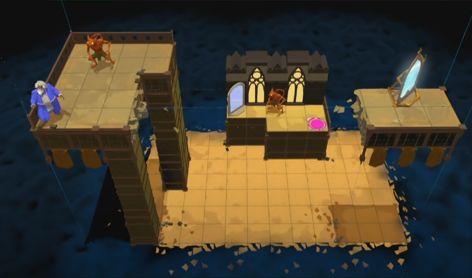

 -- схема с книжками

Сгруппированные кусочки заметок и ссылок, не склеивающиеся пока в одну цельную. Программистские линзы для взгляда на геймдизайн и геймдизайнеров.

## 1. История

Среди гейм-дизайнеров, знакомых по компаниям, в которых работал, раньше многие приходили с опытом работа в редакторах карт (Warcraft 3, CS, HoMM), сейчас -- больше с опытом дизайна настолок или вообще с курсов.
`Тристан Донован: Играй! История видеоигр` -- описание ранних этапов индустрии в разных регионах и поворотных моментов.
`Крис Колер: Power Up! Как Япония вдохнула в игровую индустрию новую жизнь` -- история японских игр.
[Shigeru Miyamoto's 1999 GDC Keynote](https://www.youtube.com/watch?v=a9DlhDRZ0yA)

[An Intro to Videogame Design History](https://thegamedesignforum.com/features/GDH_1.html)
В статье выделяется несколько этапов дизайна игр
- Arcade Era - усложнение за счёт регулирования 1-2 параметров
- Composite Era - композитный дизайн, смешивание двух жанров (простейший пример -- Марио, прыжки из платформеров, атаки из экшенов)
- Set Piece Period - количественная настройка сложности (где-то от HL2), настройка волн противников
Более детальное описание такого разделения -- в серии статей на том же сайте, про дизайн Super Mario World, HL2, Chrono Trigger.
Ну и сейчас, что-то типа Meta/Session Period - социальные игры, широкий доступ к статистике, условно-бесплатность, длительный цикл жизни игр, разделение на core и meta геймплей.

[The House of the Dev: Джон Ромеро](https://disgustingmen.com/podkasts/the-house-of-the-dev-season-2-john-romero/) -- Ромеро рассказывает о своих кумирах, поколения перед ним.
[Designer Notes](https://www.idlethumbs.net/designernotes) -- на подкасте много гостей, геймдизайнеров эпохи первых Fallot и Civilization.

## 2. Организация

Продюссерская сторона дизайна.
[Продюсирование f2p мобильных игр](https://www.youtube.com/playlist?list=PLk55LIt7jzkFjVuOW4PTXU0UX9-so3Ya8) -- бесплатный курс по free2play продиссированию
Кроме дизайна core механик существует: дизайн меты(прогрессии), финансы, маркетинг, оперирование, аналитика, работа с людьми, разработка, арт, market view, BizDev, оценка идей с точки зрения бизнеса.
[Инсайды из мира гиперкежа](https://vas3k.club/post/20571/) -- история появления и развития hyper-casual. В чём-то повторяет историю развития мобильных игр.

Также много чего про огранизацию можно откопать у Джесси Шелла.

## 3. Кор-геймдизайн, механики

"Классический" гейм-дизайн, механики, взаимодействие различных систем, эмерджентность, прототипирование.

`Ernest Adams, Joris Dormans : Game mechanics advanced game design` -- использование фреймворка Machinery (для описания потоков ресурсов и более общего дизайна игровых систем)
`Joris Dormans: Engineering Emergence Applied Theory for Game Design` -- эмерджентность, и снова о Machinery
`Роберт Зубек: Элементы гейм-дизайна. Как создавать игры, от которых невозможно оторваться`
[Шрайбер - Game Design Concepts](http://aushestov.ru/%d1%88%d1%80%d0%b0%d0%b9%d0%b1%d0%b5%d1%80/) -- теория гейм-дизайна. MDA - механика/динамика/эстетика.

Каналы про гейм-дизайн
[Луцай](https://www.youtube.com/@lutsayspeech/videos)
[Game Maker's Toolkit](https://www.youtube.com/@GMTK)

## 4. Fun

Психология игрока, понимание, почему людям нравится играть и что именно входит в понятие "играть", плейтесты

"Большая тройка":
`Тайнан Сильвестр: Геймдизайн. Рецепты успеха лучших компьютерных игр от Super Mario и Doom до Assassin's Creed и дальше`
`Джесси Шелл: Геймдизайн: Как создать игру, в которую будут играть все`
`Raph Koster: Theory of Fun for Game Design`

[Николай Дыбовский: Человек играющий: шесть причин потратить время просто так](https://stradarium.ru/gaming) -- хороший разбор базовых понятий игр
[Грег Костикян: I Have No Words and I Must Design](http://aushestov.ru/%d1%83-%d0%bc%d0%b5%d0%bd%d1%8f-%d0%bd%d0%b5-%d1%85%d0%b2%d0%b0%d1%82%d0%b0%d0%b5%d1%82-%d1%81%d0%bb%d0%be%d0%b2-%d1%8f-%d0%b4%d0%be%d0%bb%d0%b6%d0%b5%d0%bd-%d0%b4%d0%b8%d0%b7%d0%b0%d0%b9%d0%bd/) -- хрестоматийная статья о гейм-дизайне 1994 года

## 5. Некомпьютерные игры и развлечения

Индустрия развлечений существовала и до компьютерных игр, со своим опытом и наработками.

[Грег Костикян: Don’t be a vidiot](http://aushestov.ru/%D0%BD%D0%B5-%D0%B1%D1%83%D0%B4%D1%8C-%D0%B2%D0%B8%D0%B4%D0%B8%D0%BE%D1%82%D0%BE%D0%BC-%D0%B8%D0%BB%D0%B8-%D1%87%D0%B5%D0%BC%D1%83-%D0%B4%D0%B8%D0%B7%D0%B0%D0%B9%D0%BD%D0%B5%D1%80-%D0%BA%D0%BE%D0%BC/)


В качестве поиска источников вдохновения не останавливаться на видеоиграх, а исследовать другие области развлечений — настольные игры, варгеймы, ролевые и коллекционнык карточные игры, а также LARP-ы. Я бы добавил еще тематические развлекательные фестивали, комиконы, технологические фестивали, геймдев конференции, подобные бёрнинг-мэну мероприятия, парки и комнаты развлечений, квест-румы, городские квесты, спортивные и киберспортивные шоу, внедорожное ориентирование (трофи-рейд).
 

[Больше не мастерю и другое враньё](https://vk.com/bnmidv) -- книга про LARP.

Детские ощущения -- наблюдение за насекомыми, снежки и катания с горок, походы, горы и леса, сплавы по речкам (себя, или построенных моделей, с последующим вылавливанием), кукольные дома, железные дороги, дворовые игры, исследование заброшенных зданий, строительство из чего угодно,рисование карт, разгадывание секретов, залезание на высоту, соревнования с друзьями, водяные бои, игры с животными, игра в магазины, собирание коллекций, ночёвки не дома, дворовые и комнатные игры и их модификации. 

Детские забавы и игрушки. У моего поколения -- как остатки советских игрушек старших братьев и сестёр, сломанные и забытые на чердаках и в подвалах, без инструкций, так и 90е с киндерами, Тамагочи, ну погоди, нес/сега, коллекционирование вкладышей, чупакепсов, альбомы с наклейками, йойо, крышки с гвоздями, лизуны, попрыгунчики, лего и другие конструкторы.
(всё, что вызывало эмоции)

`Durchin, Jesyca. GDC 2000. “Developing Software for Girls`
**`Fashion play, Glamour play, Nurture play(Pokemon, monster farmer, nintendog), Collection play, Communication & social play`**

[What core gamers should know about social games](https://www.raphkoster.com/2010/03/18/what-core-gamers-should-know-about-social-games/)
First big ideas -  **`sports, dragons, robots, guns, jumping & climbing, and car`**

Если делается игра для определенной возрастной группы - надо не забывать исследовать,  какие игры были популярны, когда они были детьми, так как все игровые действия связаны с детством. Всё детство игра. Чтобы общаться в виде игры с кем-то по-настоящему, нужно говорить на языке его детства!

Насчет источников идей для игр:
- переиграть во все игры жанра.
	- популярные все (знать конкурентов)
	- старые (найти старые полезные идеи, понять те, от которых отказались. понять эволюцию механик)
	- посмотреть менее популярные и инди (в поиска новых механих и идей, то что сделано лучше чем в популярных)
- некомпьютерные игры и не-игры
	- настолки
	- живые игры (квесты, ларпы)
	- фильмы/литература/комиксы/новости
- природа
	- получить референсы первого уровня (референс на объект в реальном мире, а не из другого произведения)
	- в природе миллиарды идей (наша цивилизация бесконечно моложе природы) - игры про жуков - зерги/тираниды, покемоны
- ощущения
	- фокусироваться на эмоциях ради попытки передачи именно их (музыка в марио, механика охоты в монстер хантере). 
	- ощущения от разных типов движения. castlevania, souls-like

## 6. Game-feel

`Steve Swink: Game Feel. A Game Designer's Guide to Virtual Sensation`

**Ощущения слияния с персонажем**

Человек в потоке "сливается" с системой, которой управляет ([Расширенный фенотип](https://ru.wikipedia.org/wiki/%D0%A0%D0%B0%D1%81%D1%88%D0%B8%D1%80%D0%B5%D0%BD%D0%BD%D1%8B%D0%B9_%D1%84%D0%B5%D0%BD%D0%BE%D1%82%D0%B8%D0%BF), [Is That My Real Hand?](https://www.youtube.com/watch?v=DphlhmtGRqI)), и ощущает её как продолжение себя.

Десятки мелочей вроде:
- Ощущение "тяжелого" персонажа или оружия, за счёт инерции и задержки в управлении (торможение после разгона или мощной атаки занимает время)
- Замирание в несколько фреймов для ощущения тяжести удара ("впечатывание" топора в босса)
- Ракурсы и эффекты камеры

Игры, в которых мне вспоминается ощущение от клёвого движения впервые:
- NES Duck Tales 2. Pogo jump - даёт возможность распрыжки выше, чем обычный прыжок, и атаки. Кольца на боссе в пиратском корабле -- могут мешать прыжкам с пола, но помогают перемещаться ещё выше, если освоить прыжки по ним.
- NES Jungle Book. Разгон с прыжками на большие расстояния, вертикальный тип прыжка с места (особенно на уровне с падающими платформами).
Из более современных -- "клейкость" капель в Worlds of Goo.

Кроме физического ощущения от движения, также возникает эмоциональное сопереживание -- что ощущает персонаж с таким набором ограничений в движении, с такими возможностях, и с такими задачами, которые перед ним возникают. Может быть, он почувстсвует себя всесильным? Или испуганным от того, что ему предстоит пройти? Этот опыт возникает из сочетания того, что игрок уже видел, переживал до этого -- в жизни, в книгах, в кино (в детстве или недавно -- может сработать любой культурный код), или в самой игре в предыдущем уровне.

Brothers: A Tale of Two Sons — управляем старшим братом правым стиком, когда брат умирает, стик отключается

Управление может быть связано с дизайном игры, в Super Mario World -- 4 цвета кнопок нинтендо и 4 типа Yoshi, соответстующих цветам кнопок, а также 2 кнопки для бега, чтобы можно было нажимать на вторую, не отпуская первую (использование способностей также привязано к кнопкам бега). Другой пример связи механики, дизайна и управления -- игры Blizzard, особенно Starcraft (отличия в gui для каждой из рас).

 -- среди скрытых механик много направленных на улучшение ощущения от игры

[Into the Depths: Super Mario World - Part 4](https://eggplant.show/into-the-depths-super-mario-world-part-4) -- подкаст про Kaizo-хаки Super Mario World, повышенной сложности. По описанию ощущений от игроков -- отключается мозг, и управление происходит на уровне звериных инстинктов.

**Синхронизация с ритмами музыки**

[Как устроен звук в Марио. Гармонизация. Секрет звукодизайна Nintendo](https://www.youtube.com/watch?v=KuyA12ezwS4)
[Как устроена музыка в играх Нинтендо](https://www.youtube.com/watch?v=9H7B0n-Gk1A)

В серии Марио звук встроен в мелодию, синхронизирован с ритмом, и иногда меняется вместе с музыкой. Анимации также могут быть подстроены под ритм музыки

**Особенности контроллера**

На ощущение от игры влияет latency и сам тип контроллера
[Applied Sciences Group: High Performance Touch](https://www.youtube.com/watch?v=vOvQCPLkPt4)

Кроме задержки от ввода, существют еще **`задержки при запуске игры, загрузке между уровнями, сетевые`** и другие, которые можно и нужно убирать, чтобы улучшить game feel. Например, если игра может запускаться без части ресурсов или с low-res моделями или текстурами, их можно подгрузить потом (с диска или вообще по сети). Игрок запомнит, что игра запустилась быстро.

Цитата коллеги

>Ещё крутой штрих на пс5 - стрельба как обычно, правым курком, но когда заканчиваются патроны в револьвере - у курка снижается упругость, и прям чувствуешь когда в пылу битвы патроны закончились
 

В качестве примеров можно взять Mario 3D Land, где в некоторых местах нужно подуть в микрофон, ну или почти весь геймплей Mario Party.

VR/AR контроллеры даже сами по себе дают необычные ощущения от геймплея.

**Особенности игрового места**
Пространство, в котором находится игрок, так определяет опыт. Джесси Шелл выделяет типы пространств (явно прослеживают идеи Кристофера Александера), можно перерабатывать и уточнять схему бесконечно, важно понимание существования разных типов пространств:
- Очаг (телевизор). Семейные игры, Wii
- Рабочее место. Мультиплейерные игры, steam, vr
- Уголок для чтения. iPad
- Театр. ?Larp
- Арена. Спорт, киберспорт
- Музей. ?Игры в дополненной реальности
- Игровой стол. Настолки
- Игровая площадка. ?Парки аттракционов
- Где угодно. Словесные игры

 -- места влияют и на то, как делаются игры

## 7. Баланс
`Ромеро Шрайбер: Игровой баланс. Точная наука геймдизайна`
Баланс часто рассматривается кратко вместе с проектированием кор-механик, но тут ему посвящена отдельная книга. Связано вероятно с тем, что правила очень практические и мало обобщаются на различные типы игр.
Большинство принципов связано с глубоким изучением поведения основных функций (чем-то похоже на изучение [формообразующих функций](https://thebookofshaders.com/05/) у creative-кодеров), а также с тем, чтобы соотносить эти функции с тем, что получает игрок.

Вроде чего-нибудь типа "если скилл развивается в игре от 0 до 100. Допустим на старте около 20, и потом быстро подтягивается до 80, но очень медленно доходит до 100. Тогда круто дать игроку пройти игру на этих восьмидесяти, но с каждым небольшим повышением его скилла давать ему возможность открывать в игре что-то новое и отличающееся".

Пример такого подхода в Final Fantasy Tactics Advance -- игрок проходит игру первый раз не особо задумываясь за классическую ролевую команду из тяжёлого воина, лёгкого воина/вора, лучника, мага поддержки, лекаря и боевого мага. Но при этом игра оставляет несколько хуков -- миссии, которые открываются только после прохождения "финальной" (около 30%), ненайденные предметы и необычные профессии. За следующие прохождения игрок, набираясь опыта, может попробовать (в порядке того, как растёт его понимание игры):
- Разобраться в механиках, чтобы получить наиболее сильную партию. Этот тип прохождения и прокачки будет сильно отличаться от обычного. [Statistic Growth Charts](https://gamefaqs.gamespot.com/gba/560436-final-fantasy-tactics-advance/faqs/25820).
- Попробовать использовать игровые механики, чтобы собрать партию из тех классов, которые при обычном прохождении будут слабыми, но становятся сильными, если качать их специальным образом. Например, для получения сильного иллюзиониста нужно специально качать его другим классом, для сильного синего мага нужно заранее рассчитать миссии, в которых он будет получать способности от редких монстров, а для эффективного использования гаджетов и способностей, которые могут ударить по своим персонажам нужно подобрать способности/предмета для инверсии отрицательных эффектов. Также интересно, что вокруг некоторых профессий можно собрать целую партию с нестандартными ролевыми архетипами. Например, синий маг получает способности, когда соперники применяют их против него, и чтобы не полагаться на случайность соперников, можно использовать: повелителя зверей для контроля на соперниками, охотника, который может поймать монстров и получить их души, и морфера, который сам может превратиться в пойманного охотником зверя. ([Blue Mage Guide](https://gamefaqs.gamespot.com/gba/560436-final-fantasy-tactics-advance/faqs/25929), [Capture FAQ](https://gamefaqs.gamespot.com/gba/560436-final-fantasy-tactics-advance/faqs/26587))
- Попробовать собрать в игре всё, что не прибито гвоздями ([Stealing Guide](https://gamefaqs.gamespot.com/gba/560436-final-fantasy-tactics-advance/faqs/25875)). Интересный пример механики воровства, 99% задуманной именно так геймдизайнерами, но игроки уверены, что они "обманули систему". В игре есть способность "похитить способность" и "похитить оружие врага". Это редкие и мощные способности, открывающиеся в лейт-гейме. Но! Игрок, который знает об этой способности, при повторном прохождении может заметить, что уже на 4-м уровне стоит враг, со способностью Steal Weapon. Единственный способ получить её себе так рано -- прокачать навык клана до 30, что при нормальном прохождении получается ближе к концу игры. Однако, если в начале игры выгнать одного из персонажей, то открываются миссии по подбору новых персонажей в клан, которые как раз и качают нужный навык. Таким образом, можно одновременно заменить стартовых персонажей на более сильных (сюда добавлен элемент гринда, изредка приходят более сильные персонажи с крутыми профессиями) и насобирать очки для получения кинжала, который позволит отобрать у врага "похищение оружия". Процесс занимает 5-6 часов (что для японского геймера и не считается гриндом). Дальше в начальных миссиях также специально расставлены несколько соперников с очень редкими предметами, которые можно отобрать. Причём предметы не разрушают баланс, а лишь немного усиливают партию.
- Игроки, которые собрали всё, дополнительно устраивают себе челленджи вроде [Single Class Challenge Guide](https://gamefaqs.gamespot.com/gba/560436-final-fantasy-tactics-advance/faqs/41494) или переигравают в хаки с усложнённым балансом, созданные другими хардкорными игроками.

Другой хороший пример, тоже связанный с комбинаторикой скиллов различных классов, и нестандартным подходом в квестам -- Divinity Original Sin 2 ([Секретный опыт в форте Радости](https://www.youtube.com/watch?v=-kj6zhLpmME), [Как просто и красиво победить Даллис на корабле и собрать много опыта](https://www.youtube.com/watch?v=ddZ7--ZBJWo)). Или [Ветка Кааса](https://dtf.ru/games/1043703-vsyo-chto-vy-hoteli-znat-o-lore-i-syuzhete-serii-dark-souls) в Dark Souls, которая открывает альтернативную точку зрения на сюжет.

Из более простых примеров -- в инди-платформерах часто создаются специальные условия для спидраннеров.

Одна из задач гейм-дизайнера, занимающего балансом -- найти общий язык с другими гейм-дизами и программистами, чтобы вообще получить какие-нибудь управляемые параметры.

Игроки не любят и не понимают случайности. Как в случайных, так и в непредсказуемых отрицательных событиях, игроки видят злой умысел со стороны программы или разработчика. В положительных случайных исходах игрок видят собственную заслугу.

## 8. Инди
Инди -- в первую очередь отличный от мейнстрима майнд-сет. Создание игры -- это большие расходы ресурсов, объём работ, и риски. Подход инди заключается в том, чтобы уменьшить расходы и объём работ (жертвуя в том числе и от качествов), для того, чтобы получить возможность действовать быстрее, смелее и свободнее.

`Слава Грис: Сделай видеоигру один и не свихнись` -- инди подход
`Indie Game: The Movie` -- документальный фильм о нескольких инди-разработчиках. Отдельно можно много смотреть и слушать Jonathan Blow.

Инди-игры не направлены на то, чтобы становиться хитами, но истории успеха привлекают много внимания
`Джейсон Шрейер: Кровь, пот и пиксели` -- боль Pillars of Eternity, Stardew Valley, Shovel Knight

## 9. Онлайн и социальные

Кроме кор-геймплея, дизайнеры планируют также прогрессию в игре. Строятся модели, чем именно будет заниматься игрок в 30 и больше дней игры, и какой именно процент игроков пройдёт путь от запуска до того, чтобы стать суперфанатом и провести в игре месяцы и годы. Игры изначально проектируются не как продукты, а как сервисы с длительной поддержкой. Ранний доступ, кампании на кикстартере, открытая разработка, загружаемый контент, приёмы ретеншена, лут боксы - приёмы игр-сервисов.

`Lovell Nicholas: The Pyramid of Game Design Designing, Producing and Launching Service Games` -- основная книга, в которой рассматривается дизайн прогрессии

 -- про самых заядлых фанатов игр

Игра должна содержать **`"эндогенную ценность"`**. Намного интереснее играть в карты на реальные деньги, чем на спички. Также и с играми -- сама возможность покупок за реальные деньги делает игру интереснее. Даже без реальных денег -- абстрактный сбор бонусных предметов менее интересный, чем колец в Sonic, которые можно потерять.

`Richard A. Bartle: Designing Virtual Worlds` -- интересна описанием типов игров в виртуальных мирах, их взаимодействия и динамики развития онлайн сообществ. MUD-ы скопили приличное количество информации о поведении игроков.

[Raph's Website](https://www.raphkoster.com/) -- блог Рафа Костера, много статей про виртуальные миры

EVE, Ultima -- игра с большой свободой действий и мета-геймплеем, выходящим далеко за рамки игры.

Axie Infinity -- NFT игра с интересным кор-геймплеем и мета-игрой с покупкой и выращиванием персонажей на блокчейне. Много новых аспектов гейм-дизайна:

- кто-то из разработчиков потерял ключ, и из блокчейна потерялось 100 млн долларов
- разводчики аксей вложили 50к$ в ферму, чтобы вывести наиболее мощных по мете аксей, а разрабы в середине сезона решили поправить баланс, и цена упала в 10 раз
- разработчики не обновили описание способностей на сайте-магазине с апдейтом, в итоге на рынке акси отображаются со способностями, которые не работают в игре
- разработчики вообще поменяли правила и выпустили новую игру, и все старые мощные акси превратились в тыкву. ну и еще десяток вариаций, в которых ради привлечения новых игроков разработчики ослабляют уже существующих аксей. Или просто исправляют ошибки дизайна игровой экономики, обесценивая слишком щедрые призы на руках у игроков.
(изначально, разработчики и планировали выпуск нескольких игр, в которых можно играть одними и теми же NFT предметами)
(та же проблема с балансом [dota](http://aushestov.ru/why-dota-sucks-08/))
- рынок всей крипты упал вниз, и все способы заработка перестали работать
- Разработчики думали, что коллекционирование интересно само по себе, но 99% игроков интересовались только спекуляциями, и не особо понятно, зачем им играть теперь
- "теперь любой может зарабатывать на игре" звучит заманчиво вначале, но когда нужно обязательно играть в день по 4-8 часов просто, чтобы отбить вложенное, это уже не выглядит так привлекательно. Каждый неотыгранный полностью день начинает восприниматься как потеря денег (спасает сдача аксей в аренду, в некоторых странах возможность заработка в месяц по 20-40 долларов выглядит привлекательной)
- манипуляции с ценами на рынке, если неверно оценил стоимость, что достаточно сложно, можешь переплатить раз в 10, или случайно продать что-то дорогое за копейки. Отдельно веселят новички, которым посоветовали "мощную" команду за 500$, которая стоит 20-30$
- разработчики автоматическим алгоритмом борьбы с ботами забанили несколько тысяч аксей обычных игроков на 99 лет. Также забавляет, что в рамках правил один игрок может играть с одного телефона одним аккаунтом. При этом проверить это владельцу аксей сложно, те кто берет аксей в аренду дают честное слово, что будут играть со своего телефона только с этого арендованного аккаунта, и не будут брать других. В итоге банят аксей первоначальному владельцу.
- платформодержатели совсем не рады денежной системе внутри игры
- честный рандом при выведении, когда условно на 99% чистые родители (которые сами по себе стоят дофига) могут дать именно тебе мутировавшее потомство (и стоит оно ... вообще ничего не стоит)
- на разных рейтингах "обитают" различные акси, команда, которая хорошо показывает себя в топ-100 мест, может проигрывать на низких рейтингах. Для полноценной игры нужно больше чем одна команда
https://github.com/spiiin/axie_test -- я делал когда-то сбор статистики, какие команды встречаются на различных рейтингах

## 10. Level Design

Отдельная большая область. Уровни определяют **`эстетику, являются пространством, в котором существуют игровые механики и содержат визуальную разметку, которая будет направлять внимание игрока`**.

[Михаил Кадиков: проектирование виртуальных миров](https://level-design.ru/pro-ld-book-index/pro-ld-book-about/)
 -- паттерны дизайна уровней

*картинка из [[2019 TGDF] Making Games in 2019 and Beyond (Jonathan Blow)](https://youtu.be/aVb6-Rkz7W4?si=FnMvpqNxg0Hn2SUZ&t=2242). Расположение колонн заставляет игрока искать секреты на нижним ярусе.*

**Эстетика**
`Кристофер Александер: Язык шаблонов`, и другие книги, The Nature of Order
`Крис Соларски`, все книги (Drawing Basics and Video Game Art,  Interactive Stories and Video Game Art, Interactive Empathy and Embodiment), [Adaptive Gameplay Aesthetics: A Disruptive Game Design Framework](https://www.youtube.com/watch?v=W5U_5eL1bGY) + [pdf](https://solarskistudio.gumroad.com/l/TtrHn). Автор начинает с арта, и дальше расширяет повествование до дизайна всей игры. Он выделяет применение форм в **`формах персонажей, их движениях, формах окружения, путях, диалогах, кадре, звуке и жестах игрока`**
`Molly Bang: How Pictures Work`
`Скотт Макклауд: Понимание комикса`

['Magic: the Gathering': 20 Years, 20 Lessons Learned](https://www.youtube.com/watch?v=QHHg99hwQGY&t=366s)
[Геометрия в фильмах - Формирование образов](https://www.youtube.com/watch?v=lLQJiEpCLQE)

## 11. Сюжет и нарратив

`Джозеф Кэмпбелл: Тысячеликий герой`
`Роберт Макки История на миллион долларов: Мастер-класс для сценаристов, писателей и не только`

Работают общие сценарные правила. У игр есть отличные от других медиа сценарные приёмы ([Architecture of Dreams](https://thegamedesignforum.com/features/architecture_of_dreams.html))

Кроме сценария игры существует история игрока. Одни из первых игр, сфокусированных на различных способах решения проблем -- immersive sims (Ultime Underworld, Deus Ex)

[Как погибли иммёрсив симы и почему это хорошо](https://www.youtube.com/watch?v=64Rzt5oSHB0), также 1-я глава `Шрейер Джейсон - Нажми Reset. Как игровая индустрия рушит карьеры и дает второй шанс` (про взаимоотношения Уоррена Спектера и издателей).

## 12. Психология

Игроки иррациональны, но эту иррациональность можно изучать и использовать особенности реакций людей. Минимум -- книги Роберта Чалдини и Дэна Ариели для понимания когнитивных искажений. А также Талеба и Дёрнера Дитриха (кстати, его [Лоххаузен](https://ru.wikipedia.org/wiki/%D0%9B%D0%BE%D1%85%D1%85%D0%B0%D1%83%D0%B7%D0%B5%D0%BD), использовавшийся для психологических экспериментов, возможно, был прообразом игр в жанре градостроительных симуляторов, сильно раньше SimCity и прочих цезарей и фараонов) для понимания особенностей работы с неравномерными величинами.

 -- про неравномерные величины

## Ссылки

Интересные механики и игры, в которых их можно посмотреть:
[Игры достойный изучения](http://aushestov.ru/%d0%b8%d0%b3%d1%80%d1%8b-%d0%b4%d0%be%d1%81%d1%82%d0%be%d0%b9%d0%bd%d1%8b%d0%b5-%d0%b8%d0%b7%d1%83%d1%87%d0%b5%d0%bd%d0%b8%d1%8f/)
[«Золотой фонд» геймдева](http://aushestov.ru/gold-reserve/)
Также часто используются в качестве примеров гейм-дизайна -- игры Nintendo, Naughty Dog, Valve, аркадная классика и инди игры.

